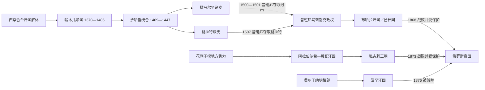

# 河中帖木儿、汗国与近世城市

## 时间

1370—1920年

## 概括

14世纪后期，帖木儿利用西察合台汗国解体后的军政竞争，以撒马尔罕为中心建立征服帝国。帝国依靠突厥—蒙古骑兵、波斯文官、王子封地与成吉思汗系名义法统运转；它把战利品、工匠和学者集中到撒马尔罕、赫拉特，也以屠城、强制迁徙和高强度远征给被征服地区造成巨大破坏。15世纪的城市文化繁荣与政治分裂并存，王子军队和封地制度最终使统一难以维持。

16世纪初，昔班尼乌兹别克人夺取河中和赫拉特。此后布哈拉、花剌子模—希瓦和费尔干纳—浩罕分别形成近世国家。三国都不是简单的“衰落残余”：灌溉农业、城市手工业以及通往俄国、印度、伊朗和清朝新疆的商路继续发展；但部族军事集团、城市官僚、宗教精英和地方首领之间的权力平衡，使中央集权反复进退。19世纪俄国凭借常备军、炮兵、河运和堡垒线逐步压缩三国空间：布哈拉、希瓦先成为保护国，浩罕则在1876年被直接兼并；布哈拉与希瓦王廷到1920年才最终消失。

## 帖木儿帝国

### 建立背景与崛起机制

14世纪中期的西察合台汗国已分裂为众多部族和地方军政集团。帖木儿出身河中巴鲁剌思部，先在东察合台汗秃忽鲁帖木儿入侵造成的权力真空中积累兵力，又与喀兹罕之孙埃米尔侯赛因结盟并争夺河中。1370年帖木儿在巴尔赫击败侯赛因，召开贵族会议确立最高地位，以撒马尔罕为都。

帖木儿不是成吉思汗男系后裔，不能直接采用“汗”的最高法统。他迎娶察合台王室的萨莱·穆尔克汗妮姆，使用“驸马”身份，并先后拥立成吉思汗系傀儡汗；本人则以埃米尔和“吉星之主”等称号统治。其崛起依靠四项机制：

- 以个人效忠和战利品分配组织跨部族军队，同时吸收蒙古军事编制和伊斯兰君主礼仪。
- 控制泽拉夫尚河谷与撒马尔罕，使草原骑兵、绿洲粮税和商路收入相互支撑。
- 借恢复察合台秩序之名打击对手，却把重要省份和军队交给儿孙、重臣分掌。
- 通过持续远征获取财富、工匠和威望，以胜利维系贵族联盟。

### 扩张过程与统治结构

1370年代帖木儿反复征服花剌子模并压服河中；1380年代进入呼罗珊和伊朗，继而对金帐汗国脱脱迷失用兵。1398年攻入德里，1400—1401年夺取阿勒颇、大马士革和巴格达，1402年在安卡拉击败奥斯曼苏丹巴耶济德一世。1405年，他在准备东征明朝途中死于讹答剌。帝国疆域的峰值很大程度上是军事臣服和贡赋网络，并非每一地区都被同样深入地行政整合。

中央宫廷之下，波斯文书官处理税收、土地、外交和城市行政，突厥—蒙古军官控制军队与封地，伊斯兰法官、乌里玛和苏非网络提供司法与社会声望。王子被派往呼罗珊、伊朗、费尔干纳等地，拥有自己的军队、府库和幕僚。这个安排提高了扩张效率，却让省级宫廷成为继承战争的现成基地。帖木儿还把被征服地区的建筑师、金工、纺织工和学者迁往撒马尔罕；其文化集中效应不能掩盖迁徙的强制性和战争破坏。

### 鼎盛、城市文化与区域重心转移

帖木儿时期的撒马尔罕以比比哈努姆清真寺、古尔-埃米尔陵和沙希辛达建筑群等工程展示王权。商税、灌溉农业、战利品和迁入工匠共同支撑城市建设。沙哈鲁在1409年压服继承对手后，以赫拉特为常驻宫廷，让儿子乌鲁伯格治理河中；帝国由个人征服机器转为“赫拉特最高宫廷—撒马尔罕王子政府”的分层结构。

乌鲁伯格在撒马尔罕兴建经学院和天文台，主持观测与星表编制。赫拉特在沙哈鲁、古哈尔沙德和后来侯赛因·拜卡拉的赞助下，成为史学、细密画、建筑和诗歌中心；波斯语继续承担宫廷与学术书写，阿里·希尔·纳瓦伊等又提升察合台语文学地位。所谓“帖木儿文艺复兴”因此包含多个城市、多个王子宫廷，并不只发生在帖木儿本人统治期。

### 分裂与终结原因

- **结构因素：**没有固定的长子继承或单一王位规则，王子封地、私人军队和贵族效忠使每次君主死亡都可能触发内战。
- **财政与军事因素：**远征能够带来一次性战利品，却难以替代稳定税制；长期战争、城市重建和宫廷竞争加重资源压力。
- **区域因素：**河中、呼罗珊和伊朗各有成熟城市与军政集团，统治者常优先保住本支核心，而非维持帝国整体。
- **直接过程：**1405年帖木儿死后，哈利勒·苏丹、皮儿·穆罕默德、沙哈鲁等并争；沙哈鲁虽在1409年重建统合，1447年去世后内战再起。阿布·赛义德于1459年重新连接撒马尔罕和赫拉特，却在1469年战败身亡，帝国再次分为河中与呼罗珊支系。
- **外部触发：**15世纪末河中诸王争夺撒马尔罕、布哈拉和费尔干纳，穆罕默德·昔班尼得以各个击破。1500—1501年他夺取撒马尔罕，1507年攻陷赫拉特，结束两条主要支系。

完整并立、复位和短任序列见[帖木儿王朝统治者表](/%E4%BA%BA%E6%96%87%E7%A7%91%E5%AD%A6/%E5%8E%86%E5%8F%B2/%E4%B8%AD%E4%BA%9A/%E6%B2%B3%E4%B8%AD%E5%9C%B0%E5%8C%BA/%E5%B8%96%E6%9C%A8%E5%84%BF%E7%8E%8B%E6%9C%9D%E7%BB%9F%E6%B2%BB%E8%80%85%E8%A1%A8.md)。

## 昔班尼进入河中与制度转型

穆罕默德·昔班尼继承阿布海儿汗的草原政治遗产，把乌兹别克部众与失去牧地、寻求战利品的军事集团结合起来。1499—1501年间，他利用帖木儿诸王互相牵制夺取布哈拉和撒马尔罕；随后控制费尔干纳、塔什干、花剌子模、巴尔赫，1507年进入赫拉特。1510年昔班尼在梅尔夫败于萨法维沙阿伊斯玛仪一世并战死，巴布尔在萨法维支持下于1511年短暂复得撒马尔罕。

昔班尼宗族很快重组：1512年在吉日杜万击败巴布尔和奇兹尔巴什援军，河中由此稳定在昔班尼诸支手中。新政权沿用波斯语文书、伊斯兰司法和绿洲税收，又保留宗族共同占有与王子封地传统。最高可汗常只是年长宗族首领，布哈拉、撒马尔罕、塔什干和巴尔赫分别由不同王子掌权；这种制度既便于联合征服，也反复制造地方割据。

## 三大汗国比较

| 政权 | 主要阶段 | 政治中心 | 权力结构 | 鼎盛与主要转折 |
|---|---|---|---|---|
| 布哈拉汗国／酋长国 | 昔班尼、贾尼、曼吉特 | 布哈拉，兼及撒马尔罕 | 可汗或埃米尔、阿塔利克／库什贝吉、地方别克、乌里玛 | 阿卜杜拉二世集中权力；1740年纳迪尔沙入侵；1785年曼吉特正式称埃米尔；1868年成为俄国保护国 |
| 希瓦汗国 | 阿拉伯沙希、傀儡汗—伊纳克、弘吉剌 | 乌尔根奇后转希瓦 | 可汗、伊纳克、米赫塔尔、库什贝吉、部族首领与水利官 | 阿布·加齐与阿努沙重整；1740年纳迪尔沙征服；1804年弘吉剌直接称汗；1873年成为俄国保护国 |
| 浩罕汗国 | 明格部比、可汗时期 | 浩罕，兼控塔什干和费尔干纳 | 可汗、明巴希、库什贝吉、地方哈基姆、宗教与部族精英 | 阿里木、乌马尔和穆罕默德·阿里扩张；1842年布哈拉入侵；1865年失塔什干；1876年被俄国兼并 |

## 布哈拉：从宗族汗国到曼吉特酋长国

### 形成、集中与贾尼继承

乌拜杜拉汗自1512年据布哈拉，在1530年代成为最高可汗后，布哈拉逐渐取代撒马尔罕成为王朝称名中心。16世纪后半叶，阿卜杜拉二世先在父亲伊斯坎德尔的名义下扩张，1583年正式称汗；他削弱宗族封地、恢复驿路与灌溉，控制河中、巴尔赫和部分呼罗珊，构成昔班尼时期的政治高峰。1598年他和独子阿卜杜勒·穆明相继死亡，旁支皮儿·穆罕默德二世无力稳定局势，1599年图盖帖木儿系的贾尼家族夺权。

贾尼时期并非持续直线衰落。伊玛目·库里在17世纪前半长期维持核心绿洲，布哈拉和撒马尔罕的经学院、市场与商路继续活跃。然而巴尔赫常作为王储或兄弟的独立权力基地，阿塔利克、部族首领和焦伊巴里苏非家族等精英能左右继承。1681年希瓦阿努沙汗一度攻入布哈拉；18世纪初乌拜杜拉二世试图限制权臣却被杀，阿布·费兹的有效控制逐渐收缩。

### 曼吉特上升、统治结构与俄国征服

1740年纳迪尔沙迫使布哈拉臣服，曼吉特阿塔利克穆罕默德·哈基姆及其子穆罕默德·拉希姆借调粮、统军和对外交涉控制朝廷。1747年阿布·费兹被杀，此后幼年或外来成吉思汗系可汗只保留礼仪。穆罕默德·拉希姆于1756年前后直接称汗；1785年沙·穆拉德废除最后的名义可汗，采用“埃米尔”，以伊斯兰正统、乌里玛支持和曼吉特军政网络取代成吉思汗男系法统。

埃米尔之下，库什贝吉统领宫廷行政，迪万贝吉处理财政事务，卡迪卡兰居司法高位；地方别克负责征税、治安和征兵，宗教学校与瓦合甫掌握教育、慈善和大量财产。中央能否贯彻命令，仍取决于沙赫里萨布兹、希萨尔等地方家族以及乌兹别克部族的合作。农业依靠泽拉夫尚河和卡什卡河灌溉，棉花、丝织、皮革、金属器和牲畜贸易连接俄国、印度与伊朗。

纳斯鲁拉通过清洗对手、组织较稳定的火器部队加强王权，1842年曾攻入浩罕并处死穆罕默德·阿里，但占领约十周即被起义驱逐。19世纪中叶，俄国从草原堡垒线南下：1866年俄军在伊尔贾尔击败布哈拉军，继取胡占德、乌拉秋别；1868年占撒马尔罕并在泽拉布拉克获胜。和约使布哈拉割地、赔款、开放贸易并失去独立外交，成为保护国。王廷内政延续至1920年，最终在红军与青年布哈拉人进攻下覆亡。

## 希瓦：下阿姆河灌溉国家

### 阿拉伯沙希、都城转移与“可汗游戏”

1511年伊勒巴尔斯一世应花剌子模地方势力邀请，驱逐萨法维驻军。其阿拉伯沙希支与征服河中的昔班尼支同出术赤—昔班系统，却是相互竞争的不同宗支。早期国家由多个王子封地和乌兹别克部族构成；阿姆河改道、旧乌尔根奇水系衰退后，政治重心在17世纪逐渐转向靠近新灌溉渠道的希瓦。

阿布·加齐一世在流亡和内战后于1640年代掌权，重组部族与行政并编纂族源历史；其子阿努沙多次进攻布哈拉。阿努沙失势后，阿拉伯沙希稳定继承断裂，阿拉尔地区和下游部族时而独立。纳迪尔沙1740年击败并处死伊勒巴尔斯二世；撤军后，各集团不断从哈萨克或其他成吉思汗系支派迎立傀儡可汗，形成频繁废立的“可汗游戏”。18世纪后半，弘吉剌首领以伊纳克身份控制军政，名义可汗只提供法统；1804年伊勒图泽尔废去傀儡，自称可汗。

### 国家机制、经济与俄国保护

弘吉剌时期，可汗依靠米赫塔尔、库什贝吉、迪万贝吉和亚萨乌尔巴希等宫廷职位处理财政、军事、文书和侍卫事务，重要问题常与部族首领议决。地方米拉布管理渠道与分水，卡迪处理伊斯兰司法。汗廷征收土地、水利、牲畜和关税，但对尧穆特土库曼、卡拉卡尔帕克及乌兹别克部族的控制强弱不一。

下阿姆河经济首先依赖渠道维护、粮食和棉花种植，也经营地毯、纺织、畜牧与商队贸易。俘虏奴役和对呼罗珊、草原的劫掠确是国家与部族经济的一部分，却不能概括全部社会。1839—1840年佩罗夫斯基率俄军远征，因严冬、疾病和补给崩溃撤退；1855年穆罕默德·阿明在萨拉赫斯战死，引发连续继承和部族危机。

1873年俄军从多路进攻希瓦，可汗投降。甘迪米扬条约使希瓦割让阿姆河右岸、赔款、承认俄国航运与贸易特权并放弃独立外交，汗国成为保护国，但宫廷、税制和内部行政继续存在。1918年土库曼军事首领朱奈德汗杀伊斯凡迪亚尔，拥立赛义德·阿卜杜拉为傀儡；1920年红军与青年希瓦人推翻王廷。

## 浩罕：费尔干纳国家的兴起与覆亡

### 从明格部政权到扩张高峰

1709年，费尔干纳明格部首领沙鲁赫·比在布哈拉权力收缩、费尔干纳地方城市寻求安全的环境下建立政权。谷地人口密集、渠道可扩展，浩罕、安集延、马尔吉兰和纳曼干的农业与手工业为国家提供税源。早期统治者使用“比”，阿里木在1799年前后正式称汗，并以山地步兵和较直接的官员任命削弱部族贵族，征服胡占德、塔什干和通往草原的要地。

乌马尔和穆罕默德·阿里时期，浩罕沿锡尔河修筑堡垒，向今哈萨克斯坦南部、吉尔吉斯山地和帕米尔边缘扩展，同时与清朝新疆、布哈拉和俄国交涉。汗廷以波斯语为主要行政和宫廷语言，察合台语用于文学和部分文书；明巴希统军并可成为摄政，库什贝吉和地方哈基姆处理财政与州县，卡迪、和卓与乌里玛掌握司法和宗教网络。扩张在穆罕默德·阿里时期达到峰值，但远距离驻军、加税和宫廷斗争使联盟变脆。

### 1842年危机、俄国推进与直接兼并

1842年布哈拉埃米尔纳斯鲁拉攻入浩罕，处死穆罕默德·阿里、其弟及诗人诺迪拉；布哈拉占领约十周便被费尔干纳反抗者赶走。此后城市定居民集团、钦察和吉尔吉斯军事集团、明格王室与布哈拉支持者不断重组。1845年穆斯林库里拥立少年胡达雅尔并掌实权，1852年胡达雅尔清洗钦察集团后亲政；1858年又被反对联盟逐走。1863—1865年苏丹·赛义德只是名义可汗，阿里木库里以军队统帅和摄政掌握国家。

俄国于1853年夺取白水城，1864年进攻突厥斯坦、奇姆肯特等堡垒，1865年攻取塔什干，阿里木库里在防城战中死亡。胡达雅尔第三次复位后，1868年条约使浩罕在贸易和外交上高度依附俄国。宫廷税收、边疆丧失、地方精英不满和俄国干预共同触发1875年大起义；胡达雅尔出逃，纳斯尔丁和冒名“普拉德汗”的毛拉·伊斯哈克先后争权。俄军镇压后于1876年2月废除汗国，设费尔干纳州。

## 城市、灌溉与跨区域贸易

| 城市／区域 | 主要功能 | 长期变化 |
|---|---|---|
| 撒马尔罕 | 帖木儿都城、泽拉夫尚灌溉核心、学术与手工业中心 | 15世纪汇集工匠和学者；16世纪后政治首位让给布哈拉，但仍是区域大城；1868年被俄国占领 |
| 赫拉特 | 呼罗珊宫廷、波斯语文化与东西商路中心 | 沙哈鲁和侯赛因·拜卡拉时期繁荣；1507年失于昔班尼，此后不再属于河中统治核心 |
| 布哈拉 | 可汗／埃米尔宫廷、宗教学术、市场与商队金融 | 16世纪成为主要首都；经俄印贸易、手工业和灌溉农业维持影响，1868年后处于保护国 |
| 希瓦与旧乌尔根奇 | 下阿姆河水利、绿洲农业、草原—伊朗商路 | 河道变化促使政治重心由旧乌尔根奇转向希瓦；1873年后仍为保护国王廷中心 |
| 浩罕与塔什干 | 费尔干纳农业、手工业、清朝新疆与草原贸易 | 18—19世纪灌溉和人口增长支持扩张；塔什干1865年失守后，浩罕战略空间被切断 |

近世中亚不能用“海路兴起后丝绸之路断绝”作单因解释。长距离奢侈品贸易的相对地位确有变化，但俄国毛皮与金属、印度棉布和资金、清朝茶叶与白银以及中亚棉花、牲畜和手工业品仍通过商队流动。各国危机更直接地来自继承制度、地方军权、水利与财政压力、区域战争，以及19世纪俄国军事和运输能力的差距。

## 重要事件

| 时间 | 事件 | 影响 |
|---|---|---|
| 1370 | 帖木儿在巴尔赫击败侯赛因并确立统治 | 撒马尔罕成为新帝国中心 |
| 1402 | 安卡拉战役 | 帖木儿击败奥斯曼，军事威望达到高点 |
| 1405 | 帖木儿死于讹答剌 | 多支继承战争爆发 |
| 1409 | 沙哈鲁夺取撒马尔罕 | 主要领地重新统合，政治重心转向赫拉特 |
| 1447—1449 | 沙哈鲁死、乌鲁伯格败亡 | 王子封地与军政派系冲突公开化 |
| 1469 | 阿布·赛义德战败身亡 | 河中与赫拉特再次分裂 |
| 1500—1501 | 昔班尼夺取布哈拉、撒马尔罕 | 帖木儿河中主线结束 |
| 1507 | 昔班尼攻陷赫拉特 | 帖木儿呼罗珊主线结束 |
| 1510—1512 | 梅尔夫战役、巴布尔复辟与吉日杜万战役 | 昔班尼死后短暂危机，乌兹别克诸支最终保住河中 |
| 1511 | 伊勒巴尔斯驱逐花剌子模萨法维驻军 | 阿拉伯沙希政权建立 |
| 1583—1598 | 阿卜杜拉二世正式在位 | 布哈拉昔班尼时期集中与扩张高峰 |
| 1599 | 贾尼家族取代昔班尼家族 | 布哈拉法统转入图盖帖木儿系 |
| 1681 | 希瓦阿努沙汗一度攻入布哈拉 | 显示贾尼后期边防与内部权力压力 |
| 1709 | 沙鲁赫·比建立浩罕政权 | 费尔干纳形成独立政治中心 |
| 1740 | 纳迪尔沙迫使布哈拉臣服并征服希瓦 | 两国权力结构重组，曼吉特与弘吉剌上升 |
| 1785 | 沙·穆拉德采用埃米尔称号 | 布哈拉结束成吉思汗系傀儡汗法统 |
| 1804 | 伊勒图泽尔直接称汗 | 希瓦弘吉剌实际统治转为公开王朝 |
| 1842 | 布哈拉短期占领浩罕 | 浩罕进入长期政变和摄政阶段 |
| 1853—1865 | 俄国夺白水城并最终占塔什干 | 浩罕失去北方堡垒线和关键商业中心 |
| 1866—1868 | 俄国击败布哈拉并占撒马尔罕 | 布哈拉成为保护国 |
| 1873 | 俄国征服希瓦、签甘迪米扬条约 | 希瓦成为保护国 |
| 1875—1876 | 浩罕起义与俄国兼并 | 浩罕王朝和国家建制终结 |
| 1918—1920 | 朱奈德掌控希瓦；红军进攻布哈拉、希瓦 | 两个保护国王廷最终消失 |

## 兴衰因果对照

| 政权 | 崛起／鼎盛条件 | 结构性衰落因素 | 外部压力 | 直接终局 |
|---|---|---|---|---|
| 帖木儿帝国 | 河中军粮基地、个人军事联盟、战利品与跨区域人才集中 | 王子封地和私人军队、无固定继承、征服财政依赖 | 乌兹别克军事联盟崛起 | 1500—1507年昔班尼分别夺取撒马尔罕、赫拉特；1512年最后复辟失败 |
| 布哈拉 | 宗族军事资源、泽拉夫尚农业、布哈拉宗教与商业网络 | 地方别克和部族军权、傀儡法统、宫廷财政与水利压力 | 纳迪尔沙入侵；19世纪俄国炮兵、堡垒和补给体系 | 1868年失去主权；1920年王廷被推翻 |
| 希瓦 | 下阿姆河灌溉、部族骑兵、伊朗—草原商路与弘吉剌集中 | 河道与渠道脆弱、部族自治、频繁废立和有限常备军 | 纳迪尔沙征服；俄国多路远征 | 1873年成为保护国；1920年汗国终结 |
| 浩罕 | 费尔干纳人口和灌溉扩张、塔什干贸易、山地与草原兵源 | 定居—游牧集团竞争、摄政与废立、扩张过度和税负 | 布哈拉干预；俄国逐堡推进并夺塔什干 | 1875年起义后被俄国于1876年直接兼并 |

## 王朝世系与实际权力

- [帖木儿王朝统治者表](/%E4%BA%BA%E6%96%87%E7%A7%91%E5%AD%A6/%E5%8E%86%E5%8F%B2/%E4%B8%AD%E4%BA%9A/%E6%B2%B3%E4%B8%AD%E5%9C%B0%E5%8C%BA/%E5%B8%96%E6%9C%A8%E5%84%BF%E7%8E%8B%E6%9C%9D%E7%BB%9F%E6%B2%BB%E8%80%85%E8%A1%A8.md)：分列撒马尔罕、赫拉特和费尔干纳支系，展开共治、占领与巴布尔三次入主撒马尔罕。
- [布哈拉、希瓦与浩罕统治者表](/%E4%BA%BA%E6%96%87%E7%A7%91%E5%AD%A6/%E5%8E%86%E5%8F%B2/%E4%B8%AD%E4%BA%9A/%E6%B2%B3%E4%B8%AD%E5%9C%B0%E5%8C%BA/%E5%B8%83%E5%93%88%E6%8B%89%E3%80%81%E5%B8%8C%E7%93%A6%E4%B8%8E%E6%B5%A9%E7%BD%95%E7%BB%9F%E6%B2%BB%E8%80%85%E8%A1%A8.md)：分列昔班尼、贾尼、曼吉特、阿拉伯沙希、弘吉剌与明格世系，并单列傀儡汗、复位者和实际摄政。

## 演变关系

- 前一阶段：[喀喇汗、花剌子模与蒙古征服](/%E4%BA%BA%E6%96%87%E7%A7%91%E5%AD%A6/%E5%8E%86%E5%8F%B2/%E4%B8%AD%E4%BA%9A/%E6%B2%B3%E4%B8%AD%E5%9C%B0%E5%8C%BA/%E5%96%80%E5%96%87%E6%B1%97%E3%80%81%E8%8A%B1%E5%89%8C%E5%AD%90%E6%A8%A1%E4%B8%8E%E8%92%99%E5%8F%A4%E5%BE%81%E6%9C%8D.md)
- 本地区入口：[河中地区](/%E4%BA%BA%E6%96%87%E7%A7%91%E5%AD%A6/%E5%8E%86%E5%8F%B2/%E4%B8%AD%E4%BA%9A/%E6%B2%B3%E4%B8%AD%E5%9C%B0%E5%8C%BA/README.md)
- 帖木儿帝国继承西察合台解体后的河中军政空间，但其法统、统治技术和疆域均不是察合台汗国的简单延续。
- 昔班尼政权取代河中、赫拉特的帖木儿诸支；花剌子模阿拉伯沙希与河中昔班尼同源而非从属分支。
- 布哈拉、希瓦和浩罕在近世并立，边界、宗主权和实际控制经常不一致；1868—1876年的俄国推进使其分别转为保护国或被直接兼并。
