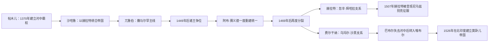

# 帖木儿王朝统治者表

## 时间

1370—1512年（河中与呼罗珊主线）

## 使用说明

帖木儿帝国不是一条始终统一的单线王位序列。帖木儿去世后，诸王子以封地、军队和宫廷支持争夺最高权力；撒马尔罕与赫拉特经常并立，费尔干纳、喀布尔等地又形成次级支系。因此本表按政治中心分别排列，同一人物在不同中心或复位时会重复出现。

帖木儿并非成吉思汗男系后裔，正式称“埃米尔”，以迎娶察合台王室女性取得“驸马”地位，并先后拥立速尤尔哈特迷失与马哈茂德为名义察合台汗。表中只列实际行使帖木儿家族统治权者；名义察合台汗不计入帖木儿世系。

## 世系分化与政权转移图

帖木儿王朝的继承不是单线的父子传位，而是宗王分封、兄弟竞争和城市宫廷并立。表中因此按撒马尔罕、赫拉特与费尔干纳等实际统治中心分列，并标注同一时期的并立与复位。

## 撒马尔罕与河中主线

| 顺序 | 统治者 | 称号／支系 | 在位或控制时间 | 与前任关系 | 状态与重要事件 |
|---|---|---|---|---|---|
| 1 | **帖木儿**（Timur） | 巴鲁剌思部埃米尔 | 1370—1405 | 建国者 | 1370年在巴尔赫确立最高权力，以撒马尔罕为都；借名义察合台汗与联姻取得法统，建立横跨河中、伊朗和呼罗珊的军事帝国。 |
| 2 | 哈利勒·苏丹 | 米兰沙之子、帖木儿之孙 | 1405—1409 | 祖孙 | 抢先控制撒马尔罕，但未获诸支普遍承认；财政赏赐和贵族离心削弱其地位，最终向沙哈鲁交出河中。 |
| 3 | **沙哈鲁** | 帖木儿之子；最高米尔扎 | 1409—1447 | 叔侄；战胜哈利勒 | 以赫拉特为常驻宫廷，1409年统一主要领地；河中交乌鲁伯格治理，形成“赫拉特最高宫廷—撒马尔罕王子政府”。 |
| 4 | **乌鲁伯格** | 沙哈鲁之子 | 1409—1447为河中总督；1447—1449为最高统治者 | 父子 | 长期治理撒马尔罕并赞助天文学；继承最高权后遭诸王子和军政集团挑战，败于其子阿卜杜勒·拉蒂夫并被杀。 |
| 5 | 阿卜杜勒·拉蒂夫 | 乌鲁伯格之子 | 1449—1450 | 父子；武力夺位 | 弑父夺权后缺乏广泛支持，约半年即被政变杀死。 |
| 6 | 阿卜杜拉·米尔扎 | 易卜拉欣·苏丹之子 | 1450—1451 | 同宗旁支 | 获撒马尔罕部分贵族拥立，旋被阿布·赛义德击败并处死。 |
| 7 | **阿布·赛义德·米尔扎** | 米兰沙后裔 | 1451—1469 | 同宗旁支；借乌兹别克支持夺位 | 先占撒马尔罕，1459年再取赫拉特，短暂重建两都统合；1469年西征白羊王朝时被俘处死。 |
| 8 | 苏丹·艾哈迈德·米尔扎 | 阿布·赛义德长子 | 1469—1494 | 父子分封 | 统治撒马尔罕、布哈拉；与费尔干纳、塔什干及兄弟诸支长期竞争，未能恢复统一。 |
| 9 | 苏丹·马哈茂德·米尔扎 | 阿布·赛义德之子 | 1494—1495 | 兄弟 | 兼并兄长领地后不久病逝，遗子争位使河中权力进一步碎片化。 |
| 10 | 拜孙豁儿·米尔扎 | 苏丹·马哈茂德之子 | 1495—1497 | 父子 | 主要控制撒马尔罕；与兄弟马苏德、苏丹·阿里及巴布尔并争，1497年失城。 |
| 11 | 马苏德·米尔扎 | 苏丹·马哈茂德之子 | 约1495—1497间争位 | 兄弟；并立争议者 | 曾获部分贵族拥戴并参与撒马尔罕争夺，控制范围和确切任期在编年材料中不一，不宜视为稳定单独一朝。 |
| 12 | **巴布尔** | 乌马尔·谢赫二世之子 | 1497—1498（第一次） | 同宗费尔干纳支 | 围城后取得撒马尔罕，却因费尔干纳后方叛变、军粮不足而退出。 |
| 13 | 苏丹·阿里·米尔扎 | 苏丹·马哈茂德之子 | 1498—1500 | 拜孙豁儿之弟 | 在布哈拉与撒马尔罕贵族支持下掌权；试图与昔班尼汗谈判时失去城市，随后被杀。 |
| 14 | **巴布尔** | 费尔干纳支 | 1500—1501（第二次） | 乘昔班尼军暂离而复夺 | 短暂突袭复城，1501年围城和萨尔普尔战败后撤出，河中主线转入昔班尼统治。 |
| 15 | **巴布尔** | 费尔干纳支；最后复辟 | 1511—1512（第三次） | 借萨法维援助复位 | 穆罕默德·昔班尼死后再占撒马尔罕；因萨法维宗教与政治依附引起反弹，1512年昔班尼诸王在吉日杜万获胜，帖木儿家族最后一次河中复辟结束。 |

## 赫拉特与呼罗珊主线

| 顺序 | 统治者 | 称号／支系 | 在位或控制时间 | 与前任关系 | 状态与重要事件 |
|---|---|---|---|---|---|
| 1 | **沙哈鲁** | 帖木儿之子 | 1405—1447 | 建立赫拉特主线 | 1405年先稳住呼罗珊，1409年成为全朝最高统治者；以波斯文官、王子封地和突厥—蒙古军队共同维持帝国。 |
| 2 | 阿剌·道剌·米尔扎 | 拜孙豁儿之子、沙哈鲁之孙 | 1447—1448 | 祖孙 | 沙哈鲁死后控制赫拉特，遭乌鲁伯格东来挑战，退往西部。 |
| 3 | 乌鲁伯格 | 沙哈鲁之子 | 1448—1449（占领） | 叔侄；武力占领 | 一度进入赫拉特，但难以同时压服呼罗珊诸支；其离开后当地权力再次重组。 |
| 4 | 阿布·卡西姆·巴布尔·米尔扎 | 拜孙豁儿之子 | 1449—1457 | 阿剌·道剌之弟 | 逐步控制赫拉特和呼罗珊主要城市，以妥协方式维持区域政权；不要与后来建立莫卧儿帝国的巴布尔混同。 |
| 5 | 沙·马哈茂德·米尔扎 | 阿布·卡西姆·巴布尔之子 | 1457（短期） | 父子 | 年幼继位，数周至数月内即被逐；确切起止因史料纪年换算略有差异。 |
| 6 | 易卜拉欣·米尔扎 | 阿剌·道剌之子 | 1457—1459 | 同宗堂支 | 夺取赫拉特，随后败给从河中扩张的阿布·赛义德。 |
| 7 | **阿布·赛义德·米尔扎** | 米兰沙后裔 | 1459—1469 | 同宗旁支；兼并赫拉特 | 重新连接撒马尔罕和赫拉特两大中心；其死后诸子分据河中，赫拉特由侯赛因·拜卡拉争得。 |
| 8 | **苏丹·侯赛因·拜卡拉** | 乌马尔·谢赫一世后裔 | 1469—1470（第一次） | 同宗旁支 | 夺得赫拉特，建立后期帖木儿朝最稳定的呼罗珊宫廷。 |
| 9 | 雅德加尔·穆罕默德·米尔扎 | 沙哈鲁后裔 | 1470（约六周） | 同宗挑战者 | 获白羊王朝支持短暂占领赫拉特，旋被侯赛因夜袭俘杀；属明确的短期中断，不能从世系省略。 |
| 10 | **苏丹·侯赛因·拜卡拉** | 复位 | 1470—1506（第二次） | 击败雅德加尔复位 | 与大臣阿里·希尔·纳瓦伊等赞助波斯语、察合台语文学及艺术；晚年诸子争权，防务和财政承压。 |
| 11 | 巴迪·匝曼·米尔扎 | 侯赛因·拜卡拉之子 | 1506—1507（共同统治） | 父子 | 与弟弟共同守赫拉特，兄弟和军政派系难以协调；1507年穆罕默德·昔班尼攻陷赫拉特。 |
| 12 | 穆扎法尔·侯赛因·米尔扎 | 侯赛因·拜卡拉之子 | 1506—1507（共同统治） | 父子；与兄并立 | 与巴迪·匝曼共同在位而非先后两朝；城破后出逃，赫拉特主线终结。 |

## 费尔干纳与指定继承支线

| 顺序 | 统治者 | 地区与时间 | 继承关系 | 状态与说明 |
|---|---|---|---|---|
| 1 | 皮儿·穆罕默德·米尔扎 | 喀布尔、加兹尼，1405—1407 | 帖木儿之孙；生前指定继承人 | 未能控制撒马尔罕，仍是1405年继承战争中的合法性中心；被部将杀害。 |
| 2 | 乌马尔·谢赫二世 | 费尔干纳，1469—1494 | 阿布·赛义德之子 | 以安集延、阿赫西为中心；意外身亡后由年幼的巴布尔继承。 |
| 3 | **巴布尔** | 费尔干纳，1494—1504；其间多次失而复得 | 乌马尔·谢赫二世之子 | 与叔伯、弟弟和昔班尼诸军反复争夺；1504年转取喀布尔，后在印度建立莫卧儿帝国。 |
| 4 | 贾汉吉尔·米尔扎 | 费尔干纳部分地区，约1497—1504 | 巴布尔异母弟 | 受地方贵族和外戚扶持，与巴布尔并立；双方一度分治费尔干纳，故不能简单列为巴布尔之后的单线继承。 |

## 世系连续性要点

- 1405—1409年的核心不是“哈利勒自然继位”，而是哈利勒、皮儿·穆罕默德、沙哈鲁及其他王子同时争夺帖木儿遗产。
- 1409—1447年沙哈鲁拥有最高权威，乌鲁伯格在河中长期执政；两者在位时间重叠是父子分层统治，不是年代错误。
- 1447年后，封地分割、军队依附具体王子以及缺少固定长子继承规则，使内战反复发生。
- 1469年阿布·赛义德死后，河中与呼罗珊再次分裂；侯赛因·拜卡拉治下的赫拉特文化繁荣，并不意味着王朝重新统一。
- 1500—1512年撒马尔罕数次易手，巴布尔三次占城均应分别记录；1512年失败后，帖木儿政治重心转向喀布尔和印度。

## 相关笔记

- [河中帖木儿、汗国与近世城市](/%E4%BA%BA%E6%96%87%E7%A7%91%E5%AD%A6/%E5%8E%86%E5%8F%B2/%E4%B8%AD%E4%BA%9A/%E6%B2%B3%E4%B8%AD%E5%9C%B0%E5%8C%BA/%E5%B8%96%E6%9C%A8%E5%84%BF%E3%80%81%E6%B1%97%E5%9B%BD%E4%B8%8E%E8%BF%91%E4%B8%96%E5%9F%8E%E5%B8%82.md)
- [河中地区](/%E4%BA%BA%E6%96%87%E7%A7%91%E5%AD%A6/%E5%8E%86%E5%8F%B2/%E4%B8%AD%E4%BA%9A/%E6%B2%B3%E4%B8%AD%E5%9C%B0%E5%8C%BA/README.md)
- 国家空间落点：[乌兹别克斯坦的帖木儿、乌兹别克汗国与三大汗国](/%E4%BA%BA%E6%96%87%E7%A7%91%E5%AD%A6/%E5%8E%86%E5%8F%B2/%E4%B8%AD%E4%BA%9A/%E4%B9%8C%E5%85%B9%E5%88%AB%E5%85%8B%E6%96%AF%E5%9D%A6/%E5%B8%96%E6%9C%A8%E5%84%BF%E3%80%81%E4%B9%8C%E5%85%B9%E5%88%AB%E5%85%8B%E6%B1%97%E5%9B%BD%E4%B8%8E%E4%B8%89%E5%A4%A7%E6%B1%97%E5%9B%BD.md)
