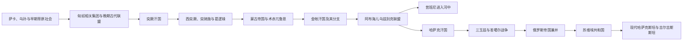

# 草原汗国

本目录整理中亚及相邻欧亚草原的跨国政治传统。草原社会并非静止的“部落世界”：季节迁徙、部族联盟、城市市场、宗教网络、军事分封和跨境贸易共同塑造从萨卡时代到哈萨克汗国的政权。目录只讲共同机制与主线；各王朝完整世系和现代国家细节由规范专页维护。

## 阅读框架

| 核心问题 | 阅读提示 |
|---|---|
| 草原与绿洲 | 两者不是封闭对立面：牧民需要粮食、市场和工匠，城市需要马匹、畜产、护路和军事力量。 |
| 汗国如何统治 | 可汗依赖黄金家族或其他王族合法性、亲族分封、部族首领和战利品分配；城市地区另需税官与地方精英。 |
| 为什么反复分裂 | 广阔迁徙空间、不同继承原则、左右翼分封和贵族拥立使汗权高度依赖个人能力。 |
| 民族名称如何变化 | “萨卡”“匈人”“突厥”“乌兹别克”“哈萨克”等名称的含义随时代变化，不能直接套用现代国族边界。 |
| 帝国如何进入草原 | 俄国先用贸易、要塞和保护关系，再以废除汗权、行政改革和移民土地制度完成兼并。 |

## 专题导航

| 顺序 | 专题 | 时间 | 简要概括 |
|---|---|---|---|
| 1 | [萨卡、匈人、突厥与草原帝国](/%E4%BA%BA%E6%96%87%E7%A7%91%E5%AD%A6/%E5%8E%86%E5%8F%B2/%E4%B8%AD%E4%BA%9A/%E8%8D%89%E5%8E%9F%E6%B1%97%E5%9B%BD/%E8%90%A8%E5%8D%A1%E3%80%81%E5%8C%88%E4%BA%BA%E3%80%81%E7%AA%81%E5%8E%A5%E4%B8%8E%E8%8D%89%E5%8E%9F%E5%B8%9D%E5%9B%BD.md) | 约前8世纪—10世纪 | 从早期草原共同体到突厥汗国、突骑施和葛逻禄，解释游牧联盟的运作、分裂与突厥化。 |
| 2 | [金帐汗国、乌兹别克与哈萨克汗国](/%E4%BA%BA%E6%96%87%E7%A7%91%E5%AD%A6/%E5%8E%86%E5%8F%B2/%E4%B8%AD%E4%BA%9A/%E8%8D%89%E5%8E%9F%E6%B1%97%E5%9B%BD/%E9%87%91%E5%B8%90%E6%B1%97%E5%9B%BD%E3%80%81%E4%B9%8C%E5%85%B9%E5%88%AB%E5%85%8B%E4%B8%8E%E5%93%88%E8%90%A8%E5%85%8B%E6%B1%97%E5%9B%BD.md) | 13世纪—18世纪中叶 | 术赤兀鲁思、金帐分裂、昔班联盟、哈萨克汗国、三玉兹和准噶尔竞争。 |
| 3 | [俄罗斯草原扩张与现代哈萨克斯坦](/%E4%BA%BA%E6%96%87%E7%A7%91%E5%AD%A6/%E5%8E%86%E5%8F%B2/%E4%B8%AD%E4%BA%9A/%E8%8D%89%E5%8E%9F%E6%B1%97%E5%9B%BD/%E4%BF%84%E7%BD%97%E6%96%AF%E8%8D%89%E5%8E%9F%E6%89%A9%E5%BC%A0%E4%B8%8E%E7%8E%B0%E4%BB%A3%E5%93%88%E8%90%A8%E5%85%8B%E6%96%AF%E5%9D%A6.md) | 18世纪—2026年 | 从名义保护到直接兼并、土地殖民、苏维埃化、饥荒、核试验和独立国家。 |

## 重要转折

| 时间 | 转折 | 意义 |
|---|---|---|
| 前1千纪 | 萨卡等草原共同体见于考古与文献 | 骑乘、冶金和远距交换形成跨草原网络；外部名称不代表单一民族。 |
| 552年 | 突厥汗国建立 | 阿史那王族首次以“突厥”为政治名称建立跨欧亚汗国。 |
| 603年前后 | 东西突厥分立 | 亲族分封和地域利益显示草原帝国扩张与分裂的一体两面。 |
| 751年 | 怛罗斯之战 | 改变局部联盟和军事平衡，但伊斯兰化仍是长期社会过程。 |
| 13世纪 | 蒙古征服与兀鲁思分封 | 黄金家族合法性和新的跨欧亚体系重组钦察草原。 |
| 1313年以后 | 金帐汗国伊斯兰制度强化 | 草原汗权、城市财政和穆斯林网络结合。 |
| 约1465—1466年 | 哈萨克汗国形成 | 阿布海儿联盟分化，新的政治共同体逐渐稳定。 |
| 1723年起 | 准噶尔大举入侵 | 人口与牧地损失推动三玉兹重新结盟并寻求外援。 |
| 1731年 | 小玉兹汗接受俄国保护 | 多边外交选择逐步被俄国转化为主权扩张依据。 |
| 1822—1824年 | 中、小玉兹汗制被废 | 保护关系转为帝国行政统治。 |
| 1931—1933年 | 集体化饥荒 | 强制定居和征购摧毁牧业社会，造成大规模死亡与外逃。 |
| 1991年 | 苏联解体 | 苏维埃民族共和国边界转化为现代主权国家边界。 |

## 统治者与国家专页

- 哈萨克统一汗权、三玉兹与布克依汗国：[哈萨克汗世系表](/%E4%BA%BA%E6%96%87%E7%A7%91%E5%AD%A6/%E5%8E%86%E5%8F%B2/%E4%B8%AD%E4%BA%9A/%E5%93%88%E8%90%A8%E5%85%8B%E6%96%AF%E5%9D%A6/%E5%93%88%E8%90%A8%E5%85%8B%E6%B1%97%E4%B8%96%E7%B3%BB%E8%A1%A8.md)
- 河中昔班尼诸朝及三汗国：[布哈拉、希瓦与浩罕统治者表](/%E4%BA%BA%E6%96%87%E7%A7%91%E5%AD%A6/%E5%8E%86%E5%8F%B2/%E4%B8%AD%E4%BA%9A/%E6%B2%B3%E4%B8%AD%E5%9C%B0%E5%8C%BA/%E5%B8%83%E5%93%88%E6%8B%89%E3%80%81%E5%B8%8C%E7%93%A6%E4%B8%8E%E6%B5%A9%E7%BD%95%E7%BB%9F%E6%B2%BB%E8%80%85%E8%A1%A8.md)
- 蒙古帝国与诸兀鲁思：[蒙古帝国与诸汗国](/%E4%BA%BA%E6%96%87%E7%A7%91%E5%AD%A6/%E5%8E%86%E5%8F%B2/%E4%B8%9C%E4%BA%9A/%E8%92%99%E5%8F%A4/%E8%92%99%E5%8F%A4%E5%B8%9D%E5%9B%BD%E4%B8%8E%E8%AF%B8%E6%B1%97%E5%9B%BD.md)
- 哈萨克斯坦国家史：[哈萨克斯坦历史](/%E4%BA%BA%E6%96%87%E7%A7%91%E5%AD%A6/%E5%8E%86%E5%8F%B2/%E4%B8%AD%E4%BA%9A/%E5%93%88%E8%90%A8%E5%85%8B%E6%96%AF%E5%9D%A6/README.md)
- 吉尔吉斯斯坦国家史：[吉尔吉斯斯坦历史](/%E4%BA%BA%E6%96%87%E7%A7%91%E5%AD%A6/%E5%8E%86%E5%8F%B2/%E4%B8%AD%E4%BA%9A/%E5%90%89%E5%B0%94%E5%90%89%E6%96%AF%E6%96%AF%E5%9D%A6/README.md)

## 与相邻专题的边界

- 绿洲城市、粟特、萨曼和花剌子模详见[河中地区](/%E4%BA%BA%E6%96%87%E7%A7%91%E5%AD%A6/%E5%8E%86%E5%8F%B2/%E4%B8%AD%E4%BA%9A/%E6%B2%B3%E4%B8%AD%E5%9C%B0%E5%8C%BA/README.md)。
- 跨区域的伊斯兰化、蒙古征服和苏维埃民族划界详见[中亚通史](/%E4%BA%BA%E6%96%87%E7%A7%91%E5%AD%A6/%E5%8E%86%E5%8F%B2/%E4%B8%AD%E4%BA%9A/_%E9%80%9A%E5%8F%B2/README.md)。
- 中国北方与西域相关内容由中国史维护；俄罗斯国家史由欧洲史维护，本目录只写其与中亚草原的交互。

## 直接上级

- [中亚历史](/%E4%BA%BA%E6%96%87%E7%A7%91%E5%AD%A6/%E5%8E%86%E5%8F%B2/%E4%B8%AD%E4%BA%9A/README.md)
