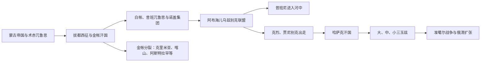

# 中亚金帐汗国、乌兹别克与哈萨克汗国

## 时间

13世纪—18世纪中叶

## 概括

蒙古征服把钦察草原、花剌子模、七河和河中纳入成吉思汗诸子的兀鲁思。术赤后裔统治的钦察草原通常被后世称为金帐汗国；它在14世纪形成横跨伏尔加河、黑海北岸和哈萨克草原西部的贸易与贡赋体系。金帐汗国分裂后，昔班后裔、诺盖部众、乌兹别克联盟、哈萨克汗国和准噶尔汗国竞争东部草原。“乌兹别克”“哈萨克”等名称由政治联盟逐渐转化为更稳定的群体认同，但这一过程并非从古代直接延续的固定血缘谱系。

## 建立背景与统治结构

### 术赤兀鲁思和金帐汗国

成吉思汗长子术赤去世后，其子拔都、斡儿答及其他支系分别获得草原封地。拔都在1236—1242年西征后以伏尔加河下游为政治中心，向罗斯诸公国征收贡赋，并控制黑海—里海商路。所谓“金帐汗国”是后世常用名，当时统治者更常以术赤兀鲁思或具体汗号表达其政权。

| 层级 | 运作方式 |
|---|---|
| 汗位合法性 | 原则上须出自术赤—成吉思汗“黄金家族”；军事实力和贵族拥立决定谁能真正即位。 |
| 左、右翼体系 | 拔都系主导西部，斡儿答等支系经营东部；边界和隶属关系会随汗权强弱变化。 |
| 军政贵族 | 部族首领、万户和异密提供兵力并分享牧地、贡赋与贸易收益，也可能废立可汗。 |
| 城市与财政 | 萨莱等城市设官征税、铸币并吸引商人和工匠；对罗斯、克里米亚港口和花剌子模的控制提供收入。 |
| 宗教 | 早期王族信仰多样；别儿哥信奉伊斯兰，月即别汗时期伊斯兰成为王权的重要制度基础，但其他宗教群体仍存在。 |

### 草原乌兹别克、昔班尼与哈萨克分化

14世纪末至15世纪，金帐汗权内战和帖木儿进攻促使术赤诸支及部落联盟重新组合。昔班后裔阿布海儿约于1428年被推举为汗，整合东部钦察草原的许多集团，史籍常称其臣民为“乌兹别克”。这一名称首先是政治归属，并不等同于今日乌兹别克民族的全部来源。

阿布海儿在1457年败于卫拉特后威望受损。克烈、贾尼别克两位术赤后裔率部分部众迁往蒙兀儿斯坦西部，得到当地统治者支持。阿布海儿死后联盟解体，克烈、贾尼别克及其继承者回到草原扩张；后世通常把约1465—1466年视为哈萨克汗国开端。昔班后裔穆罕默德·昔班尼则在1500年前后进入河中，建立以布哈拉、撒马尔罕为中心的王朝，草原“乌兹别克”名称由此与绿洲人口、突厥语和波斯语文化继续融合。

### 哈萨克汗国与三玉兹

卡西姆汗在16世纪初扩大汗国影响，并在传统记忆中与“卡西姆汗旧法”相联系。其死后继承竞争和外部压力造成分裂；哈克纳扎尔、塔吾克勒、也昔木等汗曾重新整合部分部众。17世纪末塔吾克汗借比特议事和“七项法典”传统协调贵族，但大、中、小三玉兹的地域联盟已日益清晰。

玉兹不是现代省份，也不是三座同时具备严密边界和固定中央政府的国家。它们大致对应七河与南部、中北部、西部草原的迁徙网络，各有苏丹、比和部族首领；危机时可共同拥立大汗或结盟，平时则有独立外交和内部竞争。

### 准噶尔竞争

17世纪卫拉特诸部形成准噶尔汗国，以伊犁河谷为核心，结合牧业、火器、手工业和税赋，成为草原强权。准噶尔进攻在1723年前后造成哈萨克社会严重灾难，传统称“大灾难之年”。哈萨克各部在布兰特、阿讷拉凯等战役中反击，但汗位竞争妨碍长期统一。清朝于1755—1758年摧毁准噶尔政权，俄罗斯堡垒线也同时推进；草原的国际环境由多汗国竞争转向清、俄两帝国夹击。

## 分阶段发展

| 阶段 | 时间 | 主要过程 |
|---|---|---|
| 术赤兀鲁思形成 | 1220年代—1240年代 | 蒙古分封与拔都西征建立跨钦察草原的军事贡赋体系。 |
| 金帐汗国鼎盛 | 13世纪后半—14世纪中叶 | 萨莱城市、罗斯贡赋、黑海贸易和伊斯兰制度支撑强汗统治。 |
| 内战与碎片化 | 1359—15世纪 | “大动乱”、瘟疫、地方贵族坐大和帖木儿战争削弱中央汗权。 |
| 阿布海儿联盟 | 1428—1468年 | 昔班后裔重新整合东部草原，军事失败和继承危机导致分裂。 |
| 哈萨克汗国扩张 | 15世纪后半—16世纪初 | 克烈、贾尼别克及卡西姆吸纳部众，控制锡尔河城市与牧道。 |
| 分裂与再整合 | 16—17世纪 | 继承竞争、诺盖部众并入、与布哈拉和蒙兀儿斯坦战争交替发生。 |
| 三玉兹与准噶尔战争 | 17世纪末—18世纪中叶 | 地域联盟强化；外部战争与俄清扩张改变主权结构。 |

## 重要事件

| 时间 | 事件 | 结果与影响 |
|---|---|---|
| 1236—1242年 | 拔都西征 | 术赤兀鲁思控制伏尔加—钦察草原，并建立对罗斯诸公国的宗主关系。 |
| 1250—1260年代 | 别儿哥与旭烈兀交战 | 术赤兀鲁思与伊儿汗国争夺高加索，蒙古诸汗国利益分化。 |
| 1313年起 | 月即别汗统治 | 汗权、城市财政和伊斯兰制度结合，金帐汗国达到强盛阶段。 |
| 1359年起 | 金帐“大动乱” | 汗位频繁更替，军政贵族与地区势力争权。 |
| 1380年 | 库利科沃战役 | 莫斯科取得象征性胜利，但脱脱迷失后来仍恢复对罗斯的控制。 |
| 1391、1395年 | 帖木儿击败脱脱迷失 | 萨莱等中心遭破坏，贸易和汗权恢复能力显著下降。 |
| 1428年 | 阿布海儿被拥立 | 东部钦察草原形成新的乌兹别克联盟。 |
| 1457年 | 阿布海儿败于卫拉特 | 联盟威望受损，克烈、贾尼别克出走的政治条件成熟。 |
| 约1465—1466年 | 哈萨克汗国形成 | 新汗权和“哈萨克”政治共同体逐渐稳定。 |
| 1500—1501年 | 昔班尼夺取撒马尔罕、布哈拉 | 草原昔班势力转入河中，开启乌兹别克汗国时代。 |
| 1510年代 | 卡西姆汗扩张 | 哈萨克部众和外交影响扩大，汗国进入早期鼎盛。 |
| 1598年 | 塔吾克勒汗远征河中 | 争夺锡尔河城市和塔什干，显示草原—绿洲联系的重要性。 |
| 1680—1715/1718年 | 塔吾克汗时期 | 以法律和议事机制协调三玉兹，但统一仍依赖个人权威。 |
| 1723年起 | 准噶尔大举入侵 | 大规模死亡、迁徙和牧地丧失，迫使三玉兹寻求新的联盟。 |
| 1729/1730年前后 | 阿讷拉凯战役 | 哈萨克联军取得重要反击，胜利后领导权争议又削弱协作。 |
| 1731年 | 小玉兹阿布勒海尔接受俄国保护 | 原为应对多方威胁的外交选择，后来被俄国扩展为主权控制。 |
| 1755—1758年 | 清朝摧毁准噶尔 | 伊犁和东部草原权力真空出现，清、俄与哈萨克关系进入新阶段。 |

## 崛起条件、衰落因素与直接转折

### 金帐汗国

- **崛起条件：**蒙古军事组织、术赤王族合法性、钦察草原骑兵、伏尔加和黑海贸易、对罗斯贡赋的制度化共同构成财政基础。
- **鼎盛条件：**强汗能协调王族和军政贵族；萨莱等城市、伊斯兰法学与跨区域商人增强行政能力。
- **结构性衰落：**黑死病冲击人口与贸易，术赤诸支继承权竞争，军政贵族掌握废立权，罗斯和地方汗国逐步增强。
- **直接打击：**1359年后的连续内战已经削弱中央；帖木儿1391、1395年的进攻毁坏核心城市和商路，促使分裂不可逆转。金帐并非一次战役后立即“灭亡”，而是演变为大帐、克里米亚、喀山、阿斯特拉罕、诺盖和西伯利亚等政权。

### 阿布海儿联盟与哈萨克汗国

- **阿布海儿崛起：**昔班王族身份、军事战利品和对锡尔河城市的争夺使其吸纳部众。
- **联盟瓦解：**1457年失败暴露军事弱点，部族首领对资源分配不满；阿布海儿1468年死后缺少能压服诸支的继承者。
- **哈萨克崛起：**克烈和贾尼别克拥有术赤血统、蒙兀儿斯坦提供安全空间，随后又吸收阿布海儿旧部并争得牧道和城市。
- **难以长期统一：**汗位继承、广阔迁徙空间、苏丹和部族首领自治，使中央权威高度依赖强汗个人。
- **外部压力：**准噶尔军事改革和连续进攻、布哈拉竞争、俄国堡垒及清朝西进共同改变力量平衡；1731年以后俄国逐步把外交保护转化为制度性兼并。

## 世系与统治者入口

本页是多个草原政权的比较专题，不重复维护各王朝长世系：

- 金帐汗国及蒙古诸兀鲁思背景见[蒙古帝国与诸汗国](/%E4%BA%BA%E6%96%87%E7%A7%91%E5%AD%A6/%E5%8E%86%E5%8F%B2/%E4%B8%9C%E4%BA%9A/%E8%92%99%E5%8F%A4/%E8%92%99%E5%8F%A4%E5%B8%9D%E5%9B%BD%E4%B8%8E%E8%AF%B8%E6%B1%97%E5%9B%BD.md)。
- 哈萨克统一汗权、三玉兹和布克依汗国的统治者见[哈萨克汗世系表](/%E4%BA%BA%E6%96%87%E7%A7%91%E5%AD%A6/%E5%8E%86%E5%8F%B2/%E4%B8%AD%E4%BA%9A/%E5%93%88%E8%90%A8%E5%85%8B%E6%96%AF%E5%9D%A6/%E5%93%88%E8%90%A8%E5%85%8B%E6%B1%97%E4%B8%96%E7%B3%BB%E8%A1%A8.md)。
- 河中昔班尼、阿斯特拉罕系和三汗国统治者见[布哈拉、希瓦与浩罕统治者表](/%E4%BA%BA%E6%96%87%E7%A7%91%E5%AD%A6/%E5%8E%86%E5%8F%B2/%E4%B8%AD%E4%BA%9A/%E6%B2%B3%E4%B8%AD%E5%9C%B0%E5%8C%BA/%E5%B8%83%E5%93%88%E6%8B%89%E3%80%81%E5%B8%8C%E7%93%A6%E4%B8%8E%E6%B5%A9%E7%BD%95%E7%BB%9F%E6%B2%BB%E8%80%85%E8%A1%A8.md)。
- 相关过程见[帖木儿、汗国与近世城市](/%E4%BA%BA%E6%96%87%E7%A7%91%E5%AD%A6/%E5%8E%86%E5%8F%B2/%E4%B8%AD%E4%BA%9A/%E6%B2%B3%E4%B8%AD%E5%9C%B0%E5%8C%BA/%E5%B8%96%E6%9C%A8%E5%84%BF%E3%80%81%E6%B1%97%E5%9B%BD%E4%B8%8E%E8%BF%91%E4%B8%96%E5%9F%8E%E5%B8%82.md)。

## 演变关系

- 前一专题：[萨卡、匈人、突厥与草原帝国](/%E4%BA%BA%E6%96%87%E7%A7%91%E5%AD%A6/%E5%8E%86%E5%8F%B2/%E4%B8%AD%E4%BA%9A/%E8%8D%89%E5%8E%9F%E6%B1%97%E5%9B%BD/%E8%90%A8%E5%8D%A1%E3%80%81%E5%8C%88%E4%BA%BA%E3%80%81%E7%AA%81%E5%8E%A5%E4%B8%8E%E8%8D%89%E5%8E%9F%E5%B8%9D%E5%9B%BD.md)
- 后一专题：[俄罗斯草原扩张与现代哈萨克斯坦](/%E4%BA%BA%E6%96%87%E7%A7%91%E5%AD%A6/%E5%8E%86%E5%8F%B2/%E4%B8%AD%E4%BA%9A/%E8%8D%89%E5%8E%9F%E6%B1%97%E5%9B%BD/%E4%BF%84%E7%BD%97%E6%96%AF%E8%8D%89%E5%8E%9F%E6%89%A9%E5%BC%A0%E4%B8%8E%E7%8E%B0%E4%BB%A3%E5%93%88%E8%90%A8%E5%85%8B%E6%96%AF%E5%9D%A6.md)
- 上级：[草原汗国](/%E4%BA%BA%E6%96%87%E7%A7%91%E5%AD%A6/%E5%8E%86%E5%8F%B2/%E4%B8%AD%E4%BA%9A/%E8%8D%89%E5%8E%9F%E6%B1%97%E5%9B%BD/README.md)
