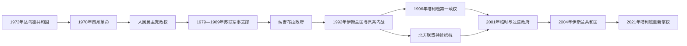

# 1973年以来国家元首与实际权力结构表

## 口径

本表把“法定国家元首”“政府首脑”和“实际最高权力”分开。1979—1989年苏军直接介入，但阿富汗仍有本国国家机构；1992—2001年多个政权和武装并立，不能把控制喀布尔等同于获得全国或国际承认；2021年以后以塔利班事实当局的实际结构为准。现代现任信息核验截止至2026年7月。

## 政权与实际权力演变图

1973年以来多次出现法定国家元首、政党领袖、军阀联盟、外国军事支持者与实际最高决策者不完全重合的情形。表格因此同时记录职位名义与实际权力来源。

## 共和国与人民民主党政权国家元首

| 顺序 | 国家元首 | 任期 | 政体与权力基础 | 结局或备注 |
|---|---|---|---|---|
| 1 | **穆罕默德·达乌德汗** | 1973年7月17/18日—1978年4月27日 | 阿富汗共和国总统；依靠军官、王国官僚与早期人民民主党盟友夺权，1977年宪法转为一党总统制 | 四月革命中与家人被杀。 |
| — | 阿卜杜勒·卡迪尔上校领导的军事革命委员会 | 1978年4月27—30日 | 政变军人临时权力中心 | 把权力移交人民民主党革命委员会。 |
| 2 | **努尔·穆罕默德·塔拉基** | 1978年4月30日—1979年9月16日 | 人民民主党“人民派”领袖、革命委员会主席 | 激进改革和镇压引发全国反抗；与阿明斗争中被废杀。 |
| 3 | 哈菲佐拉·阿明 | 1979年9月16日—12月27日 | 人民派强人，兼党政军最高职务 | 苏军“风暴333”行动攻占塔吉贝格宫时被杀。 |
| 4 | **巴布拉克·卡尔迈勒** | 1979年12月27日—1986年11月20日 | 人民民主党“旗帜派”领袖；在苏军介入下就任 | 依赖苏联军事与经济支持，后被纳吉布拉取代。 |
| 5 | 哈吉·穆罕默德·查姆卡尼 | 1986年11月20日—1987年9月30日 | 革命委员会主席代理；无党派部族人士 | 过渡性国家元首，实际党权已转向纳吉布拉。 |
| 6 | **穆罕默德·纳吉布拉** | 1987年9月30日—1992年4月16日 | 先任革命委员会主席，1987年11月30日起为总统；人民民主党后改名祖国党 | 推行“民族和解”；苏联援助中断、民兵倒戈后失去政权。 |
| 7 | 阿卜杜勒·拉希姆·哈提夫 | 1992年4月18—28日 | 第一副总统、代理总统 | 向圣战者过渡安排移交权力；4月16—18日由集体机构维持名义连续性。 |

## 人民民主党时期政府首脑

| 顺序 | 政府首脑 | 任期 | 与实际最高权力的关系 |
|---|---|---|---|
| 1 | 努尔·穆罕默德·塔拉基 | 1978年4月—1979年3月27日 | 同时为党和国家最高领导，首脑职权高度集中。 |
| 2 | 哈菲佐拉·阿明 | 1979年3月27日—12月27日 | 先在塔拉基之下任部长会议主席，9月后兼掌党政军。 |
| 3 | 巴布拉克·卡尔迈勒 | 1979年12月27日—1981年6月11日 | 同时任国家元首与党魁，后把政府日常事务交给基什特曼德。 |
| 4 | 苏丹·阿里·基什特曼德（第一次） | 1981年6月11日—1988年5月26日 | 旗帜派技术官僚；国家安全与战略仍由党魁、总统及苏联顾问主导。 |
| 5 | 穆罕默德·哈桑·沙尔克 | 1988年5月26日—1989年2月21日 | 无党派政府首脑，服务“民族和解”与淡化党国形象。 |
| 6 | 苏丹·阿里·基什特曼德（第二次） | 1989年2月21日—1990年5月8日 | 苏军撤离后的战时内阁；总统纳吉布拉掌握最高权力。 |
| 7 | 法兹勒·哈克·哈利基亚尔 | 1990年5月8日—1992年4月15日 | 无党派色彩的和解内阁；政府随喀布尔政权瓦解而终止。 |

## 1992—2001年并立国家元首

| 政权 | 国家元首或最高领导 | 时间 | 实际控制与承认 |
|---|---|---|---|
| 阿富汗伊斯兰国 | 西卜加图拉·穆贾迪迪 | 1992年4月28日—6月28日 | 《白沙瓦协议》规定的两个月过渡元首，控制依赖进入喀布尔的圣战者派别。 |
| 阿富汗伊斯兰国 | **布尔汉努丁·拉巴尼** | 1992年6月28日—2001年12月22日 | 1996年9月27日前以喀布尔为中心；塔利班占领首都后退守东北并保持联合国席位和多数国际承认，2001年返喀后向临时行政当局交权。 |
| 阿富汗伊斯兰酋长国（第一次） | **穆罕默德·奥马尔** | 1996年4月4日获称“信士的长官”；1996年9月—2001年12月为事实最高领导 | 塔利班控制喀布尔和大部分国土，但未消灭北方联盟；仅获巴基斯坦、沙特阿拉伯和阿联酋承认。 |
| 北方联盟／阿富汗联合阵线 | 拉巴尼为名义元首；艾哈迈德·沙阿·马苏德为主要军事领导 | 1996—2001年 | 控制东北与若干北部据点；马苏德2001年9月9日遇刺。 |

### 1992—2001年的政府首脑问题

- 伊斯兰国的首相职位是派系妥协工具：阿卜杜勒·萨布尔·法里德、古勒卜丁·希克马蒂亚尔、艾哈迈德·沙阿·艾哈迈德扎伊等先后名义组阁，但喀布尔及地方军队并未形成统一指挥。
- 希克马蒂亚尔在1993—1994年及1996年两度任首相，却同时以武装攻击首都；任职日期与实际履职范围因协议失效而存在不同口径。
- 塔利班第一次统治时，穆罕默德·拉巴尼任部长会议主席至2001年4月去世，阿卜杜勒·卡比尔随后代理；最高决策仍属奥马尔与坎大哈舒拉。

## 2001—2021年过渡政权与伊斯兰共和国

| 顺序 | 国家元首 | 任期 | 政体与实际权力结构 |
|---|---|---|---|
| 1 | **哈米德·卡尔扎伊** | 临时行政当局主席：2001年12月22日—2002年6月19日 | 《波恩协议》下的派系分享政府，安全依赖北方联盟力量与国际部队。 |
| 2 | 哈米德·卡尔扎伊 | 过渡伊斯兰国总统：2002年6月19日—2004年12月7日 | 紧急支尔格大会确认；筹组新宪法和全国选举。 |
| 3 | 哈米德·卡尔扎伊 | 伊斯兰共和国总统：2004年12月7日—2014年9月29日 | 2004年宪法赋予总统强势任命与行政权；地方治理仍依赖省级强人、援助与国际军事力量。 |
| 4 | **阿什拉夫·加尼** | 2014年9月29日—2021年8月15日 | 两次有争议选举后执政；2014—2020年在政治协议下与阿卜杜拉·阿卜杜拉组成“民族团结政府”；塔利班攻入喀布尔时离境，伊斯兰共和国中央行政崩溃。 |

### 共和国的并行行政职位

| 职位与人物 | 时间 | 说明 |
|---|---|---|
| 首席执行官阿卜杜拉·阿卜杜拉 | 2014年9月29日—2020年3月 | 2014年选举危机后由政治协议创设，类似政府首脑但不是2004年宪法原设职位。 |
| 阿卜杜拉自行宣誓总统 | 2020年3月9日—5月17日 | 2019年选举争议造成短暂并立主张；和解协议后放弃，转任民族和解高级委员会主席。 |
| 国际安全援助部队／北约“坚定支持”任务 | 2001—2021年 | 外国部队不构成阿富汗法定政府，但掌握大量作战、空中支援、训练和财政能力，是实际权力结构不可忽略的一层。 |

## 塔利班组织最高领导序列

| 顺序 | 最高领导 | 时间 | 组织与国家地位 |
|---|---|---|---|
| 1 | **穆罕默德·奥马尔** | 约1994年—2013年4月去世 | 1996—2001年为第一次酋长国最高领导；2001年后领导叛乱。其死亡被隐瞒至2015年，导致名义任期与实际生命期不一致。 |
| 2 | 阿赫塔尔·穆罕默德·曼苏尔 | 2015年7月—2016年5月21日 | 奥马尔死讯公布后正式继任；在巴基斯坦境内遭美军无人机袭击身亡。 |
| 3 | **海巴图拉·阿洪扎达** | 2016年5月25日至今 | 2016—2021年为塔利班组织最高领导，2021年8月15日起成为第二次酋长国实际国家最高领导。 |

## 2021年以来事实当局

| 层级 | 人物 | 任期 | 权力与状态（截至2026年7月） |
|---|---|---|---|
| 信士的长官／最高领导 | **海巴图拉·阿洪扎达** | 2021年8月15日至今（组织职位自2016年起） | 位于坎大哈的最高裁决者；通过命令决定司法、任命、安全、教育与社会政策，权力高于喀布尔内阁。 |
| 代理总理 | **穆罕默德·哈桑·阿洪德** | 2021年9月7日至今 | 负责部长会议与行政协调；2023年因病暂离后复职。2026年6月官方活动仍以总理身份出现。 |
| 代理总理（代行） | 阿卜杜勒·卡比尔 | 2023年5月17日—约7月17日 | 哈桑·阿洪德病休时代理；复职后继续担任事实当局高级副总理等职务。 |
| 代理副总理（经济事务） | 阿卜杜勒·加尼·巴拉达尔 | 2021年9月至今 | 参与经济、投资与跨部门协调；并不高于最高领导。 |
| 代理副总理（行政事务） | 阿卜杜勒·萨拉姆·哈纳菲 | 2021年9月至今 | 负责行政协调，代表塔利班中的乌兹别克成员。 |

### 制度状态

- 2021年后没有恢复2004年宪法下的民选总统、国民议会和独立选举机构；中央与地方主要职位由最高领导任命的男性塔利班成员担任。
- 内阁成员普遍使用“代理”头衔，但任期没有公开固定期限。最高领导、坎大哈宗教圈、内阁和安全机构之间并非现代内阁责任制关系。
- 俄罗斯于2025年7月成为第一个正式承认第二次伊斯兰酋长国政府的联合国会员国；截至2026年7月，多数国家仍以事实接触而非正式承认处理关系。
- 安全状况较全面战争时期相对稳定，但“伊斯兰国呼罗珊省”、反塔利班武装、边境冲突、强制遣返和经济—人道危机持续。女性和女童受教育、就业、流动与公共生活限制截至2026年仍未解除。

## 相关笔记

- 阶段主文：[阿富汗的革命、战争与现代阿富汗](/%E4%BA%BA%E6%96%87%E7%A7%91%E5%AD%A6/%E5%8E%86%E5%8F%B2/%E4%B8%AD%E4%BA%9A/%E9%98%BF%E5%AF%8C%E6%B1%97/%E9%9D%A9%E5%91%BD%E3%80%81%E6%88%98%E4%BA%89%E4%B8%8E%E7%8E%B0%E4%BB%A3%E9%98%BF%E5%AF%8C%E6%B1%97.md)
- 前一阶段：[阿富汗的杜兰尼、英俄大博弈与阿富汗王国](/%E4%BA%BA%E6%96%87%E7%A7%91%E5%AD%A6/%E5%8E%86%E5%8F%B2/%E4%B8%AD%E4%BA%9A/%E9%98%BF%E5%AF%8C%E6%B1%97/%E6%9D%9C%E5%85%B0%E5%B0%BC%E3%80%81%E8%8B%B1%E4%BF%84%E5%A4%A7%E5%8D%9A%E5%BC%88%E4%B8%8E%E9%98%BF%E5%AF%8C%E6%B1%97%E7%8E%8B%E5%9B%BD.md)
- 上级：[阿富汗历史](/%E4%BA%BA%E6%96%87%E7%A7%91%E5%AD%A6/%E5%8E%86%E5%8F%B2/%E4%B8%AD%E4%BA%9A/%E9%98%BF%E5%AF%8C%E6%B1%97/README.md)
