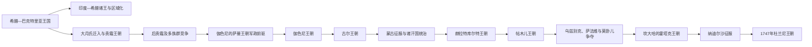

# 阿富汗古代、中世纪与近世早期统治者表

## 范围与年代口径

本表收录以巴克特里亚、加兹尼、古尔、赫拉特或坎大哈为核心，并直接塑造今阿富汗历史的主要王统。阿契美尼德、萨珊、帖木儿、莫卧儿、萨法维和阿夫沙尔是跨区域帝国，其完整世系由各自文明锚点维护，本表不重复全帝国君主，只列本地产生的希腊—巴克特里亚、贵霜、加兹尼、古尔、克尔特与霍塔克序列。

古代王统主要依靠钱币、铭文和后世文献重建。约数表示学界常用年代范围，不等于精确即位日；多位希腊—巴克特里亚王可能分区共治，后期贵霜王的次序与绝对年代也存在争议。

## 主要王统演变图

这张表按影响阿富汗核心区域的主要王统分段，并不意味着各王朝完整覆盖今日国界。山地、绿洲与商路城市常由不同政权同时控制，表中的并立、宗主与附庸关系需结合备注理解。

## 希腊—巴克特里亚王统

| 顺序 | 统治者 | 约在位时间 | 王系与继承 | 关键说明 |
|---|---|---|---|---|
| 1 | 狄奥多托斯一世 | 前255/250—前235年 | 原塞琉古巴克特里亚总督 | 脱离塞琉古，建立独立王国；独立起点有前260年代与前250年代两种常见断代。 |
| 2 | 狄奥多托斯二世 | 前235—前225年 | 前任之子 | 与安息结盟；被欧西德莫斯取代。 |
| 3 | 欧西德莫斯一世 | 前230/225—前200年 | 政变建立新王系 | 抵抗安条克三世围攻，约前206年获承认为王。 |
| 4 | 德米特里一世 | 前200—前180年 | 前任之子 | 越过兴都库什向犍陀罗和印度河流域扩张。 |
| 5 | 潘塔莱翁 | 约前190—前180年 | 欧西德莫斯系，关系不详 | 可能为分区王或共治者，钱币见希腊与印度元素。 |
| 6 | 阿加托克利斯 | 约前190—前180年 | 可能与德米特里一世有亲属关系 | 可能统治帕罗帕米萨达等南部地区；与潘塔莱翁先后关系不定。 |
| 7 | 欧西德莫斯二世 | 约前185—前180年 | 欧西德莫斯系 | 仅由钱币确认，可能与其他王共治。 |
| 8 | 安提马科斯一世 | 约前185—前170年 | 王室关系不详 | 可能控制巴克特里亚西部或阿拉霍西亚，确切范围有争议。 |
| 9 | 德米特里二世 | 约前175—前170年 | 归属存在争议 | 是否与文献中的“印度王德米特里”同一人尚无定论。 |
| 10 | 欧克拉提德一世 | 约前170—前145年 | 政变建立欧克拉提德系 | 与欧西德莫斯诸王长期战争，一度控制巴克特里亚与兴都库什以南地区。 |
| 11 | 柏拉图 | 约前145年前后 | 可能为欧克拉提德一世之弟 | 钱币所见短期或分区统治者，年代与领地均不确定。 |
| 12 | 欧克拉提德二世 | 约前145—前140年 | 可能为欧克拉提德一世之子 | 或与赫利奥克勒斯一世并立；资料极少。 |
| 13 | 赫利奥克勒斯一世 | 约前145—前130年 | 欧克拉提德系 | 通常视为最后一位统治巴克特里亚本土的希腊王；月氏等游牧集团南下后失去巴克特里亚。 |

> “完整”在此指现有钱币与文献能够辨认的巴克特里亚本土王名；兴都库什以南延续到前1世纪的印度—希腊诸王另属多条并立王系，不应机械接成单线。

## 贵霜王统

| 顺序 | 统治者 | 约在位时间 | 继承关系 | 关键说明 |
|---|---|---|---|---|
| 前驱 | 赫拉欧斯 | 约1—30年 | 身份有争议 | 钱币上自称“贵霜”，是否为王朝正式君主仍有争议。 |
| 1 | 丘就却（库朱拉·卡德菲塞斯） | 约30—80年 | 贵霜翕侯统一月氏诸部 | 建立贵霜王权，控制巴克特里亚并向喀布尔河谷扩张。 |
| 2 | 阎膏珍（维马·塔克图） | 约80—90年 | 通常视为前任之子或近亲 | 拉巴塔克铭文恢复其名；旧研究曾称其为“无名王”。 |
| 3 | 阎膏珍二世（维马·卡德菲塞斯） | 约90—127年 | 前任后继者 | 大量铸造金币，强化印度河—中亚—罗马贸易。 |
| 4 | **迦腻色伽一世** | 约127—150年 | 王室继承关系不详 | 帝国鼎盛；以巴克特里亚语和希腊字母行政，佛教及多神信仰并存。 |
| 5 | 胡毗色伽 | 约150—190年 | 可能为前任后继或亲属 | 保持大帝国与多元钱币神祇体系。 |
| 6 | 婆薮提婆一世 | 约190—230年 | 前任后继者 | 常视为“大贵霜”末期；其后萨珊与地方势力夺取西部。 |
| 7 | 迦腻色伽二世 | 约230—247年 | 后期贵霜王 | 主要由钱币和第二贵霜纪年重建。 |
| 8 | 婆什色伽 | 约247—267年 | 可能为前任后继者 | 铭文纪年可确认，统治范围已较早期缩小。 |
| 9 | 迦腻色伽三世 | 约267—270年 | 婆什色伽之子 | 由铭文与钱币确认，具体年限不明。 |
| 10 | 婆薮提婆二世 | 约270—300年 | 关系不详 | 后期贵霜继续在喀布尔及印度西北部分地区铸币。 |
| 11 | 马希 | 约300—305年 | 可能为短期统治者或僭位者 | 王名释读和地位仍有争议。 |
| 12 | 沙卡 | 约305—335年 | 关系不详 | 仅能依据钱币序列大致定位。 |
| 13 | 基普纳达 | 约335—350年 | 最后期贵霜王之一 | 贵霜政治实体逐渐被贵霜—萨珊、贵霜寄多罗等后继势力取代。 |

## 加兹尼政权前驱

| 顺序 | 统治者 | 时间 | 身份 | 说明 |
|---|---|---|---|---|
| 1 | 阿尔普特勤 | 962—963年 | 萨曼王朝突厥将领 | 夺取加兹尼，仍以萨曼属将名义统治。 |
| 2 | 阿布·伊斯哈格·易卜拉欣 | 963—966年 | 阿尔普特勤之子 | 依靠萨曼援助恢复加兹尼。 |
| 3 | 比尔格特勤 | 966—约974/975年 | 突厥古拉姆将领 | 继承地方军政权力，与本地劳维克家族冲突。 |
| 4 | 博里特勤／皮里 | 约974/975—977年 | 突厥古拉姆将领 | 统治失序后被赛布克特勤取代。 |

## 加兹尼王朝君主

| 顺序 | 君主 | 在位时间 | 与前任关系 | 关键事件 |
|---|---|---|---|---|
| 1 | **赛布克特勤** | 977—997年 | 阿尔普特勤女婿、军政集团领袖 | 建立王朝，扩张至喀布尔、巴尔赫与印度西北边地。 |
| 2 | 伊斯玛仪 | 997—998年 | 前任之子 | 按父命继位，旋被兄长马哈茂德击败。 |
| 3 | **加兹尼的马哈茂德** | 998—1030年 | 前任之兄 | 取得阿拔斯哈里发册封，控制呼罗珊并多次远征北印度，帝国达鼎盛。 |
| 4 | 穆罕默德 | 1030年；1041年复位 | 前任之子 | 两度被拥立，第一次被兄长取代，第二次很快败于侄子毛杜德。 |
| 5 | 马苏德一世 | 1030—1041年 | 前任之兄 | 1040年丹丹纳干战败，失去呼罗珊并被军队废杀。 |
| 6 | 毛杜德 | 1041—1048年 | 前任之子 | 击败复位的叔父穆罕默德，勉强稳定核心领地。 |
| 7 | 马苏德二世 | 1048年 | 前任之子 | 幼主或短期君主，在位极短。 |
| 8 | 阿里 | 1048—1049年 | 马苏德一世之子 | 宫廷斗争中即位，旋被叔父取代。 |
| 9 | 阿卜杜勒·拉希德 | 1049—1052年 | 马哈茂德之子 | 被突厥将领托格鲁尔杀害。 |
| 10 | 托格鲁尔 | 1052—1053年 | 无亲属关系，军人僭位 | 杀害多名王族，数十日后被推翻。 |
| 11 | 法鲁赫扎德 | 1053—1059年 | 马苏德一世之子 | 王族复辟并恢复秩序。 |
| 12 | **易卜拉欣** | 1059—1099年 | 前任之弟 | 与塞尔柱议和，稳定缩小后的阿富汗—旁遮普王国。 |
| 13 | 马苏德三世 | 1099—1115年 | 前任之子 | 延续相对稳定，修建宫殿与宣礼塔。 |
| 14 | 希尔扎德 | 1115—1116年 | 前任之子 | 被弟弟阿尔斯兰沙杀害夺位。 |
| 15 | 阿尔斯兰沙 | 1116—1117年 | 前任之弟 | 被获塞尔柱支持的巴赫拉姆沙击败。 |
| 16 | 巴赫拉姆沙 | 1117—1157年 | 前任之弟 | 以塞尔柱附庸身份即位；与古尔王朝战争中丢失加兹尼。 |
| 17 | 霍斯劳沙 | 1157—1160年 | 前任之子 | 王朝核心逐渐东移至旁遮普。 |
| 18 | 霍斯劳·马利克 | 1160—1186年 | 前任之子 | 以拉合尔为中心；1186年被古尔军俘获，王朝灭亡。 |

## 古尔王朝本支君主

| 顺序 | 统治者 | 在位时间 | 政治地位 | 关键说明 |
|---|---|---|---|---|
| 1 | 班吉 | 8世纪 | 早期传说与地方首领 | 谱系来自后世王朝传统，史实难以核实。 |
| 2 | 阿米尔·苏里 | 9—10世纪 | 古尔地方首领 | 早期沙恩萨巴尼家族人物，具体年代不详。 |
| 3 | 穆罕默德·本·苏里 | 10世纪—1011年 | 古尔马利克 | 被加兹尼的马哈茂德击败。 |
| 4 | 阿布·阿里·本·穆罕默德 | 1011—1035年 | 加兹尼附庸 | 在加兹尼压力下推进伊斯兰化。 |
| 5 | 阿巴斯·本·希斯 | 1035—1060年 | 加兹尼附庸 | 因统治问题被宗主干预。 |
| 6 | 穆罕默德·本·阿巴斯 | 1060—1080年 | 加兹尼附庸 | 继承地方统治。 |
| 7 | 库特布丁·哈桑 | 1080—1100年 | 地方马利克 | 在部族冲突中巩固家族地位。 |
| 8 | 伊兹丁·侯赛因 | 1100—1146年 | 先后承认塞尔柱宗主权 | 分封诸子，为后来的多支共治奠定基础。 |
| 9 | 赛义夫丁·苏里 | 1146—1149年 | 家族宗主 | 一度夺取加兹尼，旋被巴赫拉姆沙杀害。 |
| 10 | 巴哈丁·萨姆一世 | 1149年 | 前任之弟 | 准备复仇时去世，在位极短。 |
| 11 | 阿拉丁·侯赛因“焚世者” | 1149—1161年 | 前任之弟、苏丹 | 1151年攻陷并焚掠加兹尼，使古尔成为区域强权。 |
| 12 | 赛义夫丁·穆罕默德 | 1161—1163年 | 前任之子 | 摆脱部分宗主束缚，战死。 |
| 13 | **吉亚斯丁·穆罕默德** | 1163—1203年 | 前任堂弟、帝国西部宗主 | 与弟弟分工扩张，控制赫拉特与呼罗珊，维持家族联合。 |
| 14 | **穆伊兹丁·穆罕默德（穆罕默德·古里）** | 加兹尼1173—1206年；全帝国1203—1206年 | 前任之弟 | 1186年灭加兹尼王朝，1192年塔拉因战役后奠定北印度统治基础；遇刺后帝国裂解。 |
| 15 | 吉亚斯丁·马哈茂德 | 1206—1212年 | 吉亚斯丁·穆罕默德之子 | 受突厥军人和花剌子模压力，名义维持菲鲁兹库赫。 |
| 16 | 巴哈丁·萨姆三世 | 1212—1213年 | 前任之子 | 被花剌子模势力控制。 |
| 17 | 阿拉丁·阿齐兹 | 1213—1214年 | 沙恩萨巴尼家族成员 | 花剌子模扶立的短期君主。 |
| 18 | 阿拉丁·阿里 | 1214—1215年 | 沙恩萨巴尼家族成员 | 最后一位菲鲁兹库赫统治者，被花剌子模沙废黜。 |

## 古尔王朝巴米扬支系

| 顺序 | 统治者 | 在位时间 | 与前任关系 | 说明 |
|---|---|---|---|---|
| 1 | 法赫尔丁·马苏德 | 1152—1163年 | 伊兹丁·侯赛因之子 | 建立巴米扬支系，并与本支争夺宗主权。 |
| 2 | 沙姆斯丁·穆罕默德 | 1163—1192年 | 前任之子 | 控制巴米扬与吐火罗斯坦部分地区。 |
| 3 | 阿巴斯·本·穆罕默德 | 1192年 | 前任之子或近亲 | 短期统治。 |
| 4 | 巴哈丁·萨姆二世 | 1192—1206年 | 前任家族成员 | 一度被视为1206年宗主候选，未能压倒菲鲁兹库赫集团。 |
| 5 | 贾拉尔丁·阿里 | 1206—1215年 | 前任之子 | 受花剌子模宗主权约束，1215年支系被废。 |

## 克尔特王朝（赫拉特）

| 顺序 | 统治者 | 约在位时间 | 与前任关系 | 关键说明 |
|---|---|---|---|---|
| 1 | 沙姆斯丁·穆罕默德一世 | 1245—1278年 | 古尔王室姻亲后裔 | 获蒙古大汗与旭烈兀承认，以赫拉特为中心建立地方王朝。 |
| 2 | 鲁肯丁一世 | 1278—1305年 | 前任之子 | 在伊儿汗宗主权下维持统治；晚年与子法赫尔丁权力重叠。 |
| 3 | 法赫尔丁 | 1295—1308年 | 前任之子 | 强化赫拉特城防，与伊儿汗关系时有冲突。 |
| 4 | 吉亚斯丁·穆罕默德一世 | 1308—1329年 | 前任之弟 | 在伊儿汗末期扩张影响。 |
| 5 | 沙姆斯丁·穆罕默德二世 | 1329—1330年 | 前任之子 | 短期继位。 |
| 6 | 哈菲兹 | 1330—1332年 | 前任之弟 | 宫廷斗争中被杀。 |
| 7 | **穆伊兹丁·侯赛因** | 1332—1370年 | 前任之弟 | 利用伊儿汗解体扩展至呼罗珊，赫拉特进入繁荣期。 |
| 8 | 吉亚斯丁·皮尔·阿里 | 1370—1381年 | 前任之子 | 与兄弟分据、内斗；1381年向帖木儿降服，王朝实质终结。 |

## 霍塔克王朝

| 顺序 | 统治者 | 在位时间 | 与前任关系 | 统治范围与结局 |
|---|---|---|---|---|
| 1 | **米尔维斯·霍塔克** | 1709—1715年 | 吉尔扎伊霍塔克部首领 | 在坎大哈起兵杀死萨法维总督，建立独立政权；多称“坎大哈统治者”而非沙阿。 |
| 2 | 阿卜杜勒·阿齐兹·霍塔克 | 1715—1717年 | 前任之弟 | 试图与萨法维妥协，被侄子马哈茂德杀死。 |
| 3 | 马哈茂德·霍塔克 | 1717—1725年 | 米尔维斯之子 | 1722年攻陷伊斯法罕并称波斯沙阿；因统治危机被堂弟阿什拉夫废杀。 |
| 4 | 阿什拉夫·霍塔克 | 1725—1729年 | 前任堂弟 | 统治伊朗中部，1729年被纳德尔击败；退往坎大哈途中死亡。 |
| 5 | 侯赛因·霍塔克 | 1725/1729—1738年 | 马哈茂德之弟 | 在坎大哈与伊朗支系并立，1738年纳德尔沙攻陷坎大哈后投降，王朝灭亡。 |

## 跨区域帝国世系入口

- 阿契美尼德帝国：[阿契美尼德王朝](/%E4%BA%BA%E6%96%87%E7%A7%91%E5%AD%A6/%E5%8E%86%E5%8F%B2/%E8%A5%BF%E4%BA%9A/%E4%BC%8A%E6%9C%97/%E9%98%BF%E5%A5%91%E7%BE%8E%E5%B0%BC%E5%BE%B7%E7%8E%8B%E6%9C%9D.md)
- 萨珊帝国：[萨珊君主世系表](/%E4%BA%BA%E6%96%87%E7%A7%91%E5%AD%A6/%E5%8E%86%E5%8F%B2/%E8%A5%BF%E4%BA%9A/%E4%BC%8A%E6%9C%97/%E8%90%A8%E7%8F%8A%E5%90%9B%E4%B8%BB%E4%B8%96%E7%B3%BB%E8%A1%A8.md)
- 帖木儿与河中诸汗国：[帖木儿、汗国与近世城市](/%E4%BA%BA%E6%96%87%E7%A7%91%E5%AD%A6/%E5%8E%86%E5%8F%B2/%E4%B8%AD%E4%BA%9A/%E6%B2%B3%E4%B8%AD%E5%9C%B0%E5%8C%BA/%E5%B8%96%E6%9C%A8%E5%84%BF%E3%80%81%E6%B1%97%E5%9B%BD%E4%B8%8E%E8%BF%91%E4%B8%96%E5%9F%8E%E5%B8%82.md)
- 莫卧儿帝国：[莫卧儿帝国](/%E4%BA%BA%E6%96%87%E7%A7%91%E5%AD%A6/%E5%8E%86%E5%8F%B2/%E5%8D%97%E4%BA%9A/%E5%8D%B0%E5%BA%A6/%E8%8E%AB%E5%8D%A7%E5%84%BF%E5%B8%9D%E5%9B%BD.md)
- 萨法维与阿夫沙尔：[萨法维王朝](/%E4%BA%BA%E6%96%87%E7%A7%91%E5%AD%A6/%E5%8E%86%E5%8F%B2/%E8%A5%BF%E4%BA%9A/%E4%BC%8A%E6%9C%97/%E8%90%A8%E6%B3%95%E7%BB%B4%E7%8E%8B%E6%9C%9D.md)、[阿夫沙尔王朝](/%E4%BA%BA%E6%96%87%E7%A7%91%E5%AD%A6/%E5%8E%86%E5%8F%B2/%E8%A5%BF%E4%BA%9A/%E4%BC%8A%E6%9C%97/%E9%98%BF%E5%A4%AB%E6%B2%99%E5%B0%94%E7%8E%8B%E6%9C%9D.md)

## 相关笔记

- 阶段主文：[阿富汗的巴克特里亚、贵霜与伊斯兰王朝](/%E4%BA%BA%E6%96%87%E7%A7%91%E5%AD%A6/%E5%8E%86%E5%8F%B2/%E4%B8%AD%E4%BA%9A/%E9%98%BF%E5%AF%8C%E6%B1%97/%E5%B7%B4%E5%85%8B%E7%89%B9%E9%87%8C%E4%BA%9A%E3%80%81%E8%B4%B5%E9%9C%9C%E4%B8%8E%E4%BC%8A%E6%96%AF%E5%85%B0%E7%8E%8B%E6%9C%9D.md)
- 上级：[阿富汗历史](/%E4%BA%BA%E6%96%87%E7%A7%91%E5%AD%A6/%E5%8E%86%E5%8F%B2/%E4%B8%AD%E4%BA%9A/%E9%98%BF%E5%AF%8C%E6%B1%97/README.md)
