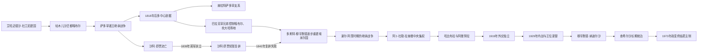

# 杜兰尼与巴拉克宰王朝世系表

## 使用说明

1747—1973年的阿富汗王统不是始终统一的单线。1818年后萨多宰王权分裂为赫拉特、喀布尔、坎大哈和白沙瓦等中心；1839—1842年又出现英国扶立的复辟王权。因此本表先列全国性或自称全国宗主的王位，再把分裂期实际地方统治者分表列出。日期精确到日者依当时宣告、进城、退位或死亡记录；史料不一致处保留“约”或并列口径。

## 王朝分裂、复辟与重建图

杜兰尼与巴拉克宰的交替包含废黜、复位、英军干预和宗族分支并立，不能简化为单一父子线。下表按实际在位顺序记录萨多宰王位，再列巴拉克宰埃米尔与国王，并在备注中说明复辟和争议统治。

## 杜兰尼—萨多宰王位与复辟序列

| 顺序 | 统治者 | 在位或主张时间 | 与前任关系 | 实际范围与关键说明 |
|---|---|---|---|---|
| 1 | **艾哈迈德·沙阿·杜兰尼** | 1747年7月—1772年 | 杜兰尼萨多宰支创建者 | 坎大哈部族会议推举；建立横跨呼罗珊、阿富汗与印度西北的帝国。死亡日有1772年6月4日与10月16日等记载。 |
| 2 | 苏莱曼沙阿 | 1772年6—8月 | 前任之子 | 在坎大哈短暂即位，未能压倒兄弟帖木儿，常被简表省略。 |
| 3 | **帖木儿·沙阿** | 1772年8月—1793年5月19日 | 前任之子 | 击败苏莱曼，1775/1776年前后把政治中心移至喀布尔；死后诸子争位。 |
| 4 | 扎曼·沙阿 | 1793年5月—1801年7月24日 | 前任之子 | 试图强化王权并东征；处死巴拉克宰首领帕因达汗，失去穆罕默德宰支持，后被废黜并刺瞎。 |
| 5 | 马哈茂德·沙阿（第一次） | 1801年7月24日—1803年7月 | 前任之兄弟 | 依靠巴拉克宰法特赫汗即位，旋被沙阿舒贾推翻。 |
| 6 | 沙阿舒贾（第一次） | 1803年7月13日—1809年 | 前任之兄弟 | 受吉尔扎伊与喀布尔城市集团支持；内战中败于马哈茂德。 |
| 7 | 马哈茂德·沙阿（第二次） | 1809—1828/1829年 | 复位 | 1818年后实际只控制赫拉特；其子卡姆兰杀害法特赫汗，引发巴拉克宰兄弟全面反叛。 |
| 8 | 苏丹阿里·沙阿 | 1818年 | 帖木儿之子 | 在喀布尔短暂称王，与马哈茂德及地方统治者并立。 |
| 9 | 阿尤布·沙阿 | 1818—1822/1823年 | 帖木儿之子 | 在白沙瓦称王；其名义钱币可能延续至1829年。 |
| 10 | 卡姆兰·沙阿 | 1828/1829—1842年 | 马哈茂德之子 | 仅统治赫拉特；1842年被权臣亚尔·穆罕默德杀死。 |
| 11 | 沙阿舒贾（第二次） | 1839年5月8日—1842年4月6日 | 复位 | 英军扶立，先入坎大哈后入喀布尔；高度依赖占领军，喀布尔起义期间遇刺。 |
| 12 | 法特赫·詹格·沙阿 | 1842年4月—10月12日 | 沙阿舒贾之子 | 在英军撤退与起义各派之间短暂称王，实际控制有限。 |
| 13 | 沙阿普尔·沙阿 | 1842年10月12日—1843年4月 | 法特赫·詹格之兄弟 | 由英方支持的末次萨多宰安排；英军撤离后失去权力。 |

## 1818—1839年喀布尔地方统治者

| 顺序 | 统治者 | 时间 | 关系与说明 |
|---|---|---|---|
| 1 | 多斯特·穆罕默德汗 | 1818年 | 法特赫汗之弟；从萨多宰官员手中夺取喀布尔，旋让位于兄长。 |
| 2 | 穆罕默德·阿齐姆汗 | 1818—1823年 | 多斯特的兄长，巴拉克宰兄弟中一度最有权势者。 |
| 3 | 哈比布拉汗 | 1823—1824年 | 阿齐姆汗之子，未能维持叔伯支持。 |
| 4 | 多斯特·穆罕默德汗 | 1824年 | 短暂复掌喀布尔。 |
| 5 | 亚尔·穆罕默德汗 | 1824年 | 巴拉克宰地方强人，短暂占据权位。 |
| 6 | 苏丹·穆罕默德汗 | 1824—1826年 | 多斯特的兄弟或异母兄弟，后转据白沙瓦。 |
| 7 | **多斯特·穆罕默德汗** | 1826—1834年为萨达尔；约1834—1839年为埃米尔 | 1826年稳固喀布尔，约1834年正式采用埃米尔称号；1839年第一次英阿战争中失位。 |

## 1818—1855年坎大哈地方统治者

| 顺序 | 统治者 | 时间 | 关系与说明 |
|---|---|---|---|
| 1 | 谢尔迪尔汗 | 1818—1826年8月29日 | 法特赫汗之弟，马哈茂德退往赫拉特后成为实际统治者。 |
| 2 | 普尔迪尔汗 | 1826年8月29日—1830年5月22日 | 前任之兄弟，外交文书中一度使用“帕迪沙”称号。 |
| 3 | 科汉迪尔汗、拉赫姆迪尔汗、米赫迪尔汗 | 1830年5月22日—1839年5月8日 | 三兄弟共治；沙阿舒贾在英军支持下进入坎大哈后中断。 |
| 4 | 科汉迪尔汗 | 1842—1855年8月21日 | 英军与沙阿舒贾政权崩溃后复位。 |
| 5 | 拉赫姆迪尔汗 | 1855年8—11月 | 科汉迪尔死后短暂掌权。 |
| 6 | 穆罕默德·萨迪克汗 | 1855年9—11月 | 与拉赫姆迪尔争位；多斯特·穆罕默德11月进入坎大哈，地方独立结束。 |

## 1818—1834年白沙瓦地方统治者

| 顺序 | 统治者 | 时间 | 说明 |
|---|---|---|---|
| 1 | 阿塔·穆罕默德汗 | 1818—1824年 | 巴拉克宰萨达尔，地方实际统治者。 |
| 2 | 亚尔·穆罕默德汗 | 1824—1828年 | 继承地方统治。 |
| 3 | 苏丹·穆罕默德汗 | 1828—1829年 | 首次统治。 |
| 4 | 赛义德·艾哈迈德 | 1829年 | 宗教军事运动领袖，短期进入权力真空。 |
| 5 | 苏丹·穆罕默德汗 | 1829—1834年5月6日 | 复位；锡克军夺取白沙瓦后，阿富汗地方政权终结。 |

## 1842—1863年赫拉特地方统治者

| 顺序 | 统治者或政权 | 时间 | 王系与说明 |
|---|---|---|---|
| 1 | 维齐尔亚尔·穆罕默德汗 | 约1842年3月—1851年6月11日 | 阿拉科宰权臣；杀死卡姆兰后成为实际统治者，名义上时受伊朗宗主权影响。 |
| 2 | 赛义德·穆罕默德汗 | 1851年6月—约1855年9月25日 | 前任之子；地方统治不稳。 |
| 3 | 穆罕默德·优素福 | 约1855年9月25日—1856年4月28日 | 萨多宰王子；反对伊朗宗主要求而被推翻。 |
| 4 | 伊萨汗 | 1856年4月28日—10月25日 | 地方将领，随后伊朗军直接占领赫拉特。 |
| — | 伊朗军事占领 | 1856年10月25日—1857年5月24日 | 英波战争与《巴黎条约》后撤军。 |
| 5 | 苏丹·艾哈迈德汗 | 1857年5月24日—1863年3月6日 | 穆罕默德宰家族，多斯特·穆罕默德的女婿兼侄子。 |
| 6 | 沙赫纳瓦兹汗 | 1863年3月6日—5月27日 | 前任之子；多斯特军攻占赫拉特后，地方独立终结。 |

## 巴拉克宰—穆罕默德宰全国王统

| 顺序 | 统治者 | 在位时间 | 与前任关系 | 关键事件与备注 |
|---|---|---|---|---|
| 1 | **多斯特·穆罕默德汗** | 1843年4/5月—1863年6月9日 | 王朝创建者、复位 | 第一次英阿战争后返国；1855年并坎大哈，1863年攻取赫拉特，重建核心疆域。 |
| 2 | 谢尔·阿里汗（第一次） | 1863年6月12日—1866年5月 | 前任之子 | 继位即遭兄弟内战；失去喀布尔但一度保有坎大哈、赫拉特。 |
| 3 | 穆罕默德·阿夫扎尔汗 | 1866年5月25日—1867年10月4日 | 前任之兄 | 叛军拥立，死后由弟继位。 |
| 4 | 穆罕默德·阿扎姆汗 | 1867年10月11日—1868年10月 | 前任之弟 | 1868年被谢尔·阿里反攻驱逐。 |
| 5 | 谢尔·阿里汗（第二次） | 1868年9月—1879年2月21日 | 复位 | 推进军政改革；拒绝英国使团并接待俄国使团，触发第二次英阿战争。 |
| 6 | 穆罕默德·雅库布汗 | 1879年2月28日—10月28日 | 前任之子 | 签订《甘达马克条约》，英国控制外交；英驻使遇害后退位。 |
| — | 英属印度军事行政 | 1879年10月28日—1880年7月22日 | 非王朝 | 英军占领喀布尔；幼年穆罕默德·穆萨汗曾被反占领者拥为名义埃米尔。 |
| 7 | **阿卜杜勒·拉赫曼汗** | 1880年7月20日—1901年10月3日 | 多斯特·穆罕默德之孙 | “铁腕埃米尔”；在英援下建常备军、税制与官僚体系，以高压征服哈扎拉地区等边疆；1893年签订杜兰线协议。 |
| 8 | 哈比布拉汗 | 1901年10月3日—1919年2月20日 | 前任之子 | 渐进办学、医疗与军政改革；第一次世界大战中保持中立，遇刺身亡。 |
| 9 | 纳斯鲁拉汗 | 1919年2月20—27日 | 前任之弟 | 在贾拉拉巴德获拥立，旋向侄子阿曼努拉投降并退位。 |
| 10 | **阿曼努拉汗** | 1919年2月21日—1929年1月14日 | 哈比布拉之子 | 第三次英阿战争后取得外交自主；1926年由埃米尔改称国王；快速改革引发部族与宗教反弹，内战中退位。 |
| 11 | 伊纳亚图拉汗 | 1929年1月14—17日 | 前任之兄 | 被阿曼努拉传位，在喀布尔被围三日后退位。 |
| 12 | 哈比布拉·卡拉卡尼 | 1928年12月起兵；1929年1月16日—10月13日控制喀布尔 | 非王族，塔吉克出身 | 推翻阿曼努拉改革政权；未能建立全国稳定控制，后被纳迪尔汗军队击败处决。 |
| 13 | **穆罕默德·纳迪尔沙阿** | 1929年10月15日—1933年11月8日 | 穆罕默德宰穆萨希班支 | 重新统一喀布尔政权，采取较审慎改革，1931年颁宪；遇刺。 |
| 14 | **穆罕默德·查希尔沙阿** | 1933年11月8日—1973年7月17日 | 前任之子 | 前期由叔父与堂兄任首相掌权；1964年宪法开启有限议会政治。1973年在国外时被堂兄达乌德政变废黜。 |

### 重要并立与复辟主张

| 人物 | 时间 | 范围与结局 |
|---|---|---|
| 阿尤布汗 | 1879—1881年 | 雅库布之弟，以赫拉特和坎大哈为基础抗英；1880年迈万德战役获胜，随后在坎大哈败于罗伯茨，1881年再败后流亡。 |
| 穆罕默德·伊沙克汗 | 1888年8—9月 | 阿富汗突厥斯坦起兵称王，被阿卜杜勒·拉赫曼击败。 |
| 阿里·艾哈迈德汗 | 1929年1—2月、5—6月 | 在贾拉拉巴德与南部两度称王，均被卡拉卡尼或地方势力击败。 |
| 阿曼努拉汗复辟 | 1929年1—5月23日 | 退位后由坎大哈再起兵，失败后流亡。 |

## 王国时期政府首脑

首相与国王分表，避免把礼仪元首、王室摄政者和行政首脑混为一列。1927—1929年的首相职位仍偏王室顾问性质；1933—1963年实际权力长期掌握在国王的叔父和堂兄首相手中，1964年宪法才明确限制王族兼任政府职务。

| 顺序 | 首相 | 任期 | 王朝阶段与实际作用 |
|---|---|---|---|
| 1 | 谢尔·艾哈迈德汗 | 1927年10月25日—1929年1月 | 阿曼努拉设置的首相，仍由国王直接主导改革；政权在内战中瓦解。 |
| 2 | 穆罕默德·哈希姆汗 | 1929年11月1日—1946年5月9日 | 纳迪尔的弟弟、查希尔的叔父；纳迪尔死后长期掌握军政与外交。 |
| 3 | 沙阿·马哈茂德汗 | 1946年5月9日—1953年9月7日 | 哈希姆之弟；有限放松政治控制，后因议会与社会压力收紧。 |
| 4 | **穆罕默德·达乌德汗** | 1953年9月7日—1963年3月10日 | 国王堂兄；国家主导现代化、依赖苏联军援，并因“普什图斯坦”问题与巴基斯坦紧张。 |
| 5 | 穆罕默德·优素福 | 1963年3月10日—1965年11月2日 | 非王族技术官僚；主持1964年宪法过渡与首次新制议会选举。 |
| 6 | 穆罕默德·哈希姆·迈万德瓦尔 | 1965年11月2日—1967年10月11日 | 议会宪政早期首相；在政治派系与议会压力下辞职。 |
| 7 | 阿卜杜拉·亚夫塔 | 1967年10月11日—11月1日 | 临时首相，负责交接。 |
| 8 | 穆罕默德·努尔·艾哈迈德·埃特马迪 | 1967年11月1日—1971年6月9日 | 同时承担重要外交职责；议会碎片化与改革迟缓持续。 |
| 9 | 阿卜杜勒·查希尔 | 1971年6月9日—1972年12月12日 | 面对旱灾、饥荒与政府响应不力的批评。 |
| 10 | 穆罕默德·穆萨·沙菲克 | 1972年12月12日—1973年7月17日 | 推动对外关系与赫尔曼德河协议；达乌德政变时被捕，王国终结。 |

## 相关笔记

- 阶段主文：[阿富汗的杜兰尼、英俄大博弈与阿富汗王国](/%E4%BA%BA%E6%96%87%E7%A7%91%E5%AD%A6/%E5%8E%86%E5%8F%B2/%E4%B8%AD%E4%BA%9A/%E9%98%BF%E5%AF%8C%E6%B1%97/%E6%9D%9C%E5%85%B0%E5%B0%BC%E3%80%81%E8%8B%B1%E4%BF%84%E5%A4%A7%E5%8D%9A%E5%BC%88%E4%B8%8E%E9%98%BF%E5%AF%8C%E6%B1%97%E7%8E%8B%E5%9B%BD.md)
- 前一阶段：[阿富汗的巴克特里亚、贵霜与伊斯兰王朝](/%E4%BA%BA%E6%96%87%E7%A7%91%E5%AD%A6/%E5%8E%86%E5%8F%B2/%E4%B8%AD%E4%BA%9A/%E9%98%BF%E5%AF%8C%E6%B1%97/%E5%B7%B4%E5%85%8B%E7%89%B9%E9%87%8C%E4%BA%9A%E3%80%81%E8%B4%B5%E9%9C%9C%E4%B8%8E%E4%BC%8A%E6%96%AF%E5%85%B0%E7%8E%8B%E6%9C%9D.md)
- 后一阶段：[阿富汗的革命、战争与现代阿富汗](/%E4%BA%BA%E6%96%87%E7%A7%91%E5%AD%A6/%E5%8E%86%E5%8F%B2/%E4%B8%AD%E4%BA%9A/%E9%98%BF%E5%AF%8C%E6%B1%97/%E9%9D%A9%E5%91%BD%E3%80%81%E6%88%98%E4%BA%89%E4%B8%8E%E7%8E%B0%E4%BB%A3%E9%98%BF%E5%AF%8C%E6%B1%97.md)
- 上级：[阿富汗历史](/%E4%BA%BA%E6%96%87%E7%A7%91%E5%AD%A6/%E5%8E%86%E5%8F%B2/%E4%B8%AD%E4%BA%9A/%E9%98%BF%E5%AF%8C%E6%B1%97/README.md)
