# 阿富汗的革命、战争与现代阿富汗

## 时间

1973年至今；现代信息核验截止至2026年7月。

## 概括

1973年达乌德以军官政变废除君主制，建立高度集中的共和国。1978年人民民主党发动四月革命，激进改革、党内清洗和国家暴力激起广泛反抗；1979年苏联出兵并扶植旗帜派政府，使内战成为冷战代理战争。苏军1989年撤离后，纳吉布拉政权依靠苏联援助和地方民兵又维持三年；1992年援助中断、联盟瓦解，圣战者进入喀布尔，却因派系战争无法建立统一国家。塔利班由1994年的坎大哈运动扩张，1996年控制喀布尔，至2001年统治大部分国土。

2001年美国及盟军因“九一一”袭击推翻塔利班首都政权，以《波恩协议》、2004年宪法、选举和国际援助重建伊斯兰共和国。新国家扩大教育、媒体、城市服务和女性公共参与，也因总统制过度集中、地方强人、腐败、选举争议、外援依赖和战争经济而缺乏稳固社会契约。塔利班在巴基斯坦边境网络、乡村治理和外国军队造成的伤亡中恢复。2020年美国与塔利班签署多哈协议；2021年外国军队撤离、地方交易与安全部队崩解叠加，塔利班于8月15日重入喀布尔。

第二次伊斯兰酋长国由最高领导海巴图拉·阿洪扎达在坎大哈作最终裁决，喀布尔代理内阁负责行政。截至2026年7月，事实当局基本控制全国，整体战事低于此前二十年，但女性和女童教育、就业及公共生活限制持续，“伊斯兰国呼罗珊省”、反塔利班武装、巴基斯坦边境冲突、强制返乡与人道经济危机仍构成长期压力。

## 演进图

```mermaid
flowchart LR
    Kingdom["查希尔沙阿王国"] -->|1973年达乌德政变| Daoud["达乌德共和国"]
    Daoud -->|1978年四月革命| PDPA["人民民主党政权"]
    PDPA -->|1979年苏联出兵| SovietWar["苏联战争与圣战者抵抗"]
    SovietWar -->|1989年苏军撤离| Najib["纳吉布拉政府独立作战"]
    Najib -->|1992年政权瓦解| IslamicState["圣战者伊斯兰国"]
    IslamicState --> CivilWar["喀布尔派系内战"]
    CivilWar --> Taliban1["塔利班第一次酋长国"]
    IslamicState --> NorthernAlliance["拉巴尼政府与北方联盟"]
    Taliban1 -->|2001年美国及盟军介入| Bonn["波恩进程与过渡政府"]
    NorthernAlliance --> Bonn
    Bonn --> Republic["阿富汗伊斯兰共和国"]
    Republic -->|2020年多哈协议与撤军| Collapse["2021年共和国崩溃"]
    Collapse --> Taliban2["塔利班第二次伊斯兰酋长国"]
```

## 政权与实际权力结构

| 阶段 | 法定或自称政体 | 实际最高权力 | 主要支柱与制约 |
|---|---|---|---|
| 1973—1978年 | 阿富汗共和国 | 总统达乌德 | 军官、国家官僚和一党体制；受左翼、伊斯兰主义与经济压力夹击 |
| 1978—1979年 | 阿富汗民主共和国 | 人民民主党人民派党魁 | 革命委员会、安全机构和党籍军官；党内分裂、农村反抗迅速扩大 |
| 1979—1989年 | 民主共和国／共和国 | 旗帜派党魁与总统；苏联拥有决定性军事影响 | 苏军、阿富汗军警、党国官僚和地方民兵；圣战者获巴基斯坦、美国、沙特等援助 |
| 1989—1992年 | 阿富汗共和国 | 总统纳吉布拉 | 城市军队、空军、祖国党、地方民兵和苏联援助；援助中断后联盟解体 |
| 1992—1996年 | 阿富汗伊斯兰国 | 拉巴尼为元首，各派首领控制本部武装 | 伊斯兰促进会、伊斯兰党、民族伊斯兰运动、统一党等并立，中央无统一军权 |
| 1996—2001年 | 伊斯兰酋长国与伊斯兰国并立 | 塔利班区由奥马尔和坎大哈舒拉裁决；东北由拉巴尼—马苏德联盟控制 | 塔利班宗教军事网络、巴基斯坦支持；北方联盟及国际承认制约其全国统治 |
| 2001—2004年 | 临时行政当局／过渡伊斯兰国 | 卡尔扎伊过渡政府与地方军政强人；美国及国际部队掌握关键安全能力 | 波恩派系安排、北方联盟、国际援助和支尔格大会 |
| 2004—2021年 | 阿富汗伊斯兰共和国 | 强势总统；2014—2020年与首席执行官分享部分行政权 | 宪法机构、援助财政、安全部队、地方网络和外国军队；塔利班叛乱持续 |
| 2021年至今 | 阿富汗伊斯兰酋长国 | 最高领导阿洪扎达 | 坎大哈宗教核心、代理内阁、军警与省级任命体系；缺乏包容性制度和广泛国际承认 |

## 分阶段过程

### 达乌德共和国：王室政变到一党总统制（1973—1978年）

达乌德曾于1953—1963年任首相，主张国家主导现代化和“普什图斯坦”。1973年查希尔沙阿在国外时，他联合亲信军官和部分人民民主党旗帜派成员控制电台、王宫与军营，宣布共和国。政变近乎无流血，却不是民主共和革命：达乌德同时任总统、总理和外交等要职，以中央委员会统治，逐步排除早期左翼盟友。

1975年潘杰希尔伊斯兰主义起义失败，希克马蒂亚尔、拉巴尼等人的网络在巴基斯坦获得庇护。达乌德随后尝试降低对苏联依赖，改善同伊朗、埃及、沙特和巴基斯坦关系。1977年宪法确立国家革命党一党制。人民民主党人民派与旗帜派虽分裂，仍在军官和城市知识界保有组织；1978年左翼活动家米尔·阿克巴尔·开伯遇刺后的大规模葬礼触发逮捕，党籍军官抢先发动政变。4月27—28日总统府被攻陷，达乌德及家人被杀。

### 四月革命、人民派激进化与苏联入侵（1978—1979年）

塔拉基政府宣布土地改革、取消部分债务和高额彩礼、推广识字与世俗教育。这些目标触及地主、债权人和婚姻权力，却由不了解地方关系的党干部、军警和逮捕运动强制执行；宗教领袖、部族、农民和旧精英把改革同无神论和外来统治联系。人民派同时清洗旗帜派，数千名真实或被怀疑的反对者遭监禁、处决或失踪。

1978年夏努里斯坦等地起兵，1979年3月赫拉特发生大规模叛乱，政府与苏联顾问遭袭，军队以轰炸和镇压回应。塔拉基与总理阿明争权，阿明9月废杀塔拉基。苏联领导层担心阿明无法控制局势、可能改变阵营，也担心本国南部边界安全；12月24日起苏军大规模进入，27日特种部队攻占塔吉贝格宫并杀死阿明，扶植流亡旗帜派领袖卡尔迈勒。由此，内战升级为外国军队直接参战。

### 苏联战争与圣战者网络（1979—1989年）

苏联军队控制主要城市、机场、道路和大规模清剿，阿富汗政府负责许多驻防、情报和地方行动。抵抗并非统一组织：白沙瓦“七党”、伊朗支持的什叶派组织、地方指挥官、部族和宗教网络各有基地。巴基斯坦三军情报局分配美国、沙特、中国等来源的援助，偏好某些伊斯兰主义组织；军援改变了各派之间的力量，也使难民营成为招募、教育和政治动员空间。

战争造成村庄毁坏、地雷、农业中断和数百万人逃往巴基斯坦、伊朗或城市。喀布尔政府并非只靠苏军：它扩大教育与城市就业，建立民兵联盟，并利用派系、族群和地方利益。1986年纳吉布拉取代卡尔迈勒，提出“民族和解”，1987年宪法恢复总统和伊斯兰表述，1988年开始淡化马克思主义党国形象。

1988年《日内瓦协议》规定苏军撤离，最后一批苏军于1989年2月离境。圣战者同年进攻贾拉拉巴德失败，证明喀布尔政权仍能依靠空军、重武器、国家机构和持续苏联援助作战。

### 纳吉布拉政权垮台与圣战者内战（1989—1996年）

苏联1991年解体后燃油、弹药和财政援助骤停。1992年北方民兵领袖杜斯塔姆倒向反政府联盟，喀布尔补给线断裂；纳吉布拉同意联合国过渡方案但未能离境，4月政权瓦解。他此后留在联合国驻喀布尔机构，1996年塔利班入城时被处死。

《白沙瓦协议》安排穆贾迪迪短期任元首、拉巴尼随后接任，但希克马蒂亚尔拒绝接受权力分配，马苏德、杜斯塔姆、哈扎拉统一党、伊蒂哈德等也各掌武装。1992—1996年，喀布尔遭火箭、炮击、巷战和派系分区，平民遭杀戮、绑架、强奸与财产掠夺。地方上则出现不同结果：赫拉特、马扎里沙里夫等地一度由强人建立相对稳定的区域政权。全国缺乏统一军队、税制和司法，战争经济与检查站腐败削弱圣战者政府合法性。

### 塔利班第一次崛起与统治（1994—2001年）

塔利班1994年在坎大哈周边形成，成员包括宗教学校学生、前圣战者和来自难民社群的普什图青年。它以清除军阀、开放商路、实施自身解释的伊斯兰秩序为号召，获得部分商人、地方社群和巴基斯坦网络支持。1994年夺取坎大哈，1995年夺赫拉特，1996年9月进入喀布尔；奥马尔此前已获宗教人士拥为“信士的长官”。

塔利班通过宗教警察、法令和军事指挥取代正式宪政，禁止女性大部分教育与就业，严控服饰、媒体和文化。1998年夺取马扎里沙里夫并杀害大量哈扎拉平民和伊朗外交人员，几乎引发与伊朗战争。拉巴尼政府和马苏德退守东北，形成北方联盟。塔利班接纳乌萨马·本·拉登和“基地”组织训练网络，遭联合国制裁；2001年3月巴米扬大佛被炸毁。

2001年9月9日马苏德遭“基地”人员刺杀；两日后发生“九一一”袭击。美国要求交出本·拉登未果，10月7日开始空袭并联合北方联盟推进。塔利班在常规战场迅速失去马扎里沙里夫、喀布尔和坎大哈，但领导与战斗网络转入边境和乡村，第一次酋长国失去领土政权而未被组织性消灭。

### 波恩进程与伊斯兰共和国建国（2001—2009年）

2001年12月《波恩协议》让卡尔扎伊领导临时行政当局，并把北方联盟、流亡精英和部分前国王派纳入过渡。塔利班未参加，许多军阀通过部长、省长、议会和安全机构重新进入国家。2002年紧急支尔格大会建立过渡政府，2004年宪法设置强总统、两院议会、独立司法和广泛权利，同年卡尔扎伊当选总统。

国际援助重建学校、道路、通信、医疗和媒体，城市人口与女性教育、就业显著扩大。与此同时，援助绕过国家预算、承包腐败、土地掠夺、任人唯亲和地方强人削弱法治。美国早期把资源转向伊拉克，阿富汗政府在南部和东部存在有限；塔利班利用越境庇护、夜间袭击、政府滥权、空袭平民伤亡和快速裁决体系逐步复兴。鸦片种植、走私、地方税和外援共同构成战争经济，各方都从中获利。

### 增兵、选举危机与谈判（2009—2020年）

2009年总统选举出现大规模舞弊争议，美国随后增兵并推动反叛乱、清剿与地方治理，2011年前后外国兵力达高峰。军事行动能短期夺取地区，却难以阻止塔利班在部队撤走后恢复；巴基斯坦庇护问题、阿富汗安全部队伤亡与“幽灵兵”、政府内部网络和地方争端持续。

2014年外国作战任务缩减，加尼与阿卜杜拉的选举争议经美国斡旋，建立宪法外的首席执行官职位。民族团结政府内部竞争延误任命与改革，塔利班2015年短暂夺取昆都士，显示其已能攻占省会。2018年后美国绕过喀布尔政府与塔利班直接谈判。

2020年2月29日多哈协议规定美国及盟军撤军、塔利班作反恐承诺并启动阿富汗人内部谈判；阿富汗政府不是协议签署方，却需释放大量囚犯。协议减少塔利班对外国军队攻击，却没有形成全国停火或最终政治安排，也使共和国军政精英预期美国必然离开。

### 共和国迅速崩溃（2021年）

2021年外国部队确定撤离后，塔利班以军事进攻、地方投降协议、部族斡旋和对官员保证安全相结合，逐县切断省会。共和国安全部队名义人数庞大，实际依赖美国空中支援、维修、承包商、薪资系统和集中补给；地方部队长期伤亡，领导层腐败且指挥频繁更换。中央政府没有把有限精锐和空军集中于可守目标，反而试图同时守卫过多据点。

8月6日起省会连锁失守，北方原反塔利班强人也未能重建统一防线。8月15日塔利班抵达喀布尔，加尼离境，政府和安全指挥体系在没有大规模首都战的情况下解体。直接原因是撤军时间表与省级投降连锁，深层原因则包括国家外援依赖、精英分裂、乡村合法性薄弱、塔利班组织韧性和多哈进程排除共和国。

### 第二次伊斯兰酋长国（2021—2026年7月）

2021年9月塔利班宣布全男性代理内阁，穆罕默德·哈桑·阿洪德任代理总理；最高领导阿洪扎达留在坎大哈并通过命令掌握最终权力。事实当局接管原共和国的部委、税关、中央银行和省县行政，但取消或搁置民选总统、议会、选举机构及许多宪法安排；大量共和国时期技术官员继续在低层服务，高层则持续由塔利班忠诚者替换。

统治出现几条同时存在的趋势：

- **安全与财政集中**：全国大规模前线战显著减少，关税和税收征集更集中；2022年禁种罂粟令使种植面积大幅下降，但农户生计与地下市场承受冲击。
- **政治排他**：内阁、最高法院、省长和安全职位由男性塔利班成员主导，其他政治力量、女性与多数非塔利班专业人士缺乏制度化参与。
- **女性权利倒退**：2021年后女童中学教育暂停，2022年女性大学教育被禁，女性就业、旅行和公共空间持续受限；到2026年这些限制仍未取消，并波及医疗培训和人道工作。
- **持续暴力风险**：“伊斯兰国呼罗珊省”袭击哈扎拉、宗教场所、官员和外国目标；潘杰希尔等地反塔利班武装规模有限，边境地区与巴基斯坦的冲突在2025—2026年加剧。
- **国际关系分层**：中国、巴基斯坦、伊朗、中亚国家、印度及海湾国家与事实当局保持不同程度接触。俄罗斯2025年7月成为第一个正式承认第二次酋长国政府的联合国会员国；截至2026年7月，多数国家仍未正式承认。
- **社会经济压力**：外国发展援助骤减、银行与制裁限制、旱灾、地震、失业和大批从巴基斯坦、伊朗返乡者叠加。局部经济稳定不等于摆脱人道危机。

## 重要事件

| 时间 | 事件 | 结果与转折 |
|---|---|---|
| 1973年7月 | 达乌德政变 | 王国终结，共和国建立 |
| 1975年 | 潘杰希尔伊斯兰主义起义失败 | 反对派流亡巴基斯坦，跨境网络形成 |
| 1977年 | 新宪法 | 达乌德一党总统制制度化 |
| 1978年4月 | 四月革命 | 人民民主党夺权，达乌德被杀 |
| 1979年3月 | 赫拉特起义 | 反抗全国化，政府与苏联加强军事介入 |
| 1979年9月 | 阿明废杀塔拉基 | 人民派内斗达顶点 |
| 1979年12月 | 苏联入侵、阿明被杀 | 内战转化为国际化战争 |
| 1986年 | 纳吉布拉取代卡尔迈勒 | 转向“民族和解”与政体去马克思主义化 |
| 1988年4月 | 《日内瓦协议》 | 确定苏军撤离框架 |
| 1989年2月 | 苏军全部撤离 | 阿富汗政府独立作战，但战争未结束 |
| 1989年3—7月 | 贾拉拉巴德战役 | 圣战者未能迅速推翻喀布尔政府 |
| 1991—1992年 | 苏联援助中断、民兵倒戈 | 纳吉布拉政权崩溃 |
| 1992年4月 | 圣战者进入喀布尔 | 伊斯兰国建立，派系战争随即爆发 |
| 1994年 | 塔利班夺取坎大哈 | 新的宗教军事运动形成领土政权 |
| 1996年9月 | 塔利班占领喀布尔 | 第一次酋长国控制首都，拉巴尼政府退守北方 |
| 1998年 | 塔利班攻占马扎里沙里夫 | 控制大部分国土，哈扎拉平民遭大规模杀害 |
| 2001年3月 | 巴米扬大佛被毁 | 文化遗产遭不可逆破坏，国际孤立加深 |
| 2001年9月9—11日 | 马苏德遇刺与“九一一”袭击 | 美国介入的直接前奏 |
| 2001年10—12月 | 美国及盟军与北方联盟攻势、《波恩协议》 | 塔利班失去城市政权，过渡政府成立 |
| 2004年 | 宪法与首次总统选举 | 强总统制伊斯兰共和国制度化 |
| 2009—2011年 | 选举危机与国际增兵 | 战事升级，未能消除叛乱基础 |
| 2014年 | 民族团结政府 | 首席执行官职位以政治协议创设 |
| 2015年 | 塔利班短暂攻占昆都士 | 显示其具备攻取省会能力 |
| 2020年2月 | 多哈协议 | 外军撤离确定化，共和国被排除在签署之外 |
| 2021年8月15日 | 塔利班进入喀布尔 | 伊斯兰共和国崩溃，第二次酋长国建立 |
| 2021—2022年 | 女童中学与女性大学教育先后暂停 | 女性和女童被系统性排除出多数教育阶段 |
| 2022年4月 | 最高领导发布罂粟禁令 | 鸦片种植大幅下降，也冲击农村生计 |
| 2025年7月 | 俄罗斯正式承认事实当局 | 第二次酋长国首次获得联合国会员国正式承认 |
| 2026年 | 女性限制、人道危机与巴阿边境紧张延续 | 事实控制稳定并未解决制度包容、权利与地区安全问题 |

## 崛起、衰落与直接转折

### 达乌德共和国为何迅速灭亡

- **结构因素**：总统集权且缺乏合法政党竞争，军队和城市知识界成为地下组织的主要政治场。
- **联盟瓦解**：达乌德先借助左翼军官夺权，后清除旗帜派并转向非苏联国家，失去原有支持却未建立新制度联盟。
- **直接触发**：开伯遇刺后的葬礼与逮捕使人民民主党判断清洗迫近，党籍军官于1978年4月抢先行动。

### 人民民主党为何失去社会基础

- 改革内容与实施手段脱节：土地、婚姻与教育改革由暴力和行政命令推进，破坏地方关系却未提供稳定替代制度。
- 人民派—旗帜派清洗削弱国家能力；监禁、处决和轰炸把局部抵抗扩大为跨地区圣战。
- 苏联入侵挽救了喀布尔政权，却让反对者获得“抗外来占领”的动员框架和国际援助。政权灭亡的直接触发不是1989年撤军，而是1991年后援助断绝与1992年杜斯塔姆等联盟倒戈。

### 圣战者政府为何让位于塔利班

- 各党在反苏时期就有不同外国支持、族群与地方基地，胜利后没有统一军队或可接受的权力分配。
- 对喀布尔的炮击、掠夺和检查站经济摧毁合法性，商路与平民需要秩序。
- 塔利班提供简明指挥、宗教法庭和解除地方武装的承诺，并得到跨境人力、物资与外交支持。1996年喀布尔失守是直接转折，但北方联盟使全国统一始终未完成。

### 第一次塔利班政权为何在2001年迅速失城

- 国际承认狭窄、经济受制裁，执政联盟高度依赖军事胜利。
- 接纳“基地”组织把阿富汗卷入跨国袭击后果。
- 美国空中力量与北方联盟地面部队结合，使塔利班常规阵地迅速瓦解；其乡村与跨境网络保存下来，因而“政权倒台”不等于“组织消失”。

### 伊斯兰共和国为何既能扩张又会崩溃

共和国维持二十年并非空壳：它建立数十万人的行政与安全体系，扩大教育、媒体、通信、医疗、选举和城市经济。但其国家能力带有四个脆弱层：

1. **财政脆弱**：军队和公共开支远超国内收入，依赖外国援助。
2. **安全脆弱**：空中支援、情报、维修和后勤依赖外国军队与承包商。
3. **政治脆弱**：选举舞弊、强总统制、派系分赃和地方强人削弱制度信任。
4. **领土脆弱**：许多乡村治理以临时驻军和地方交易维持，塔利班可在撤军预期下逐一谈降。

2021年的直接崩溃由外军撤离、承包体系退出、省级投降连锁和总统离境共同触发，不能只归因于单一“军队不战”。

### 第二次酋长国的巩固与长期约束

塔利班以统一指挥、接收原国家机构、集中关税和压低大规模战事巩固控制；反对派未形成类似1990年代的跨国援助与稳固领地。但其长期稳定受政治排他、女性教育禁令、专业人才流失、制裁与承认不足、族群代表性、极端组织袭击、气候和邻国边境关系制约。能控制领土并不自动等于建立被广泛接受、可持续继承的国家制度。

## 战争的长期遗产

- **人口与城市**：数轮难民潮、内部流离失所和返乡改变喀布尔及区域城市规模，也形成跨巴基斯坦、伊朗、海湾和西方的侨民网络。
- **地方武装化**：政府、圣战者、塔利班和国际部队都曾依赖地方民兵；短期安全交易往往留下土地、复仇与权力世袭问题。
- **国家连续性**：政体多次更名，但部委、税关、教师、医护和地方文员并未每次全部消失；理解现代阿富汗需同时看到政权断裂与行政人员延续。
- **族群与宗派**：普什图、塔吉克、哈扎拉、乌兹别克等身份被战争组织、政党与外援强化，但各阵营内部始终存在地域、派系和个人竞争，不能把战争简化为固定族群对抗。
- **经济**：援助、军费、走私、矿产、汇款与鸦片先后成为关键收入。战争经济能养活武装，却削弱可问责税收与长期产业。
- **性别与教育**：共和国时期的扩张和塔利班时期的禁止都具有明显城乡差异；2021年后的全国性法令把女性排除制度化，其影响将延伸到医疗、教师供给和家庭收入。

## 国家元首与实际领导

1973年以来国家元首、人民民主党政府首脑、1992—2001年并立政权、共和国行政安排、塔利班最高领导及2026年现任事实当局详见[1973年以来国家元首与实际权力结构表](/%E4%BA%BA%E6%96%87%E7%A7%91%E5%AD%A6/%E5%8E%86%E5%8F%B2/%E4%B8%AD%E4%BA%9A/%E9%98%BF%E5%AF%8C%E6%B1%97/1973%E5%B9%B4%E4%BB%A5%E6%9D%A5%E5%9B%BD%E5%AE%B6%E5%85%83%E9%A6%96%E4%B8%8E%E5%AE%9E%E9%99%85%E6%9D%83%E5%8A%9B%E7%BB%93%E6%9E%84%E8%A1%A8.md)。

## 演变关系

- 上级：[阿富汗历史](/%E4%BA%BA%E6%96%87%E7%A7%91%E5%AD%A6/%E5%8E%86%E5%8F%B2/%E4%B8%AD%E4%BA%9A/%E9%98%BF%E5%AF%8C%E6%B1%97/README.md)
- 前一阶段：[阿富汗的杜兰尼、英俄大博弈与阿富汗王国](/%E4%BA%BA%E6%96%87%E7%A7%91%E5%AD%A6/%E5%8E%86%E5%8F%B2/%E4%B8%AD%E4%BA%9A/%E9%98%BF%E5%AF%8C%E6%B1%97/%E6%9D%9C%E5%85%B0%E5%B0%BC%E3%80%81%E8%8B%B1%E4%BF%84%E5%A4%A7%E5%8D%9A%E5%BC%88%E4%B8%8E%E9%98%BF%E5%AF%8C%E6%B1%97%E7%8E%8B%E5%9B%BD.md)
- 区域背景：[中亚历史](/%E4%BA%BA%E6%96%87%E7%A7%91%E5%AD%A6/%E5%8E%86%E5%8F%B2/%E4%B8%AD%E4%BA%9A/README.md)
