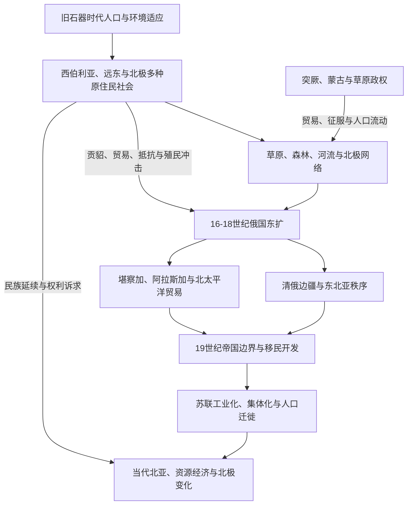

# 北亚历史

## 范围与概括

北亚在本目录中主要指乌拉尔山脉以东、蒙古高原和东北亚以北、延伸至太平洋与北冰洋的广大历史区域，包括西伯利亚、俄罗斯远东及其北极和亚北极地带。“北亚”是历史地理导航概念，并非边界固定的单一文明区。

这里长期存在多样的原住民族社会、草原—森林交换、河流交通和北极海域网络。16世纪以后俄国东扩重组政治与资源体系，清俄边界、北太平洋贸易、俄罗斯帝国和苏联开发又把北亚连接到东亚、中亚、欧洲和北美。

## 历史主线

## 文明与历史空间入口

| 历史空间 | 类型 | 入口 | 主线 |
|---|---|---|---|
| 西伯利亚与俄罗斯远东 | 跨生态区域史 | [西伯利亚与俄罗斯远东](/%E4%BA%BA%E6%96%87%E7%A7%91%E5%AD%A6/%E5%8E%86%E5%8F%B2/%E5%8C%97%E4%BA%9A/%E8%A5%BF%E4%BC%AF%E5%88%A9%E4%BA%9A%E4%B8%8E%E4%BF%84%E7%BD%97%E6%96%AF%E8%BF%9C%E4%B8%9C/README.md) | 乌拉尔以东至太平洋的原住民社会、河流、森林、城市、帝国治理与资源开发。 |
| 北极与亚北极 | 跨国海域与生态历史空间 | [北极与亚北极](/%E4%BA%BA%E6%96%87%E7%A7%91%E5%AD%A6/%E5%8E%86%E5%8F%B2/%E5%8C%97%E4%BA%9A/%E5%8C%97%E6%9E%81%E4%B8%8E%E4%BA%9A%E5%8C%97%E6%9E%81/README.md) | 苔原、海岸、北冰洋社会、北方航路、帝国竞争、冷战与气候变化。 |

## 现代国家与政治实体入口

| 对象 | 入口 | 与北亚区域史的分工 |
|---|---|---|
| 俄罗斯国家史 | [俄罗斯与东斯拉夫](/%E4%BA%BA%E6%96%87%E7%A7%91%E5%AD%A6/%E5%8E%86%E5%8F%B2/%E6%AC%A7%E6%B4%B2/%E6%96%AF%E6%8B%89%E5%A4%AB/%E4%B8%9C%E6%96%AF%E6%8B%89%E5%A4%AB/README.md) | 维护基辅罗斯、莫斯科公国、沙皇俄国、苏联与现代俄罗斯国家主线；北亚维护西伯利亚、远东与北极的本地和区域历史。 |
| 清俄边疆与东北亚秩序 | [清俄边疆、东北亚与北太平洋联系](/%E4%BA%BA%E6%96%87%E7%A7%91%E5%AD%A6/%E5%8E%86%E5%8F%B2/%E5%8C%97%E4%BA%9A/_%E9%80%9A%E5%8F%B2/%E6%B8%85%E4%BF%84%E8%BE%B9%E7%96%86%E3%80%81%E4%B8%9C%E5%8C%97%E4%BA%9A%E4%B8%8E%E5%8C%97%E5%A4%AA%E5%B9%B3%E6%B4%8B%E8%81%94%E7%B3%BB.md) | 处理帝国边界、条约、贸易和跨境族群，不归入任一现代国家的单向扩张叙事。 |

## 区域共同史与跨境专题

[北亚通史](/%E4%BA%BA%E6%96%87%E7%A7%91%E5%AD%A6/%E5%8E%86%E5%8F%B2/%E5%8C%97%E4%BA%9A/_%E9%80%9A%E5%8F%B2/README.md)集中维护环境、早期人口、原住民社会、草原—森林—北极网络、俄国东扩、清俄边疆、北太平洋和苏联开发等共同过程。

## 关键辨析

- 北亚不是“无人荒原”。帝国扩张以前已经存在人口、贸易、政治联盟和复杂的生态知识体系。
- 西伯利亚和俄罗斯远东属于现代俄罗斯疆域，但其历史不等于俄罗斯国家史的附录。
- 俄国东扩同时包含贸易、驻防、移民、传教、贡赋、暴力、条约和原住民协商等多种机制。
- 现代民族名称、语言分类和古代考古文化之间不能直接画成无争议的直系谱系。
- “北极”既是自然地理区，也是连接欧亚和北美的海域历史空间；国家边界并未终止跨海族群联系。

## 上级与相邻区域

- [历史总览](/%E4%BA%BA%E6%96%87%E7%A7%91%E5%AD%A6/%E5%8E%86%E5%8F%B2/README.md)
- [俄罗斯与东斯拉夫](/%E4%BA%BA%E6%96%87%E7%A7%91%E5%AD%A6/%E5%8E%86%E5%8F%B2/%E6%AC%A7%E6%B4%B2/%E6%96%AF%E6%8B%89%E5%A4%AB/%E4%B8%9C%E6%96%AF%E6%8B%89%E5%A4%AB/README.md)
- [蒙古](/%E4%BA%BA%E6%96%87%E7%A7%91%E5%AD%A6/%E5%8E%86%E5%8F%B2/%E4%B8%9C%E4%BA%9A/%E8%92%99%E5%8F%A4/README.md)
- [华夏周边民族](/%E4%BA%BA%E6%96%87%E7%A7%91%E5%AD%A6/%E5%8E%86%E5%8F%B2/%E4%B8%9C%E4%BA%9A/%E4%B8%AD%E5%9B%BD/_%E6%B0%91%E6%97%8F/README.md)
- [中亚草原汗国](/%E4%BA%BA%E6%96%87%E7%A7%91%E5%AD%A6/%E5%8E%86%E5%8F%B2/%E4%B8%AD%E4%BA%9A/%E8%8D%89%E5%8E%9F%E6%B1%97%E5%9B%BD/README.md)
- [北美原住民](/%E4%BA%BA%E6%96%87%E7%A7%91%E5%AD%A6/%E5%8E%86%E5%8F%B2/%E7%BE%8E%E6%B4%B2/%E5%8C%97%E7%BE%8E/%E5%8C%97%E7%BE%8E%E5%8E%9F%E4%BD%8F%E6%B0%91/README.md)
