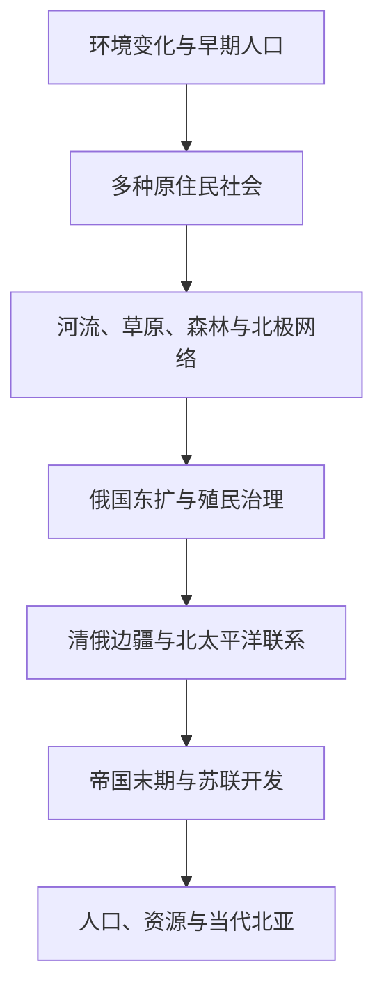

# 北亚通史

## 概括

本目录以跨生态区和跨帝国联系整理北亚，不把所有历史压缩成“俄国征服西伯利亚”。六条主线分别处理环境与早期人口、原住民社会、草原森林北极网络、俄国东扩、清俄与北太平洋联系，以及苏联和当代北亚。

## 通史演进图

## 主题导航

| 顺序 | 主题 | 入口 | 重点 |
|---:|---|---|---|
| 1 | 自然地理与早期人口 | [北亚自然地理、考古与早期人口](/%E4%BA%BA%E6%96%87%E7%A7%91%E5%AD%A6/%E5%8E%86%E5%8F%B2/%E5%8C%97%E4%BA%9A/_%E9%80%9A%E5%8F%B2/%E5%8C%97%E4%BA%9A%E8%87%AA%E7%84%B6%E5%9C%B0%E7%90%86%E3%80%81%E8%80%83%E5%8F%A4%E4%B8%8E%E6%97%A9%E6%9C%9F%E4%BA%BA%E5%8F%A3.md) | 冰期、河流、草原森林、白令陆桥和考古文化。 |
| 2 | 原住民社会 | [西伯利亚和远东原住民社会](/%E4%BA%BA%E6%96%87%E7%A7%91%E5%AD%A6/%E5%8E%86%E5%8F%B2/%E5%8C%97%E4%BA%9A/_%E9%80%9A%E5%8F%B2/%E8%A5%BF%E4%BC%AF%E5%88%A9%E4%BA%9A%E5%92%8C%E8%BF%9C%E4%B8%9C%E5%8E%9F%E4%BD%8F%E6%B0%91%E7%A4%BE%E4%BC%9A.md) | 语言与生计多样性、地方政治、殖民冲击和民族延续。 |
| 3 | 跨生态网络 | [草原、森林与北极网络](/%E4%BA%BA%E6%96%87%E7%A7%91%E5%AD%A6/%E5%8E%86%E5%8F%B2/%E5%8C%97%E4%BA%9A/_%E9%80%9A%E5%8F%B2/%E8%8D%89%E5%8E%9F%E3%80%81%E6%A3%AE%E6%9E%97%E4%B8%8E%E5%8C%97%E6%9E%81%E7%BD%91%E7%BB%9C.md) | 毛皮、驯鹿、马匹、河运、海岸航行和宗教文化交流。 |
| 4 | 俄国东扩 | [俄国东扩与西伯利亚殖民](/%E4%BA%BA%E6%96%87%E7%A7%91%E5%AD%A6/%E5%8E%86%E5%8F%B2/%E5%8C%97%E4%BA%9A/_%E9%80%9A%E5%8F%B2/%E4%BF%84%E5%9B%BD%E4%B8%9C%E6%89%A9%E4%B8%8E%E8%A5%BF%E4%BC%AF%E5%88%A9%E4%BA%9A%E6%AE%96%E6%B0%91.md) | 哥萨克、城堡、贡貂、移民、传教、抵抗和疾病。 |
| 5 | 清俄与北太平洋 | [清俄边疆、东北亚与北太平洋联系](/%E4%BA%BA%E6%96%87%E7%A7%91%E5%AD%A6/%E5%8E%86%E5%8F%B2/%E5%8C%97%E4%BA%9A/_%E9%80%9A%E5%8F%B2/%E6%B8%85%E4%BF%84%E8%BE%B9%E7%96%86%E3%80%81%E4%B8%9C%E5%8C%97%E4%BA%9A%E4%B8%8E%E5%8C%97%E5%A4%AA%E5%B9%B3%E6%B4%8B%E8%81%94%E7%B3%BB.md) | 黑龙江、恰克图、堪察加、阿拉斯加、日本和太平洋贸易。 |
| 6 | 苏联与当代 | [苏联开发、人口迁徙与当代北亚](/%E4%BA%BA%E6%96%87%E7%A7%91%E5%AD%A6/%E5%8E%86%E5%8F%B2/%E5%8C%97%E4%BA%9A/_%E9%80%9A%E5%8F%B2/%E8%8B%8F%E8%81%94%E5%BC%80%E5%8F%91%E3%80%81%E4%BA%BA%E5%8F%A3%E8%BF%81%E5%BE%99%E4%B8%8E%E5%BD%93%E4%BB%A3%E5%8C%97%E4%BA%9A.md) | 工业化、强制迁徙、城市、资源、人口变化和北极航路。 |

## 关键辨析

- 先理解生态和原住民社会，再进入帝国扩张与现代国家。
- 把“毛皮贸易”“贡赋”和“税收”区分开来，注意不同参与者对交换关系的理解可能不同。
- 帝国边界条约改变国家间法定边界，但不自动终止当地族群迁徙和跨境网络。
- 当代资源开发、环境变化与原住民族权利需要同时观察。
