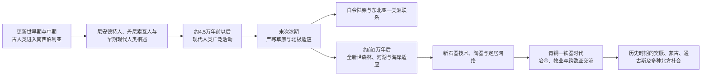

# 北亚自然地理、考古与早期人口

## 时间

旧石器时代早期—约公元1千纪；相关人口与环境过程延续至今。

## 概括

北亚由西西伯利亚平原、中西伯利亚高原、阿尔泰—萨彦山地、贝加尔湖区、勒拿河与阿穆尔河流域、俄罗斯远东海岸、苔原和北极群岛等差异显著的环境组成。它既不是终年冰封的同质空间，也不是人类只在前往美洲时短暂停留的“通道”。旧石器时代以来，人群已在草原、森林、山地、冻原和海岸建立长期适应，并不断迁徙、回流、融合与分化。

遗址、古代DNA、语言和民族传统分别记录不同层面的历史。它们能够互相印证，也可能给出不完全一致的图景。考古文化不能直接等同现代民族，遗传亲缘不能自动推导语言，某件器物的传播也不必意味着整个人群迁入。北亚早期史最重要的不是寻找一条简单“祖先谱系”，而是理解环境变化、技术交流和多方向人口网络如何共同塑造区域。

## 自然空间与交通骨架

| 区域 | 环境特征 | 对历史的影响 |
|---|---|---|
| 西西伯利亚平原 | 地势低平，河网和湿地广布，南部接草原 | 鄂毕河—额尔齐斯河成为南北交通轴，湿地限制陆路但利于水运与渔猎 |
| 中西伯利亚高原 | 针叶林、河谷、矿产与大片永久冻土 | 叶尼塞河、下通古斯河等连接内陆，人口密度长期较低 |
| 阿尔泰—萨彦与南西伯利亚 | 山谷、草原森林和矿产交错 | 适合牧业、冶金和跨欧亚交流，是草原政治与森林社会的接触地 |
| 贝加尔湖与外贝加尔 | 淡水、森林草原和山地廊道 | 连接蒙古高原、勒拿河源区和阿穆尔河系统，人口与文化交流频繁 |
| 勒拿河—雅库特地区 | 大陆性严寒、河谷和冻土 | 河流提供交通、鱼类和定居节点，冬季冰道与夏季水运互补 |
| 阿穆尔河流域 | 森林、湿地、鱼类资源及东亚季风影响 | 连接内陆与太平洋，较早出现定居渔猎、陶器和农业成分 |
| 楚科奇—堪察加与远东海岸 | 火山、苔原、海岸和丰富海洋资源 | 支持海兽捕猎、渔业和跨白令海联系，也使航行知识至关重要 |
| 北冰洋海岸与群岛 | 海冰、苔原、极昼极夜及季节性资源 | 形成驯鹿、海兽、候鸟和河口鱼类相结合的高度专门化生计 |

北亚河流大多南北流向。夏季船运、冬季冰道和流域间短距离搬运，使看似遥远的地区可以连成网络。气候带也会随冰期—间冰期移动：草原曾扩展到今日森林和苔原区域，海平面下降则露出连接东北亚与阿拉斯加的白令陆架。

## 环境与人口演进

## 旧石器时代人群

### 古人类与阿尔泰遗址

阿尔泰山地的洞穴保存了尼安德特人、丹尼索瓦人和早期现代人类活动的证据。丹尼索瓦洞穴显示，不同古人类在漫长时期内先后或交错出现，并发生基因交流。所谓“丹尼索瓦人”首先是依据遗传和少量化石材料识别的古人类群体，并非已经能重建完整语言、民族或政治历史的单一人口。

这些发现改变了“现代人类沿一条路线完全取代其他古人类”的简单模型。北亚更可能是多次迁入、局部延续和混合发生的空间。遗址年代和具体文化归属仍会因测年、地层和新材料而调整，因此宜使用约数。

### 现代人类的寒地适应

约4.5万年前的乌斯季—伊希姆个体证明现代人类已深入西西伯利亚。东北西伯利亚雅纳河遗址约在3.2万年前有人类活动，显示人群能够在北极圈附近利用猛犸象、野牛、马等资源并制造石器和骨器。约2.4万年前的马尔他—布列季遗址以住房、艺术品和复杂工具著称，反映南西伯利亚猎人社会并非“技术落后”的边缘群体。

末次盛冰期环境严酷，但人口并非在整个北亚完全消失。不同地区可能出现收缩、迁往避难区及后来重新扩散。火、缝制服装、半地下住房、储存、犬的早期伙伴关系以及对动物季节迁徙的知识，都是寒地生存的重要条件。

## 白令陆架与美洲早期人口

冰期海平面下降时，今天的白令海峡及邻近浅海露出广阔陆地，通常称为“白令陆架”或“白令陆桥”。它并非一条狭窄、短暂的桥，而是可持续存在的草原—苔原生态区。人群可能在其上停留数代，并通过内陆路线、太平洋沿岸或多种路径进入美洲。

现有遗传与考古研究支持东北亚—白令地区是美洲原住民祖先的重要来源之一，但不支持把全部过程化约成某一年、某一小队人完成的单次迁徙。美洲至少在约1.5万年前已有广泛人类活动，一些更早证据仍在讨论中。冰盖、海岸线和生态变化决定可行路线，后来的海平面上升淹没了许多潜在沿岸遗址。

白令海峡形成后，欧亚和北美也没有完全隔绝。尤皮克、因纽皮亚特、楚科奇等群体长期维持跨海语言、亲族、贸易和技术联系。美洲早期人口问题可与[北美原住民](/%E4%BA%BA%E6%96%87%E7%A7%91%E5%AD%A6/%E5%8E%86%E5%8F%B2/%E7%BE%8E%E6%B4%B2/%E5%8C%97%E7%BE%8E/%E5%8C%97%E7%BE%8E%E5%8E%9F%E4%BD%8F%E6%B0%91/README.md)交叉阅读。

## 全新世：森林、河湖与海岸社会

约前1万年后气候转暖，针叶林向北扩展，猛犸草原生态消失或收缩。人群调整猎物、捕鱼、植物采集、储存和季节迁徙方式。弓箭、小型石器、渔具、雪地交通和水上交通的重要性上升。

阿穆尔河及远东一些遗址很早出现陶器，说明陶器并不必然随农业一起传入；富集的鱼类和植物资源也能支持较稳定聚落。西伯利亚不同地区的“新石器时代”常以陶器、磨制工具和新的聚落模式定义，不等同于西亚或中国式的谷物农业革命。

贝加尔湖区墓地和聚落显示，渔猎社会具有长期领地、交换和复杂仪式。考古学家通过饮食同位素、墓葬和古代DNA观察人口变化，但墓地群体不必代表整个地区，埋葬差异也不能直接等同固定阶级。

在北极和太平洋沿岸，海兽、鲑鱼及大型鱼类能支持储存和季节性集会。皮艇、雪橇、鱼堰和骨制工具体现高度专业化知识。海岸社会并非与内陆隔绝，会交换石材、金属、毛皮和婚姻伙伴。

## 青铜时代与跨欧亚交流

南西伯利亚是草原、森林与山地冶金网络的交界。约前4—前3千纪以后，阿凡纳谢沃、奥库涅夫、安德罗诺沃、卡拉苏克等考古文化先后或并存于不同区域。它们涉及牧业、冶金、墓葬和长距离交流，但每个名称都是考古学分类，不能直接当作一个完整民族或国家。

马匹、牛羊牧养和轮式交通提高草原人口移动能力；铜、锡、青铜和后来铁器的生产连接矿区、工匠和远距离市场。南西伯利亚与中亚、蒙古高原、东欧草原和中国北方互有影响。某些技术和艺术母题传播很远，但传播既可能经人口迁移，也可能靠贸易、模仿和精英网络。

前1千纪的斯基泰式动物艺术、巴泽雷克墓葬以及匈奴时代遗址，显示北亚南缘进入更大规模草原帝国体系。森林和山地社会会向草原政权提供毛皮、金属或兵员，也可能保持自治、迁移或反抗。相关政治主线见[中亚草原汗国](/%E4%BA%BA%E6%96%87%E7%A7%91%E5%AD%A6/%E5%8E%86%E5%8F%B2/%E4%B8%AD%E4%BA%9A/%E8%8D%89%E5%8E%9F%E6%B1%97%E5%9B%BD/README.md)和[蒙古](/%E4%BA%BA%E6%96%87%E7%A7%91%E5%AD%A6/%E5%8E%86%E5%8F%B2/%E4%B8%9C%E4%BA%9A/%E8%92%99%E5%8F%A4/README.md)。

## 语言与人口关系

| 语言或集合 | 北亚主要分布 | 历史辨析 |
|---|---|---|
| 乌拉尔语系 | 西西伯利亚及乌拉尔周边 | 汉特语、曼西语、涅涅茨语等内部关系可研究，但语言传播不等于单次民族迁徙 |
| 突厥语族 | 南西伯利亚、萨哈等地 | 萨哈语远在东北，反映复杂迁徙与接触；不能把所有突厥语群体等同一个古代民族 |
| 蒙古语族 | 贝加尔湖周边和南部接触区 | 布里亚特等社会与蒙古世界相连，同时具有地方历史 |
| 通古斯语族 | 中东西伯利亚、阿穆尔河和远东 | 鄂温克、埃文、纳奈等语言相关，但生计和政治经历差异很大 |
| 楚科奇—堪察加语系 | 东北远东 | 楚科奇、科里亚克、伊捷尔缅等语言的分类内部仍有细节争议 |
| 叶尼塞语系 | 今日主要以凯特语延续 | 历史分布曾更广；与北美纳—德内语言的远缘假说有重要研究但仍需谨慎表述 |
| 尤卡吉尔语 | 东北西伯利亚 | 现存使用者很少，与乌拉尔语系关系的假说未形成完全共识 |
| 爱斯基摩—阿留申语系 | 白令海两岸与北太平洋 | 显示海峡并非绝对文明边界，近代国家边界晚于语言与亲族网络 |

现代民族名称多形成于自称、邻称、帝国行政和苏联民族分类的共同作用。考古文化的地理范围与现代语言分布可能重叠，却不能据此宣称“某遗址就是某民族直接祖先”。遗传研究也只能说明人口亲缘与混合，不能单独决定文化身份。

## 重要考古与环境节点

| 时间 | 节点 | 历史意义 |
|---|---|---|
| 约30万—5万年前 | 阿尔泰洞穴古人类活动 | 尼安德特人、丹尼索瓦人及其基因交流显示北亚古人类史复杂 |
| 约4.5万年前 | 乌斯季—伊希姆现代人类 | 证明现代人类已深入西西伯利亚 |
| 约3.2万年前 | 雅纳河遗址 | 显示人群能够在北极圈附近长期活动 |
| 约2.4万年前 | 马尔他—布列季遗址群 | 反映末次冰期南西伯利亚的住房、艺术和广域人口联系 |
| 约2万—1.5万年前 | 白令地区人口活动与扩散 | 为进入美洲的重要人口背景，具体路线和时间仍有讨论 |
| 约前1万年后 | 全新世森林与海岸重组 | 人群转向河湖捕鱼、森林猎取、海兽利用和更细密的区域适应 |
| 约前1万纪后半叶 | 远东早期陶器传统 | 说明陶器可在非农业社会出现，挑战单一“新石器革命”模型 |
| 约前3300年以后 | 南西伯利亚牧业与冶金网络扩大 | 北亚南缘更深连接欧亚草原交流 |
| 前1千纪 | 斯基泰式文化与草原帝国体系 | 马战、金属、艺术与政治网络扩展，森林—草原联系加深 |

## 变化机制

### 环境压力

冰盖、气温、降水、冻土、野火和动物分布改变可居住空间，但环境不会机械决定文化。相似环境可形成不同社会，群体也能通过技术、交换和知识降低风险。

### 技术与知识

衣物、住房、储存、犬、雪橇、舟船、渔具、驯鹿和马匹等技术改变行动范围。许多创新不一定有单一发明中心，可能在接触中反复改进。

### 迁徙与融合

北亚人口史包含来自欧洲草原、中亚、东亚和北极海岸的多方向流动。迁入者可能取代、吸收或与当地群体共存；语言转换和遗传混合的速度也不相同。

### 交换与政治

稀有石材、金属、毛皮、海产品和牲畜促进远距离关系。到青铜和铁器时代，草原政权能够把部分网络纳入贡赋和军事体系，但地方社会并未因此失去全部主动性。

## 关键辨析

- **北亚不是空白通道**：人群在这里长期生活并形成自身历史，美洲迁徙只是其中一条重要线索。
- **白令陆桥不是一次性桥梁**：它在不同冰期出现，包含可居住环境，后来海峡仍保留跨海联系。
- **“新石器时代”不必等于农业**：北亚许多地区以陶器、磨制工具和定居渔猎为主要变化。
- **考古文化不等于民族**：器物组合是研究分类，不能无证据地赋予固定语言和自我认同。
- **古代DNA不等于完整身份史**：遗传亲缘无法替代语言、政治、宗教与自我认同材料。
- **寒冷不表示停滞**：北亚社会以高度技术、季节规划和广域交换适应环境。

## 演变关系

- 后续社会与民族史：[西伯利亚和远东原住民社会](/%E4%BA%BA%E6%96%87%E7%A7%91%E5%AD%A6/%E5%8E%86%E5%8F%B2/%E5%8C%97%E4%BA%9A/_%E9%80%9A%E5%8F%B2/%E8%A5%BF%E4%BC%AF%E5%88%A9%E4%BA%9A%E5%92%8C%E8%BF%9C%E4%B8%9C%E5%8E%9F%E4%BD%8F%E6%B0%91%E7%A4%BE%E4%BC%9A.md)。
- 区域交换：[草原、森林与北极网络](/%E4%BA%BA%E6%96%87%E7%A7%91%E5%AD%A6/%E5%8E%86%E5%8F%B2/%E5%8C%97%E4%BA%9A/_%E9%80%9A%E5%8F%B2/%E8%8D%89%E5%8E%9F%E3%80%81%E6%A3%AE%E6%9E%97%E4%B8%8E%E5%8C%97%E6%9E%81%E7%BD%91%E7%BB%9C.md)。
- 全球比较：[人口迁徙、农业与城市文明](/%E4%BA%BA%E6%96%87%E7%A7%91%E5%AD%A6/%E5%8E%86%E5%8F%B2/_%E9%80%9A%E5%8F%B2/%E4%BA%BA%E5%8F%A3%E8%BF%81%E5%BE%99%E3%80%81%E5%86%9C%E4%B8%9A%E4%B8%8E%E5%9F%8E%E5%B8%82%E6%96%87%E6%98%8E.md)。
