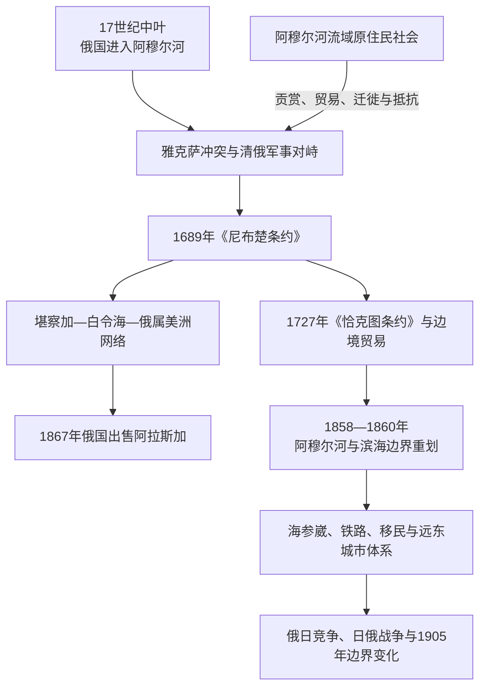

# 清俄边疆、东北亚与北太平洋联系

## 时间

17世纪中叶—20世纪初；部分边界与跨境关系延续至今。

## 概括

俄国东扩抵达阿穆尔河和太平洋后，北亚不再只通过欧亚内陆与外部相连。阿穆尔河、蒙古边疆、堪察加、鄂霍次克海、白令海峡、萨哈林和日本海共同构成新的帝国接触带。清朝、俄国、日本、朝鲜以及北太平洋原住民族在这里进行战争、贡赏、贸易、迁徙和外交，现代国界由这一长期互动逐步形成。

17世纪的《尼布楚条约》是在清俄军事力量相互制约下达成；18世纪的《恰克图条约》把边界管理与贸易制度结合起来；19世纪中叶的《瑷珲条约》和中俄《北京条约》则形成于清朝内外危机和俄国持续施压之中。三者虽然都属“清俄条约”，权力条件和结果并不相同。国家划界也没有自动终止达斡尔、鄂温克、赫哲 / 纳奈、尼夫赫、楚科奇、西伯利亚尤皮克等群体的跨河、跨海和季节性活动。

## 关系演进

## 17世纪：阿穆尔河冲突与《尼布楚条约》

### 俄国进入阿穆尔河

波雅尔科夫在1640年代率队由雅库茨克南下，哈巴罗夫随后沿阿穆尔河建立据点并征取贡赋。俄国人看重当地粮食、毛皮和水路，也希望把征贡网络连接到较富庶的农业区域。远征者对村落征粮、扣押和施暴，引起达斡尔、杜切尔及其他居民抵抗，不少人口在战乱和清朝组织下向南或内地迁移。

清朝把东北视为王朝发祥地和军事边疆，并通过驻防、贡赏、编旗及与地方首领的关系建立权威。随着清朝完成关内战争，它能调集更大力量处理阿穆尔河问题。由此，俄国原本面对的地方冲突升级为两个扩张帝国之间的主权竞争。

### 雅克萨之战

俄国人在雅克萨修筑堡垒并恢复定居。清军于1685年围攻，守军投降撤离；俄国人不久返回重建，清军1686年再次围困。守军因战斗、疾病和饥饿大量减员，清军同样承受远距离补给压力。双方都发现，长期维持高成本边疆战争会妨碍更广泛的战略目标。

### 《尼布楚条约》

1689年谈判在尼布楚举行，耶稣会士参与翻译和交涉，条约以拉丁文等文本处理边界。俄国同意撤出雅克萨，双方以额尔古纳河、外兴安岭一线等地理标志划分部分边界，并承诺处理逃人和开放合法往来。

条约的重要性不只在“第一次边界划定”：

- 清朝通过军事优势保住阿穆尔河中下游方向的控制。
- 俄国避免长期两线压力，得以维持对华贸易并转向堪察加和北太平洋。
- 双方以条约而非单纯贡属语言建立相对对等的国家交涉框架。
- 条文本身无法精确处理所有山脉、河源和游动人群，地方执行仍需持续协商。

## 18世纪：蒙古边界、恰克图贸易与北太平洋

### 《恰克图条约》与边贸

1727年的《布连斯奇条约》和《恰克图条约》进一步划定蒙古方向边界，确立使团、逃人、宗教与贸易安排。恰克图—买卖城成为主要陆路市场，俄国输出毛皮、皮革等商品，从清朝市场取得茶叶、丝绸、棉布和瓷器。贸易时有关闭和重新开放，说明边贸既是经济活动，也是两国施压和谈判的工具。

合法贸易之外，边民仍进行小规模交换、放牧和走私。布里亚特、蒙古、俄国商人及各类中介掌握语言、路线和信用关系，是制度实际运转的关键。国家边界把一些共同体分置两侧，也促使帝国重新分类人口、土地和纳贡归属。

### 堪察加与大北方探险

俄国在17世纪末进入堪察加后，以鄂霍次克等港口组织北太平洋航行。18世纪的白令探险和“大北方探险”测绘西伯利亚北岸、堪察加、阿留申群岛及北美西北海岸。1741年白令和奇里科夫航行后，海獭皮的高价值吸引商人越过阿留申群岛。

航行依赖伊捷尔缅、科里亚克、阿留申和其他原住民的地理、皮艇、海兽捕猎与食物知识。商人也把人质、强制猎取、债务和暴力带到群岛，导致反抗、镇压、疫病和人口灾难。北太平洋扩张因此不是单纯“探险发现”，而是知识合作与殖民掠夺同时发生的过程。

### 俄属美洲

1799年成立的俄美公司获得国家特许，在阿拉斯加和北太平洋经营毛皮、据点与行政。殖民地依赖西伯利亚和远东港口，却长期面对粮食不足、运输成本、英美商人竞争及海獭资源下降。俄国在当地人口有限，实际运作依赖阿留申、特林吉特等群体以及混合家庭。

1867年俄国把阿拉斯加售予美国，国家主权随之变化。出售没有切断白令海峡两岸的亲族、语言和交换关系，但后来的国界管控、冷战和军事化使跨境活动更困难。

## 19世纪：阿穆尔河边界重划

### 背景

19世纪中叶，俄国希望取得不易封冻的太平洋港口、控制阿穆尔河航运，并防止其他海权进入远东。清朝则同时承受太平天国战争、第二次鸦片战争及沿海列强压力，东北边疆驻防和外交处于不利局面。东西伯利亚总督穆拉维约夫利用这一机会组织阿穆尔河航行、移民和军事据点，以实际占领强化谈判筹码。

### 《瑷珲条约》与中俄《北京条约》

| 时间 | 条约或行动 | 主要结果 | 权力背景 |
|---|---|---|---|
| 1858年 | 《瑷珲条约》 | 黑龙江以北大片地区划归俄国，乌苏里江以东暂定中俄共管；黑龙江航运安排改变 | 清朝面临内战与英法压力，俄国以既成航行和军事存在施压 |
| 1860年 | 中俄《北京条约》 | 乌苏里江以东至海地区划归俄国，现代中俄东段边界基本成形 | 俄国以调停者身份介入第二次鸦片战争后谈判 |
| 1860年 | 海参崴据点建立 | 俄国获得面向日本海的战略港口，后来发展为远东城市和舰队基地 | 新边界使帝国能直接经营滨海地区 |
| 1891年以后 | 西伯利亚铁路建设 | 远东与欧洲俄国的军运、移民和市场联系加强 | 国家从河流边疆转向铁路—城市—港口体系 |

这次边界变化常被置于“不平等条约”体系中理解，因为谈判条件明显不对称，俄国取得了巨大利益。条约也没有征询当地原住民族。阿穆尔河由区域交通轴变为国界的一部分，原有渔场、狩猎地和亲族网络被新的行政制度切割。

## 远东城市、铁路与人口迁徙

边界重划后，俄国建立布拉戈维申斯克、哈巴罗夫斯克和海参崴等行政军事中心，鼓励哥萨克、农民和商人定居。中国商人、农民和工人以及朝鲜移民同样参与农业、建筑、采矿和城市市场。远东社会由多语人口共同塑造，却处在不平等的帝国法律和种族分类之下。

1890年代，西伯利亚铁路及穿越中国东北的中东铁路把赤塔、哈尔滨、海参崴和旅顺口连接起来。俄国于1898年租借旅顺口、大连并经营南满铁路，使北亚扩张与中国东北、朝鲜和日本的帝国竞争直接交织。铁路提高运输和军事动员能力，也带来土地征用、城市殖民治理及新的劳工流动。

1900年义和团运动和清俄冲突期间，俄军占领中国东北多地；布拉戈维申斯克及黑龙江沿岸发生对中国居民的大规模驱逐和杀害。事件表明，边境商业共存并未消除战争时期的排外暴力与集体惩罚。

## 萨哈林、千岛群岛与俄日关系

俄国和日本都在萨哈林、千岛群岛及北海道北方扩展国家控制。当地阿伊努、尼夫赫和乌尔塔等群体原有的海域活动，被国家探险、渔业、流放殖民和划界逐步限制。

| 时间 | 安排或战争 | 结果 |
|---|---|---|
| 1855年 | 《下田条约》 | 俄日确立部分千岛群岛边界，萨哈林暂不划定国界 |
| 1875年 | 《圣彼得堡条约》 | 日本取得全部千岛群岛，俄国取得整个萨哈林 |
| 1904—1905年 | 日俄战争 | 日本在东北亚取得军事优势，俄国失去旅顺口租借权益及南满铁路南段 |
| 1905年 | 《朴次茅斯条约》 | 日本取得北纬50度以南萨哈林，俄国在朝鲜和中国东北的地位受挫 |

日俄战争不只是两个国家的海陆战，也影响朝鲜、中国东北、萨哈林和远东港口的居民。战争及其边界结果进一步将跨区域空间纳入互相排斥的帝国领土体系。

## 统治结构与实际权力

| 空间 | 名义权力 | 实际运作 | 主要中介与受影响群体 |
|---|---|---|---|
| 17世纪阿穆尔河 | 清朝、俄国分别主张贡属和占领 | 驻军、堡垒、征贡、迁民与地方联盟并存 | 达斡尔、鄂温克、赫哲 / 纳奈等 |
| 蒙古边界 | 清俄条约划界 | 边卡、恰克图市场、外交使团和地方走私共同维持 | 蒙古、布里亚特、俄国与汉商 |
| 堪察加与白令海 | 俄国宣称主权 | 哥萨克征贡、商人公司、原住民航海和季节性据点 | 伊捷尔缅、科里亚克、楚科奇、尤皮克、阿留申 |
| 俄属美洲 | 沙皇及俄美公司 | 特许公司兼行商业与行政，国家驻守有限 | 阿留申、特林吉特、克里奥尔群体和俄国商人 |
| 19世纪俄罗斯远东 | 俄国总督体系 | 军事驻防、移民、城市行政、铁路和港口资本 | 俄国移民、中国人与朝鲜人、原住民族 |
| 萨哈林与千岛 | 俄日主权先重叠后划界 | 渔业、流放地、军事据点与强制定居政策 | 阿伊努、尼夫赫、乌尔塔及渔民 |

## 重要事件与转折

| 时间 | 事件 | 过程与长期影响 |
|---|---|---|
| 1640—1650年代 | 俄国进入阿穆尔河 | 征粮征贡引发当地抵抗，并触发清俄直接竞争 |
| 1685—1686年 | 两次雅克萨围攻 | 清朝军事压力迫使俄国接受谈判，双方均认识到长期战争成本 |
| 1689年 | 《尼布楚条约》 | 俄国撤出雅克萨，清朝保住阿穆尔方向，清俄建立条约交往 |
| 1727年 | 恰克图体系形成 | 蒙古边界和贸易制度化，茶叶与毛皮贸易长期繁荣 |
| 1741年以后 | 北太平洋毛皮扩张 | 俄国商人进入阿留申与阿拉斯加，殖民暴力和跨海社会同时形成 |
| 1799年 | 俄美公司获特许 | 俄属美洲进入公司殖民阶段，但补给和人口始终脆弱 |
| 1858—1860年 | 阿穆尔与滨海边界重划 | 俄国取得黑龙江以北及乌苏里江以东，建立现代远东战略空间 |
| 1867年 | 阿拉斯加出售美国 | 俄国退出北美领土统治，白令海两岸被不同国家边界分割 |
| 1875年 | 俄日调整萨哈林与千岛 | 两国以领土交换加强排他主权，原住民活动空间被重新切割 |
| 1891年以后 | 西伯利亚铁路和中东铁路 | 远东军事、移民和市场整合加速，俄国深入中国东北 |
| 1904—1905年 | 日俄战争 | 日本取代俄国成为东北亚更强势的帝国力量之一，地区秩序重组 |

## 边界形成的原因与后果

### 结构因素

- 俄国需要毛皮、港口、海军基地、农业土地及连接欧洲与太平洋的交通体系。
- 清朝通过东北驻防和蒙古治理维护王朝安全，但19世纪遭遇多重内外危机。
- 日本明治维新后建立近代军队和海军，将北海道、千岛、朝鲜与中国东北纳入安全和扩张战略。
- 北太平洋毛皮、茶叶贸易、铁路资本和港口市场把边界争夺同全球经济相连。

### 直接触发因素

- 雅克萨筑堡和清军围攻直接促成《尼布楚条约》。
- 俄国在阿穆尔河的实际航运和移民，加上清朝战争困境，直接促成1858—1860年领土变化。
- 俄日在朝鲜和中国东北的利益冲突、谈判失败，直接引发日俄战争。

### 长期后果

- 北亚东部形成现代俄罗斯、中国、日本和后来美国之间的领土边界框架。
- 海参崴、哈巴罗夫斯克、哈尔滨等城市及铁路网络重塑人口和贸易重心。
- 原住民族被分置不同国家，其传统领地、渔猎和迁徙受到更严格管理。
- “边疆”从贡赋和季节性接触区，逐渐变为有测绘、护照、军队、铁路和排他主权的国界。
- 跨境经济和亲族联系并未消失，而是在国家管制下改变形式。

## 关键辨析

- **17世纪与19世纪的清俄条约不能混为同一种权力关系**：前者具有较强军事制衡，后者形成于清朝明显不利的国际环境。
- **条约边界不等于当地居民主动选择的边界**：原住民族及普通边民通常没有参与国家谈判。
- **俄属美洲属于北亚网络的延伸而非北亚本土**：其人员、补给和商业从堪察加、鄂霍次克及西伯利亚出发。
- **远东发展不是单一民族的建设史**：俄国、中国、朝鲜及原住民劳工、商人和家庭共同参与，但权利并不平等。
- **日俄战争不是孤立的双边战争**：它是东北亚帝国竞争、铁路和港口争夺的结果，并深刻影响第三方社会。

## 演变关系

- 前置扩张：[俄国东扩与西伯利亚殖民](/%E4%BA%BA%E6%96%87%E7%A7%91%E5%AD%A6/%E5%8E%86%E5%8F%B2/%E5%8C%97%E4%BA%9A/_%E9%80%9A%E5%8F%B2/%E4%BF%84%E5%9B%BD%E4%B8%9C%E6%89%A9%E4%B8%8E%E8%A5%BF%E4%BC%AF%E5%88%A9%E4%BA%9A%E6%AE%96%E6%B0%91.md)。
- 中国王朝背景：[清](/%E4%BA%BA%E6%96%87%E7%A7%91%E5%AD%A6/%E5%8E%86%E5%8F%B2/%E4%B8%9C%E4%BA%9A/%E4%B8%AD%E5%9B%BD/%E6%B8%85/README.md)。
- 俄罗斯国家背景：[俄罗斯帝国](/%E4%BA%BA%E6%96%87%E7%A7%91%E5%AD%A6/%E5%8E%86%E5%8F%B2/%E6%AC%A7%E6%B4%B2/%E6%96%AF%E6%8B%89%E5%A4%AB/%E4%B8%9C%E6%96%AF%E6%8B%89%E5%A4%AB/%E4%BF%84%E7%BD%97%E6%96%AF%E5%B8%9D%E5%9B%BD.md)。
- 北美延伸：[殖民北美](/%E4%BA%BA%E6%96%87%E7%A7%91%E5%AD%A6/%E5%8E%86%E5%8F%B2/%E7%BE%8E%E6%B4%B2/%E5%8C%97%E7%BE%8E/%E6%AE%96%E6%B0%91%E5%8C%97%E7%BE%8E/README.md)。
- 后续工业与国家整合：[苏联开发、人口迁徙与当代北亚](/%E4%BA%BA%E6%96%87%E7%A7%91%E5%AD%A6/%E5%8E%86%E5%8F%B2/%E5%8C%97%E4%BA%9A/_%E9%80%9A%E5%8F%B2/%E8%8B%8F%E8%81%94%E5%BC%80%E5%8F%91%E3%80%81%E4%BA%BA%E5%8F%A3%E8%BF%81%E5%BE%99%E4%B8%8E%E5%BD%93%E4%BB%A3%E5%8C%97%E4%BA%9A.md)。
