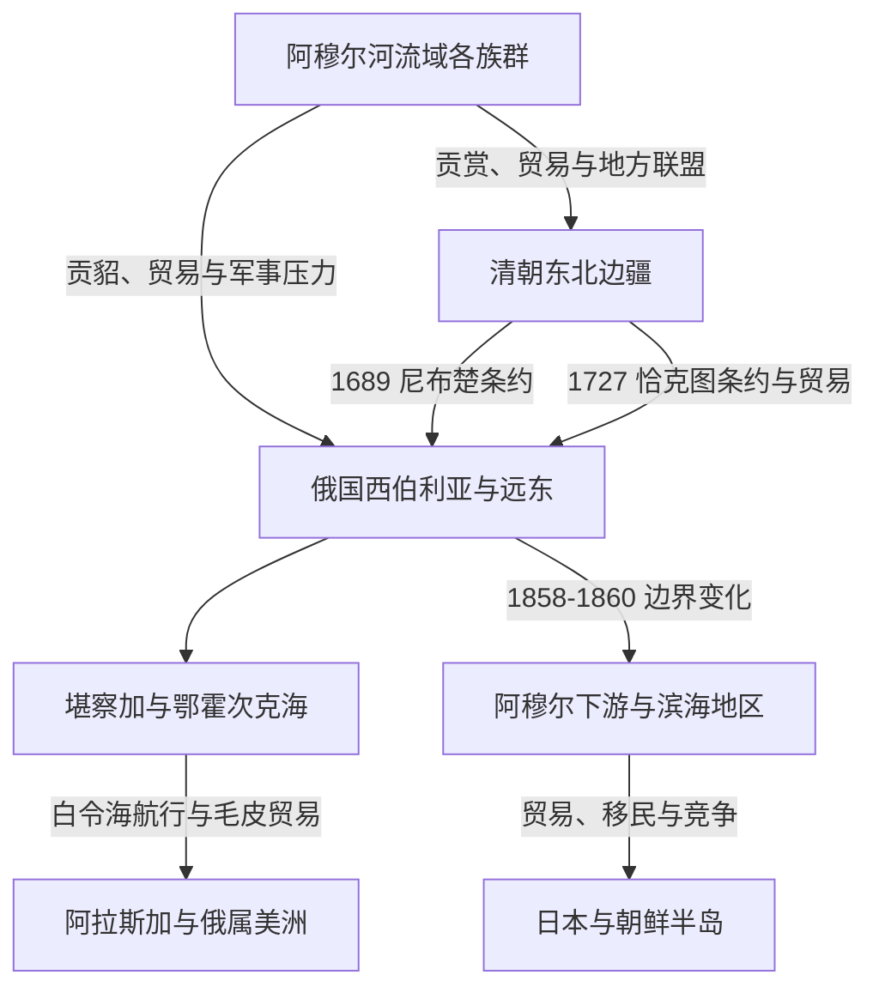

# 清俄边疆、东北亚与北太平洋联系

## 时间

17世纪至20世纪初

## 概括

俄国东扩抵达阿穆尔河和太平洋后，北亚与清朝东北、日本、朝鲜半岛和北美的联系明显加强。清俄条约、恰克图贸易、堪察加航路、俄属美洲和日本海沿岸竞争共同塑造新的边疆秩序。

## 关系图

## 重要节点

| 时间 | 节点 | 影响 |
|---|---|---|
| 1689年 | 《尼布楚条约》 | 解决雅克萨冲突并划定部分边界，是清俄正式条约关系的重要起点。 |
| 1727年 | 《恰克图条约》 | 调整蒙古方向边界和贸易制度，恰克图成为重要商贸口岸。 |
| 18世纪 | 白令、堪察加与阿拉斯加航行 | 俄国商人与探险者进入北太平洋毛皮贸易。 |
| 1858年 | 《瑷珲条约》 | 黑龙江以北地区归俄国，乌苏里江以东暂定共管。 |
| 1860年 | 《北京条约》 | 乌苏里江以东地区归俄国，俄国获得符拉迪沃斯托克一带。 |
| 1867年 | 俄国出售阿拉斯加 | 俄属美洲转交美国，国家边界改变但跨白令海峡联系延续。 |
| 1904-1905年 | 日俄战争 | 日本与俄国在东北亚的帝国竞争重组地区力量。 |

## 关键辨析

- 清俄条约的边界变化与当地原住民族的土地、贡赋和迁徙范围并不一致。
- 19世纪条约是在清朝内外危机和俄国扩张压力下形成，其政治条件与17世纪《尼布楚条约》不同。
- 俄属美洲不是北亚本土，但它是堪察加、楚科奇半岛和北太平洋贸易网络的延伸。

## 相关入口

- [清](/%E4%BA%BA%E6%96%87%E7%A7%91%E5%AD%A6/%E5%8E%86%E5%8F%B2/%E4%B8%9C%E4%BA%9A/%E4%B8%AD%E5%9B%BD/%E6%B8%85/README.md)
- [俄罗斯帝国](/%E4%BA%BA%E6%96%87%E7%A7%91%E5%AD%A6/%E5%8E%86%E5%8F%B2/%E6%AC%A7%E6%B4%B2/%E6%96%AF%E6%8B%89%E5%A4%AB/%E4%B8%9C%E6%96%AF%E6%8B%89%E5%A4%AB/%E4%BF%84%E7%BD%97%E6%96%AF%E5%B8%9D%E5%9B%BD.md)
- [殖民北美](/%E4%BA%BA%E6%96%87%E7%A7%91%E5%AD%A6/%E5%8E%86%E5%8F%B2/%E7%BE%8E%E6%B4%B2/%E5%8C%97%E7%BE%8E/%E6%AE%96%E6%B0%91%E5%8C%97%E7%BE%8E/README.md)
