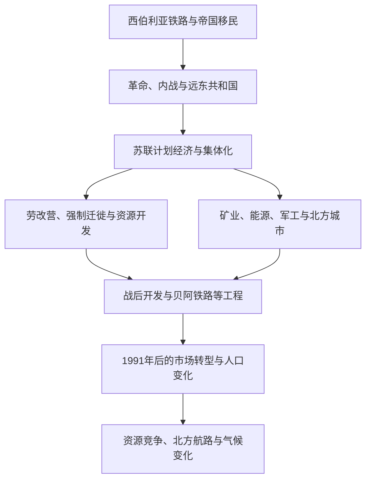

# 苏联开发、人口迁徙与当代北亚

## 时间

19世纪末至今

## 概括

西伯利亚铁路和帝国末期移民扩大北亚的城镇与农业开发。苏联时期通过计划经济、矿业、能源、军工、集体化和交通工程把北亚更深纳入国家体系，同时伴随劳改营、强制迁徙、环境破坏和原住民族定居化。1991年后，资源出口、人口收缩、区域不平衡和北极气候变化成为重要议题。

## 演进图

## 主要阶段

| 时期 | 主线 | 影响 |
|---|---|---|
| 1890年代-1916年 | 西伯利亚铁路建设与移民 | 加强欧洲俄国与太平洋港口联系，推动城市、农业和军事运输。 |
| 1917-1922年 | 革命、内战和外国干涉 | 西伯利亚铁路沿线、海参崴和远东成为多方争夺区域。 |
| 1920-1930年代 | 集体化、民族政策和工业化 | 游牧定居、集体农庄、民族行政与教育体系重组。 |
| 1930-1950年代 | 劳改营和强制迁徙 | 囚犯与被迁徙人口参与矿山、铁路、林业和城市建设，造成巨大人权灾难。 |
| 1945-1991年 | 军工、油气和交通开发 | 北亚成为资源、核工业、太平洋军事和航天体系的重要基地。 |
| 1991年至今 | 市场转型与资源经济 | 部分城镇人口外流，油气、矿产、森林和对亚洲贸易的重要性上升。 |

## 当代议题

- 永久冻土融化、野火和海冰减少影响基础设施、生计和生态系统。
- 北方航路通航条件变化提升经济和战略关注，但成本、环境风险和季节限制仍然明显。
- 资源项目、保护区、地方就业与原住民族土地和传统生计之间存在持续协商与冲突。
- 俄罗斯远东面向中国、日本、韩国和太平洋市场，但人口和基础设施分布不均。

## 关键辨析

- 苏联开发不能只写成“征服自然”的建设史，也不能忽略教育、医疗和城市化等复杂社会结果。
- 劳改营劳动力、强制迁徙人口、自愿移民和当地居民是不同群体，经历不能混同。
- 当代北亚属于俄罗斯联邦的主要部分，但地区社会、民族和生态差异仍然显著。

## 相关入口

- [苏俄与苏联](/%E4%BA%BA%E6%96%87%E7%A7%91%E5%AD%A6/%E5%8E%86%E5%8F%B2/%E6%AC%A7%E6%B4%B2/%E6%96%AF%E6%8B%89%E5%A4%AB/%E4%B8%9C%E6%96%AF%E6%8B%89%E5%A4%AB/%E8%8B%8F%E4%BF%84%E4%B8%8E%E8%8B%8F%E8%81%94.md)
- [俄罗斯](/%E4%BA%BA%E6%96%87%E7%A7%91%E5%AD%A6/%E5%8E%86%E5%8F%B2/%E6%AC%A7%E6%B4%B2/%E6%96%AF%E6%8B%89%E5%A4%AB/%E4%B8%9C%E6%96%AF%E6%8B%89%E5%A4%AB/%E4%BF%84%E7%BD%97%E6%96%AF.md)
- [北极与亚北极](/%E4%BA%BA%E6%96%87%E7%A7%91%E5%AD%A6/%E5%8E%86%E5%8F%B2/%E5%8C%97%E4%BA%9A/%E5%8C%97%E6%9E%81%E4%B8%8E%E4%BA%9A%E5%8C%97%E6%9E%81/README.md)
