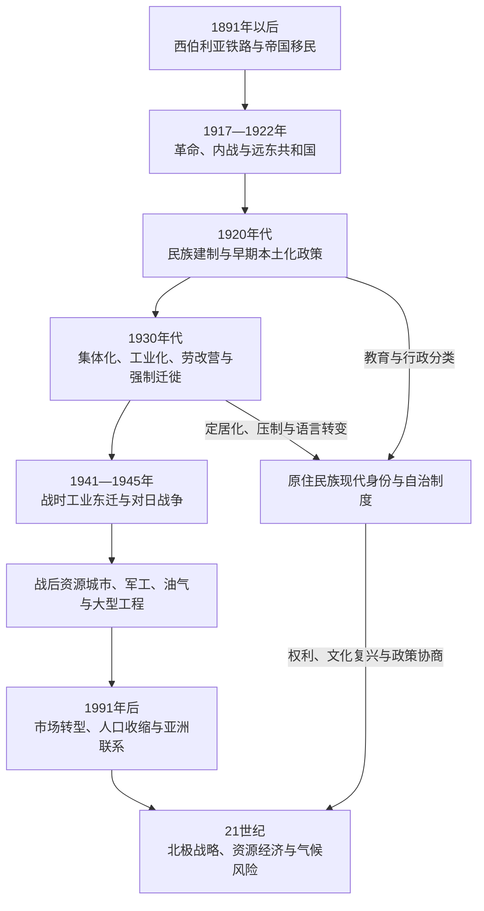

# 苏联开发、人口迁徙与当代北亚

## 时间

19世纪末—2026年7月。

## 概括

西伯利亚铁路、帝国末期移民和城市扩张，把北亚从以河流和毛皮据点为骨架的边疆，转变为铁路、农业、采矿和太平洋港口相连的区域。革命与内战后，苏联以计划经济、民族行政、集体化、劳改营、资源工程、军工和大规模人口迁徙进一步重组北亚。国家同时提供学校、医疗、住房和现代交通，也以强制劳动、环境破坏、语言同化与定居化给居民造成深远创伤。

1991年后，许多北方和远东城镇人口外流，市场化使企业、地方财政和基础设施经历剧烈调整；油气、矿产、森林、渔业、核力量和面向亚洲的港口仍使北亚具有全国战略地位。到2026年，永久冻土融化、野火、资源项目、原住民族土地权、北方航路、对华贸易以及2022年以来战争和制裁造成的经济与安全重组，成为理解当代北亚不可分割的议题。

## 演进主线

## 帝国末期：铁路、移民与区域整合

### 西伯利亚铁路

1891年，连接欧洲俄国与太平洋的西伯利亚铁路开始建设。工程分段推进，并利用穿过中国东北的中东铁路缩短初期路线；绕行俄国境内的阿穆尔铁路到1916年贯通。铁路把军队、移民、粮食、煤炭和工业品以过去河运无法达到的规模运入北亚，也把小麦、黄油、木材和矿产送往国内外市场。

铁路没有平均带动所有地区。主要城市和南部农业带获得人口与资本，远离干线的北方仍依赖河运、冬道和季节补给。沿线土地被重新测量和分配，原住民、旧住民和游牧群体的使用权常在国家“空地”叙事中被忽略。

### 移民与流放

19世纪末至20世纪初，政府鼓励欧洲俄国农民迁入西伯利亚，斯托雷平改革时期移民尤其增加。定居者建立村庄、开垦草原森林交界地，也有人因气候、土地或债务问题返回。城市人口还包括铁路工人、商人、中国和朝鲜劳工、军人及长期流放形成的群体。

刑罚流放在铁路时代以前已是帝国治理西伯利亚的重要手段。政治犯、普通罪犯、苦役犯和行政流放者的身份与经历不同，不能统称为“建设者”。流放既是惩罚和隔离，也是国家向边疆输送劳动力与人口的方式。

## 革命、内战与远东共和国

1917年革命后，北亚因铁路、粮食、黄金、军火和太平洋港口成为内战关键战场。布尔什维克、地方苏维埃、白军、哥萨克、捷克斯洛伐克军团、农民武装和民族政治力量相互争夺；日本、美国等国也在西伯利亚和远东干涉。

1918—1919年，海军上将高尔察克以鄂木斯克为中心建立白军政权，控制铁路沿线大片地区，但军事失败、征粮和政治孤立使其崩溃。游击战和地方起义表明居民并非只在红白两方之间被动选择。

1920年成立的远东共和国名义上独立，实际是苏维埃俄国面对日本驻军时设置的缓冲政权。日本撤军后，远东共和国于1922年并入俄罗斯苏维埃联邦社会主义共和国。此后从贝加尔湖以东到太平洋的主要领土纳入苏维埃国家，但萨哈林北部等地的撤军和边界问题仍延续数年。

## 1920年代：民族建制与社会改造

苏维埃政府把民族识别、行政区划、语言文字和干部培养作为北方治理的一部分。1920年代成立专门处理“北方小民族”事务的机构，民族学家、语言学家、教师与地方代表参与调查、学校和文字创制。若干民族获得自治共和国、自治州、民族区或基层苏维埃等不同层级的行政形式。

早期本土化政策为非俄语教育、出版和地方干部提供空间，但也把流动、地域和亲族身份固定为国家认可的“民族”类别。某些群体名称和边界是多方协商结果，另一些则由官僚和学术分类推动。行政承认既能支撑文化权利，也会排除未被列入类别的人群。

医疗站、寄宿学校、合作社和识字教育改善部分公共服务，同时逐步把国家深入到牧场、猎场与家庭。到1930年代，政策重心由较灵活的本土化转向集中计划、政治控制和俄语化压力，地方自主空间明显收缩。

## 1930年代：集体化、工业化与强制劳动

### 集体化与定居化

国家将农业、驯鹿牧养、渔业和狩猎纳入集体农庄或国营单位，要求交售产品并推广固定居民点。对部分社区而言，合作组织带来稳定供给、学校和医疗；对另一些社区而言，牲畜征收、迁离季节路线和外来管理破坏既有生计。

“游牧转定居”并非一次完成。许多家庭继续在牧场与村镇之间移动，国家机构也依赖牧民知识维持驯鹿业。寄宿教育使儿童获得文字和职业机会，却会造成家庭分离、母语流失和文化传承中断。

### 劳改营经济

苏联劳改营系统在北亚建立采矿、林业、铁路和建筑项目。科雷马的“远东建设总局”、诺里尔斯克矿冶基地、伯朝拉流域、贝阿铁路早期工程等都大量使用囚犯劳动。极端气候、饥饿、过劳、疾病和暴力造成高死亡率。

劳改营不能被写成“以囚犯完成全部西伯利亚建设”。自由工人、被行政迁徙者、特殊定居者、工程师、军人和当地居民同样参与，而不同群体的法律身份和强制程度必须区分。劳改营的关键意义在于：国家愿意以巨大人命代价，把劳动力投入市场条件下难以开发的偏远资源区。

### 强制迁徙与政治压制

去富农化、民族驱逐、边疆安全政策和战争时期迁徙，把大量人口送往西伯利亚、哈萨克草原和远东。被迁徙者包括农民家庭以及朝鲜人、德意志人、波兰人和其他群体。1937年远东朝鲜人被整体强制迁往中亚，是以边境安全名义实施民族性驱逐的典型事件。

大清洗冲击地方干部、知识分子、宗教领袖和民族文化工作者。早期文字、自治和地方组织成果因此中断或受严格控制，社会记忆也长期被压抑。

## 第二次世界大战与远东战争

1941年德国入侵后，部分工厂、设备和人员向乌拉尔及西伯利亚转移。新西伯利亚、鄂木斯克、克拉斯诺亚尔斯克等城市扩大军工生产；矿产、粮食和铁路运输支撑战争。北亚居民大量参军，留下的妇女、老人和青少年承担工农业劳动。

苏联远东在对德战争期间维持重兵防备日本。1945年8月，苏军对日作战，攻入中国东北、南萨哈林和千岛群岛。战后苏联取得南萨哈林和千岛群岛控制权，大批日本居民被遣返，边界与人口结构再次重组。千岛群岛南部归属争议后来成为日俄关系的长期问题。

## 战后开发：资源城市、油气与军工

### 计划经济的区域分工

战后北亚被纳入全国能源和原料体系。库兹巴斯煤炭、诺里尔斯克镍铜、西西伯利亚油气、雅库特金刚石、科雷马黄金、森林和水电支撑工业化。新城往往围绕单一矿区、联合企业、军工或交通节点建立，工资补贴和“北方待遇”吸引来自苏联各地的工人。

20世纪60年代以后，西西伯利亚大型油气田开发改变全国能源地理；管道把偏远产区连接到欧洲苏联和出口市场。资源收入支撑国家，却使地方经济高度依赖少数企业和中央投资。

### 交通与大型工程

贝加尔—阿穆尔铁路在1930年代已有建设，1970年代被重新确定为全国重点工程，1980年代主线基本贯通。官方宣传强调青年建设者和开发新资源区，实际劳动力包括专业工人、军队铁路部队及早期囚犯等不同群体。工程改善若干地区交通，却成本高昂，沿线资源开发和人口规模未完全达到最初设想。

北方航路由苏联以破冰船、港口、气象站和航空体系组织，服务矿业、军事和居民补给。它是国家基础设施系统，而非一条可以脱离港口、冰况和救援能力独立运行的航线。

### 军事化与环境代价

北亚拥有核试验、导弹、潜艇、雷达、航天和封闭城市。军事设施提供就业和科研能力，也带来保密、强制迁离和污染风险。矿冶、油气泄漏、水坝、森林采伐及工业废物破坏河流、冻土和牧场；成本往往由地方社区长期承担。

## 1991年后的市场转型

苏联解体使中央订货、价格补贴和人口保障体系断裂。许多矿山、工厂、军镇和北方定居点关闭或缩减，居民向俄罗斯欧洲部分和区域中心迁移。远东和北极人口总体下降，偏远村镇的医疗、学校与交通尤其脆弱；与此同时，秋明油气区、萨哈林能源项目、雅库特矿业及若干大城市仍吸引资本和人口。

私有化和企业重组强化大型资源公司的地位。地方政府依赖企业税收和基础设施，形成“公司—城市”关系。市场开放也使远东与中国、日本、韩国的贸易扩大，中国成为商品、设备、消费市场和跨境物流的重要伙伴。

原住民族在1990年代建立协会、社区组织和文化复兴项目，俄罗斯法律也承认“北方、西伯利亚和远东人数较少原住民族”等特定类别及传统资源使用权。但法律承认、土地登记、企业补偿和实际决策权之间仍存在落差；人口超过法定门槛或不在官方名录中的民族，不一定享有相同制度。

## 21世纪至2026年的北亚

### 国家发展与北极战略

俄罗斯联邦以远东开发区、港口、铁路扩能、油气和矿产项目吸引投资，并把北方航路视为国内运输、资源出口和国家安全走廊。液化天然气、镍、煤炭、黄金、铜和稀土等项目提升北亚的全球经济作用，但融资、技术、冰区航行、港口能力和环境治理构成限制。

2022年以来，俄罗斯对乌克兰的全面战争、国际制裁和对欧洲市场关系的变化，促使能源与贸易更加转向亚洲，也限制部分高技术、保险和融资渠道。北极和远东的军事价值上升，跨国科研与治理合作受到冲击。到2026年，这一重组仍在进行，不能把规划中的港口、铁路或航运能力当作已经实现的结果。

### 气候与基础设施

北极和北亚升温、永久冻土融化、野火及海冰变化影响房屋、道路、管道和机场。冻土承载力下降会增加维护成本；野火烟霾影响广泛地区；动物迁徙、河冰和积雪变化改变狩猎与驯鹿放牧。海冰减少可能延长部分航段的通航季，却不会消除风暴、漂冰、浅水、搜救距离和泄漏风险。

### 原住民族政策与权利

俄罗斯在2025年公布面向2036年的北方、西伯利亚和远东人数较少原住民族可持续发展政策构想，继续强调生活质量、传统经济和文化保护。评价政策不能只看正式目标，还要观察社区是否真正参与矿业、油气、保护区和交通项目的决定，是否能使用传统土地和水域，以及语言教育与地方组织是否有持续资源。

当代原住民并不只生活在“传统村落”。城市居民、专业人员、活动者、牧民、渔民和企业雇员可能同时维持民族身份。传统知识也会使用卫星通信、雪地车和数字地图，不应被静止化为前工业遗存。

## 治理与实际权力结构

| 层级或主体 | 主要权力 | 对北亚的具体影响 |
|---|---|---|
| 苏联中央计划与部委 | 配置投资、劳动力、产量和军工任务 | 决定资源区、铁路、城市和民族政策的总体方向 |
| 俄罗斯联邦中央政府 | 战略、自然资源、国防、航运、原住民族和跨区交通政策 | 控制关键矿产、能源、北方航路与大型基础设施 |
| 联邦主体与地方政府 | 教育、卫生、地方预算、土地及部分文化事务 | 能力受财政、人口规模和与大型企业关系影响 |
| 国有与大型私营企业 | 开采、雇佣、住房、道路和城市服务 | 在单一产业城市和偏远区常具有接近公共权力的实际影响 |
| 军事与安全机构 | 边界、封闭区、基地和战略设施 | 限制部分地区进入，也提供就业和交通投资 |
| 原住民族协会与社区 | 文化、传统经济、土地诉求和项目协商 | 法律地位与资源不一，实际参与程度因地区和项目而异 |
| 居民与迁徙劳工 | 生产、城市生活、地方抗议与人口流动 | 通过迁入迁出、就业选择和社区行动改变区域发展结果 |

## 重要事件

| 时间 | 事件 | 过程与影响 |
|---|---|---|
| 1891—1916年 | 西伯利亚铁路与阿穆尔铁路建设 | 加强军运、市场和移民，使南部铁路带成为区域骨架 |
| 1906—1914年 | 斯托雷平时期移民扩大 | 农业定居增加，也加剧土地和资源权冲突 |
| 1918—1919年 | 高尔察克政权与西伯利亚内战 | 铁路沿线成为红白及外国军队争夺中心，社会遭受征粮与暴力 |
| 1920—1922年 | 远东共和国 | 作为苏俄与日本之间的缓冲，日军撤出后并入苏维埃俄国 |
| 1920年代 | 民族行政和文字教育展开 | 承认部分民族与自治形式，同时把流动身份纳入国家分类 |
| 1930年代 | 集体化、定居化与劳改营扩张 | 国家控制深入生产和家庭，强制劳动支撑偏远资源工程 |
| 1937年 | 远东朝鲜人被强制迁徙 | 以安全名义实施民族驱逐，社区被迁至中亚 |
| 1941—1945年 | 战时工业东迁和资源动员 | 北亚城市与工矿支持苏联战争，人口与产业进一步集中 |
| 1945年 | 苏联对日作战 | 苏联控制南萨哈林和千岛群岛，远东边界及人口重组 |
| 1960年代以后 | 西西伯利亚油气开发 | 北亚成为苏联及后来的俄罗斯核心能源基地 |
| 1970—1980年代 | 贝阿铁路重点建设 | 新交通走廊形成，但成本与开发成效存在地区差异 |
| 1991年以后 | 市场转型和人口外流 | 补贴体系收缩，单一产业城镇分化，资源公司权力上升 |
| 2010年代以来 | 北极战略与亚洲转向 | 北方航路和资源出口获重视，气候、融资和地缘政治风险同步上升 |
| 2022—2026年 | 战争、制裁与经济安全重组 | 对亚洲贸易依赖加深，国际合作和技术融资受限，军事化程度提高 |

## 发展动力、衰退因素与直接转折

| 类型 | 因素 | 解释 |
|---|---|---|
| 结构动力 | 全国对能源、矿产、木材、渔业和战略纵深的需求 | 使中央长期愿意补贴高成本基础设施和人口迁入 |
| 制度动力 | 计划经济集中配置和后来的资源公司投资 | 能在短期集中资源建设大工程，但可能忽视地方多样性与长期维护 |
| 外部动力 | 太平洋贸易、对华关系、战争和大国竞争 | 决定港口、铁路、军工和边境人口政策的优先级 |
| 结构弱点 | 距离、严寒、冻土、人口稀疏和单一产业 | 抬高生活与维护成本，使城镇易受价格和政策变化冲击 |
| 社会代价 | 强制迁徙、劳改营、土地丧失和文化同化 | 不能用工业产量抵消，应作为发展模式本身的组成部分理解 |
| 直接转折 | 1917年革命、1930年代强制工业化、1941年战争、1991年解体、2022年战争升级 | 每次都重新配置人口、企业、边界安全和国家资源 |

## 关键辨析

- **“开发”不是价值中立词**：它既可指交通、医疗和生产能力，也可能掩盖强制劳动、土地占用与污染。
- **苏联成果与苏联代价必须同时观察**：现代城市、教育和工业化是真实变化，劳改、驱逐和政治压制同样是制度性事实。
- **北亚人口变化不是单向俄罗斯化**：移民、返回、跨境劳工、原住民族复兴和城市多民族生活并存。
- **北方航路不是已成熟替代航线**：其商业规模受冰况、季节、港口、保险、搜救和地缘政治共同限制。
- **自治名称不等于完整自治权**：行政地位、资源所有、企业决策和居民实际参与必须分别判断。
- **现代页面的“至今”以2026年7月为截点**：规划、在建工程和政策目标均不写成已经实现。

## 演变关系

- 前置殖民过程：[俄国东扩与西伯利亚殖民](/%E4%BA%BA%E6%96%87%E7%A7%91%E5%AD%A6/%E5%8E%86%E5%8F%B2/%E5%8C%97%E4%BA%9A/_%E9%80%9A%E5%8F%B2/%E4%BF%84%E5%9B%BD%E4%B8%9C%E6%89%A9%E4%B8%8E%E8%A5%BF%E4%BC%AF%E5%88%A9%E4%BA%9A%E6%AE%96%E6%B0%91.md)。
- 帝国边界与太平洋背景：[清俄边疆、东北亚与北太平洋联系](/%E4%BA%BA%E6%96%87%E7%A7%91%E5%AD%A6/%E5%8E%86%E5%8F%B2/%E5%8C%97%E4%BA%9A/_%E9%80%9A%E5%8F%B2/%E6%B8%85%E4%BF%84%E8%BE%B9%E7%96%86%E3%80%81%E4%B8%9C%E5%8C%97%E4%BA%9A%E4%B8%8E%E5%8C%97%E5%A4%AA%E5%B9%B3%E6%B4%8B%E8%81%94%E7%B3%BB.md)。
- 地方社会主体：[西伯利亚和远东原住民社会](/%E4%BA%BA%E6%96%87%E7%A7%91%E5%AD%A6/%E5%8E%86%E5%8F%B2/%E5%8C%97%E4%BA%9A/_%E9%80%9A%E5%8F%B2/%E8%A5%BF%E4%BC%AF%E5%88%A9%E4%BA%9A%E5%92%8C%E8%BF%9C%E4%B8%9C%E5%8E%9F%E4%BD%8F%E6%B0%91%E7%A4%BE%E4%BC%9A.md)。
- 苏联国家主线：[苏俄与苏联](/%E4%BA%BA%E6%96%87%E7%A7%91%E5%AD%A6/%E5%8E%86%E5%8F%B2/%E6%AC%A7%E6%B4%B2/%E6%96%AF%E6%8B%89%E5%A4%AB/%E4%B8%9C%E6%96%AF%E6%8B%89%E5%A4%AB/%E8%8B%8F%E4%BF%84%E4%B8%8E%E8%8B%8F%E8%81%94.md)。
- 现代俄罗斯国家主线：[俄罗斯](/%E4%BA%BA%E6%96%87%E7%A7%91%E5%AD%A6/%E5%8E%86%E5%8F%B2/%E6%AC%A7%E6%B4%B2/%E6%96%AF%E6%8B%89%E5%A4%AB/%E4%B8%9C%E6%96%AF%E6%8B%89%E5%A4%AB/%E4%BF%84%E7%BD%97%E6%96%AF.md)。
- 北极专题：[北极与亚北极](/%E4%BA%BA%E6%96%87%E7%A7%91%E5%AD%A6/%E5%8E%86%E5%8F%B2/%E5%8C%97%E4%BA%9A/%E5%8C%97%E6%9E%81%E4%B8%8E%E4%BA%9A%E5%8C%97%E6%9E%81/README.md)。
