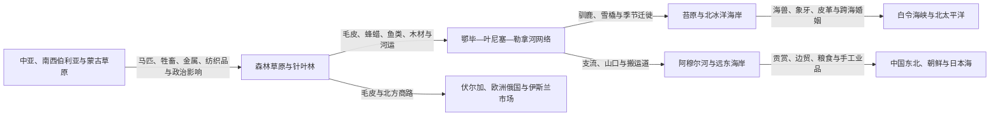

# 草原、森林与北极网络

## 时间

史前时代—20世纪；许多交换和迁徙关系延续至今。

## 概括

北亚的草原、针叶林、苔原、大河与海岸不是彼此隔绝的生态“格子”。马匹、驯鹿、毛皮、鱼类、海兽产品、金属、盐、粮食、茶叶、布匹和宗教物品沿河流、山口、冬道与海路交换；婚姻、语言、技术、仪式和政治权威也随之流动。草原帝国、森林首领、北极猎手、城市商人和帝国官员都曾参与这些网络，但控制力和利益并不相等。

网络会随季节变化。夏季舟船顺河运输，冬季结冰河面可供雪橇快速移动；驯鹿和马匹连接水路之间的陆地。国家边界和征税制度能改变路线，却很少从零创造交流。理解俄国东扩以前的北亚，必须先看到这些成熟的地方和跨区域联系；理解殖民以后，也必须看到原住民知识怎样继续支撑毛皮、交通、测绘和资源开发。

## 跨生态网络

## 网络的物质基础

| 交通或资源 | 主要使用方式 | 历史意义 |
|---|---|---|
| 大河与支流 | 独木舟、桦皮舟、大船、冬季冰道 | 把南北生态带连接起来，后来成为俄国筑堡和征贡路线 |
| 流域间搬运道 | 在相邻河源之间拖舟、背负或用畜力转运 | 使鄂毕、叶尼塞、勒拿与太平洋水系能组成大陆交通网 |
| 马匹 | 草原放牧、战争、驮运和身份财富 | 扩大南西伯利亚与蒙古高原政治联系，但在深雪苔原适用性有限 |
| 驯鹿 | 驮运、雪橇、乳肉、皮革和社会财富 | 支撑森林与苔原长距离移动；不同民族的牧养规模和技术差异很大 |
| 犬与雪橇 | 冬季运输、狩猎和海岸旅行 | 在东北远东与北极海岸尤其重要，并与驯鹿运输并存 |
| 毛皮 | 服饰、贡赋、礼物和远距离商品 | 价值高、体积小，连接欧洲、伊斯兰世界、中国和北太平洋市场 |
| 鲑鱼及河湖鱼类 | 季节集中捕捞、干制、冻藏和交换 | 支持阿穆尔河、堪察加和大河沿岸较稳定聚落 |
| 海兽产品 | 肉、油、皮、骨、海象牙 | 支撑北极海岸社会，并进入内陆和跨海贸易 |
| 金属与盐 | 工具、武器、饰品、保存食物 | 矿区、工匠和商人节点能够影响很远的非冶金社区 |
| 粮食、茶和布匹 | 从南部农业区和城市输入 | 使北方社会获得新消费品，也可能形成债务和市场依赖 |

## 史前与古代网络

### 石材、海岸与河湖交换

旧石器和全新世早期人群已经跨距离取得优质石材、贝饰和颜料。器物分布说明群体之间有接触，但不能据一件远来物品就推定固定商人阶层。交换可能发生在季节集会、婚姻访问、共同捕猎或礼物关系中。

全新世森林扩展后，捕鱼和小型猎物的重要性增加。河口、鱼群洄游点和湖岸形成季节聚会中心，食物储存使一些聚落停留时间更长。沿海群体则以皮艇、海兽知识和海冰路线连接岛屿与大陆。内陆与海岸互换毛皮、鱼油、骨角、石材和木制品。

### 冶金与牧业扩散

约前4—前1千纪，南西伯利亚的牧业和冶金网络加强。草原人群以马牛羊、金属和纺织品交换森林地区的毛皮、木材和特殊资源。铜、锡、青铜和铁的技术可以通过工匠移动、婚姻、俘虏和模仿传播，不一定伴随大规模人口取代。

草原贵族墓葬中的北方毛皮、木材和远来物品，说明政治中心依赖多生态带交换。森林社会并非只被动交贡，也能控制河口、狩猎区和中介路线，从大国竞争中获利。

## 草原帝国与森林政治

匈奴、突厥、回鹘、蒙古及其后继政权在不同时期影响南西伯利亚。它们通过军事联盟、婚姻、税贡和贸易把草原与森林纳入更大政治体系。森林猎民提供毛皮、猎鹰、兵员或向导，获得金属、牲畜、粮食和政治保护。

帝国控制具有层级和季节性。靠近草原核心的地区可能由官员或贵族直接管理，遥远森林则通过地方首领纳贡。臣属关系可以重叠：同一群体可能同时与多个汗国、商人网络或邻近农业国家保持联系。现代地图上清晰的领土边界不适合直接套用。

蒙古帝国扩张使南西伯利亚进入横跨欧亚的驿站、军事和贸易体系。金帐汗国、西伯利亚汗国、察合台诸政权及蒙古诸部后来分别控制部分路线。伊斯兰商人沿伏尔加、中亚和西西伯利亚开展贸易，佛教、伊斯兰教、东正教与地方宗教也在长期接触中传播。

## 五类主要网络

| 网络 | 代表参与者 | 核心交换 | 政治作用 |
|---|---|---|---|
| 草原—森林网络 | 突厥、蒙古诸部，萨哈、布里亚特、森林猎民和城镇商人 | 马匹、牲畜、金属、毛皮、粮食 | 连接汗国与地方首领，形成贡赋、联盟和军事招募 |
| 西西伯利亚—伏尔加网络 | 西伯利亚汗国、中亚与伏尔加商人、汉特和曼西等 | 毛皮、布匹、金属、盐、奴隶 | 在俄国征服以前已有成熟税贡和伊斯兰商业联系 |
| 大河网络 | 鄂毕、叶尼塞、勒拿流域居民 | 鱼类、毛皮、舟船、木材和地方产品 | 决定聚落和权力节点，也被俄国改造为城堡链 |
| 阿穆尔—东北亚网络 | 达斡尔、鄂温克、赫哲 / 纳奈、满洲及中俄商人 | 鱼皮、貂皮、人参、粮食、布匹和贡赏品 | 连接清朝边疆与远东，后来成为清俄竞争核心 |
| 北极—白令海网络 | 楚科奇、尤皮克、科里亚克、阿留申等 | 海象牙、鲸脂、皮革、铁器、烟草和婚姻关系 | 跨越今日俄美边界，国家征服后仍长期延续 |

## 毛皮、贡赋与市场

毛皮既可作为衣物和礼物，也可成为国家贡赋和全球商品。西伯利亚汗国、蒙古诸政权和俄国都利用既有猎获与首领关系征贡。俄国建立的“亚萨克”制度并非凭空出现，却以更系统的登记、人质、堡垒和国际市场需求扩大了压力。

贡赋和贸易不能简单二分。地方群体可能在交贡时获得礼物和贸易权，官员则把同一行为登记为臣服。市场交易也可能包含垄断、债务、人质或暴力。黑貂过度捕猎导致资源下降，使猎人和征贡者向新地区移动，形成“资源耗竭—路线扩展—控制深化”的循环。

中国市场对毛皮、俄国市场对茶叶和布匹的需求，使恰克图等边境口岸在18—19世纪繁荣。国家时而关闭贸易以施压，但走私和小规模边民交换难以完全停止。

## 驯鹿并非单一“北方文明”

驯鹿可被猎取，也可少量驯养作运输，或形成大群牧业。涅涅茨、埃文基、埃文、楚科奇等群体的牧养方式、迁徙距离、财产关系和社会组织并不相同。大型牧群不是所有地区最古老或唯一的生计，有些是在贸易、国家政策和市场需求中扩大。

驯鹿网络连接森林营地、苔原牧场和城镇补给点。牧民需要在季节、雪况、河流和动物健康之间调整路线；固定边界、矿区、管道和道路可能切断迁徙廊道。苏联集体化把许多牧群纳入集体或国营单位，现代家庭则可能结合工资劳动、卫星通讯和传统放牧。

## 阿穆尔河与北太平洋

阿穆尔河流域的鱼类、森林和农业条件支持多种定居与流动组合。清朝以贡赏、编旗、驻防和边贸连接地方群体，俄国人则在17世纪试图征粮征贡。两种帝国权力与地方网络重叠，最终促成军事冲突和条约划界。

北太平洋的楚科奇、西伯利亚尤皮克、阿留申及阿拉斯加诸群体依靠海洋技术跨海交流。铁器、烟草、珠饰和枪械进入地方网络，海象牙、鲸产品和毛皮向外流通。俄国商人高度依赖原住民航海与捕猎知识，同时使用强迫劳动和人质，造成严重殖民冲击。

1867年阿拉斯加易手没有立即切断白令海峡两岸关系。20世纪国家护照、边境封锁和冷战军事化才显著限制传统往来；冷战后部分家庭和文化交流重新建立。

## 宗教、语言与知识传播

- **萨满传统**是外部研究者对多种仪式、治病和人与非人关系的概括，不表示北亚存在统一宗教。
- **佛教**主要通过蒙古和藏传佛教网络影响布里亚特、图瓦等南部社会。
- **伊斯兰教**沿中亚、伏尔加和汗国商路进入西西伯利亚，鞑靼商人与宗教人士具有重要中介作用。
- **东正教**随俄国殖民扩展，洗礼可能来自信仰、婚姻、税收优惠或政治压力；地方仪式常与新宗教并存。
- 多语能力是商路和边疆生活的常态。翻译者、混合家庭、商人和首领能够把词汇、法律观念和地理知识带入不同制度。

地图绘制、探险和国家行政依赖当地向导、舟船制造者、猎人及口述地理。帝国文献常把这些知识记在俄国官员或探险者名下，整理时应恢复地方参与者的作用。

## 网络重组的重要事件

| 时间 | 事件或变化 | 网络后果 |
|---|---|---|
| 前4—前1千纪 | 南西伯利亚牧业与冶金扩大 | 草原、山地和森林交换加深，金属与牲畜传播 |
| 前1千纪—公元1千纪 | 草原联盟和帝国形成 | 贡赋、兵员和贵重物品被纳入更大政治体系 |
| 13世纪 | 蒙古帝国扩张 | 驿路、军事和贸易连接增强，地方网络被重新编入汗国秩序 |
| 15—16世纪 | 西伯利亚汗国与中亚—伏尔加贸易 | 毛皮、盐、布匹和伊斯兰商业联系成为俄国东扩前提 |
| 16—17世纪 | 俄国沿大河筑堡征贡 | 既有网络被国家接管，毛皮压力和暴力扩大 |
| 1689年、1727年 | 清俄条约与恰克图体系 | 部分边界固定，合法贸易制度化，地方跨境活动被重新分类 |
| 18世纪 | 北太平洋毛皮扩张 | 西伯利亚网络延伸至阿留申和阿拉斯加，殖民暴力加剧 |
| 19世纪末 | 铁路与大规模定居 | 河运和季节网络被铁路—城市市场叠加，土地关系改变 |
| 20世纪 | 集体化、国营运输和边境封闭 | 国家深入组织牧业、渔业和航运，跨境亲族联系受限 |
| 1991年后 | 市场开放与地方复兴 | 部分跨境贸易恢复，资源公司和国家安全制度继续塑造路线 |

## 网络繁荣与衰退的机制

### 形成条件

- 生态互补使不同地区拥有彼此需要的资源。
- 河流、冰道、驯鹿、马匹和舟船降低运输成本。
- 季节集会、婚姻和多语中介建立信任与信用。
- 高价值、低体积的毛皮、金属和象牙适合长距离交换。
- 汗国或帝国提供部分道路安全和市场，却不一定直接控制全部参与者。

### 脆弱因素

- 过度捕猎、鱼类下降或牧场变化会破坏物质基础。
- 疫病和战争减少人口并中断知识传承。
- 边界封锁、垄断贸易和强制定居可能切断季节路线。
- 债务、贡额和商人暴力把互惠交换变为不平等抽取。
- 铁路和工业项目可能绕开旧节点，使地方社区失去中介地位。

### 网络并未“消失”

一条路线衰退后，参与者常转用新商品和交通。例如传统舟路可接入蒸汽船、铁路或公路；牧民可用无线电和雪地车；跨海亲族在政治开放时重新联系。现代化不是网络从“传统”到“消失”的单线过程，而是权力、技术和路线的重组。

## 关键辨析

- **游牧、渔猎和农耕不是文明等级**：同一社区可按季节组合多种生计。
- **贡赋不等于完全行政控制**：远方政权可能只在特定季节通过首领获得资源。
- **贸易不自动等于自愿和平交换**：债务、垄断、人质和军事威胁可能同时存在。
- **草原帝国没有覆盖所有北亚社会**：影响随距离、生态和地方政治而变化。
- **国家边界晚于许多网络**：划界改变法律身份，却不能证明跨境亲族和迁徙原本不存在。
- **技术采用不等于文化被替代**：铁器、枪械、雪地车和数字工具可被纳入地方知识体系。

## 演变关系

- 环境与早期人口：[北亚自然地理、考古与早期人口](/%E4%BA%BA%E6%96%87%E7%A7%91%E5%AD%A6/%E5%8E%86%E5%8F%B2/%E5%8C%97%E4%BA%9A/_%E9%80%9A%E5%8F%B2/%E5%8C%97%E4%BA%9A%E8%87%AA%E7%84%B6%E5%9C%B0%E7%90%86%E3%80%81%E8%80%83%E5%8F%A4%E4%B8%8E%E6%97%A9%E6%9C%9F%E4%BA%BA%E5%8F%A3.md)。
- 地方社会：[西伯利亚和远东原住民社会](/%E4%BA%BA%E6%96%87%E7%A7%91%E5%AD%A6/%E5%8E%86%E5%8F%B2/%E5%8C%97%E4%BA%9A/_%E9%80%9A%E5%8F%B2/%E8%A5%BF%E4%BC%AF%E5%88%A9%E4%BA%9A%E5%92%8C%E8%BF%9C%E4%B8%9C%E5%8E%9F%E4%BD%8F%E6%B0%91%E7%A4%BE%E4%BC%9A.md)。
- 殖民转折：[俄国东扩与西伯利亚殖民](/%E4%BA%BA%E6%96%87%E7%A7%91%E5%AD%A6/%E5%8E%86%E5%8F%B2/%E5%8C%97%E4%BA%9A/_%E9%80%9A%E5%8F%B2/%E4%BF%84%E5%9B%BD%E4%B8%9C%E6%89%A9%E4%B8%8E%E8%A5%BF%E4%BC%AF%E5%88%A9%E4%BA%9A%E6%AE%96%E6%B0%91.md)。
- 全球网络比较：[丝绸之路、印度洋与跨撒哈拉网络](/%E4%BA%BA%E6%96%87%E7%A7%91%E5%AD%A6/%E5%8E%86%E5%8F%B2/_%E9%80%9A%E5%8F%B2/%E4%B8%9D%E7%BB%B8%E4%B9%8B%E8%B7%AF%E3%80%81%E5%8D%B0%E5%BA%A6%E6%B4%8B%E4%B8%8E%E8%B7%A8%E6%92%92%E5%93%88%E6%8B%89%E7%BD%91%E7%BB%9C.md)。
