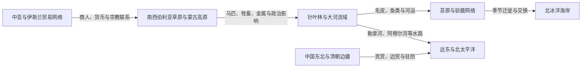

# 草原、森林与北极网络

## 时间

古代至近现代

## 概括

北亚并非由气候带彼此隔绝。南西伯利亚草原、针叶林、大河流域、苔原和海岸通过毛皮、马匹、驯鹿、鱼类、金属、盐、粮食和奴隶贸易相互连接。宗教、婚姻、语言和政治权威也沿这些网络流动。

## 网络结构

## 主要网络

| 网络 | 参与者与物资 | 历史作用 |
|---|---|---|
| 草原—森林交换 | 游牧政权、森林猎民、城镇商人；马匹、毛皮、金属和粮食 | 连接突厥、蒙古、中亚和西伯利亚政治经济。 |
| 西伯利亚河运 | 鄂毕河、叶尼塞河、勒拿河支流沿岸社会 | 为地方迁徙、俄国城堡和后来的工业运输提供通道。 |
| 驯鹿网络 | 涅涅茨、埃文基、楚科奇等不同群体 | 提供交通、食物和社会财富，经营方式各不相同。 |
| 阿穆尔河网络 | 达斡尔、赫哲 / 纳奈、鄂温克、满洲和俄国群体 | 联系清朝边疆、俄罗斯远东和日本海。 |
| 北太平洋网络 | 楚科奇、西伯利亚尤皮克、阿留申等 | 跨越今日俄美边界进行贸易、婚姻和知识交流。 |

## 关键辨析

- “游牧”“渔猎”“农耕”不是互相排斥的文明等级，而是可组合和变化的生计策略。
- 毛皮贸易既能带来金属工具和远距离市场，也会造成债务、暴力、动物资源减少和国家控制。
- 蒙古帝国及其后继政权影响南西伯利亚，但地方民族不能全部写成蒙古人的直系分支。

## 相关入口

- [中亚草原汗国](/%E4%BA%BA%E6%96%87%E7%A7%91%E5%AD%A6/%E5%8E%86%E5%8F%B2/%E4%B8%AD%E4%BA%9A/%E8%8D%89%E5%8E%9F%E6%B1%97%E5%9B%BD/README.md)
- [蒙古](/%E4%BA%BA%E6%96%87%E7%A7%91%E5%AD%A6/%E5%8E%86%E5%8F%B2/%E4%B8%9C%E4%BA%9A/%E8%92%99%E5%8F%A4/README.md)
- [丝绸之路、印度洋与跨撒哈拉网络](/%E4%BA%BA%E6%96%87%E7%A7%91%E5%AD%A6/%E5%8E%86%E5%8F%B2/_%E9%80%9A%E5%8F%B2/%E4%B8%9D%E7%BB%B8%E4%B9%8B%E8%B7%AF%E3%80%81%E5%8D%B0%E5%BA%A6%E6%B4%8B%E4%B8%8E%E8%B7%A8%E6%92%92%E5%93%88%E6%8B%89%E7%BD%91%E7%BB%9C.md)
