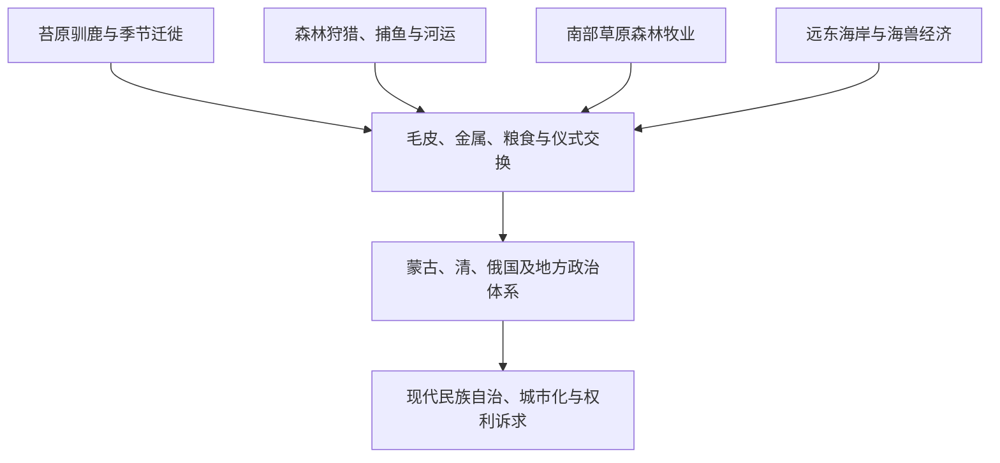

# 西伯利亚和远东原住民社会

## 时间

古代至今

## 概括

西伯利亚和远东原住民族在苔原、针叶林、山地、草原森林和海岸形成多种社会。驯鹿牧养、狩猎、捕鱼、海兽捕猎、马牛牧养和农耕并非互斥标签，同一社会会随季节、贸易和国家政策改变生计组合。

## 区域与代表人群

| 区域 | 代表人群 | 历史线索 |
|---|---|---|
| 西西伯利亚与乌拉尔以东 | 汉特、曼西、涅涅茨等 | 河流渔猎、驯鹿、毛皮贸易及与俄国和中亚的联系。 |
| 中西伯利亚 | 埃文基、埃文、雅库特 / 萨哈等 | 森林迁徙、驯鹿和马牛牧养、勒拿河网络。 |
| 南西伯利亚 | 布里亚特、图瓦、哈卡斯、阿尔泰等 | 草原森林经济、蒙古与突厥世界、佛教和萨满传统。 |
| 阿穆尔河与萨哈林 | 赫哲 / 纳奈、乌尔奇、尼夫赫等 | 河海捕鱼、清朝贡赏贸易、俄国和日本势力竞争。 |
| 东北远东与白令海峡 | 楚科奇、科里亚克、尤卡吉尔、西伯利亚尤皮克等 | 驯鹿、海兽、跨白令海峡贸易和殖民抵抗。 |

## 关系图

## 殖民与现代变化

- 俄国贡貂、商人债务、传教和行政制度改变地方权力与资源使用，也遭遇逃避、谈判和武装抵抗。
- 疾病传播和毛皮过度捕猎造成严重人口与生态冲击，各地区程度不同。
- 苏联时期的集体化、定居化、寄宿教育、工业迁移和民族行政重组改变语言和生活方式。
- 当代原住民族同时生活在村落、牧区和城市；传统知识会创新和重建，不是静止的“古老遗存”。

## 关键辨析

- “原住民”不表示各民族共享单一文化或政治利益。
- 沙皇俄国和苏联使用的民族名称、统计分类与地方自称可能不同。
- 民族自治地区并不自动等于资源、土地和政治决定权完全由当地民族掌握。

## 相关入口

- [草原、森林与北极网络](/%E4%BA%BA%E6%96%87%E7%A7%91%E5%AD%A6/%E5%8E%86%E5%8F%B2/%E5%8C%97%E4%BA%9A/_%E9%80%9A%E5%8F%B2/%E8%8D%89%E5%8E%9F%E3%80%81%E6%A3%AE%E6%9E%97%E4%B8%8E%E5%8C%97%E6%9E%81%E7%BD%91%E7%BB%9C.md)
- [通古斯语族与肃慎](/%E4%BA%BA%E6%96%87%E7%A7%91%E5%AD%A6/%E5%8E%86%E5%8F%B2/%E4%B8%9C%E4%BA%9A/%E4%B8%AD%E5%9B%BD/_%E6%B0%91%E6%97%8F/%E9%80%9A%E5%8F%A4%E6%96%AF%E8%AF%AD%E6%97%8F%E4%B8%8E%E8%82%83%E6%85%8E/README.md)
