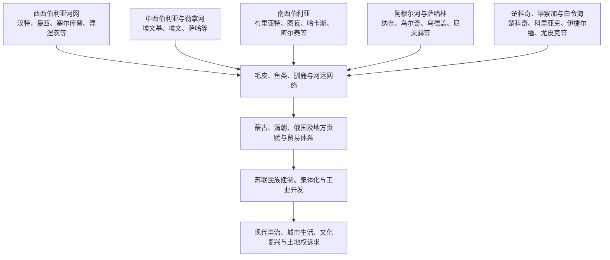

# 西伯利亚和远东原住民社会

## 时间

史前时代—2026年7月。

## 概括

西伯利亚和俄罗斯远东从来不是单一民族或单一“北方文化”的区域。汉特、曼西、涅涅茨、塞尔库普、凯特、萨哈、埃文基、埃文、布里亚特、图瓦、哈卡斯、阿尔泰、尤卡吉尔、楚科奇、科里亚克、伊捷尔缅、西伯利亚尤皮克、纳奈、乌尔奇、乌德盖、尼夫赫等社会，在森林、草原、苔原、河流和海岸形成不同语言、亲族制度、政治组织和生计组合。

“原住民族”强调这些群体在俄国征服和现代国家形成以前已拥有土地、政治关系与知识体系，并在殖民后持续存在；它不表示各民族共享同一文化，也不表示所有成员只从事所谓传统生计。当代牧民、渔民、教师、企业雇员、城市居民和公共活动者都可以维持原住民族身份。

帝国和苏联文献中的旧称、现代自称、语言学分类与法定民族名录并不总一致。国家分类能提供自治、教育或资源权，也可能把流动和多重身份固定成僵硬类别。整理时应把民族自我认同、地方历史和行政名称分别说明。

## 区域与社会分布

## 区域社会概览

| 区域 | 代表民族与语言背景 | 主要历史生计 | 政治与交流特征 |
|---|---|---|---|
| 西西伯利亚森林与河流 | 汉特、曼西等乌戈尔语群体；塞尔库普等萨莫耶德语群体；凯特等 | 捕鱼、狩猎、小规模驯鹿、采集及后来工资劳动 | 以河流、亲族和地方领地组织生活，长期同西伯利亚汗国、中亚商人及俄国征贡者互动 |
| 亚马尔及北极西部 | 涅涅茨、恩茨、恩加纳桑等 | 驯鹿牧养、狩猎、捕鱼和季节迁徙 | 牧群规模与迁徙方式不同；苔原路线跨越今日行政边界 |
| 中西伯利亚森林 | 埃文基、埃文等通古斯语族群体 | 流动狩猎、驯鹿运输、捕鱼及地区性牧业 | 小型亲族群高度分散，语言和地理知识支撑远距离旅行 |
| 勒拿河与雅库特 | 萨哈为主，也有埃文基、埃文、尤卡吉尔等 | 马牛牧养、干草、捕鱼、狩猎和农业成分 | 萨哈社会形成较大的地方贵族和属民关系，后与俄国贡赋、教会及贸易结合 |
| 南西伯利亚 | 布里亚特、图瓦、哈卡斯、阿尔泰等突厥或蒙古语群体 | 马牛羊牧业、狩猎、农业和矿冶 | 与蒙古诸部、汗国、藏传佛教和俄中边贸联系紧密 |
| 阿穆尔河流域 | 纳奈、乌尔奇、乌德盖、鄂温克等；语言与文化多样 | 鲑鱼捕捞、狩猎、采集、犬和舟船交通 | 参与清朝贡赏、地方贸易和后来俄国边疆，定居渔村与流动活动并存 |
| 萨哈林及邻海 | 尼夫赫、乌尔塔等 | 捕鱼、海兽、驯鹿和海峡交通 | 连接大陆、萨哈林、北海道与日本海，后来受俄日划界和殖民政策切割 |
| 楚科奇—堪察加 | 楚科奇、科里亚克、伊捷尔缅、尤卡吉尔等 | 驯鹿、海兽捕猎、捕鱼、犬雪橇 | 内陆与海岸群体互换产品；对俄国征服的反应从战争到贸易协商不一 |
| 白令海峡 | 西伯利亚尤皮克、楚科奇等 | 鲸和海象捕猎、捕鱼、舟船与跨海交换 | 与阿拉斯加亲族、语言和贸易关系长期存在，现代国界晚于这些网络 |

“代表民族”不是完整名单。民族内部也可能因河流、方言、氏族、宗教和生计形成很强差异，同一名称下的社区未必共享统一政治立场。

## 社会与权力结构

北亚许多社会没有中央集权王朝，但这不等于“没有政治”。资源使用、婚姻、赔偿、战争、仪式和外来者交涉都需要规则与权威。

| 权力层次或角色 | 主要职能 | 变化与限制 |
|---|---|---|
| 家庭与营地 | 组织生产、照料、迁徙和食物分配 | 家庭可随婚姻和季节组合，不等同固定村庄 |
| 氏族、亲族和地方共同体 | 调解婚姻、领地、互助、复仇和仪式责任 | 边界常以关系和使用权表达，不一定形成排他的测绘领土 |
| 长者、富裕牧主或地方首领 | 组织交换、宴饮、战争、迁徙或对外谈判 | 权威依赖声望、财富和追随者，未必能强制所有成员 |
| 萨满、祭司和宗教人士 | 治病、仪式、知识传承及人与环境关系解释 | “萨满”是宽泛概括；各民族角色、性别和宇宙观不同 |
| 汗国、清朝或俄国认可的首领 | 代征贡物、翻译、管理人口和接受礼物 | 外部承认可能强化某些家族，也会制造新的内部竞争 |
| 帝国官员、传教士和商人 | 税贡、司法、贸易、学校和皈依 | 实际控制受距离限制，经常依赖地方中介 |
| 苏维埃、集体农庄和国营单位 | 生产计划、住房、学校、医疗和干部任命 | 将地方社会纳入国家机构，也压缩迁徙和自主资源管理 |
| 当代自治政府、社区和协会 | 地方公共服务、文化、法律主张和项目协商 | 行政自治、民族代表性和自然资源决定权必须分别判断 |

性别分工在不同社区有差异。男性在许多地区承担远距离狩猎或海兽捕猎，女性掌握制衣、食物处理、营地移动和亲族网络；这不表示政治只属于男性。财产继承、仪式权威和劳动价值会随市场、学校与国家政策改变。

## 生计不是固定标签

### 驯鹿、马牛与季节迁徙

涅涅茨等群体可经营大规模驯鹿牧群，埃文基等森林社会常以较少驯鹿作运输，不同楚科奇群体则分为以驯鹿为主的内陆群体与以海兽为主的海岸群体。驯鹿牧业可能因贸易与国家需求扩大，并非各民族从远古以来完全不变的生活方式。

萨哈社会在勒拿河谷发展适应严寒的马牛牧业、干草储备和季节营地，也结合捕鱼、狩猎与后来农业。南西伯利亚诸民族的马牛羊牧养则更接近草原体系。牧业形态受雪深、牧场、市场和土地管制制约，不能以“游牧民族”一个标签概括。

### 河流渔业与海洋知识

阿穆尔河、鄂毕河、勒拿河及堪察加的鱼类洄游，可支持季节集中捕捞、熏干和储藏。纳奈、尼夫赫等群体发展精细的鱼皮加工、舟船和渔场知识。海岸楚科奇与尤皮克依靠集体协作捕鲸、海象和海豹，猎获分配也是社会关系与风险互助的一部分。

国家渔业许可和商业捕捞可能限制传统使用。气候变化使海冰、河冰、鱼群和风暴规律改变，地方知识需要不断更新，而非简单“失效”。

### 狩猎、采集与市场

黑貂、松鼠、狐等毛皮很早进入远距离交换，俄国征服后市场压力显著扩大。猎人获得铁器、枪支、面粉和茶叶，也可能陷入债务、被迫交贡或面对动物资源下降。浆果、根茎、坚果和药用植物常被殖民记录忽略，却对营养和知识体系重要。

现代家庭可能同时有牧业、捕鱼、公共部门工资、矿业就业和社会福利收入。采用发动机、雪地车、手机或卫星定位不使生计“不再传统”，关键在于土地、知识和社区决定是否延续。

## 俄国征服以前的政治联系

西西伯利亚汗国向部分森林群体征贡，并与中亚和伏尔加商路连接。南西伯利亚诸民族先后受突厥、蒙古、准噶尔等草原政权影响，关系包括贡赋、联盟、战争和婚姻。阿穆尔河群体同女真—满洲及清朝的贡赏、编旗和贸易体系相连，白令海社会则跨海交换。

这些关系通常不是现代意义的完整领土统治。同一群体可能向多个权力中心送礼或纳贡，也可能利用距离保持自治。俄国后来把既有首领与贡赋记录改造成沙皇主权证据，地方居民未必接受相同解释。

## 俄国殖民时期

### 贡貂、贸易与暴力

俄国哥萨克以“亚萨克”征收毛皮，并通过城堡、人质和登记宣示主权。地方社会会武装抵抗、迁往偏远支流、隐瞒猎获、同邻近势力结盟或谈判贡额。楚科奇长期军事抵抗迫使帝国在18世纪更多采用贸易和松散臣属；其他人口较少或更依赖河谷的群体遭受更直接控制。

商人、传教士和移民带来铁器、粮食、东正教和新市场，也带来天花等疫病、债务、酒精和土地竞争。人口损失因地区、时期和记录差异而难以用一个数字概括。

### 地方中介与混合社会

俄国行政离不开翻译、向导、首领和猎人。部分地方精英借帝国承认强化地位；通婚形成多语家庭和新的地方共同体。萨哈、布里亚特等人口较多、具有牧业和地方贵族结构的社会，在殖民体系中形成不同于小型北极群体的政治路径。

东正教洗礼可能带来税收优惠、婚姻或教育机会，也可能由压力促成。基督教、佛教、伊斯兰教和地方仪式常长期并存，不能用正式皈依名册推定信仰完全替代。

### 土地与定居殖民

农业移民、哥萨克军地、矿区和城市主要占用南部河谷及草原森林地带。国家常将季节使用、共同渔场和迁徙路线视为“未占土地”，使原住民在法律上难以证明权利。19世纪铁路和大规模移民进一步加剧这一问题。

## 革命、苏联民族政策与集体化

### 早期承认与分类

革命后，原住民族组织、地方自治者和苏维埃机构讨论土地、自治和文化权利。1920年代的本土化政策推动民族行政、母语教育、文字创制和地方干部培养。国家所称“北方小民族”成为专门治理类别，一些过去由地域、氏族或邻称区分的人群被归入标准民族。

这一过程有双重性：它为学校、出版和政治代表提供制度，也可能由外部专家和官员固定身份、合并方言或排除不符合标准的人。

### 集体化、定居化与压制

1930年代，国家把牧群、渔业和狩猎纳入集体农庄或国营单位，推广固定村镇、寄宿学校和计划交售。医疗、识字和交通改善与强制征收、迁离季节路线、宗教压制及家庭分离同时发生。

萨满、佛教僧侣、地方知识分子和民族干部在政治运动中遭到镇压。文字方案转向西里尔字母，俄语在行政和升学中的优势扩大。许多语言使用范围因此收缩，但家庭和偏远地区仍保存口述传统。

### 战后工业化

矿山、油气、林业、水坝和军工吸引大量外来人口。原住民族在本地人口中的比例下降，牧场、河流和圣地受到污染或阻隔。国家单位也提供稳定工资、兽医、学校和运输，苏联经验因此不能只写成“完全破坏”或“无条件进步”。

## 1991年至2026年

### 法律与自治

俄罗斯联邦设有民族共和国、自治专区等行政单位，也通过法律承认人数较少的北方、西伯利亚和远东原住民族。法定类别通常涉及自我认同、传统居住和生计、人口规模等条件。它能带来部分狩猎、捕鱼、文化和社区组织权利，但人口较多的萨哈、布里亚特、图瓦等民族走的是共和国和一般民族政策路径，两类制度不可混同。

行政名称中的“自治”不保证矿产、油气、森林和土地由原住民族决定。联邦、地方政府和企业掌握不同权力，传统资源使用区的设立、边界和执行也不均衡。

### 文化与语言复兴

地方学校、博物馆、节庆、数字档案、文学和网络媒体支持语言文化复兴。城市青年可以通过社团、音乐、影视和在线课程重新学习语言。与此同时，使用者减少、村校合并、师资不足和俄语主导仍威胁许多小语种。

文化复兴不应只展示服饰和节庆。土地使用、历史记忆、姓名恢复、宗教场所和参与公共决定同样是文化权利。

### 资源项目与环境变化

油气、矿业、管道、道路和保护区可能提供就业、补偿和公共设施，也会切割驯鹿路线、污染河流并改变猎物。有效协商需要社区在项目早期获得信息和参与，而不只是事后补偿。

永久冻土融化、野火、海冰缩减和极端天气改变住房、交通与生计。气候压力与工业影响叠加，不能要求原住民族独自承担“适应”责任。俄罗斯在2025年公布面向2036年的相关可持续发展政策构想；到2026年，仍需以实际土地、语言、公共服务和参与结果检验其成效。

## 重要事件与转折

| 时间 | 事件或过程 | 影响 |
|---|---|---|
| 13—16世纪 | 蒙古及后继汗国、清朝前身和地方贡赋网络 | 北亚社会进入多层政治与贸易体系，俄国征服并非从“无政府”开始 |
| 16世纪末—17世纪 | 俄国沿大河征贡筑堡 | 毛皮、人口登记和人质制度扩大，地方社会抵抗、迁徙与协商 |
| 17—18世纪 | 楚科奇等群体长期抵抗 | 帝国直接征服成本高，部分关系转为贸易和名义臣属 |
| 19世纪 | 农业、流放、矿业和铁路殖民深化 | 南部土地占用和人口结构改变，行政控制增强 |
| 1917—1920年代 | 革命与民族组织、本土化政策 | 土地和自治诉求公开化，民族行政、文字与学校建立 |
| 1930年代 | 集体化、定居化和政治压制 | 生计、宗教和地方领导重组，家庭与语言传承受冲击 |
| 1940—1980年代 | 战争动员和资源工业化 | 城市化、公共服务与环境损害并行，外来人口大量增加 |
| 1990年代 | 协会、法律与文化复兴 | 原住民族权利进入新法律框架，但实施和资源控制有限 |
| 21世纪 | 大型资源项目与气候变化 | 就业、国家战略、土地权和生态风险形成持续冲突与协商 |
| 2025—2026年 | 面向2036年的国家政策构想进入实施阶段 | 正式目标强调可持续发展，实际成效仍需长期检验 |

## 殖民冲击与社会延续机制

| 类型 | 主要因素 | 结果 |
|---|---|---|
| 结构压力 | 人口少、政治分散、外来市场和军事技术差距 | 一些社区更难抵抗征贡和土地占用，但分散也能帮助逃避控制 |
| 外部冲击 | 疫病、暴力、过度捕猎、定居移民和工业污染 | 人口、生计和领地受损，程度具有明显地区差异 |
| 国家制度 | 民族分类、学校、集体农庄、自治单位和法律名录 | 同时提供承认与公共服务，也带来规训、同化和身份固定 |
| 社会韧性 | 亲族网络、多语能力、季节知识、迁徙与文化再创造 | 帮助社区适应市场和国家变化，并维持身份 |
| 直接转折 | 征贡筑堡、1930年代集体化、1991年体制变化及大型项目 | 每次都重新分配土地、权力和社会组织 |

## 关键辨析

- **原住民族不是一种生计**：城市居民或受雇劳动者不会因此失去民族身份。
- **民族内部不完全一致**：社区、方言、阶层、年龄和性别会形成不同利益。
- **无王国不等于无政治**：亲族、领地、赔偿、首领和仪式权威构成治理。
- **行政民族名不等于自古不变的边界**：名称和分类有历史，必须保留旧称与自称差异的说明。
- **公共服务不能抵消强制**：教育、医疗和基础设施的成果与集体化、压制和同化应同时叙述。
- **法律自治不等于资源主权**：需分别考察土地、矿产、财政和决策参与。
- **传统会创新**：使用现代技术、市场和数字媒体不使文化“不真实”。

## 演变关系

- 环境与早期人口：[北亚自然地理、考古与早期人口](/%E4%BA%BA%E6%96%87%E7%A7%91%E5%AD%A6/%E5%8E%86%E5%8F%B2/%E5%8C%97%E4%BA%9A/_%E9%80%9A%E5%8F%B2/%E5%8C%97%E4%BA%9A%E8%87%AA%E7%84%B6%E5%9C%B0%E7%90%86%E3%80%81%E8%80%83%E5%8F%A4%E4%B8%8E%E6%97%A9%E6%9C%9F%E4%BA%BA%E5%8F%A3.md)。
- 前现代交换：[草原、森林与北极网络](/%E4%BA%BA%E6%96%87%E7%A7%91%E5%AD%A6/%E5%8E%86%E5%8F%B2/%E5%8C%97%E4%BA%9A/_%E9%80%9A%E5%8F%B2/%E8%8D%89%E5%8E%9F%E3%80%81%E6%A3%AE%E6%9E%97%E4%B8%8E%E5%8C%97%E6%9E%81%E7%BD%91%E7%BB%9C.md)。
- 殖民进程：[俄国东扩与西伯利亚殖民](/%E4%BA%BA%E6%96%87%E7%A7%91%E5%AD%A6/%E5%8E%86%E5%8F%B2/%E5%8C%97%E4%BA%9A/_%E9%80%9A%E5%8F%B2/%E4%BF%84%E5%9B%BD%E4%B8%9C%E6%89%A9%E4%B8%8E%E8%A5%BF%E4%BC%AF%E5%88%A9%E4%BA%9A%E6%AE%96%E6%B0%91.md)。
- 苏联与现代变化：[苏联开发、人口迁徙与当代北亚](/%E4%BA%BA%E6%96%87%E7%A7%91%E5%AD%A6/%E5%8E%86%E5%8F%B2/%E5%8C%97%E4%BA%9A/_%E9%80%9A%E5%8F%B2/%E8%8B%8F%E8%81%94%E5%BC%80%E5%8F%91%E3%80%81%E4%BA%BA%E5%8F%A3%E8%BF%81%E5%BE%99%E4%B8%8E%E5%BD%93%E4%BB%A3%E5%8C%97%E4%BA%9A.md)。
- 通古斯语族背景：[通古斯语族与肃慎](/%E4%BA%BA%E6%96%87%E7%A7%91%E5%AD%A6/%E5%8E%86%E5%8F%B2/%E4%B8%9C%E4%BA%9A/%E4%B8%AD%E5%9B%BD/_%E6%B0%91%E6%97%8F/%E9%80%9A%E5%8F%A4%E6%96%AF%E8%AF%AD%E6%97%8F%E4%B8%8E%E8%82%83%E6%85%8E/README.md)。
