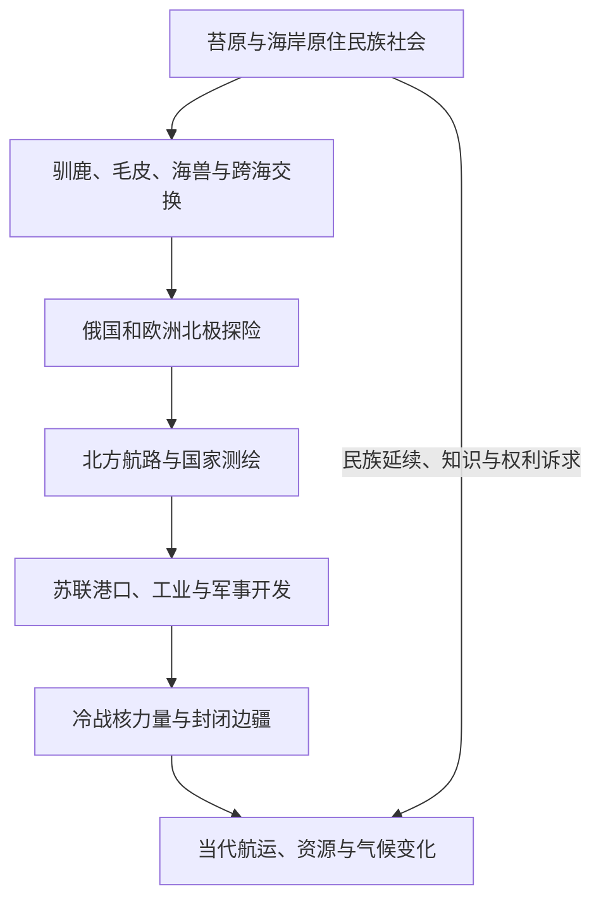

# 北极与亚北极历史

## 概括

本入口以欧亚北极为核心，并通过白令海峡连接北美。北极不是只有海冰和探险家的“边缘”，而是涅涅茨、楚科奇、西伯利亚尤皮克等民族长期生活、迁徙和交换的空间。国家探险、北方航路、矿产能源、军事设施和气候变化后来叠加在这些社会之上。

## 历史主线

## 主题导航

| 主题 | 入口 | 说明 |
|---|---|---|
| 原住民族 | [西伯利亚和远东原住民社会](/%E4%BA%BA%E6%96%87%E7%A7%91%E5%AD%A6/%E5%8E%86%E5%8F%B2/%E5%8C%97%E4%BA%9A/_%E9%80%9A%E5%8F%B2/%E8%A5%BF%E4%BC%AF%E5%88%A9%E4%BA%9A%E5%92%8C%E8%BF%9C%E4%B8%9C%E5%8E%9F%E4%BD%8F%E6%B0%91%E7%A4%BE%E4%BC%9A.md) | 驯鹿、海兽、渔猎、语言和现代民族权利。 |
| 前现代网络 | [草原、森林与北极网络](/%E4%BA%BA%E6%96%87%E7%A7%91%E5%AD%A6/%E5%8E%86%E5%8F%B2/%E5%8C%97%E4%BA%9A/_%E9%80%9A%E5%8F%B2/%E8%8D%89%E5%8E%9F%E3%80%81%E6%A3%AE%E6%9E%97%E4%B8%8E%E5%8C%97%E6%9E%81%E7%BD%91%E7%BB%9C.md) | 内陆河流、苔原和北太平洋之间的交换。 |
| 帝国与北太平洋 | [清俄边疆、东北亚与北太平洋联系](/%E4%BA%BA%E6%96%87%E7%A7%91%E5%AD%A6/%E5%8E%86%E5%8F%B2/%E5%8C%97%E4%BA%9A/_%E9%80%9A%E5%8F%B2/%E6%B8%85%E4%BF%84%E8%BE%B9%E7%96%86%E3%80%81%E4%B8%9C%E5%8C%97%E4%BA%9A%E4%B8%8E%E5%8C%97%E5%A4%AA%E5%B9%B3%E6%B4%8B%E8%81%94%E7%B3%BB.md) | 堪察加、阿拉斯加、白令海和帝国竞争。 |
| 苏联与当代 | [苏联开发、人口迁徙与当代北亚](/%E4%BA%BA%E6%96%87%E7%A7%91%E5%AD%A6/%E5%8E%86%E5%8F%B2/%E5%8C%97%E4%BA%9A/_%E9%80%9A%E5%8F%B2/%E8%8B%8F%E8%81%94%E5%BC%80%E5%8F%91%E3%80%81%E4%BA%BA%E5%8F%A3%E8%BF%81%E5%BE%99%E4%B8%8E%E5%BD%93%E4%BB%A3%E5%8C%97%E4%BA%9A.md) | 港口、工业、军事、航路、环境与资源。 |

## 关键辨析

- 北极航路并非气候变暖后才出现；现代变化主要影响通航季、风险和商业规模。
- 国家探险记录经常忽略当地向导、原住民知识和既有交通网络。
- 海冰减少可能增加航运机会，也同时威胁海岸、野生动物和依赖冰面的生计。
- 北极安全、资源开发和环境治理是不同议题，不能用单一“竞争”叙事覆盖。
