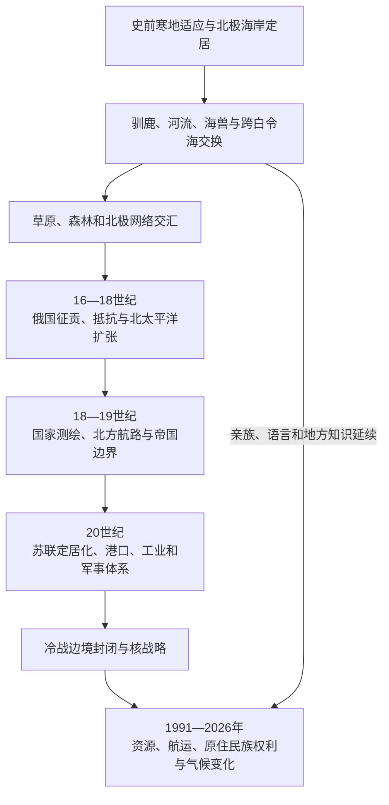

# 北极与亚北极历史

## 范围与概括

本入口以欧亚北极及其亚北极腹地为中心，包括巴伦支海以东的北冰洋海岸、亚马尔与泰梅尔半岛、勒拿河下游、楚科奇和堪察加北部，并通过白令海峡连接北美。北极不是只有海冰、探险家和资源的“空白边缘”，而是涅涅茨、楚科奇、西伯利亚尤皮克、科里亚克、恩加纳桑、埃文、萨哈等民族长期居住、迁徙和交换的历史空间。

“北极”与“亚北极”的分界会随自然科学、行政和文化语境变化。本目录用它们组织海冰、苔原、针叶林北缘、驯鹿路线和北冰洋航运的共同历史，不把所有北方民族视为同一文化，也不把现代俄罗斯疆域等同于古代活动范围。

## 历史主线

## 历史主线概括

1. **长期居住与环境适应**：旧石器时代人群已经到达北极圈附近；全新世海岸、河口和苔原社会发展出海兽捕猎、捕鱼、驯鹿利用、储存与季节迁徙。
2. **跨生态交换**：苔原并不孤立，毛皮、海象牙、铁器、粮食和婚姻关系连接森林内陆、北冰洋与白令海两岸。
3. **俄国东扩**：哥萨克和商人以贡貂、城堡和贸易进入北方；楚科奇等群体的长期抵抗使帝国在部分地区只能维持松散关系。
4. **航路与帝国知识**：测绘、探险和海运依赖原住民向导及航海知识，国家逐渐把地方路线改造成北方航路和边界体系。
5. **苏联改造**：集体化、固定居民点、学校、医疗、港口、矿业和军事基地改变人口与生计；公共服务与强制迁徙、文化压制和环境损害并存。
6. **当代重组**：北极资源和航运获国家重视，永久冻土融化、海冰变化、野火及地缘政治同时增加风险；原住民族围绕土地、语言和项目参与持续争取权利。

## 主题导航

| 顺序 | 主题 | 入口 | 阅读重点 |
|---:|---|---|---|
| 1 | 环境与早期人口 | [北亚自然地理、考古与早期人口](/%E4%BA%BA%E6%96%87%E7%A7%91%E5%AD%A6/%E5%8E%86%E5%8F%B2/%E5%8C%97%E4%BA%9A/_%E9%80%9A%E5%8F%B2/%E5%8C%97%E4%BA%9A%E8%87%AA%E7%84%B6%E5%9C%B0%E7%90%86%E3%80%81%E8%80%83%E5%8F%A4%E4%B8%8E%E6%97%A9%E6%9C%9F%E4%BA%BA%E5%8F%A3.md) | 冰期、白令陆架、寒地技术和全新世海岸适应 |
| 2 | 原住民族 | [西伯利亚和远东原住民社会](/%E4%BA%BA%E6%96%87%E7%A7%91%E5%AD%A6/%E5%8E%86%E5%8F%B2/%E5%8C%97%E4%BA%9A/_%E9%80%9A%E5%8F%B2/%E8%A5%BF%E4%BC%AF%E5%88%A9%E4%BA%9A%E5%92%8C%E8%BF%9C%E4%B8%9C%E5%8E%9F%E4%BD%8F%E6%B0%91%E7%A4%BE%E4%BC%9A.md) | 民族、语言、生计、殖民冲击和现代权利 |
| 3 | 前现代网络 | [草原、森林与北极网络](/%E4%BA%BA%E6%96%87%E7%A7%91%E5%AD%A6/%E5%8E%86%E5%8F%B2/%E5%8C%97%E4%BA%9A/_%E9%80%9A%E5%8F%B2/%E8%8D%89%E5%8E%9F%E3%80%81%E6%A3%AE%E6%9E%97%E4%B8%8E%E5%8C%97%E6%9E%81%E7%BD%91%E7%BB%9C.md) | 驯鹿、毛皮、海兽、河运和跨海交换 |
| 4 | 俄国扩张 | [俄国东扩与西伯利亚殖民](/%E4%BA%BA%E6%96%87%E7%A7%91%E5%AD%A6/%E5%8E%86%E5%8F%B2/%E5%8C%97%E4%BA%9A/_%E9%80%9A%E5%8F%B2/%E4%BF%84%E5%9B%BD%E4%B8%9C%E6%89%A9%E4%B8%8E%E8%A5%BF%E4%BC%AF%E5%88%A9%E4%BA%9A%E6%AE%96%E6%B0%91.md) | 贡赋、城堡、商人、抵抗与北太平洋延伸 |
| 5 | 帝国与跨海关系 | [清俄边疆、东北亚与北太平洋联系](/%E4%BA%BA%E6%96%87%E7%A7%91%E5%AD%A6/%E5%8E%86%E5%8F%B2/%E5%8C%97%E4%BA%9A/_%E9%80%9A%E5%8F%B2/%E6%B8%85%E4%BF%84%E8%BE%B9%E7%96%86%E3%80%81%E4%B8%9C%E5%8C%97%E4%BA%9A%E4%B8%8E%E5%8C%97%E5%A4%AA%E5%B9%B3%E6%B4%8B%E8%81%94%E7%B3%BB.md) | 堪察加、阿拉斯加、白令海、萨哈林和帝国划界 |
| 6 | 苏联与当代 | [苏联开发、人口迁徙与当代北亚](/%E4%BA%BA%E6%96%87%E7%A7%91%E5%AD%A6/%E5%8E%86%E5%8F%B2/%E5%8C%97%E4%BA%9A/_%E9%80%9A%E5%8F%B2/%E8%8B%8F%E8%81%94%E5%BC%80%E5%8F%91%E3%80%81%E4%BA%BA%E5%8F%A3%E8%BF%81%E5%BE%99%E4%B8%8E%E5%BD%93%E4%BB%A3%E5%8C%97%E4%BA%9A.md) | 定居化、工业、军工、航路、人口与气候风险 |

## 重要转折与时间节点

| 时间 | 转折 | 意义 |
|---|---|---|
| 约3.2万年前 | 雅纳河附近已有寒地人类活动 | 证明北极圈附近很早便有人群长期适应 |
| 末次冰期 | 白令陆架连接东北亚与阿拉斯加 | 为美洲早期人口扩散和长期跨区交流提供地理条件 |
| 全新世 | 海岸、河口与苔原生计重组 | 海兽、捕鱼、驯鹿和储存体系发展 |
| 17—18世纪 | 俄国进入东北远东与北极海岸 | 贡赋、贸易、疫病和战争重塑地方社会 |
| 18世纪 | 白令探险与北太平洋毛皮扩张 | 国家测绘和殖民网络越过白令海 |
| 1930年代 | 集体化、定居化与北方航路体系建设 | 国家深入牧业、渔业、教育和交通 |
| 冷战时期 | 北极军事化和边境封闭 | 跨白令海亲族联系受到严格限制 |
| 1991年以后 | 市场转型和北方城镇分化 | 补贴、人口和产业结构重组 |
| 21世纪至2026年 | 气候变化、资源战略与航运关注上升 | 机会与基础设施、生态、权利和安全风险并存 |

## 空间辨析

| 概念 | 说明 |
|---|---|
| 北极 | 可按北极圈、树线、气候、海冰或政治合作范围定义，不存在唯一边界 |
| 亚北极 | 北极以南、受严寒和季节变化显著影响的森林与苔原过渡区 |
| 俄罗斯北方 | 行政、经济和补贴制度用语，范围与自然地理北极不完全一致 |
| 北方航路 | 俄罗斯北极海岸的国家管理航运走廊，需要破冰、港口、测绘和搜救体系 |
| 白令海峡区域 | 欧亚与北美之间的跨海文化空间，现代俄美边界晚于地方社会 |
| “远北小民族” | 苏联和俄罗斯的特定行政法律类别，不是对所有北方民族的统称 |

## 关键辨析

- 北极航行在近代以前已经存在；当代变化主要影响通航季、船型、风险和商业规模。
- 海冰减少不等于航运自动安全，漂冰、浅水、风暴、搜救距离和污染风险仍然突出。
- 原住民族既是历史主体，也是当代居民，不应只在“传统文化”章节出现。
- 国家探险记录常淡化当地向导、翻译、舟船制造者和食物知识的贡献。
- 苏联公共服务和现代化成果不能用来忽略强制定居、寄宿教育、劳改与环境代价。
- 2026年的政策目标、规划航线和在建工程不等于已经实现的能力。

## 上级与相邻入口

- [北亚历史](/%E4%BA%BA%E6%96%87%E7%A7%91%E5%AD%A6/%E5%8E%86%E5%8F%B2/%E5%8C%97%E4%BA%9A/README.md)
- [西伯利亚与俄罗斯远东](/%E4%BA%BA%E6%96%87%E7%A7%91%E5%AD%A6/%E5%8E%86%E5%8F%B2/%E5%8C%97%E4%BA%9A/%E8%A5%BF%E4%BC%AF%E5%88%A9%E4%BA%9A%E4%B8%8E%E4%BF%84%E7%BD%97%E6%96%AF%E8%BF%9C%E4%B8%9C/README.md)
- [北美原住民](/%E4%BA%BA%E6%96%87%E7%A7%91%E5%AD%A6/%E5%8E%86%E5%8F%B2/%E7%BE%8E%E6%B4%B2/%E5%8C%97%E7%BE%8E/%E5%8C%97%E7%BE%8E%E5%8E%9F%E4%BD%8F%E6%B0%91/README.md)
