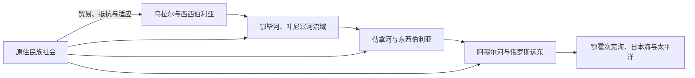

# 西伯利亚与俄罗斯远东

## 概括

本入口连接乌拉尔以东至太平洋的区域历史。西伯利亚通常包括西西伯利亚、中西伯利亚、南西伯利亚和东西伯利亚；“俄罗斯远东”是近现代行政与地缘概念，主要面向太平洋和东北亚。两者有重叠，但并非同义词。

## 区域主线

## 导航

| 主题 | 入口 | 说明 |
|---|---|---|
| 环境与早期人口 | [北亚自然地理、考古与早期人口](/%E4%BA%BA%E6%96%87%E7%A7%91%E5%AD%A6/%E5%8E%86%E5%8F%B2/%E5%8C%97%E4%BA%9A/_%E9%80%9A%E5%8F%B2/%E5%8C%97%E4%BA%9A%E8%87%AA%E7%84%B6%E5%9C%B0%E7%90%86%E3%80%81%E8%80%83%E5%8F%A4%E4%B8%8E%E6%97%A9%E6%9C%9F%E4%BA%BA%E5%8F%A3.md) | 地形、河流、冰期和人口扩散。 |
| 原住民社会 | [西伯利亚和远东原住民社会](/%E4%BA%BA%E6%96%87%E7%A7%91%E5%AD%A6/%E5%8E%86%E5%8F%B2/%E5%8C%97%E4%BA%9A/_%E9%80%9A%E5%8F%B2/%E8%A5%BF%E4%BC%AF%E5%88%A9%E4%BA%9A%E5%92%8C%E8%BF%9C%E4%B8%9C%E5%8E%9F%E4%BD%8F%E6%B0%91%E7%A4%BE%E4%BC%9A.md) | 多种民族、语言、生计和现代延续。 |
| 帝国扩张 | [俄国东扩与西伯利亚殖民](/%E4%BA%BA%E6%96%87%E7%A7%91%E5%AD%A6/%E5%8E%86%E5%8F%B2/%E5%8C%97%E4%BA%9A/_%E9%80%9A%E5%8F%B2/%E4%BF%84%E5%9B%BD%E4%B8%9C%E6%89%A9%E4%B8%8E%E8%A5%BF%E4%BC%AF%E5%88%A9%E4%BA%9A%E6%AE%96%E6%B0%91.md) | 毛皮、城堡、贡赋、移民与冲突。 |
| 东北亚联系 | [清俄边疆、东北亚与北太平洋联系](/%E4%BA%BA%E6%96%87%E7%A7%91%E5%AD%A6/%E5%8E%86%E5%8F%B2/%E5%8C%97%E4%BA%9A/_%E9%80%9A%E5%8F%B2/%E6%B8%85%E4%BF%84%E8%BE%B9%E7%96%86%E3%80%81%E4%B8%9C%E5%8C%97%E4%BA%9A%E4%B8%8E%E5%8C%97%E5%A4%AA%E5%B9%B3%E6%B4%8B%E8%81%94%E7%B3%BB.md) | 清俄条约、阿穆尔河、堪察加和太平洋。 |
| 苏联与当代 | [苏联开发、人口迁徙与当代北亚](/%E4%BA%BA%E6%96%87%E7%A7%91%E5%AD%A6/%E5%8E%86%E5%8F%B2/%E5%8C%97%E4%BA%9A/_%E9%80%9A%E5%8F%B2/%E8%8B%8F%E8%81%94%E5%BC%80%E5%8F%91%E3%80%81%E4%BA%BA%E5%8F%A3%E8%BF%81%E5%BE%99%E4%B8%8E%E5%BD%93%E4%BB%A3%E5%8C%97%E4%BA%9A.md) | 铁路、工业、劳改营、城市、资源与人口。 |

## 关键辨析

- 西伯利亚是历史地理概念，俄罗斯远东更多是近现代行政和战略概念。
- “远东”是从俄罗斯和欧洲方向命名；讨论当地社会时应同时使用阿穆尔河、楚科奇、堪察加等具体区域名称。
- 城市和铁路沿线的俄罗斯化程度不能代表所有乡村、北极和原住民族地区。
