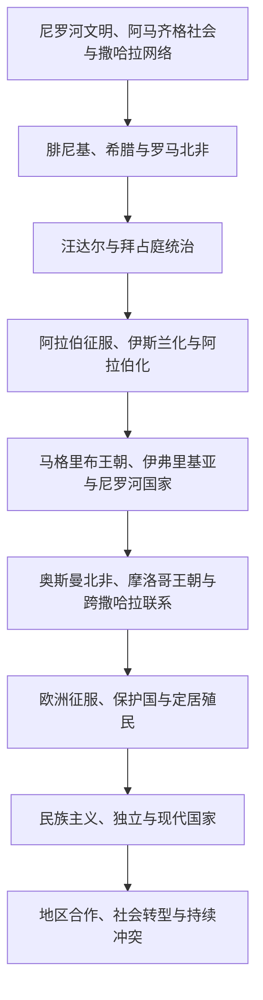

# 北非历史

## 概括

北非是地中海、尼罗河、撒哈拉与西亚交汇的历史区域。本目录以现代埃及、利比亚、突尼斯、阿尔及利亚、摩洛哥和苏丹为国家主线，并把西撒哈拉作为地位未决的争议地区单列。埃及现已作为北非的正式国家子目录维护，其古埃及至现代共和国的完整通史保留在原有笔记中。

北非历史不能只理解为阿拉伯征服或欧洲殖民的结果。阿马齐格诸社会、尼罗河文明、腓尼基与希腊殖民、罗马和拜占庭统治、伊斯兰化与阿拉伯化、跨撒哈拉贸易、地方王朝、奥斯曼行省、欧洲帝国主义和现代民族国家共同塑造了区域结构。

## 历史演进

## 历史主线

- 地中海沿岸长期连接黎凡特、南欧与西地中海；迦太基、亚历山大里亚、昔兰尼加和罗马阿非利加都是跨海网络节点。
- 阿拉伯征服后，伊斯兰逐步成为主要宗教，阿拉伯语不断扩展，但阿马齐格语言、地方共同体与尼罗河流域传统并未消失。
- 撒哈拉是商路和迁徙通道。黄金、盐、奴隶、纺织品、马匹和学术网络将马格里布与萨赫勒连接起来。
- 19—20世纪欧洲统治形式并不相同：阿尔及利亚经历法国定居殖民，突尼斯和摩洛哥成为保护国，利比亚遭意大利征服，苏丹处于英埃共管，埃及则长期受英国控制。
- 独立后的各国在君主制、共和国、军人政治、资源国家与大众政治之间形成不同道路。

## 国家与地区导航

| 类型 | 入口 | 核心主线 |
|---|---|---|
| 国家 | [埃及](/%E4%BA%BA%E6%96%87%E7%A7%91%E5%AD%A6/%E5%8E%86%E5%8F%B2/%E5%8C%97%E9%9D%9E/%E5%9F%83%E5%8F%8A/README.md) | 古埃及、伊斯兰王朝、奥斯曼、近代王朝与共和国 |
| 国家 | [摩洛哥](/%E4%BA%BA%E6%96%87%E7%A7%91%E5%AD%A6/%E5%8E%86%E5%8F%B2/%E5%8C%97%E9%9D%9E/%E6%91%A9%E6%B4%9B%E5%93%A5/README.md) | 马格里布王朝、阿拉维王朝、保护国与现代君主制 |
| 国家 | [阿尔及利亚](/%E4%BA%BA%E6%96%87%E7%A7%91%E5%AD%A6/%E5%8E%86%E5%8F%B2/%E5%8C%97%E9%9D%9E/%E9%98%BF%E5%B0%94%E5%8F%8A%E5%88%A9%E4%BA%9A/README.md) | 努米底亚、奥斯曼摄政、法国定居殖民与独立战争 |
| 国家 | [突尼斯](/%E4%BA%BA%E6%96%87%E7%A7%91%E5%AD%A6/%E5%8E%86%E5%8F%B2/%E5%8C%97%E9%9D%9E/%E7%AA%81%E5%B0%BC%E6%96%AF/README.md) | 迦太基、伊弗里基亚、奥斯曼贝伊、保护国与共和国 |
| 国家 | [利比亚](/%E4%BA%BA%E6%96%87%E7%A7%91%E5%AD%A6/%E5%8E%86%E5%8F%B2/%E5%8C%97%E9%9D%9E/%E5%88%A9%E6%AF%94%E4%BA%9A/README.md) | 昔兰尼加、的黎波里塔尼亚、费赞、意大利殖民与现代冲突 |
| 国家 | [苏丹](/%E4%BA%BA%E6%96%87%E7%A7%91%E5%AD%A6/%E5%8E%86%E5%8F%B2/%E5%8C%97%E9%9D%9E/%E8%8B%8F%E4%B8%B9/README.md) | 克尔玛与库施、努比亚王国、马赫迪国家、共管与南北分离 |
| 争议地区 | [西撒哈拉](/%E4%BA%BA%E6%96%87%E7%A7%91%E5%AD%A6/%E5%8E%86%E5%8F%B2/%E5%8C%97%E9%9D%9E/%E8%A5%BF%E6%92%92%E5%93%88%E6%8B%89/README.md) | 西班牙殖民、反殖民运动、战争、停火与未决政治地位 |

## 通史入口

- [北非通史](/%E4%BA%BA%E6%96%87%E7%A7%91%E5%AD%A6/%E5%8E%86%E5%8F%B2/%E5%8C%97%E9%9D%9E/_%E9%80%9A%E5%8F%B2/README.md)：维护迦太基等跨现代国界的北非文明与帝国专题。

## 跨区域专题

- [阿马齐格人、阿拉伯化与北非社会](/%E4%BA%BA%E6%96%87%E7%A7%91%E5%AD%A6/%E5%8E%86%E5%8F%B2/%E5%8C%97%E9%9D%9E/%E9%98%BF%E9%A9%AC%E9%BD%90%E6%A0%BC%E4%BA%BA%E3%80%81%E9%98%BF%E6%8B%89%E4%BC%AF%E5%8C%96%E4%B8%8E%E5%8C%97%E9%9D%9E%E7%A4%BE%E4%BC%9A.md)
- [撒哈拉商路、游牧网络与萨赫勒联系](/%E4%BA%BA%E6%96%87%E7%A7%91%E5%AD%A6/%E5%8E%86%E5%8F%B2/%E5%8C%97%E9%9D%9E/%E6%92%92%E5%93%88%E6%8B%89%E5%95%86%E8%B7%AF%E3%80%81%E6%B8%B8%E7%89%A7%E7%BD%91%E7%BB%9C%E4%B8%8E%E8%90%A8%E8%B5%AB%E5%8B%92%E8%81%94%E7%B3%BB.md)
- [殖民统治、民族主义与北非独立](/%E4%BA%BA%E6%96%87%E7%A7%91%E5%AD%A6/%E5%8E%86%E5%8F%B2/%E5%8C%97%E9%9D%9E/%E6%AE%96%E6%B0%91%E7%BB%9F%E6%B2%BB%E3%80%81%E6%B0%91%E6%97%8F%E4%B8%BB%E4%B9%89%E4%B8%8E%E5%8C%97%E9%9D%9E%E7%8B%AC%E7%AB%8B.md)

## 重要转折与时间节点

| 时间 | 事件或过程 | 意义 |
|---|---|---|
| 前1千纪 | 腓尼基和希腊殖民网络扩展 | 北非海岸更深地卷入地中海贸易与争霸 |
| 前146年 | 罗马灭迦太基 | 罗马逐步建立北非行省体系 |
| 7—8世纪 | 阿拉伯征服北非 | 北非进入伊斯兰政治世界，长期伊斯兰化与阿拉伯化开始 |
| 11—13世纪 | 穆拉比特、穆瓦希德等跨区域王朝兴盛 | 马格里布、撒哈拉和伊比利亚政治联系加强 |
| 16世纪 | 奥斯曼控制阿尔及尔、突尼斯和的黎波里 | 北非东中部纳入奥斯曼帝国体系，摩洛哥保持独立王朝 |
| 1830年 | 法国入侵阿尔及利亚 | 欧洲对北非的直接殖民扩张进入新阶段 |
| 1881—1912年 | 突尼斯、埃及、利比亚和摩洛哥相继受欧洲强权控制 | 区域主权与社会经济结构被殖民秩序重组 |
| 1951—1962年 | 利比亚、苏丹、摩洛哥、突尼斯和阿尔及利亚先后独立 | 现代北非国家体系基本形成 |
| 1975年 | 西班牙撤离西撒哈拉 | 地区地位问题转化为长期战争与外交争议 |
| 2011年 | 北非多国发生大规模抗议与政权危机 | 政治参与、国家权力与社会经济矛盾重新组合 |

## 关键辨析

- “马格里布”狭义常指摩洛哥、阿尔及利亚和突尼斯，广义有时包括利比亚与毛里塔尼亚；本目录不据此移动已归入西非的[毛里塔尼亚](/%E4%BA%BA%E6%96%87%E7%A7%91%E5%AD%A6/%E5%8E%86%E5%8F%B2/%E9%9D%9E%E6%B4%B2/%E8%A5%BF%E9%9D%9E/%E6%AF%9B%E9%87%8C%E5%A1%94%E5%B0%BC%E4%BA%9A/README.md)。
- “阿马齐格”是北非多种语言和地方共同体的总称之一，不能被理解为自古至今完全同质的单一民族。
- 苏丹同时属于尼罗河谷、撒哈拉、萨赫勒和红海世界。本目录维护今苏丹共和国主线，[南苏丹](/%E4%BA%BA%E6%96%87%E7%A7%91%E5%AD%A6/%E5%8E%86%E5%8F%B2/%E9%9D%9E%E6%B4%B2/%E4%B8%9C%E9%9D%9E/%E5%8D%97%E8%8B%8F%E4%B8%B9/README.md)独立后的国家史保留在东非目录。
- 西撒哈拉的主权和最终地位尚未解决，应区分实际控制、政治主张、国际承认与联合国非殖民化进程。

## 目录层级

- 上级目录：[历史](/%E4%BA%BA%E6%96%87%E7%A7%91%E5%AD%A6/%E5%8E%86%E5%8F%B2/README.md)
- 通史入口：[北非通史](/%E4%BA%BA%E6%96%87%E7%A7%91%E5%AD%A6/%E5%8E%86%E5%8F%B2/%E5%8C%97%E9%9D%9E/_%E9%80%9A%E5%8F%B2/README.md)
- 同级区域：[西亚](/%E4%BA%BA%E6%96%87%E7%A7%91%E5%AD%A6/%E5%8E%86%E5%8F%B2/%E8%A5%BF%E4%BA%9A/README.md)
