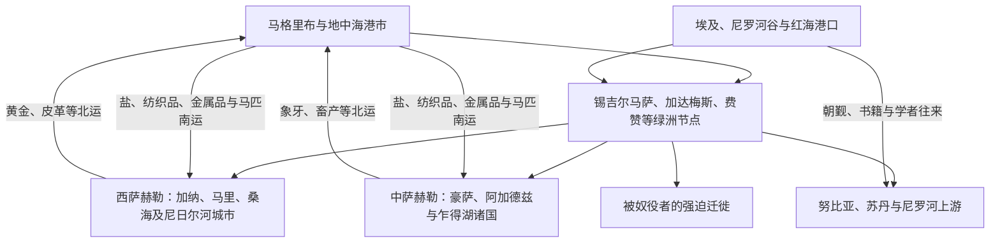

# 撒哈拉商路、游牧网络与萨赫勒联系

## 时间

古代至20世纪

## 概括

撒哈拉并非绝对隔绝北非与撒哈拉以南非洲的空白地带。绿洲、山地水源、骆驼运输、游牧联盟和商队城市组成多条路线，将马格里布、利比亚、埃及与萨赫勒、尼日尔河流域、乍得湖和尼罗河上游连接起来。

商路运输黄金、盐、铜、纺织品、马匹、书籍和奴隶，也传播伊斯兰、阿拉伯语、学术传统和政治观念。贸易收益并不均等，强迫迁徙与奴隶贸易给许多社会造成长期伤害。

## 跨撒哈拉网络图

商路不是一条固定“黄金—盐大道”，而是随水源、治安、税率、政治联盟和市场需求变化的路线束。游牧群体既经营运输、放牧和护卫，也可能征收通行费或争夺绿洲；城市商人与王国无法单独维持整个网络。

## 主要网络

| 路线 | 北端 | 南端 | 主要特点 |
|---|---|---|---|
| 西撒哈拉路线 | 摩洛哥南部、锡吉尔马萨 | 奥达戈斯特、加纳与尼日尔河上游 | 黄金、盐与穆拉比特网络 |
| 中撒哈拉路线 | 阿尔及利亚绿洲、加达梅斯 | 豪萨地区、阿加德兹与尼日尔河弯曲部 | 图阿雷格商队、盐与纺织品 |
| 的黎波里—乍得湖路线 | 的黎波里、费赞 | 卡涅姆—博尔努与乍得湖 | 马匹、奴隶、象牙与地中海商品 |
| 尼罗河路线 | 埃及、下努比亚 | 苏丹尼罗河谷、森纳尔与红海 | 河运、朝觐、谷物、黄金与奴隶贸易 |
| 红海路线 | 苏丹港口、埃及港口 | 阿拉伯半岛和印度洋 | 朝觐、商业与宗教学术联系 |

## 重要事件

- 骆驼在古代晚期广泛用于撒哈拉运输，降低长途商队的补给压力。
- 8世纪以后，穆斯林商人和学者加强马格里布与萨赫勒城市间的联系。
- 11世纪穆拉比特运动同时影响西撒哈拉、摩洛哥和安达卢斯。
- 14世纪马里统治者曼萨·穆萨朝觐，显示萨赫勒黄金经济与埃及、地中海世界的联系。
- 1591年摩洛哥军队越过撒哈拉击败桑海，随后难以长期直接控制尼日尔河区域。
- 19世纪海运、殖民边界和铁路改变传统商路，但游牧、朝觐与边境贸易并未消失。

## 统治与社会结构

| 参与者 | 作用 |
|---|---|
| 绿洲城市与商人家族 | 组织仓储、信贷、税收和跨地区代理网络 |
| 游牧联盟 | 提供运输、护卫、向导，也可能控制通道和征收贡赋 |
| 王国与帝国 | 保护或争夺商路，对市场、矿区与关口征税 |
| 宗教学者与苏菲网络 | 传播教育、法律、调解和跨地区声望 |
| 殖民国家 | 划定边界、镇压流动、改建交通并征收新税 |

## 演变关系

- 北非入口：[北非历史](/%E4%BA%BA%E6%96%87%E7%A7%91%E5%AD%A6/%E5%8E%86%E5%8F%B2/%E5%8C%97%E9%9D%9E/README.md)
- 西端联系：[西撒哈拉](/%E4%BA%BA%E6%96%87%E7%A7%91%E5%AD%A6/%E5%8E%86%E5%8F%B2/%E5%8C%97%E9%9D%9E/%E8%A5%BF%E6%92%92%E5%93%88%E6%8B%89/README.md)、[摩洛哥](/%E4%BA%BA%E6%96%87%E7%A7%91%E5%AD%A6/%E5%8E%86%E5%8F%B2/%E5%8C%97%E9%9D%9E/%E6%91%A9%E6%B4%9B%E5%93%A5/README.md)
- 尼罗河联系：[苏丹](/%E4%BA%BA%E6%96%87%E7%A7%91%E5%AD%A6/%E5%8E%86%E5%8F%B2/%E5%8C%97%E9%9D%9E/%E8%8B%8F%E4%B8%B9/README.md)、[埃及](/%E4%BA%BA%E6%96%87%E7%A7%91%E5%AD%A6/%E5%8E%86%E5%8F%B2/%E5%8C%97%E9%9D%9E/%E5%9F%83%E5%8F%8A/README.md)
- 萨赫勒对照：[非洲贸易网络与奴隶贸易](/%E4%BA%BA%E6%96%87%E7%A7%91%E5%AD%A6/%E5%8E%86%E5%8F%B2/%E9%9D%9E%E6%B4%B2/_%E9%80%9A%E5%8F%B2/%E9%9D%9E%E6%B4%B2%E8%B4%B8%E6%98%93%E7%BD%91%E7%BB%9C%E4%B8%8E%E5%A5%B4%E9%9A%B6%E8%B4%B8%E6%98%93.md)、[毛里塔尼亚](/%E4%BA%BA%E6%96%87%E7%A7%91%E5%AD%A6/%E5%8E%86%E5%8F%B2/%E9%9D%9E%E6%B4%B2/%E8%A5%BF%E9%9D%9E/%E6%AF%9B%E9%87%8C%E5%A1%94%E5%B0%BC%E4%BA%9A/README.md)
