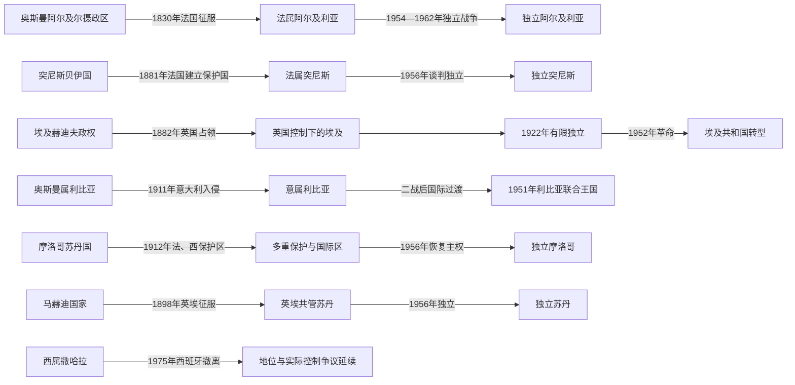

# 殖民统治、民族主义与北非独立

## 时间

1830年代—20世纪后期

## 概括

欧洲列强在北非建立了不同形式的统治。法国把阿尔及利亚改造成定居殖民地和法国行政区，在突尼斯、摩洛哥实行保护国；意大利以战争和强制迁徙征服利比亚；英国控制埃及，并与埃及名义上共同统治苏丹；西班牙则在摩洛哥北部、伊夫尼和西撒哈拉经营殖民地。

民族主义并非单一路线。君主、宗教学者、工人、退伍军人、城市知识分子、乡村游击队和妇女组织以请愿、罢工、政党、外交或武装斗争争取主权。

## 殖民扩张与独立图

北非的非殖民化没有统一剧本：保护国可保留王室法统，定居殖民地则牵涉土地、国籍与移民社会，英埃共管又制造双重名义主权。独立年份也不总等于殖民影响终止，军事基地、经济控制、边界和行政人员常在过渡期继续作用。

## 殖民体制比较

| 地区 | 主要殖民形式 | 关键特征 | 独立或转折 |
|---|---|---|---|
| 阿尔及利亚 | 法国征服与定居殖民 | 土地剥夺、欧洲移民政治特权、法律身份不平等 | 1954—1962年独立战争 |
| 突尼斯 | 法国保护国 | 保留贝伊名义统治，法国掌握财政、外交与治安 | 1956年独立 |
| 摩洛哥 | 法国和西班牙保护区 | 苏丹制度保留，多重殖民区并存 | 1956年恢复独立 |
| 利比亚 | 意大利殖民地 | 军事征服、集中营、定居计划与法西斯帝国工程 | 1951年联合王国独立 |
| 苏丹 | 英埃共管 | 英国掌握实权，南北行政差异扩大 | 1956年独立 |
| 埃及 | 英国占领与保护 | 保留王朝和有限议会，英国控制军事与帝国交通 | 1922年有限独立，1952年革命后结束王朝 |
| 西撒哈拉 | 西班牙殖民 | 资源开发、有限行政整合与反殖民运动 | 1975年西班牙撤离，地位问题未解决 |

## 重要事件

- 1830年法国占领阿尔及尔，随后以长期战争扩张至阿尔及利亚内陆。
- 1881年法国迫使突尼斯接受保护国；1882年英国占领埃及。
- 1899年英埃共管苏丹建立，殖民者以差异化政策治理南北地区。
- 1911年意大利入侵奥斯曼属利比亚；1912年摩洛哥被划分为法、西保护区及国际管理区域。
- 两次世界大战动摇欧洲帝国的资源和合法性，退伍军人、工人和政党组织扩大。
- 1950—1960年代独立浪潮建立现代国家，但殖民边界、土地制度和军事结构继续产生影响。
- 西撒哈拉的非殖民化过程未形成各方共同接受的最终政治安排。

## 民族主义与建国结构

| 方式 | 代表情形 | 后续影响 |
|---|---|---|
| 王室与民族运动协作 | 摩洛哥 | 独立后君主制成为国家整合核心 |
| 政党谈判与群众动员 | 突尼斯、苏丹 | 执政党或议会精英在建国初期居主导地位 |
| 长期武装战争 | 阿尔及利亚、利比亚反殖民抵抗 | 军事合法性深刻影响独立后政治 |
| 军官革命 | 埃及、后来的利比亚 | 军队成为政体重组的重要力量 |
| 未完成的非殖民化 | 西撒哈拉 | 自决、领土主张和实际控制持续冲突 |

## 演变关系

- 前一结构：[撒哈拉商路、游牧网络与萨赫勒联系](/%E4%BA%BA%E6%96%87%E7%A7%91%E5%AD%A6/%E5%8E%86%E5%8F%B2/%E5%8C%97%E9%9D%9E/_%E9%80%9A%E5%8F%B2/%E6%92%92%E5%93%88%E6%8B%89%E5%95%86%E8%B7%AF%E3%80%81%E6%B8%B8%E7%89%A7%E7%BD%91%E7%BB%9C%E4%B8%8E%E8%90%A8%E8%B5%AB%E5%8B%92%E8%81%94%E7%B3%BB.md)
- 区域入口：[北非历史](/%E4%BA%BA%E6%96%87%E7%A7%91%E5%AD%A6/%E5%8E%86%E5%8F%B2/%E5%8C%97%E9%9D%9E/README.md)
- 大陆对照：[瓜分非洲、殖民统治与民族独立](/%E4%BA%BA%E6%96%87%E7%A7%91%E5%AD%A6/%E5%8E%86%E5%8F%B2/%E9%9D%9E%E6%B4%B2/_%E9%80%9A%E5%8F%B2/%E7%93%9C%E5%88%86%E9%9D%9E%E6%B4%B2%E3%80%81%E6%AE%96%E6%B0%91%E7%BB%9F%E6%B2%BB%E4%B8%8E%E6%B0%91%E6%97%8F%E7%8B%AC%E7%AB%8B.md)
- 欧洲交叉：[法国历史](/%E4%BA%BA%E6%96%87%E7%A7%91%E5%AD%A6/%E5%8E%86%E5%8F%B2/%E6%AC%A7%E6%B4%B2/%E6%B3%95%E5%9B%BD/README.md)、[意大利历史](/%E4%BA%BA%E6%96%87%E7%A7%91%E5%AD%A6/%E5%8E%86%E5%8F%B2/%E6%AC%A7%E6%B4%B2/%E6%84%8F%E5%A4%A7%E5%88%A9/README.md)
