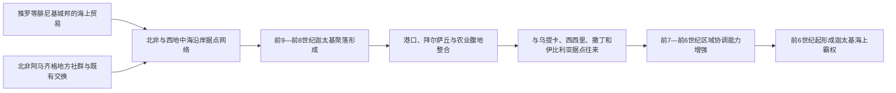

# 迦太基建城与腓尼基殖民

## 时间

传统纪年为前814年；考古材料显示约前9世纪末至前8世纪已形成定居点，至前6世纪逐渐成为西地中海腓尼基城市网络的中心。

## 概括

迦太基位于今突尼斯湾，腓尼基语名意为“新城”。它不是突然建立在无人海岸上的孤立殖民点，而是在北非地方社群、乌提卡等较早腓尼基据点和推罗海上贸易共同作用下发展起来的港市。传统故事把建城归于推罗王女埃利萨／狄多，前814年可作为古代纪年传统，但人物经历与精确年代具有传说成分。

迦太基的意义在于完成了从东方母城据点到西方区域中心的转型。推罗及其他黎凡特城市受亚述、新巴比伦等帝国压力后，跨海联系仍持续，却难以直接组织遥远据点；迦太基凭借安全港湾、肥沃腹地和居中的航路位置，逐步承担协调北非、西西里、撒丁和伊比利亚腓尼基社群的角色。

## 建城与扩展图

## 建立背景

- **黎凡特的商业推动**：腓尼基城市缺少广阔农业腹地，却拥有造船、航海、金属加工、染织和跨文化贸易经验。西航可接触伊比利亚金属、北非农牧产品和中地中海转运市场。
- **地理条件**：突尼斯湾接近西西里海峡，是东西地中海之间的窄口；半岛地形、天然泊地和拜尔萨丘便于防御，周围平原则适合谷物、橄榄和畜牧。
- **既有网络**：乌提卡等据点可能早于迦太基。所谓“殖民”不是一支船队一次完成，而是商人、工匠、家族和宗教群体多轮迁入，随后与本地社会交换、通婚、纳贡和冲突。
- **母城关系**：早期迦太基保留对推罗的宗教和象征联系，可能向推罗神庙奉献，但没有证据表明其长期只是受推罗日常行政控制的海外属城。

## 分阶段发展

| 阶段 | 主要过程 | 历史意义 |
|---|---|---|
| 初期定居 | 建立港口、住宅、墓地和宗教空间，与突尼斯湾地方社群交易 | 形成可持续港市，而非季节性商站 |
| 城市巩固 | 拜尔萨丘与沿海居民区扩大，手工业和转口贸易增长 | 城市人口、财富与防御能力提高 |
| 腹地整合 | 通过租佃、贡赋、盟约与军事压力取得北非农产和人力 | 海港获得稳定粮食、税源与战略纵深 |
| 西方联结 | 与西西里、撒丁、马耳他、伊比利亚及北非诸腓尼基城市加强合作 | 迦太基由网络节点转为协调中心 |
| 区域强权 | 在东方母城受帝国压迫、希腊殖民扩张之际组织共同防务与贸易 | 为前6世纪后的海上霸权奠基 |

## 城市、社会与权力

早期政治制度资料很少，不能把后世的双执政官、元老会议等制度原样投射到建城时。可以确定的是，商人家族、地主、祭司和军事领导逐渐形成城市精英；北非腹地居民、被依附的“利比亚人”、奴隶和来自不同港口的移民共同支撑城市经济。

迦太基文化既延续腓尼基语言、字母、神祇和葬俗，也吸收北非、埃及、希腊及伊比利亚因素。“布匿”是这种西地中海腓尼基文化长期本土化后的称呼，不应理解为与北非环境无关的纯粹东方复制品。关于托斐特遗址和儿童献祭的解释仍有争论，古典敌对文献、墓葬考古与人口资料需要分别衡量。

## 重要节点

1. 约前9—前8世纪，迦太基最早城市与墓葬材料出现，传统前814年建城纪年与此大体接近但不能视为精确档案。
2. 前8—前7世纪，城市与推罗、塞浦路斯、意大利、撒丁和伊比利亚交换网络扩大。
3. 前7世纪，东方腓尼基母城持续承受亚述帝国的贡赋和军事压力，西方据点更依赖自身协调。
4. 前6世纪前后，迦太基加强对北非腹地及西方腓尼基城市的政治—军事影响。
5. 希腊殖民者在西西里和南意大利扩展后，贸易竞争转化为港口、航线和盟友争夺。
6. 至前6世纪，迦太基已具备舰队、同盟、海外基地与农业财政，进入海上霸权阶段。

## 崛起条件与内在张力

迦太基崛起不是只靠“擅长经商”。贸易收入、北非农业、港口技术、跨文化中介和组织舰队的能力互相支持；本地盟友与依附社群则提供骑兵、步兵、贡赋和粮食。与此同时，城市公民与腹地纳税者承担义务并不均等，精英家族之间也围绕远征指挥和贸易利益竞争。这些张力在后来的雇佣兵战争和北非叛乱中会集中暴露。

## 演变关系

- 前置背景：[腓尼基城邦](/%E4%BA%BA%E6%96%87%E7%A7%91%E5%AD%A6/%E5%8E%86%E5%8F%B2/%E8%A5%BF%E4%BA%9A/%E9%BB%8E%E5%87%A1%E7%89%B9/%E8%85%93%E5%B0%BC%E5%9F%BA%E5%9F%8E%E9%82%A6.md)。
- 后续阶段：[迦太基海上霸权](/%E4%BA%BA%E6%96%87%E7%A7%91%E5%AD%A6/%E5%8E%86%E5%8F%B2/%E5%8C%97%E9%9D%9E/_%E9%80%9A%E5%8F%B2/%E8%BF%A6%E5%A4%AA%E5%9F%BA/%E8%BF%A6%E5%A4%AA%E5%9F%BA%E6%B5%B7%E4%B8%8A%E9%9C%B8%E6%9D%83.md)。
- 所属总览：[迦太基](/%E4%BA%BA%E6%96%87%E7%A7%91%E5%AD%A6/%E5%8E%86%E5%8F%B2/%E5%8C%97%E9%9D%9E/_%E9%80%9A%E5%8F%B2/%E8%BF%A6%E5%A4%AA%E5%9F%BA/README.md)。
