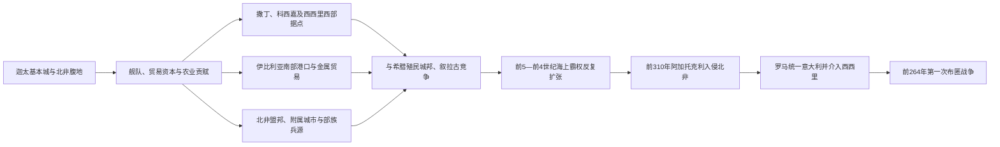

# 迦太基海上霸权

## 时间

约前6世纪—前264年；布匿战争前的霸权基础延续至前3世纪。

## 概括

迦太基把早期腓尼基港口网络重组为由本城、北非腹地、盟邦、附属城市、军事基地和条约伙伴构成的复合霸权。它并未把整个西地中海变成统一行省，而是以舰队保护航线，以条约划定贸易范围，以驻军或亲迦太基精英控制关键港口，并在北非征收贡赋和招募兵员。

这种制度在分散战场上具有弹性：伊比利亚金属、北非谷物、撒丁与西西里基地能够互相支持。但它也依赖海上交通、地方忠诚和精英将领，一旦舰队受挫、贡赋过重或多处战场同时失利，网络就容易从外围断裂。

## 霸权形成与收缩图

## 崛起机制

- **海峡位置**：突尼斯湾与西西里之间的航道连接东西地中海，舰队可由此支援北非、西西里和撒丁。
- **复合财政**：商业关税、港口费用、北非农业地租与贡赋共同承担舰队和战争成本，避免完全依赖单一贸易品。
- **网络整合**：许多旧腓尼基城市保留本地制度，仅在外交、共同防务或贡赋上接受迦太基主导，因此扩张成本低于直接占领。
- **军事分工**：公民常在舰队和精锐部队服役，陆军广泛使用北非、伊比利亚、巴利阿里和高卢兵员；努米底亚骑兵、巴利阿里投石手等具有地域专长。
- **外交与条约**：与伊特鲁里亚城市等伙伴合作，并通过早期罗马—迦太基条约限定航行、贸易和势力范围。

## 政治与实际权力结构

| 机构 / 群体 | 主要作用 | 需要辨析 |
|---|---|---|
| 两名苏费特 | 定期选出的最高民政官，主持审判和政务 | 名称常译“执政官”或“士师”，并非国王 |
| 元老会议 | 由贵族精英组成，处理外交、财政和重大政策 | 具体规模与权限主要见希腊、罗马作者，时代间会变化 |
| “一百零四人”等监督机构 | 审查将领及公职人员，限制个人军权 | 后世资料最清楚，不能机械套用于整个霸权期 |
| 公民大会 | 在精英无法一致时参与裁决，也选举部分职位 | 迦太基并非单纯商人寡头，民众参与程度有阶段差异 |
| 将领与家族网络 | 组织海外远征、经营军队和地方盟友 | 军事指挥可长期集中于马戈、巴卡等家族，但不构成世袭王朝 |
| 附属城市与北非社群 | 提供贡赋、粮食、士兵和地方治理 | 权利义务不平等，是霸权的重要脆弱点 |

迦太基没有可按父子顺序列出的“国王世系”。现存官名与人物名单残缺，故应按机构、家族和实际军事指挥解释，而不能用君主表伪造连续性。

## 分阶段发展

| 阶段 | 过程 | 转折 |
|---|---|---|
| 前6世纪整合 | 迦太基接替东方母城，协调西方腓尼基据点；与伊特鲁里亚盟友共同限制希腊扩张 | 约前535年阿拉利亚海战后，科西嘉—撒丁航路格局改变 |
| 前5世纪西西里战争 | 迦太基大军干预西西里，前480年希墨拉战败后调整策略 | 失败未摧毁海上网络，但延缓岛内扩张 |
| 前409—前4世纪扩张 | 再度攻取西西里希腊城市，与叙拉古多轮战争、和约和边界重划 | 疫病、补给和叙拉古反攻使全岛征服失败 |
| 前310—前307年危机 | 叙拉古的阿加托克利越海入侵北非，迫使迦太基本土动员 | 显示对手可绕过海外战线直接威胁腹地 |
| 前3世纪初 | 迦太基仍控制西西里西部、撒丁和北非核心，罗马则统一意大利 | 墨西拿危机使双方第一次在同一战场直接对抗 |

## 重要事件

1. 约前535年，迦太基—伊特鲁里亚联盟与福凯亚希腊人在阿拉利亚附近交战，西北地中海势力范围重新调整。
2. 前509年前后及以后数次罗马—迦太基条约反映双方早期并非宿敌，而是通过规则处理贸易和盟邦边界。
3. 前480年，迦太基在希墨拉战败；将其解释为与希波战争同步的统一“东西夹击希腊”缺乏可靠证据。
4. 前409年后，迦太基重新大规模进入西西里，塞利农特、希墨拉等城市遭攻陷。
5. 前397—前392年，叙拉古僭主狄奥尼西奥斯一世与迦太基反复争夺，摩提亚被毁后迦太基另建利利俾等基地。
6. 前310年，阿加托克利把战争带到北非；迦太基虽守住本城，却暴露腹地与附属社群的不稳定。
7. 前264年墨西拿雇佣兵危机引来迦太基、叙拉古和罗马，局部干预迅速升级为第一次布匿战争。

## 鼎盛条件与衰落压力

**鼎盛条件**包括可维修大型舰队的港口体系、分散而互补的税源、对多种兵员的整合、熟悉远洋航线的商人群体，以及允许附属港市保留自治的低成本统治。农业家马戈传统所代表的北非集约农业，也是财政和粮食安全的重要基础。

**结构性压力**则来自公民人口相对有限、海外陆战倚赖雇佣和盟军、附属社群负担不均，以及文官监督与远征将领之间的互疑。把后来失败简单归结为“雇佣军不忠”并不充分；迦太基军队多次长期有效作战，真正困难是罗马能持续重建舰队和军团，并依靠意大利同盟体系承受巨大损失。

**直接转折**是罗马进入西西里。过去迦太基可在希腊城市彼此竞争中维持均势，罗马却拥有统一意大利后的兵源和陆上联盟。前264年以后，争夺不再只是港口与贸易，而成为两个国家财政、同盟和动员制度的全面较量。

## 演变关系

- 前一阶段：[迦太基建城与腓尼基殖民](/%E4%BA%BA%E6%96%87%E7%A7%91%E5%AD%A6/%E5%8E%86%E5%8F%B2/%E5%8C%97%E9%9D%9E/_%E9%80%9A%E5%8F%B2/%E8%BF%A6%E5%A4%AA%E5%9F%BA/%E8%BF%A6%E5%A4%AA%E5%9F%BA%E5%BB%BA%E5%9F%8E%E4%B8%8E%E8%85%93%E5%B0%BC%E5%9F%BA%E6%AE%96%E6%B0%91.md)。
- 后一阶段：[布匿战争](/%E4%BA%BA%E6%96%87%E7%A7%91%E5%AD%A6/%E5%8E%86%E5%8F%B2/%E5%8C%97%E9%9D%9E/_%E9%80%9A%E5%8F%B2/%E8%BF%A6%E5%A4%AA%E5%9F%BA/%E5%B8%83%E5%8C%BF%E6%88%98%E4%BA%89.md)。
- 伊比利亚侧面：[腓尼基、希腊与迦太基殖民](/%E4%BA%BA%E6%96%87%E7%A7%91%E5%AD%A6/%E5%8E%86%E5%8F%B2/%E6%AC%A7%E6%B4%B2/%E4%BC%8A%E6%AF%94%E5%88%A9%E4%BA%9A%E5%8D%8A%E5%B2%9B/%E8%85%93%E5%B0%BC%E5%9F%BA%E3%80%81%E5%B8%8C%E8%85%8A%E4%B8%8E%E8%BF%A6%E5%A4%AA%E5%9F%BA%E6%AE%96%E6%B0%91.md)。
- 所属总览：[迦太基](/%E4%BA%BA%E6%96%87%E7%A7%91%E5%AD%A6/%E5%8E%86%E5%8F%B2/%E5%8C%97%E9%9D%9E/_%E9%80%9A%E5%8F%B2/%E8%BF%A6%E5%A4%AA%E5%9F%BA/README.md)。
