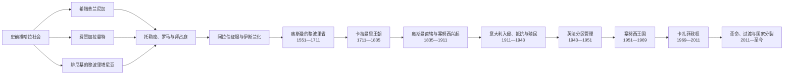

# 利比亚历史

## 历史演进图

## 历史主线

利比亚的历史首先是**昔兰尼加、的黎波里塔尼亚与费赞三大地区逐步组合为一国的历史**。东部昔兰尼加面向埃及和希腊世界，西部的黎波里塔尼亚属于腓尼基—迦太基和马格里布网络，南部费赞则依靠绿洲、水利和跨撒哈拉贸易形成加拉曼特等内陆政权。罗马、拜占庭与伊斯兰征服把三地纳入更大的帝国体系，却没有消除区域差异。

1551年奥斯曼帝国夺取的黎波里。18世纪卡拉曼里家族建立事实世袭政权，1835年奥斯曼恢复直接统治；与此同时，塞努西教团在昔兰尼加和撒哈拉形成宗教、商路与部族网络。1911年意大利入侵后，殖民主权宣称与实际控制长期不符。法西斯军政以强制迁徙、集中营和处决镇压抵抗，1934年首次把三大地区合为统一殖民行政区。第二次世界大战终结意大利统治，英国管理东西沿海、法国管理费赞。

1951年，三地区通过联合国进程建立伊德里斯一世领导的联邦王国。石油出口改变财政与社会结构，1963年联邦制被取消。1969年自由军官政变开启卡扎菲时代；1977年后的“民众国”以基层人民大会为公开制度，实际最高权力则集中于卡扎菲、革命委员会、安全机构和家族网络。2011年起义、内战与国际干预推翻旧政权，却没有形成统一军队和共同接受的继承制度。2014年后东西部机构并立；2020年停火降低全面战争强度，2021年全国选举延期后统一转型再度停滞。截至2026-07-14，双政府、双重军政体系与全国选举问题仍未解决。

## 分期导航

| 顺序 | 阶段 | 时间 | 简要概括 |
| --- | --- | --- | --- |
| 1 | [古代昔兰尼加、的黎波里塔尼亚与费赞](/%E4%BA%BA%E6%96%87%E7%A7%91%E5%AD%A6/%E5%8E%86%E5%8F%B2/%E5%8C%97%E9%9D%9E/%E5%88%A9%E6%AF%94%E4%BA%9A/%E5%8F%A4%E4%BB%A3%E6%98%94%E5%85%B0%E5%B0%BC%E5%8A%A0%E3%80%81%E7%9A%84%E9%BB%8E%E6%B3%A2%E9%87%8C%E5%A1%94%E5%B0%BC%E4%BA%9A%E4%B8%8E%E8%B4%B9%E8%B5%9E.md) | 史前—1551 | 从撒哈拉湿润期社会、希腊城邦、腓尼基港口和加拉曼特，到罗马—拜占庭统治、伊斯兰化与中世纪王朝竞争。 |
| 2 | [奥斯曼、塞努西与意大利殖民](/%E4%BA%BA%E6%96%87%E7%A7%91%E5%AD%A6/%E5%8E%86%E5%8F%B2/%E5%8C%97%E9%9D%9E/%E5%88%A9%E6%AF%94%E4%BA%9A/%E5%A5%A5%E6%96%AF%E6%9B%BC%E3%80%81%E5%A1%9E%E5%8A%AA%E8%A5%BF%E4%B8%8E%E6%84%8F%E5%A4%A7%E5%88%A9%E6%AE%96%E6%B0%91.md) | 1551—1951 | 奥斯曼省政、卡拉曼里王朝、塞努西网络、意大利殖民战争、法西斯镇压、二战和英法分区管理。 |
| 3 | [联合王国、卡扎菲政权与2011年后转型](/%E4%BA%BA%E6%96%87%E7%A7%91%E5%AD%A6/%E5%8E%86%E5%8F%B2/%E5%8C%97%E9%9D%9E/%E5%88%A9%E6%AF%94%E4%BA%9A/%E8%81%94%E5%90%88%E7%8E%8B%E5%9B%BD%E3%80%81%E5%8D%A1%E6%89%8E%E8%8F%B2%E6%94%BF%E6%9D%83%E4%B8%8E2011%E5%B9%B4%E5%90%8E%E8%BD%AC%E5%9E%8B.md) | 1951—至今 | 联邦及单一制王国、卡扎菲革命与民众国、2011年内战、第二次内战、停火与未完成的国家统一。 |

## 世系与领导人专表

| 专表 | 覆盖范围 | 使用说明 |
| --- | --- | --- |
| [意大利利比亚殖民行政首脑表](/%E4%BA%BA%E6%96%87%E7%A7%91%E5%AD%A6/%E5%8E%86%E5%8F%B2/%E5%8C%97%E9%9D%9E/%E5%88%A9%E6%AF%94%E4%BA%9A/%E6%84%8F%E5%A4%A7%E5%88%A9%E5%88%A9%E6%AF%94%E4%BA%9A%E6%AE%96%E6%B0%91%E8%A1%8C%E6%94%BF%E9%A6%96%E8%84%91%E8%A1%A8.md) | 1911—1951 | 完整区分的黎波里塔尼亚、昔兰尼加、南部与统一意属利比亚总督，并列1943年后英法分区行政。 |
| [利比亚现代国家元首与政府首脑表](/%E4%BA%BA%E6%96%87%E7%A7%91%E5%AD%A6/%E5%8E%86%E5%8F%B2/%E5%8C%97%E9%9D%9E/%E5%88%A9%E6%AF%94%E4%BA%9A/%E5%88%A9%E6%AF%94%E4%BA%9A%E7%8E%B0%E4%BB%A3%E5%9B%BD%E5%AE%B6%E5%85%83%E9%A6%96%E4%B8%8E%E6%94%BF%E5%BA%9C%E9%A6%96%E8%84%91%E8%A1%A8.md) | 1951—至今 | 区分国王、革命委员会、民众国法定国家元首、卡扎菲实际最高权力及2014年后并立政府。 |

卡拉曼里王朝和塞努西教团领袖序列较短，直接收录在[奥斯曼、塞努西与意大利殖民](/%E4%BA%BA%E6%96%87%E7%A7%91%E5%AD%A6/%E5%8E%86%E5%8F%B2/%E5%8C%97%E9%9D%9E/%E5%88%A9%E6%AF%94%E4%BA%9A/%E5%A5%A5%E6%96%AF%E6%9B%BC%E3%80%81%E5%A1%9E%E5%8A%AA%E8%A5%BF%E4%B8%8E%E6%84%8F%E5%A4%A7%E5%88%A9%E6%AE%96%E6%B0%91.md)；古代昔兰尼加巴提亚德王朝则收录在古代阶段页，不另建重复专表。

## 重要转折与时间节点

| 时间 | 转折 | 历史意义 |
| --- | --- | --- |
| 约前7世纪 | 希腊人在昔兰尼加建城、腓尼基港口发展 | 东西沿海分别接入希腊—埃及与腓尼基—迦太基网络。 |
| 前1千纪中后期 | 加拉曼特在费赞兴起 | 以地下水渠、绿洲农业和跨撒哈拉交通形成内陆政权。 |
| 前74—前46年 | 罗马陆续控制昔兰尼加与的黎波里塔尼亚 | 沿海城市进入罗马帝国市场、道路和行省体系。 |
| 642—670年代 | 阿拉伯征服三地区 | 开启长期伊斯兰化和阿拉伯化，但柏柏尔与地方社会持续重组。 |
| 1551 | 奥斯曼攻占的黎波里 | 建立延续至1911年的奥斯曼法理与省政框架。 |
| 1711 | 卡拉曼里家族夺权 | 名义属奥斯曼、实际世袭的地方王朝形成。 |
| 1835—1837 | 奥斯曼恢复直辖、塞努西教团形成 | 沿海中央化与内陆宗教—部族网络同时发展。 |
| 1911—1912 | 意土战争 | 意大利夺取港口；地方反殖民战争却延续到1930年代。 |
| 1929—1931 | 强制迁徙、集中营与欧麦尔·穆赫塔尔被处决 | 法西斯军政以大规模暴力压服昔兰尼加有组织抵抗。 |
| 1934 | 意属利比亚成立 | 三大地区首次被统一为一个殖民行政单位。 |
| 1943—1951 | 英法分区管理与联合国制宪 | 意大利统治终结，三地区通过国际安排走向独立。 |
| 1951-12-24 | 利比亚联合王国独立 | 建立现代主权国家和联邦君主制。 |
| 1959—1961 | 发现并出口石油 | 国家从援助依赖转为石油经济，中央财政与社会结构巨变。 |
| 1963 | 取消联邦制 | 强化中央统筹，也削弱地区自治。 |
| 1969-09-01 | 自由军官政变 | 王国灭亡，卡扎菲时代开始。 |
| 1977—1979 | 建立民众国、卡扎菲转任“革命领袖” | 法定国家机构与个人化实际最高权力分离。 |
| 1992—2003 | 国际制裁及对外和解 | 洛克比危机使国家孤立；移交嫌疑人和放弃非常规武器后重新融入。 |
| 2011 | 起义、国际干预与卡扎菲政权覆亡 | 结束42年统治，也释放地方武装和国家继承危机。 |
| 2014 | 尊严行动、众议院东迁与第二次内战 | 东西部双政府、双立法和双军事体系固定化。 |
| 2015—2016 | 《利比亚政治协议》与民族团结政府 | 建立获国际承认的总统委员会，但未完成国内统一。 |
| 2019—2020 | 的黎波里战争与停火 | 哈夫塔尔军事统一失败，双方转入停火和政治论坛。 |
| 2021—2022 | 统一民族政府、全国选举延期与再生双政府 | 没有共同接受的交权终点，过渡僵局延续。 |
| 2023 | 德尔纳洪灾 | 暴露基础设施失修、行政分裂和问责缺位。 |
| 2026-06 | 联合国支持的结构化对话完成报告 | 形成525项以上建议，但尚未转化为全国选举和机构统一。 |

## 理解利比亚历史的四条线索

| 线索 | 核心问题 |
| --- | --- |
| 三地区关系 | 昔兰尼加、的黎波里塔尼亚和费赞如何在帝国、殖民与民族国家框架中被连接，地区自治与中央集权如何反复摆动。 |
| 海岸与沙漠 | 地中海港口、绿山农业、费赞绿洲和跨撒哈拉通道如何支撑不同权力中心。 |
| 宗教与部族网络 | 塞努西扎维耶、地方名流和部族协商如何在国家行政薄弱时提供秩序，也如何转化为王权或军政联盟。 |
| 石油与武力 | 石油收入为何能建设福利国家又加剧分配争夺；中央财政全国化与军队、地方武装碎片化为何长期并存。 |

## 地区联系

- 上级：[北非历史](/%E4%BA%BA%E6%96%87%E7%A7%91%E5%AD%A6/%E5%8E%86%E5%8F%B2/%E5%8C%97%E9%9D%9E/README.md)
- 西邻：[突尼斯历史](/%E4%BA%BA%E6%96%87%E7%A7%91%E5%AD%A6/%E5%8E%86%E5%8F%B2/%E5%8C%97%E9%9D%9E/%E7%AA%81%E5%B0%BC%E6%96%AF/README.md)、[阿尔及利亚历史](/%E4%BA%BA%E6%96%87%E7%A7%91%E5%AD%A6/%E5%8E%86%E5%8F%B2/%E5%8C%97%E9%9D%9E/%E9%98%BF%E5%B0%94%E5%8F%8A%E5%88%A9%E4%BA%9A/README.md)
- 东邻：[埃及历史](/%E4%BA%BA%E6%96%87%E7%A7%91%E5%AD%A6/%E5%8E%86%E5%8F%B2/%E5%8C%97%E9%9D%9E/%E5%9F%83%E5%8F%8A/README.md)
- 南部关联：[苏丹历史](/%E4%BA%BA%E6%96%87%E7%A7%91%E5%AD%A6/%E5%8E%86%E5%8F%B2/%E5%8C%97%E9%9D%9E/%E8%8B%8F%E4%B8%B9/README.md)
