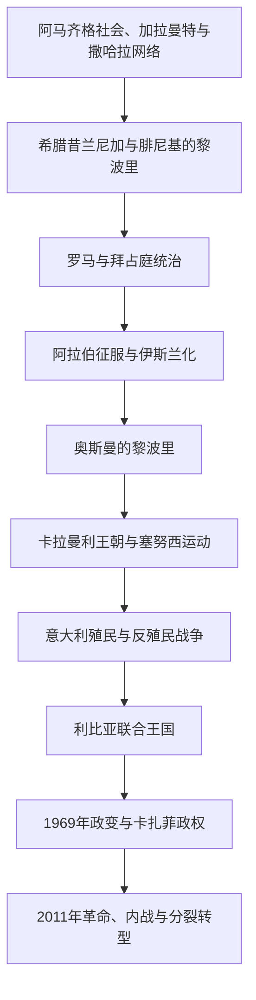

# 利比亚历史

## 概括

现代利比亚由三个历史区域组成：东部昔兰尼加、西部的黎波里塔尼亚和西南费赞。三地分别面向埃及与东地中海、马格里布与中地中海、撒哈拉商路，长期缺少统一政治中心。奥斯曼统治、意大利殖民征服和1951年联合王国建国，才逐步把三地纳入同一国家框架。

石油发现改变了国家财政和社会结构。1969年政变后卡扎菲建立个人化革命政体；2011年内战推翻旧政权，却未形成稳定统一的安全与政治体系。

## 演进图

## 历史主线

利比亚的区域差异是理解现代政治的关键。昔兰尼加的塞努西教团为独立王国提供王室与组织基础；的黎波里塔尼亚人口和城市经济更集中；费赞连接撒哈拉绿洲与萨赫勒。殖民时期的暴力统一和独立后的联邦安排都试图处理三地关系。

## 阶段导航

| 顺序 | 阶段 | 时间 | 入口 | 简要概括 |
|---:|---|---|---|---|
| 1 | 古代昔兰尼加、的黎波里塔尼亚与费赞 | 古代—1551年 | [古代昔兰尼加、的黎波里塔尼亚与费赞](/%E4%BA%BA%E6%96%87%E7%A7%91%E5%AD%A6/%E5%8E%86%E5%8F%B2/%E5%8C%97%E9%9D%9E/%E5%88%A9%E6%AF%94%E4%BA%9A/%E5%8F%A4%E4%BB%A3%E6%98%94%E5%85%B0%E5%B0%BC%E5%8A%A0%E3%80%81%E7%9A%84%E9%BB%8E%E6%B3%A2%E9%87%8C%E5%A1%94%E5%B0%BC%E4%BA%9A%E4%B8%8E%E8%B4%B9%E8%B5%9E.md) | 地中海殖民城市、罗马行省、撒哈拉王国与伊斯兰征服 |
| 2 | 奥斯曼、塞努西与意大利殖民 | 1551—1951年 | [奥斯曼、塞努西与意大利殖民](/%E4%BA%BA%E6%96%87%E7%A7%91%E5%AD%A6/%E5%8E%86%E5%8F%B2/%E5%8C%97%E9%9D%9E/%E5%88%A9%E6%AF%94%E4%BA%9A/%E5%A5%A5%E6%96%AF%E6%9B%BC%E3%80%81%E5%A1%9E%E5%8A%AA%E8%A5%BF%E4%B8%8E%E6%84%8F%E5%A4%A7%E5%88%A9%E6%AE%96%E6%B0%91.md) | 奥斯曼行省、卡拉曼利、塞努西网络、意大利征服与反抗 |
| 3 | 联合王国、卡扎菲政权与2011年后转型 | 1951年至今 | [联合王国、卡扎菲政权与2011年后转型](/%E4%BA%BA%E6%96%87%E7%A7%91%E5%AD%A6/%E5%8E%86%E5%8F%B2/%E5%8C%97%E9%9D%9E/%E5%88%A9%E6%AF%94%E4%BA%9A/%E8%81%94%E5%90%88%E7%8E%8B%E5%9B%BD%E3%80%81%E5%8D%A1%E6%89%8E%E8%8F%B2%E6%94%BF%E6%9D%83%E4%B8%8E2011%E5%B9%B4%E5%90%8E%E8%BD%AC%E5%9E%8B.md) | 联邦建国、石油国家、革命政体和长期政治分裂 |

## 重要转折与时间节点

| 时间 | 事件 | 意义 |
|---|---|---|
| 前7世纪 | 希腊人在昔兰尼加建立殖民城市 | 东部进入希腊地中海网络 |
| 前146年以后 | 罗马逐步控制沿海 | 昔兰尼加和的黎波里塔尼亚纳入帝国行省 |
| 7世纪 | 阿拉伯征服 | 伊斯兰化和阿拉伯语传播开始 |
| 1551年 | 奥斯曼占领的黎波里 | 西部沿海进入奥斯曼体系 |
| 1830年代 | 塞努西教团形成 | 昔兰尼加绿洲和商路建立宗教政治网络 |
| 1911年 | 意大利入侵 | 殖民征服和长期反抗开始 |
| 1931年 | 欧麦尔·穆赫塔尔被处决 | 昔兰尼加有组织抵抗遭重创 |
| 1951年 | 利比亚联合王国独立 | 三个历史区域首次组成主权国家 |
| 1969年 | 自由军官政变 | 君主制终结，卡扎菲政权建立 |
| 2011年 | 起义、国际干预与政权崩溃 | 国家进入武装竞争和制度分裂 |
| 2020年 | 全国性停火安排形成 | 大规模战线冻结，但统一治理仍未完成 |

## 相关笔记

- 上级：[北非历史](/%E4%BA%BA%E6%96%87%E7%A7%91%E5%AD%A6/%E5%8E%86%E5%8F%B2/%E5%8C%97%E9%9D%9E/README.md)
- 撒哈拉背景：[撒哈拉商路、游牧网络与萨赫勒联系](/%E4%BA%BA%E6%96%87%E7%A7%91%E5%AD%A6/%E5%8E%86%E5%8F%B2/%E5%8C%97%E9%9D%9E/%E6%92%92%E5%93%88%E6%8B%89%E5%95%86%E8%B7%AF%E3%80%81%E6%B8%B8%E7%89%A7%E7%BD%91%E7%BB%9C%E4%B8%8E%E8%90%A8%E8%B5%AB%E5%8B%92%E8%81%94%E7%B3%BB.md)
- 殖民比较：[殖民统治、民族主义与北非独立](/%E4%BA%BA%E6%96%87%E7%A7%91%E5%AD%A6/%E5%8E%86%E5%8F%B2/%E5%8C%97%E9%9D%9E/%E6%AE%96%E6%B0%91%E7%BB%9F%E6%B2%BB%E3%80%81%E6%B0%91%E6%97%8F%E4%B8%BB%E4%B9%89%E4%B8%8E%E5%8C%97%E9%9D%9E%E7%8B%AC%E7%AB%8B.md)

## 目录层级

- 直接上级：[北非](/%E4%BA%BA%E6%96%87%E7%A7%91%E5%AD%A6/%E5%8E%86%E5%8F%B2/%E5%8C%97%E9%9D%9E/README.md)
- 历史总览：[历史](/%E4%BA%BA%E6%96%87%E7%A7%91%E5%AD%A6/%E5%8E%86%E5%8F%B2/README.md)
