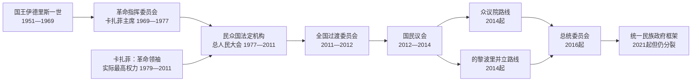

# 利比亚现代国家元首与政府首脑表

## 时间

1951年至今（核验截止：2026-07-14）

## 概括

利比亚的现代领导序列不能简化为一张“历任总统表”。1951—1969年是君主立宪制；1969—1977年由革命指挥委员会统治；1977—2011年总人民大会秘书长是法定国家代表，但穆阿迈尔·卡扎菲以“革命领袖”身份掌握实际最高权力；2011年后国家元首职能先后由全国过渡委员会、国民议会、众议院和总统委员会承担，2014年起又出现并立机构。下表按角色分别记录，重叠任期表示政治分裂，不是抄录错误。

## 君主与王位继承

| 顺序 | 君主 / 王储 | 身份与任期 | 继承关系 | 关键事件 / 备注 |
| --- | --- | --- | --- | --- |
| 1 | **伊德里斯一世**（穆罕默德·伊德里斯·塞努西，1889—1983） | 国王，1951-12-24—1969-09-01 | 塞努西教团领袖、昔兰尼加埃米尔；制宪会议推戴 | 利比亚唯一正式在位国王。1951年建立联邦王国，1963年改为单一制；1969年在国外治疗时被政变推翻。 |
| — | 哈桑·里达·塞努西（1928—1992） | 王储，1956—1969；摄政，1969-08-25—1969-09-01 | 伊德里斯侄子、指定继承人 | 国王出国治疗期间摄政；政变前原拟于9月初接受退位并继承，但政变使其从未正式即位。不能列作“哈桑一世”。 |

## 王国政府首脑完整表

| 顺序 | 首相 | 在任时间 | 与前任关系 / 关键事件 |
| --- | --- | --- | --- |
| 1 | **马哈茂德·蒙塔西尔** | 1951-03-29—1954-02-19 | 独立前先任临时政府首脑，独立后续任；处理联邦建制、英美基地与财政援助。 |
| 2 | 穆罕默德·萨基兹利 | 1954-02-19—1954-04-12 | 短任；反映宫廷与地区精英之间的政府更替。 |
| 3 | **穆斯塔法·本·哈利姆** | 1954-04-12—1957-05-26 | 推动石油勘探法、基础设施和对外关系；强化中央行政。 |
| 4 | 阿卜杜勒·马吉德·库巴尔 | 1957-05-26—1960-10-17 | 石油发现前后执政；联邦财政与地区协调压力增加。 |
| 5 | 穆罕默德·奥斯曼·赛义德 | 1960-10-17—1963-03-19 | 石油出口启动；筹备取消联邦制。 |
| 6 | 穆希丁·菲基尼 | 1963-03-19—1964-01-20 | 1963年改单一制；与宫廷冲突后去职。 |
| 7 | 马哈茂德·蒙塔西尔 | 1964-01-20—1965-03-20 | 第二次任职；石油国家能力上升。 |
| 8 | 侯赛因·马齐格 | 1965-03-20—1967-07-02 | 六日战争激化反西方示威和基地问题。 |
| 9 | 阿卜杜勒·卡迪尔·巴德里 | 1967-07-02—1967-10-25 | 短任；地区与宫廷政治持续。 |
| 10 | 阿卜杜勒·哈米德·巴库什 | 1967-10-25—1968-09-04 | 尝试行政现代化和更鲜明的利比亚国家认同。 |
| 11 | 瓦尼斯·卡扎菲 | 1968-09-04—1969-08-31 | 王国末任首相；青年军官在其任内发动政变。 |

## 1969—1977年革命政权

### 国家元首与实际最高权力

| 顺序 | 人物 | 正式职务 | 在任时间 | 实际权力与备注 |
| --- | --- | --- | --- | --- |
| 1 | **穆阿迈尔·卡扎菲** | 革命指挥委员会主席 | 1969-09-01—1977-03-02 | 自由军官发动不流血政变；废除君主制，集国家元首、军队和革命合法性于一身。 |
| — | 革命指挥委员会其他成员 | 集体决策机构 | 1969—1977 | 阿卜杜勒·萨拉姆·贾卢德等早期成员有实权，但安全机构重组、清洗和卡扎菲个人网络逐步压倒集体性。 |

### 政府首脑

| 顺序 | 政府首脑 | 在任时间 | 关键事件 / 备注 |
| --- | --- | --- | --- |
| 1 | 马哈茂德·苏莱曼·马格里比 | 1969-09-08—1970-01-16 | 政变后首任文职首相；处理外国基地撤离与旧制度过渡。 |
| 2 | **穆阿迈尔·卡扎菲** | 1970-01-16—1972-07-16 | 同时任革命指挥委员会主席；石油政策、阿拉伯统一与制度激进化。 |
| 3 | **阿卜杜勒·萨拉姆·贾卢德** | 1972-07-16—1977-03-02 | 卡扎菲亲密战友；负责石油、经济与对外谈判，后在1990年代被边缘化。 |

## 1977—2011年民众国法定国家元首

1977年《人民权力宣言》把国家形式改为“民众国”。总人民大会秘书长承担法定国家元首或国家代表职能；1979年卡扎菲辞去正式国家职位，却以“九一革命领袖和导师”掌握安全、军队、革命委员会、外交与重大政策的最终决定权。因此，法定国家元首表必须与实际最高领导表并读。

| 顺序 | 总人民大会秘书长 | 在任时间 | 关键事件 / 备注 |
| --- | --- | --- | --- |
| 1 | **穆阿迈尔·卡扎菲** | 1977-03-02—1979-03-02 | 首任秘书长；1979年辞去正式职位。 |
| 2 | 阿卜杜勒·阿提·奥贝迪 | 1979-03-02—1981-01-07 | 此前任总人民委员会秘书长；法定国家代表。 |
| 3 | 穆罕默德·扎鲁克·拉贾卜 | 1981-01-07—1984-02-15 | 后转任政府首脑。 |
| 4 | 米夫塔·乌斯塔·欧麦尔 | 1984-02-15—1990-10-07 | 1986年美国空袭期间的法定国家元首。 |
| 5 | 阿卜杜勒·拉扎克·苏萨 | 1990-10-07—1992-01-18 | 任期处于洛克比危机升级阶段。 |
| 6 | 穆罕默德·扎纳提 | 1992-01-18—2008-03-03 | 联合国制裁、解禁与对西方关系转折期间长期任职。 |
| 7 | 米夫塔·穆罕默德·卡巴 | 2008-03-03—2009-03-05 | 法定职位仍弱于革命领袖体系。 |
| 8 | 穆巴拉克·沙米赫 | 2009-03-05—2010-01-26 | 此前任政府首脑。 |
| 9 | 穆罕默德·阿布·卡西姆·兹维 | 2010-01-26—2011-08-23 | 民众国末任法定国家元首；的黎波里被反对派攻占后职位终结。 |

### 实际最高领导

| 人物 | 身份 | 任期 | 权力基础 |
| --- | --- | --- | --- |
| **穆阿迈尔·卡扎菲** | “九一革命领袖和导师”；1979年后无常规国家职位 | 1979-03-02—2011-08-23（后在苏尔特继续抵抗至2011-10-20） | 革命合法性、家族与亲信网络、安全机构、革命委员会、军队关键单位、石油分配和对外政策控制。 |

## 1977—2011年民众国政府首脑完整表

| 顺序 | 总人民委员会秘书长 | 在任时间 | 关键事件 / 备注 |
| --- | --- | --- | --- |
| 1 | 阿卜杜勒·阿提·奥贝迪 | 1977-03-02—1979-03-02 | 新制度首任政府首脑；后任法定国家元首。 |
| 2 | 贾达拉·阿祖兹·塔勒希 | 1979-03-02—1984-02-16 | 第一次任职；人民委员会体系扩张。 |
| 3 | 穆罕默德·扎鲁克·拉贾卜 | 1984-02-16—1986-03-03 | 曾任法定国家元首。 |
| 4 | 贾达拉·阿祖兹·塔勒希 | 1986-03-03—1987-03-01 | 第二次任职；美国空袭后的调整期。 |
| 5 | 欧麦尔·穆斯塔法·蒙塔西尔 | 1987-03-01—1990-10-07 | 经济开放与政策反复并存。 |
| 6 | 阿布·扎伊德·欧麦尔·杜尔达 | 1990-10-07—1994-01-29 | 洛克比制裁开始；后任情报系统负责人。 |
| 7 | 阿卜杜勒·马吉德·卡乌德 | 1994-01-29—1997-12-29 | 制裁与经济压力期。 |
| 8 | 穆罕默德·艾哈迈德·曼古什 | 1997-12-29—2000-03-01 | 洛克比嫌疑人移交和制裁暂停前后。 |
| 9 | 穆巴拉克·沙米赫 | 2000-03-01—2003-06-14 | 制度“地方化”改革与对外和解推进。 |
| 10 | **舒克里·加尼姆** | 2003-06-14—2006-03-05 | 市场化改革、放弃大规模杀伤性武器计划后对外关系改善。 |
| 11 | **巴格达迪·马哈茂迪** | 2006-03-05—2011-08-23 | 民众国末任政府首脑；2011年内战中随的黎波里政权崩溃。 |

## 2011—2014年全国过渡与国民议会

### 国家元首职能承担者

| 顺序 | 人物 | 机构与任期 | 关键事件 / 备注 |
| --- | --- | --- | --- |
| 1 | **穆斯塔法·阿卜杜勒·贾利勒** | 全国过渡委员会主席，2011-03-05—2012-08-08 | 2011年8月前是反对派机构；政权倒台后成为全国临时最高政治代表。 |
| — | 穆罕默德·阿里·萨利姆 | 国民议会临时主持，2012-08-08—08-09 | 权力交接的一日过渡，不另计正式一届。 |
| 2 | 穆罕默德·马加里夫 | 国民议会议长，2012-08-09—2013-05-28 | 因《政治隔离法》辞职。 |
| — | 朱马·艾哈迈德·阿提加 | 代理国民议会议长，2013-05-28—06-25 | 代理。 |
| 3 | 努里·阿布·萨赫曼 | 国民议会议长，2013-06-25—2014-08-04（其派系在的黎波里延续至2016-04-05） | 2014年后旧议会与新众议院争夺合法性。 |

### 政府首脑

| 顺序 | 政府首脑 | 任期 | 机构 / 关键事件 |
| --- | --- | --- | --- |
| 1 | **马哈茂德·吉卜里勒** | 2011-03-05—2011-10-23 | 全国过渡委员会执行机构负责人；8月前与卡扎菲政府并立。 |
| — | 阿里·塔尔胡尼 | 2011-10-23—2011-11-24 | 看守政府首脑。 |
| 2 | 阿卜杜勒·拉希姆·凯卜 | 2011-11-24—2012-11-14 | 临时政府；民兵整合和国家机构重建困难。 |
| 3 | 阿里·扎伊丹 | 2012-11-14—2014-03-11 | 曾被武装人员短暂绑架；石油设施封锁削弱政府。 |
| 4 | 阿卜杜拉·萨尼 | 2014-03-11起 | 先代理后正式；2014年后转为众议院一方政府首脑。 |
| — | 艾哈迈德·迈提格 | 2014-05-25—2014-06-09 | 任命程序被最高法院判无效，不视作稳定继任。 |

## 2014年以来并立国家元首机构

2014年选举后，众议院转往东部，旧国民议会阵营在的黎波里恢复活动。2015年《利比亚政治协议》建立总统委员会和民族团结政府，但众议院、东部军事力量与的黎波里机构并未完成统一。以下任期相互重叠。

| 路线 | 国家元首职能承担者 | 任期 | 地位与实际范围 |
| --- | --- | --- | --- |
| 众议院路线 | 阿布·巴克尔·拜拉 | 2014-08-04—08-05 | 众议院权力交接临时主持。 |
| 众议院路线 | **阿吉拉·萨利赫** | 众议院议长，2014-08-05至今 | 2014—2016年曾获较广国际承认；此后仍是东部立法与任命体系关键人物，但不能等同全国统一总统。 |
| 的黎波里旧国民议会路线 | 努里·阿布·萨赫曼 | 至2016-04-05 | 旧国民议会一方的法定代表，国际承认在2014年后下降。 |
| 总统委员会 / 民族团结政府 | **法耶兹·萨拉杰** | 总统委员会主席，2016-03-30—2021-03-15 | 同时任民族团结政府首脑；获联合国支持，主要控制西部。 |
| 新总统委员会 | **穆罕默德·尤尼斯·门菲** | 2021-03-15至今 | 全国政治对话论坛选出，获国际承认；总统委员会是集体国家元首机构。 |
| 东部军事实际权力 | **哈利法·哈夫塔尔** | 2014年至今 | “利比亚国民军 / 利比亚阿拉伯武装力量”总司令，控制东部并影响南部；不是依法统一选出的国家元首。 |

## 2014年以来并立政府首脑

| 路线 / 政府 | 政府首脑 | 任期 | 地位与实际范围 |
| --- | --- | --- | --- |
| 众议院政府 | 阿卜杜拉·萨尼 | 2014-08—2021-03-15 | 驻东部，2016年前后国际地位被民族团结政府取代，但继续由众议院支持。 |
| 民族救国政府 | 欧麦尔·哈西 | 2014-09-06—2015-03-31 | 旧国民议会支持，驻的黎波里。 |
| 民族救国政府 | 哈利法·加维尔 | 2015-03-31—2016-04-05；2016-10-14—2017-03-16再起 | 一度拒绝向民族团结政府交权，后仅控制的黎波里部分机构。 |
| 民族团结政府 | **法耶兹·萨拉杰** | 2016-04-05—2021-03-15 | 联合国支持；同时任总统委员会主席，主要控制西部。 |
| 统一民族政府 | **阿卜杜勒·哈米德·德贝巴** | 2021-03-15至今 | 原任务包括推动2021年选举；选举延期后拒绝向众议院另任政府交权，继续驻的黎波里并获多数国际交往承认。 |
| 国家稳定政府 | 法蒂·巴沙加 | 2022-03-03—2023-05-16 | 众议院任命；未能进驻的黎波里，后被暂停。 |
| 国家稳定政府 | **乌萨马·哈马德** | 2023-05-16至今 | 众议院支持的代理总理，驻东部；行政资源与哈夫塔尔军事体系密切相连。 |

## 截至2026-07-14的实际权力结构

| 层面 | 主要人物 / 机构 | 法理地位 | 实际情况 |
| --- | --- | --- | --- |
| 集体国家元首 | 穆罕默德·门菲领导的总统委员会 | 2021年政治对话框架产生，获国际承认 | 调解、外交和部分主权职能；缺乏统一军警和完整行政控制。 |
| 西部行政 | 德贝巴领导的统一民族政府 | 2021年获众议院信任，但任期与继任条件争议大 | 掌握的黎波里多数部委和西部财政分配；依赖复杂武装联盟。 |
| 东部立法 / 任命 | 阿吉拉·萨利赫领导的众议院 | 2014年选举产生，任期延长及程序受争议 | 支持国家稳定政府并制定选举法；与高级国家委员会反复谈判。 |
| 东部行政 | 乌萨马·哈马德领导的国家稳定政府 | 众议院任命 | 管理东部并参与灾后重建；国际承认有限。 |
| 东部与南部军事 | 哈利法·哈夫塔尔及其家族化军政网络 | 众议院体系授予总司令地位，但全国合法性有争议 | 实际控制昔兰尼加并深入费赞；军队、治安与重建资源高度集中。 |
| 协商机构 | 高级国家委员会 | 2015年政治协议设立 | 对重要任命和选举法有协商权，但内部领导争议与众议院分歧持续。 |
| 选举机构 | 国家高级选举委员会 | 全国性技术机构 | 表示具备技术准备，但统一政府、候选资格和选举法争议仍阻碍全国投票。 |

2026年6月，联合国支持的“结构化对话”完成最终报告，提出525项以上建议，覆盖治理、经济、安全和人权。它为后续政治路线图提供选项，但并未自动解除双政府、双军政体系或完成全国选举。截至核验日，2021年延期的总统和议会选举仍未举行，不能把任何过渡职位写成经全国普选获得的新任期。

## 使用本表时的辨析规则

- “国家元首职能承担者”不等于都使用“总统”称号；议长、委员会主席和集体机构的宪制来源不同。
- 卡扎菲1979年后没有常规国家职位，但仍是实际最高领导；法定总人民大会秘书长不能被忽略，也不能被误写成真正掌握最高权力。
- 2014年后的重叠表是并立政权事实：同一日期可以同时存在两个政府首脑。
- “国际承认”会随协议和外交实践变化，不等于对全国领土具有实际控制。
- 哈夫塔尔是东部军事最高权力中心，但不是全国普选国家元首；其职位须与阿吉拉·萨利赫、哈马德的法定机构分开。
- 对当前职位使用“至今”仅表示截至2026-07-14未见正式交接；不预判未来选举或协议结果。

## 演变关系

- 王国、卡扎菲与2011年后过程：[联合王国、卡扎菲政权与2011年后转型](/%E4%BA%BA%E6%96%87%E7%A7%91%E5%AD%A6/%E5%8E%86%E5%8F%B2/%E5%8C%97%E9%9D%9E/%E5%88%A9%E6%AF%94%E4%BA%9A/%E8%81%94%E5%90%88%E7%8E%8B%E5%9B%BD%E3%80%81%E5%8D%A1%E6%89%8E%E8%8F%B2%E6%94%BF%E6%9D%83%E4%B8%8E2011%E5%B9%B4%E5%90%8E%E8%BD%AC%E5%9E%8B.md)
- 前一时期的殖民行政：[意大利利比亚殖民行政首脑表](/%E4%BA%BA%E6%96%87%E7%A7%91%E5%AD%A6/%E5%8E%86%E5%8F%B2/%E5%8C%97%E9%9D%9E/%E5%88%A9%E6%AF%94%E4%BA%9A/%E6%84%8F%E5%A4%A7%E5%88%A9%E5%88%A9%E6%AF%94%E4%BA%9A%E6%AE%96%E6%B0%91%E8%A1%8C%E6%94%BF%E9%A6%96%E8%84%91%E8%A1%A8.md)
- 返回：[利比亚历史总览](/%E4%BA%BA%E6%96%87%E7%A7%91%E5%AD%A6/%E5%8E%86%E5%8F%B2/%E5%8C%97%E9%9D%9E/%E5%88%A9%E6%AF%94%E4%BA%9A/README.md)
