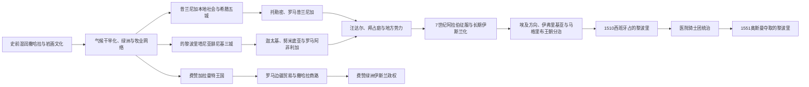

# 利比亚的古代昔兰尼加、的黎波里塔尼亚与费赞

## 时间

史前—1551年。

## 概括

现代利比亚国界把三个长期面向不同方向的历史空间结合起来：东部昔兰尼加同埃及、爱琴海和东地中海联系密切；西部的黎波里塔尼亚由奥亚、莱普蒂斯和萨布拉塔三座港口连接迦太基、马格里布和罗马；西南费赞则以绿洲、地下灌溉和撒哈拉商路为基础。古代帝国有时同时控制两段海岸，却很少把三地建成行政均匀的单一国家。

希腊和腓尼基城市并非在“无人土地”上建立，它们同本地阿马齐格及其他共同体通过贸易、战争、婚姻和土地竞争互动。加拉曼特王国也不是罗马边疆外的原始游牧群体，而是拥有绿洲农业、城镇和远程商路的撒哈拉国家。七世纪阿拉伯征服后，伊斯兰化、阿拉伯语传播与政治控制以不同速度推进；昔兰尼加常受埃及方向影响，的黎波里更多进入伊弗里基亚—马格里布体系，费赞继续连接乍得湖和萨赫勒。

## 三个历史区域

| 区域 | 主要自然与交通 | 古代中心 | 长期政治取向 |
|---|---|---|---|
| 昔兰尼加／巴尔卡 | 杰贝勒阿赫达尔高地、可耕地与东地中海港口 | 昔兰尼、阿波罗尼亚、托勒密斯、巴尔卡 | 希腊城邦、托勒密埃及、罗马克里特—昔兰尼加及后来的埃及方向政权 |
| 的黎波里塔尼亚 | 沿海平原、杰法拉、通向加达梅斯的商路 | 奥亚、莱普蒂斯大城、萨布拉塔 | 腓尼基—迦太基、罗马阿非利加、伊弗里基亚王朝与西地中海海权 |
| 费赞 | 沙漠绿洲、干河谷与跨撒哈拉通道 | 加拉马、泽维拉、穆尔祖格等不同时期中心 | 加拉曼特、绿洲王朝、商队和同乍得湖—萨赫勒政权的联系 |

## 演进图

## 史前撒哈拉与身份边界

阿卡库斯山脉和塔西利一带的岩画记录动物、狩猎、牧畜和不同生活方式，反映全新世气候从较湿润向干旱转变。图像跨越数千年，不能直接标记为后世“图阿雷格”“阿马齐格”或某一王国的作品。随着水源收缩，人口向海岸、山地、尼罗河、萨赫勒和少数绿洲集中，骆驼在较晚时期成为长距离沙漠交通的重要工具。

古典文献使用“利比亚人”等广义名称，也记录纳萨莫涅斯、马凯、加拉曼特等群体。现代“利比亚”国家名称借用了古代地理词，却不代表从史前到现代存在同一连续民族国家。

## 昔兰尼加的希腊城市

### 建立与本地互动

按希腊传统，来自锡拉岛的移民在巴图斯一世率领下于约前631年建立昔兰尼。城市位于杰贝勒阿赫达尔可耕高地，利用谷物、牲畜和药用植物“昔尔菲乌姆”等资源发展。昔兰尼、阿波罗尼亚、巴尔卡、陶刻拉和尤赫斯佩里得斯构成所谓“五城地区”，但各城并非始终接受同一政府。

殖民扩展造成同本地利比亚共同体的土地和权力冲突，也形成贸易与军事联盟。埃及法老阿普里斯曾介入但军队战败。巴图斯王朝通过德尔斐神谕、王族血统和土地分配维持权威；人口增加和贵族竞争推动制度改革，王权最终被城邦政治取代。

### 巴图斯王朝完整序列

具体起讫年在不同古代编年中略有差异，下表采用常见约年并保留“约”。

| 顺序 | 统治者 | 约在位时间 | 与前任关系 | 关键事件与备注 |
|---:|---|---|---|---|
| 1 | **巴图斯一世** | 前631—前599年 | 建城领袖 | 建立昔兰尼，成为王朝和城市奠基者 |
| 2 | 阿尔克西拉奥斯一世 | 前599—前583年 | 巴图斯一世之子 | 延续早期殖民地，史料较少 |
| 3 | **巴图斯二世** | 前583—前560年 | 阿尔克西拉奥斯一世之子 | 招募更多希腊移民，扩张引发本地联盟战争 |
| 4 | 阿尔克西拉奥斯二世 | 前560—前550年 | 巴图斯二世之子 | 王族内斗和政治危机，死于政变 |
| 5 | 巴图斯三世 | 前550—前530年 | 阿尔克西拉奥斯二世之子 | 在曼提尼亚改革者德莫纳克斯安排下限制王权、重组公民政治 |
| 6 | 阿尔克西拉奥斯三世 | 前530—约前515年 | 巴图斯三世之子 | 试图恢复王权，流亡、复位后在巴尔卡遇害；承认波斯宗主权 |
| 7 | 巴图斯四世 | 约前515—前465年 | 阿尔克西拉奥斯三世之子 | 在阿契美尼德宗主权背景下维持较长统治 |
| 8 | **阿尔克西拉奥斯四世** | 约前465—前440年 | 巴图斯四世之子 | 王朝末代；其统治结束后昔兰尼转向共和／寡头城邦政治 |

### 希腊化与罗马统治

亚历山大征服埃及后，昔兰尼加进入托勒密势力范围。托勒密将领俄斐拉斯一度自主；前3世纪，马加斯以昔兰尼国王身份实现阶段性独立。其女贝勒尼基二世与托勒密三世联姻后，区域重新并入托勒密王国。末代托勒密支系统治者将领地遗赠罗马，罗马前74年正式设省，后同克里特合为一省。

昔兰尼拥有希腊公民、本地居民、犹太社群及罗马官员等多重人口。115—117年罗马帝国东部犹太战争严重破坏城市和人口，随后重建。365年大地震及海啸、贸易变化和帝国财政压力又削弱沿海城市。不能把一次地震写成古代文明即时终结；城市、基督教主教区和乡村聚落仍延续数世纪。

## 的黎波里塔尼亚三城

### 腓尼基、迦太基与努米底亚

腓尼基商人约在前一千纪建立莱普蒂斯、奥亚和萨布拉塔等站点，控制通向内陆的商品出口。三城后来进入迦太基体系，使用布匿语言和宗教，同时同本地居民深度互动。第二次布匿战争后，马西尼萨的努米底亚一度扩张影响；前146年罗马毁灭迦太基后，三城逐步纳入罗马阿非利加。

“的黎波里塔尼亚”意为“三城之地”，是罗马时期逐渐固定的区域名。罗马起初通过地方城市精英和贡赋治理，后调整行省。海岸并非只向罗马出口：萨布拉塔连接加达梅斯商路，莱普蒂斯同撒哈拉、马格里布和东方均有往来。

### 罗马繁荣

莱普蒂斯大城在公元二、三世纪达到高峰。出生当地的塞普蒂米乌斯·塞维鲁193年成为皇帝后，扩建港口、论坛、柱廊和纪念建筑，使城市成为罗马北非最宏伟的中心之一。萨布拉塔以港口、剧场和内陆贸易繁荣，奥亚则在后世延续为的黎波里。

繁荣依靠地中海航运、本地农业、税收、帝国建筑投资和内陆商路，不是皇帝个人恩赐的单一结果。港口淤积、商路变化、政治战争和地震在晚期削弱城市，但莱普蒂斯并未在塞维鲁王朝结束时突然废弃。

## 加拉曼特与费赞

### 国家与灌溉

加拉曼特约在前一千纪中叶后形成以加拉马及费赞绿洲为中心的政治体系。地下渠道即“福加拉”把古地下水引向农田，使沙漠中能够种植椰枣、谷物和其他作物。渠道建设需要大量劳动、技术和权力协调，也会逐渐消耗不可快速补充的地下水。

考古发现城镇、墓葬和工艺生产，表明加拉曼特不是无定居点的游牧部落。其统治范围和君主名单缺乏连续文献，不能伪造完整王表；更适合描述为多个绿洲中心在特定时期由强王权或精英网络整合。

### 罗马关系与跨撒哈拉网络

罗马文献常强调加拉曼特袭击边疆。前19年科尔内利乌斯·巴尔布斯率军远征费赞，罗马后续也以堡垒和军事行动施压。但战争之外，陶器、玻璃、金属和非洲内陆商品显示双方持续贸易。加拉曼特控制或参与通向乍得湖、尼日尔河方向的路线，交易盐、牲畜、象牙和被奴役人口。

用“加拉曼特垄断跨撒哈拉黄金贸易”会超出证据；古代路线规模、具体商品和中转者仍有争论。约公元六、七世纪以后，地下水、商路和政治环境变化使旧中心衰落，费赞绿洲社会则在伊斯兰时期以新王朝和商镇继续存在。

## 汪达尔与拜占庭时期

439年汪达尔占领迦太基后控制的黎波里塔尼亚部分海岸，昔兰尼加仍更多属于东罗马体系。汪达尔海权并未让其有效统治所有沙漠和山地。533—534年，查士丁尼军队灭亡汪达尔王国，拜占庭在莱普蒂斯等地恢复堡垒、教堂和行政。

拜占庭资源集中于城市、港口和要塞，地方阿马齐格政治体控制广阔内陆。六、七世纪的利比亚不是一个完整“拜占庭省”被一次性替换，而是帝国据点、主教区、本地首领和绿洲网络并存。

## 阿拉伯征服与长期伊斯兰化

### 征服过程

约642年，阿姆尔·伊本·阿斯的军队从埃及进入巴尔卡，随后攻取的黎波里。643年前后达成的降服和纳贡安排并未立刻带来密集行政。乌克巴·伊本·纳菲等后来向费赞和马格里布推进，具体远征路线在后世史料中有争议。沿海驻军、税收和新城逐渐建立，本地基督教和阿马齐格共同体仍长期存在。

昔兰尼加常由埃及总督体系治理，的黎波里塔尼亚更多随伊弗里基亚政权变化。伊斯兰作为统治和贸易网络扩展，阿拉伯语随城市、宗教教育、行政、部族迁移和通婚逐步传播；不能以征服年份代替社会完成伊斯兰化的年份。

### 中世纪政权

| 地区／政权 | 大致时期 | 统治机制 | 主要影响 |
|---|---|---|---|
| 倭马亚、阿拔斯总督 | 7—9世纪 | 驻军、税收与地方盟约 | 把沿海接入哈里发政治，控制强度不均 |
| 阿格拉布王朝 | 800—909年 | 名义奉阿拔斯，凯鲁万中心 | 的黎波里进入伊弗里基亚财政、海军和商贸体系 |
| 法蒂玛与齐里德 | 10—12世纪 | 什叶派哈里发及其地方代理，后齐里德独立 | 沿海与埃及、伊弗里基亚关系重组 |
| 巴努·哈兹伦／地方首领 | 10—12世纪 | 的黎波里地方王族和部族联盟 | 在大王朝间取得阶段性自主 |
| 泽维拉巴努·哈塔卜 | 约10—12世纪 | 费赞绿洲王朝、商队税收 | 连接北非、乍得湖和萨赫勒 |
| 诺曼西西里占领 | 1146—1158年 | 海军占领和贡赋 | 控制的黎波里等港口，后被穆瓦希德取代 |
| 穆瓦希德与哈夫斯 | 12—16世纪 | 马格里布帝国及突尼斯地方王朝 | 主要影响的黎波里塔尼亚，内陆依赖地方首领 |
| 埃及方向王朝 | 中世纪多阶段 | 巴尔卡的军事、税收和朝觐路线 | 昔兰尼加受法蒂玛、阿尤布和马穆鲁克埃及不均衡影响 |

十一世纪希拉勒、苏莱姆等阿拉伯部族迁入改变牧业、语言和政治联盟。变化持续数代，并同王朝战争、气候和商路结合，不能写成一次“阿拉伯入侵摧毁全部城市”。

## 十六世纪海权转折

西班牙于1510年攻占的黎波里，试图把北非沿岸据点纳入反奥斯曼防线。1530年，查理五世把的黎波里交给圣约翰医院骑士团。骑士团依赖要塞和海路，难以控制广阔内陆，又不断受到奥斯曼海军和地方力量压力。

1551年，奥斯曼将领西南帕夏与图尔古特·雷斯围攻的黎波里，迫使医院骑士团投降。此举结束西班牙—骑士团阶段，建立奥斯曼行省中心，但并未同时征服昔兰尼加和全部费赞；后续统治仍需通过地方部族、绿洲王朝与商路逐步建立关系。

## 重要事件

| 时间 | 事件 | 结果与意义 |
|---|---|---|
| 史前全新世 | 阿卡库斯岩画与气候转型 | 记录湿润撒哈拉向沙漠化及生计变化，不能直接归属后世民族 |
| 约前7世纪 | 昔兰尼与腓尼基三城建立 | 东、西沿海分别进入希腊和布匿地中海网络 |
| 约前631—前440年 | 巴图斯王朝 | 昔兰尼王权经扩张、改革和贵族竞争转为城邦政治 |
| 前19年 | 罗马远征加拉曼特 | 体现边疆冲突，也未终止费赞—罗马贸易 |
| 1—3世纪 | 罗马沿海城市繁荣 | 莱普蒂斯在塞维鲁时期扩建，昔兰尼和三城进入帝国市场 |
| 115—117年 | 昔兰尼加犹太战争 | 城市与人口遭严重破坏，随后由罗马重建 |
| 365年 | 地震与海啸 | 打击昔兰尼加和的黎波里塔尼亚港城，但非文明即时终结 |
| 439年 | 汪达尔控制西部沿海 | 西罗马行省瓦解，东部和内陆发展不同 |
| 533—534年 | 拜占庭征服汪达尔 | 恢复部分沿海行政和要塞，内陆控制仍有限 |
| 642—643年 | 阿拉伯军队进入巴尔卡和的黎波里 | 开启长期伊斯兰化、阿拉伯语传播和政治重组 |
| 909年以后 | 法蒂玛—齐里德更替 | 沿海连接埃及与伊弗里基亚，地方首领保持空间 |
| 1146—1158年 | 诺曼西西里短期占领 | 地中海海权控制港口，后被穆瓦希德恢复 |
| 1510—1530年 | 西班牙及医院骑士团控制的黎波里 | 北非港口成为哈布斯堡—奥斯曼竞争前线 |
| 1551年 | 奥斯曼攻取的黎波里 | 西部进入奥斯曼体系，下一阶段开始 |

## 兴衰与历史辨析

### 崛起机制

- 昔兰尼依靠高地农业、港口和希腊—本地网络发展，王朝又以移民和宗教正统扩张。
- 三城控制沿海与撒哈拉商路出口，罗马帝国市场和本地精英合作推动繁荣。
- 加拉曼特以地下灌溉、绿洲劳动和跨沙漠交通建立国家，而非仅靠掠夺。

### 衰落与直接转折

- 巴图斯王朝受贵族、公民制度和王族斗争削弱，约前440年最后一王被推翻；城市并未随王朝消失。
- 罗马城市衰落由贸易、港口淤积、地震、战争和帝国财政共同造成，汪达尔或阿拉伯征服都不是唯一原因。
- 加拉曼特旧中心面对地下水消耗、商路和政治变化，伊斯兰时期费赞以新绿洲政权延续。
- 中世纪的黎波里反复被大王朝和海军势力争夺，1551年奥斯曼胜利是西班牙—骑士团控制的直接终点。

### 易混点

- “昔兰尼加”“的黎波里塔尼亚”“费赞”是历史地理区，不是三个从古代连续到现代、边界固定的民族国家。
- 希腊、腓尼基和罗马城市都依赖本地劳作、商路与政治关系，“殖民城市”不等于与非洲腹地隔绝。
- 加拉曼特统治者姓名缺乏连续可靠记录；没有完整证据时标“不详”比编造王表更符合世系契约。
- 阿拉伯征服不等于阿马齐格人口消失；许多本地社会通过伊斯兰、阿拉伯语与原有亲属制度形成新身份。
- “利比亚”作为统一国家框架主要形成于殖民末期和1951年独立，不能倒置到古代。

## 演变关系

- 上级：[利比亚历史](/%E4%BA%BA%E6%96%87%E7%A7%91%E5%AD%A6/%E5%8E%86%E5%8F%B2/%E5%8C%97%E9%9D%9E/%E5%88%A9%E6%AF%94%E4%BA%9A/README.md)
- 后一阶段：[奥斯曼、塞努西与意大利殖民](/%E4%BA%BA%E6%96%87%E7%A7%91%E5%AD%A6/%E5%8E%86%E5%8F%B2/%E5%8C%97%E9%9D%9E/%E5%88%A9%E6%AF%94%E4%BA%9A/%E5%A5%A5%E6%96%AF%E6%9B%BC%E3%80%81%E5%A1%9E%E5%8A%AA%E8%A5%BF%E4%B8%8E%E6%84%8F%E5%A4%A7%E5%88%A9%E6%AE%96%E6%B0%91.md)
- 地中海背景：[迦太基](/%E4%BA%BA%E6%96%87%E7%A7%91%E5%AD%A6/%E5%8E%86%E5%8F%B2/%E5%8C%97%E9%9D%9E/_%E9%80%9A%E5%8F%B2/%E8%BF%A6%E5%A4%AA%E5%9F%BA/README.md)
- 撒哈拉背景：[撒哈拉商路、游牧网络与萨赫勒联系](/%E4%BA%BA%E6%96%87%E7%A7%91%E5%AD%A6/%E5%8E%86%E5%8F%B2/%E5%8C%97%E9%9D%9E/_%E9%80%9A%E5%8F%B2/%E6%92%92%E5%93%88%E6%8B%89%E5%95%86%E8%B7%AF%E3%80%81%E6%B8%B8%E7%89%A7%E7%BD%91%E7%BB%9C%E4%B8%8E%E8%90%A8%E8%B5%AB%E5%8B%92%E8%81%94%E7%B3%BB.md)
