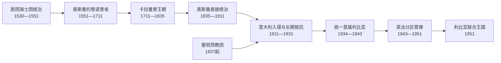

# 奥斯曼、塞努西与意大利殖民

## 时间

1551—1951年

## 概括

1551年奥斯曼帝国夺取的黎波里，结束医院骑士团统治。此后三个半世纪并非一条单纯的“土耳其统治线”：沿海的奥斯曼帕夏、禁卫军和海上武装，内陆的部族与绿洲网络，以及18—19世纪的卡拉曼里家族、塞努西教团分别掌握不同层次的权力。1911年意大利入侵后，殖民主权宣称与实际控制长期脱节；直到法西斯政权以强制迁徙、集中营、处决和土地殖民压服主要抵抗，三大地区才被纳入统一殖民行政。第二次世界大战摧毁意大利统治，英法分区管理又成为1951年统一独立的前奏。

## 奥斯曼征服与早期省政

### 建立背景

- 1510年西班牙占领的黎波里，1530年又把城堡和马耳他交给医院骑士团。骑士团的控制主要集中在港城，难以整合周边部族和内陆商路。
- 奥斯曼帝国在16世纪中叶向西地中海扩张，海军将领图尔古特·雷斯与西南欧穆斯林海上力量把的黎波里视为连接埃及、突尼斯和阿尔及尔的战略据点。
- 1551年奥斯曼军攻克的黎波里，设的黎波里塔尼亚省。帕夏由苏丹任命，但远离伊斯坦布尔、财政依靠地方税收与海上劫掠，使地方军人集团很快获得自主性。

### 统治结构

| 层级 | 主要角色 | 权力基础 | 实际限制 |
| --- | --- | --- | --- |
| 帝国中央 | 苏丹、帝国政府 | 任命帕夏、赋予法理与军籍 | 距离遥远，难以持续监督地方军队和财政。 |
| 省级行政 | 帕夏及其文官 | 港城税收、司法、外交名义 | 经常受禁卫军军官和海上首领制约。 |
| 军事集团 | 禁卫军、戴伊、海军首领 | 武装、船队、赎金与战利品 | 内部分裂，容易通过兵变废立帕夏。 |
| 地方社会 | 部族首领、城市名流、绿洲家族 | 土地、商路、保护关系与宗教权威 | 对港城政治影响不一，内陆常保持高度自治。 |

16—17世纪的黎波里成为“巴巴里诸邦”之一。海上劫掠、保护费和俘虏赎金既为军政集团提供收入，也不断引发欧洲海军报复。1680年代法国炮击的黎波里，显示这种财政模式面对强化中的欧洲海军时越来越脆弱。

## 卡拉曼里王朝

### 崛起机制

1711年，骑兵军官艾哈迈德·卡拉曼里利用禁卫军内斗夺取权力，迫使奥斯曼中央承认其帕夏职位。王朝仍在名义上效忠苏丹、使用奥斯曼官号，却以父子或家族继承建立事实上的地方世袭政权。它的崛起依靠四项资源：

1. 控制的黎波里港和海关；
2. 在禁卫军、地方骑兵与部族之间分配利益；
3. 以朝贡、保护费和海上武装维持外交收入；
4. 通过与内陆商队和费赞通道的联系扩大税源。

### 完整统治顺序

| 顺序 | 统治者 | 在位 | 与前任关系 | 关键事件 / 备注 |
| --- | --- | --- | --- | --- |
| 1 | **艾哈迈德·卡拉曼里** | 1711—1745 | 王朝建立者 | 镇压军中对手，取得奥斯曼承认；重建地方财政并扩大海上势力。 |
| 2 | 穆罕默德·卡拉曼里 | 1745—1754 | 艾哈迈德之子 | 延续家族统治；中央权威仍依赖军队与部族协商。 |
| 3 | 阿里一世·卡拉曼里 | 1754—1793 | 穆罕默德之子 | 长期统治后出现财政紧张和继承内斗；其子之间的冲突削弱政权。 |
| — | 阿里·布尔古勒 | 1793—1795 | 外来篡位者，非卡拉曼里家族 | 借阿尔及尔与奥斯曼关系夺取的黎波里；卡拉曼里家族在外援下复位。 |
| 4 | **优素福·卡拉曼里** | 1795—1832 | 阿里一世之子 | 通过政变和杀兄巩固权力；与美国发生第一次巴巴里战争；后期债务、反抗和继承危机加深。 |
| 5 | 阿里二世·卡拉曼里 | 1832—1835 | 优素福之子 | 在内战和部族反抗中继位；无力稳定财政与军队，奥斯曼中央出兵终结世袭统治。 |

### 重要事件

- **1793—1795年篡位与复位**：阿里·布尔古勒一度驱逐卡拉曼里家族，显示王朝仍受奥斯曼—阿尔及尔区域政治影响。优素福后来在突尼斯支持下复位。
- **第一次巴巴里战争（1801—1805）**：优素福要求提高美国船只保护费，美国拒绝后开战。1805年美国支持优素福之兄哈米特，从埃及经陆路攻占德尔纳；和平条约使优素福继续在位，但美国不再接受其新增贡金要求。
- **第二次巴巴里战争余波（1815）**：美国舰队迫使阿尔及尔、突尼斯和的黎波里放弃对美国的贡金要求，海上保护费体系进一步失去可持续性。
- **财政与部族危机**：欧洲海军优势扩大、海上收入下降，而宫廷债务和征税上升，费赞及内陆部族反抗频繁。
- **1832—1835年继承内战**：优素福退位给阿里二世后，各派仍争夺王位。奥斯曼中央以恢复秩序、防止欧洲势力介入为由派军，1835年废除卡拉曼里政权。

### 兴盛、衰落与灭亡原因

| 类型 | 因素 |
| --- | --- |
| 兴盛条件 | 港口与跨撒哈拉商路位置；名义奥斯曼合法性；地方世袭带来的政策连续；海上保护费和赎金收入。 |
| 结构性衰落 | 财政过度依赖海上武装；家族继承缺乏稳定规则；中央军、部族和宫廷之间利益冲突。 |
| 外部压力 | 欧洲与美国海军力量上升；海上奴役和贡金体系遭军事打击；法国占领阿尔及利亚后奥斯曼更重视北非边疆。 |
| 直接触发 | 优素福晚年债务与内乱、1832年退位后的继承战争，使奥斯曼出兵有了窗口。 |
| 终结方式 | 1835年奥斯曼军进入的黎波里，逮捕或流放家族成员，恢复中央任命总督。 |

## 奥斯曼直接统治与塞努西教团

### 1835年后的省政重建

奥斯曼帝国恢复直接统治后，先以军队平定的黎波里塔尼亚和费赞反抗，随后把坦志麦特改革逐步带入沿海：重组税收、法院、土地登记、征兵和行政区。1864年前后改称的黎波里塔尼亚州。改革增强了港城与部分绿洲的官僚联系，却始终无法把部族协商、宗教网络和跨撒哈拉商路完全纳入常规行政。

费赞尤其重要：它是通往乍得湖盆地和苏丹草原的商路节点。奥斯曼驻军能控制塞卜哈、迈尔祖格等据点，却常须依靠地方家族征税、维持水源和调解商队冲突。19世纪后期，欧洲殖民势力从阿尔及利亚、突尼斯、埃及和乍得方向逼近，帝国才加强边境驻军。

### 塞努西教团的形成与扩展

穆罕默德·本·阿里·塞努西来自阿尔及利亚，曾在麦加求学，1837年建立第一座扎维耶。因与奥斯曼—埃及宗教政治环境摩擦，他把中心转向昔兰尼加，最终在贾格布卜建立总部。塞努西网络把宗教教育、司法调解、农业定居、商队接待和部族联盟结合起来，在国家行政薄弱的沙漠形成跨绿洲秩序。

| 顺序 | 领袖 | 任期 | 与前任关系 | 关键事件 / 备注 |
| --- | --- | --- | --- | --- |
| 1 | **穆罕默德·本·阿里·塞努西“大塞努西”** | 1837—1859 | 创立者 | 建立扎维耶网络；将中心由汉志转至昔兰尼加，强调宗教革新、调解与沙漠社会组织。 |
| 2 | **穆罕默德·马赫迪·塞努西** | 1859—1902 | 创立者之子 | 大幅扩展至费赞、乍得和撒哈拉商路；1890年代把中心移至库夫拉，避开殖民压力。 |
| 3 | **艾哈迈德·谢里夫·塞努西** | 1902—1916 | 马赫迪之侄 | 领导对法国在中非扩张及对意大利入侵的抵抗；第一次世界大战中与奥斯曼及同盟国合作进攻英属埃及，失败后交出政治领导权。 |
| 4 | **穆罕默德·伊德里斯·塞努西** | 1916—1951 | 艾哈迈德·谢里夫堂弟、马赫迪之子 | 与英国和意大利谈判，获承认为昔兰尼加埃米尔；1922年流亡埃及，二战时支持盟军；1949年恢复埃米尔国，1951年成为国王。 |

塞努西“继承”不是普通王朝父子表：前两代以教团宗教权威为核心，艾哈迈德·谢里夫与伊德里斯的交接同时是战争战略与政治领导权转移。伊德里斯后来把宗教—部族合法性转化为埃米尔权和国家王权。

### 奥斯曼统治为何失去利比亚

- **军事与财政边缘性**：帝国要同时应对巴尔干危机、债务和列强干预，难以在北非维持与意大利海军对等的力量。
- **行政渗透不均**：沿海制度改革较深，昔兰尼加和费赞仍依赖地方网络；这既限制奥斯曼动员，也给后来的抵抗提供社会组织。
- **国际孤立**：意大利先取得列强默许，再于1911年以保护侨民和“文明使命”等借口发动战争。
- **海上劣势**：意军迅速炮击和占领沿海港口，奥斯曼难以跨地中海增援，只能由少量军官经埃及秘密进入内陆组织抵抗。
- **巴尔干战争压力**：1912年巴尔干战争迫近，奥斯曼政府选择签署乌希和约撤出正规军；但地方抵抗并未因此结束。

## 意大利入侵与殖民战争

### 1911—1922年：占领沿海，内陆抵抗

1911年9月意大利向奥斯曼帝国发出最后通牒，10月登陆的黎波里、班加西、德尔纳等港口。意方预期快速接管，却在沙拉沙特等战斗中遭奥斯曼军官与地方武装反击。意军对平民实施报复和驱逐，战争从港城争夺转为长期殖民战争。

1912年乌希和约要求奥斯曼撤军，但保留苏丹作为哈里发的宗教影响和地方自治安排的模糊空间。许多奥斯曼军官离开后，塞努西和地方首领继续作战。第一次世界大战期间，意军几乎退守少数沿海据点：

- 昔兰尼加由塞努西领导，1917年后英国调停促成协议；
- 的黎波里塔尼亚地方领袖于1918年宣布共和国，是阿拉伯世界较早的共和尝试之一；
- 费赞控制反复，意大利驻军与地方反抗之间没有稳定边界。

1919年意大利曾颁布自治法规，承认地方议会与有限公民权；阿克拉马等协议又承认伊德里斯的埃米尔地位。自治并非真正平等安排，但反映意大利当时无力完成征服。

### 1922—1931年：法西斯“重新征服”

墨索里尼上台后废弃妥协路线。殖民军凭借飞机、装甲车、道路网和部族分化，先压服的黎波里塔尼亚，再集中进攻昔兰尼加和费赞。欧麦尔·穆赫塔尔依靠绿山地区的小股骑兵、部族补给和熟悉地形持续游击战。

殖民镇压的关键机制包括：

1. 把绿山农村人口强制迁入沿海集中营，切断游击队粮食、情报与人员来源；
2. 关闭埃及边境并修筑铁丝网，阻断跨境补给；
3. 没收牲畜和土地，破坏原有生计；
4. 以集体惩罚、军事法庭、公开绞刑和空中轰炸制造恐惧；
5. 把“投降部族”编入辅助力量，瓦解抵抗联盟。

1931年欧麦尔·穆赫塔尔负伤被俘，经军事法庭迅速判处绞刑。其死没有使所有零星抵抗立即消失，却标志昔兰尼加有组织游击战被压垮。死亡人数和集中营人口在不同研究中估计不一，但强迁、饥饿、疾病和处决造成的大规模平民死亡并无争议。

### 1934—1943年：统一殖民地与战争崩溃

1934年意大利把的黎波里塔尼亚、昔兰尼加和费赞合并为“意属利比亚”。总督伊塔洛·巴尔博推动沿海公路、城市建设、航空与灌溉项目，并组织数万意大利移民定居。殖民建设的另一面是土地剥夺、种族化公民等级和对利比亚劳动力的差别管理；基础设施主要服务军队、移民农业和帝国展示。

详细行政首脑序列见[意大利利比亚殖民行政首脑表](/%E4%BA%BA%E6%96%87%E7%A7%91%E5%AD%A6/%E5%8E%86%E5%8F%B2/%E5%8C%97%E9%9D%9E/%E5%88%A9%E6%AF%94%E4%BA%9A/%E6%84%8F%E5%A4%A7%E5%88%A9%E5%88%A9%E6%AF%94%E4%BA%9A%E6%AE%96%E6%B0%91%E8%A1%8C%E6%94%BF%E9%A6%96%E8%84%91%E8%A1%A8.md)。

1940年意大利从利比亚进攻英属埃及，北非战场随即在昔兰尼加和的黎波里塔尼亚反复拉锯。英军、意军和德国非洲军团多次占领同一城市，造成交通设施破坏、征用和人口流离。1942年阿拉曼战役后轴心军西撤，1943年初盟军占领全境，意大利殖民统治在军事失败中终结。

## 1943—1951年：分区管理与统一独立

### 英法占领结构

- 英国管理的黎波里塔尼亚和昔兰尼加，保留部分意大利法律和技术人员，同时培训本地文官；
- 法国从乍得北进，管理费赞—加达米斯，并依靠赛义夫·纳斯尔家族等地方精英；
- 伊德里斯及塞努西力量在二战中支持英国，组建利比亚阿拉伯部队，战后因此拥有强势谈判地位；
- 1949年英国支持恢复昔兰尼加埃米尔国，而的黎波里塔尼亚民族主义者更担心地区分裂与君主集中。

1947年对意和约使意大利正式放弃殖民权。列强一度讨论把三地区分别交由英、法、意托管，引发利比亚反对。1949年联合国大会决定利比亚最迟于1952年1月1日前独立，并任命专员协调三地区代表制宪。1951年12月24日，三地区以联邦方式组成利比亚联合王国。

### 殖民统治终结的原因

| 类型 | 因素 |
| --- | --- |
| 结构因素 | 殖民国家依赖暴力与移民特权，未能建立被多数利比亚人认同的合法秩序。 |
| 外部压力 | 第二次世界大战改变地中海力量格局；反殖民原则、阿拉伯民族主义和联合国制度提供新政治空间。 |
| 直接触发 | 轴心国在北非战败，1943年意大利行政机构随军队撤退或被盟军接管。 |
| 转型机制 | 1947年意大利放弃权利；1949年联合国规定独立时限；三地区代表通过制宪会议达成联邦君主制妥协。 |
| 历史遗产 | 殖民边界把三个差异显著的地区合为一体；强迁、土地占有、地区行政分裂和塞努西—英国合作共同塑造独立后的权力结构。 |

## 重要事件

| 时间 | 事件 | 过程与转折 | 长期影响 |
| --- | --- | --- | --- |
| 1551 | 奥斯曼攻占的黎波里 | 击败医院骑士团，建立奥斯曼省 | 将沿海纳入伊斯兰帝国与西地中海政治网络。 |
| 1711 | 卡拉曼里夺权 | 艾哈迈德借军中内斗建立世袭政权 | 地方自主性提高，但继承和财政问题累积。 |
| 1801—1805 | 第一次巴巴里战争 | 优素福与美国因贡金冲突；德尔纳战役成为转折 | 海上保护费模式开始遭新海军力量系统挑战。 |
| 1835 | 奥斯曼恢复直辖 | 卡拉曼里内战后中央出兵 | 坦志麦特式省政重建，也为塞努西网络扩张留下空间。 |
| 1837以后 | 塞努西教团形成 | 扎维耶连接宗教、商路和部族调解 | 成为昔兰尼加抵抗与王国合法性的组织基础。 |
| 1911—1912 | 意土战争 | 意军占港，奥斯曼和地方武装抵抗；和约后战争地方化 | 殖民战争持续近二十年，不能以1912年视为“征服完成”。 |
| 1918 | 的黎波里塔尼亚共和国 | 地方领袖建立集体共和政权 | 展示西部不同于塞努西埃米尔制的政治路线。 |
| 1929—1931 | 强迁与集中营 | 法西斯军政切断游击队社会基础，处死穆赫塔尔 | 造成深重人口与社会创伤，成为民族记忆核心。 |
| 1934 | 意属利比亚统一 | 三地区纳入单一总督府 | 固化现代边界，但未消除地区差异。 |
| 1943 | 意大利统治崩溃 | 盟军占领全境，英法分区管理 | 把利比亚问题带入战后国际安排。 |
| 1949—1951 | 联合国独立进程 | 否决分区托管，制宪会议达成联邦方案 | 诞生联合国推动下的独立国家。 |

## 演变关系

- 前一阶段：[古代昔兰尼加、的黎波里塔尼亚与费赞](/%E4%BA%BA%E6%96%87%E7%A7%91%E5%AD%A6/%E5%8E%86%E5%8F%B2/%E5%8C%97%E9%9D%9E/%E5%88%A9%E6%AF%94%E4%BA%9A/%E5%8F%A4%E4%BB%A3%E6%98%94%E5%85%B0%E5%B0%BC%E5%8A%A0%E3%80%81%E7%9A%84%E9%BB%8E%E6%B3%A2%E9%87%8C%E5%A1%94%E5%B0%BC%E4%BA%9A%E4%B8%8E%E8%B4%B9%E8%B5%9E.md)
- 本阶段内部主线：奥斯曼省政 → 卡拉曼里世袭统治 → 奥斯曼直辖与塞努西扩张 → 意大利殖民战争 → 英法分区管理。
- 殖民行政专表：[意大利利比亚殖民行政首脑表](/%E4%BA%BA%E6%96%87%E7%A7%91%E5%AD%A6/%E5%8E%86%E5%8F%B2/%E5%8C%97%E9%9D%9E/%E5%88%A9%E6%AF%94%E4%BA%9A/%E6%84%8F%E5%A4%A7%E5%88%A9%E5%88%A9%E6%AF%94%E4%BA%9A%E6%AE%96%E6%B0%91%E8%A1%8C%E6%94%BF%E9%A6%96%E8%84%91%E8%A1%A8.md)
- 后一阶段：[联合王国、卡扎菲政权与2011年后转型](/%E4%BA%BA%E6%96%87%E7%A7%91%E5%AD%A6/%E5%8E%86%E5%8F%B2/%E5%8C%97%E9%9D%9E/%E5%88%A9%E6%AF%94%E4%BA%9A/%E8%81%94%E5%90%88%E7%8E%8B%E5%9B%BD%E3%80%81%E5%8D%A1%E6%89%8E%E8%8F%B2%E6%94%BF%E6%9D%83%E4%B8%8E2011%E5%B9%B4%E5%90%8E%E8%BD%AC%E5%9E%8B.md)
- 返回：[利比亚历史总览](/%E4%BA%BA%E6%96%87%E7%A7%91%E5%AD%A6/%E5%8E%86%E5%8F%B2/%E5%8C%97%E9%9D%9E/%E5%88%A9%E6%AF%94%E4%BA%9A/README.md)
