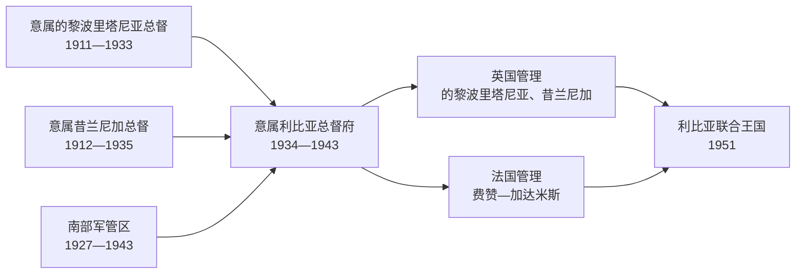

# 意大利利比亚殖民行政首脑表

## 时间

1911—1951年（意大利入侵、殖民统治与盟军分区管理）

## 概括

本表把意大利在的黎波里塔尼亚、昔兰尼加和南部军管区的行政首脑，与1943年后的英法占领机构分开排列。它记录的是殖民或占领行政职位，并不意味着这些官员在任内始终实际控制全境：1911—1931年间，意大利的法理宣称长期大于其军事控制范围；昔兰尼加塞努西抵抗、的黎波里塔尼亚地方政权和费赞反抗都曾使殖民统治局限于沿海城市或交通线。

## 的黎波里塔尼亚殖民行政首脑

早期“远征军司令”“保护地总督”和后来的殖民地总督在制度上并不完全相同。下表按实际交接顺序连续列出；同一人在职位改名或法定地位改变前后仍连续任职时合并说明。

| 顺序 | 行政首脑 | 职务与在任时间 | 关键事件 / 备注 |
| --- | --- | --- | --- |
| 1 | 拉斐尔·博雷亚·里奇·德奥尔莫 | 远征军司令，1911-10-05—1911-10-13 | 率先占领的黎波里港区；控制范围尚限于登陆场。 |
| 2 | 卡洛·卡内瓦 | 远征军司令、保护地总督，1911-10-13—1912-09-02 | 指挥战争初期行动；意大利宣布吞并并与奥斯曼帝国作战。 |
| 3 | 奥塔维奥·拉尼 | 总督，1912-09-02—1913-06-02 | 1912年和约后继续对地方抵抗作战。 |
| 4 | 温琴佐·加里奥尼 | 总督，1913-06-02—1914-10-01 | 尝试把占领区向内陆扩展；第一次世界大战前局势仍不稳。 |
| 5 | 乔治·奇利亚纳 | 总督，1914-10-02—1914-11-16 | 任期短；大战与地方反攻使意军收缩。 |
| 6 | 路易吉·德鲁埃蒂 | 总督，1914-11-16—1915-02-05 | 意军实际控制迅速退回若干沿海据点。 |
| 7 | 朱利奥·切萨雷·塔索尼 | 总督，1915-02-05—1915-07-15 | 的黎波里塔尼亚起义扩大，殖民行政难以深入内陆。 |
| 8 | 乔瓦尼·阿梅利奥 | 总督，1915-07-15—1918-08-08 | 与昔兰尼加职位一度重叠；主要维持沿海据点。 |
| 9 | 温琴佐·加里奥尼 | 总督，1918-08-08—1919-08-08 | 第二次任职；战后寻求以自治协议恢复影响。 |
| 10 | 维托里奥·门青格尔 | 总督，1919-08-08—1920-07-10 | 第一位文职色彩较强的总督；面对的黎波里塔尼亚共和国及自治谈判。 |
| 11 | 乌戈·尼科利 | 代理总督，1920-07-11—1920-07-31 | 过渡任职。 |
| 12 | 路易吉·梅尔卡泰利 | 总督，1920-08-01—1921-07-16 | 改革委员会和地方派系并存，意方控制仍有限。 |
| 13 | 爱德华多·巴卡里 | 代理总督，1921-07-17—1921-08-24 | 过渡任职；后来短任昔兰尼加总督。 |
| 14 | **朱塞佩·沃尔皮** | 总督，1921-08-24—1925-07-03 | 发动重新征服的黎波里塔尼亚；1922年法西斯上台后军事压服加速。 |
| 15 | 埃米利奥·德博诺 | 总督，1925-07-03—1928-12-18 | 将征服推进至内陆，强化军政统治。 |
| 16 | **彼得罗·巴多格里奥** | 的黎波里塔尼亚及昔兰尼加总督，1928-12-18—1933-12-31 | 两区行政趋于合并；批准大规模强制迁徙、集中营和反游击政策。 |

> 个别早期交接日因“军事指挥权”“民政职位”和殖民地法定改制口径不同，会相差数日；表中采用行政职位连续性的常见口径。

## 昔兰尼加殖民行政首脑

| 顺序 | 行政首脑 | 职务与在任时间 | 关键事件 / 备注 |
| --- | --- | --- | --- |
| 1 | 奥塔维奥·布里科拉 | 总督，1912-09-02—1913-11-06 | 意军占领班加西等沿海点，但内陆由塞努西网络和部族力量掌握。 |
| 2 | 乔瓦尼·阿梅利奥 | 总督，1913-11-06—1918-08-08 | 大战期间意军控制收缩；与塞努西领导层谈判。 |
| 3 | 温琴佐·加里奥尼 | 代理、继任总督，1918-08-08—1919-07-01 | 1919年殖民地地位调整前后的过渡管理。 |
| 4 | 贾科莫·德马蒂诺 | 总督，1919-07-01—1921-11-23 | 阿克拉马协议后承认伊德里斯的地方权威，形成有限共存。 |
| 5 | 路易吉·平托尔 | 代理总督，1921-11-23—1922-09-30 | 协议体系趋于破裂。 |
| 6 | 爱德华多·巴卡里 | 总督，1922-10-01—1922-12-01 | 法西斯上台前后的短暂过渡。 |
| 7 | 蓬佩奥·戈里尼 | 代理总督，1922-12-01—1923-06-06 | 意大利准备恢复全面军事行动。 |
| 8 | 路易吉·邦焦万尼 | 总督，1923-06-06—1924-05-24 | 宣布协议失效，发动对塞努西控制区的新一轮征服。 |
| 9 | 埃内斯托·蒙贝利 | 总督，1924-05-24—1926-11-22 | 推进据点、道路和空中作战，抵抗仍由欧麦尔·穆赫塔尔维持。 |
| 10 | 阿蒂利奥·泰鲁齐 | 总督，1926-11-23—1928-12-18 | 加强山区围剿和边境封锁。 |
| 11 | 彼得罗·巴多格里奥 | 总督，1928-12-18—1929-01-21 | 随后以两区共同总督身份统筹殖民战争。 |
| 12 | 多梅尼科·西奇利亚尼 | 副总督，1929-01-21—1930-03-15 | 昔兰尼加隶属共同总督，推行更严厉的军事控制。 |
| 13 | **鲁道夫·格拉齐亚尼** | 副总督，1930-03-15—1934-05-31 | 实施人口强迁、集中营、边境铁丝网和大规模处决；1931年捕获并处死欧麦尔·穆赫塔尔。 |
| 14 | 古列尔莫·纳西 | 名誉副总督，1934-06-01—1935-07-01 | 1934年意属利比亚成立后职位主要为过渡和名誉性质。 |

## 南部与费赞的意大利军政首脑

南部职位多次改称，且意方在1920年代以前并未持续控制费赞全境。表中只列有较清楚连续记录的军政首脑；1911—1920年代的地方占领军、塞努西代理人和反殖民首领不混入殖民官员表。

| 顺序 | 军政首脑 | 在任时间 | 职务 / 备注 |
| --- | --- | --- | --- |
| 1 | 乌戈·吉利亚雷利·菲乌米 | 1927—1931 | 南部利比亚领地司令，1930年后称南的黎波里塔尼亚军管区司令。 |
| 2 | 路易吉·阿马托 | 1930—1935 | 塞卜哈驻军司令；与上级南部军管体系部分重叠。 |
| 3 | 弗朗切斯科·莫恰 | 1935—1939-12-31 | 南部军管区司令。 |
| 4 | 米凯莱·莱奥 | 1940-01-01—1940-11-04 | 利比亚撒哈拉领地司令。 |
| 5 | 记录不完整 | 1940-11—1941-03 | 战时交接资料存在缺口，不以推测姓名补表。 |
| 6 | 翁贝托·皮亚蒂·达尔波佐 | 1941-03-03—1942-10-24 | 利比亚撒哈拉军事司令。 |
| 7 | 阿尔贝托·曼内里尼 | 1942-10-24—1943-01-12 | 轴心国撤退前最后阶段的南部司令。 |

## 统一意属利比亚总督

1934年1月1日，的黎波里塔尼亚、昔兰尼加与费赞被合并为“意属利比亚”。总督兼具殖民行政、军事和法西斯党国权力；第二次世界大战中，职位又与北非战区指挥体系重叠。

| 顺序 | 总督 | 在任时间 | 关键事件 / 备注 |
| --- | --- | --- | --- |
| 1 | **伊塔洛·巴尔博** | 1934-01-01—1940-06-28 | 统一行政区划；修筑沿海公路、推进意大利移民定居与农业殖民；基础设施现代化与土地剥夺、种族等级并存。因意军误击座机身亡。 |
| 2 | **鲁道夫·格拉齐亚尼** | 1940-07-01—1941-03-25 | 发动对埃及进攻，随后在英军反攻中失败；此前是昔兰尼加镇压的主要执行者。 |
| 3 | 伊塔洛·加里博尔迪 | 1941-03-25—1941-07-19 | 德军非洲军团介入后，意德指挥关系复杂。 |
| 4 | 埃托雷·巴斯蒂科 | 1941-07-19—1943-02-02 | 北非战役反复，轴心国在阿拉曼失败后向突尼斯撤退。 |
| 5 | 乔瓦尼·梅塞 | 1943-02-02—1943-05-13 | 名义上接任末期总督；此时利比亚本土已陆续被盟军占领，5月轴心国北非部队投降。 |

## 1943—1951年盟军分区行政

### 英国管理的的黎波里塔尼亚

| 顺序 | 行政首脑 | 职务与在任时间 | 备注 |
| --- | --- | --- | --- |
| 1 | 莫里斯·斯坦利·拉什 | 副民政事务长，1942-12-15—1943-01-23 | 随军管理的过渡阶段。 |
| 2 | **特拉弗斯·罗伯特·布莱克利** | 民政事务长 / 首席行政官，1943-01-23—1949-04 | 建立英国军事行政，保留部分意大利法律与技术人员，同时逐步训练利比亚文官。 |
| 3 | **特拉弗斯·罗伯特·布莱克利** | 英国驻的黎波里塔尼亚代表，1949-04—1951-12-24 | 职衔改变但行政连续；配合联合国专员推动制宪与权力移交。 |

### 英国管理的昔兰尼加

| 顺序 | 行政首脑 | 在任时间 | 备注 |
| --- | --- | --- | --- |
| 1 | 邓肯·卡梅伦·卡明 | 1943-03-10—1945-10-30 | 首席行政官；与塞努西领导层合作恢复地方秩序。 |
| 2 | 彼得·贝维尔·爱德华·阿克兰 | 1945-10-30—1946-06 | 首席行政官。 |
| 3 | 詹姆斯·威廉·诺里斯·霍 | 1946-06—1948 | 首席行政官。 |
| 4 | 阿瑟·斯坦利·帕克 | 1948 | 代理首席行政官。 |
| 5 | **埃里克·德坎多尔** | 首席行政官，1948—1949-09-17；英国驻昔兰尼加代表，1949-09-17—1951-12-24 | 1949年昔兰尼加埃米尔国成立后，英国直接行政转为驻地监督；伊德里斯为埃米尔。 |

### 法国管理的费赞—加达米斯

| 顺序 | 军政首脑 / 地方首脑 | 在任时间 | 备注 |
| --- | --- | --- | --- |
| 1 | 自由法国驻塞卜哈军政机构 | 1943—1947 | 从乍得北进后建立军管；低层行政常依赖赛义夫·纳斯尔家族和原有人员。早期个人职位记录不连续。 |
| 2 | 雷蒙·让·马里·德朗热 | 1947—约1950 | 费赞—加达米斯军事总督。 |
| 3 | 奥古斯特·科内耶 | 约1950—1951-12-24 | 末任军事总督；与联合国移交进程并行。 |
| — | 艾哈迈德·赛义夫·纳斯尔 | 1946—1951 | 地方哈基姆 / 瓦利；在法国监督下主持费赞地方行政，独立后继续进入王国省级体系。 |
| — | 莫里斯·萨拉扎克 | 1950—1951 | 法国驻地代表；不与军事总督重复计为地方统治者。 |

## 行政体系与实际权力

| 时期 | 名义主权 | 行政工具 | 实际控制的限制 |
| --- | --- | --- | --- |
| 1911—1918 | 意大利宣布吞并，奥斯曼法理与哈里发影响尚未立即消失 | 远征军、沿海总督府 | 内陆抵抗、第一次世界大战和补给困难迫使意军收缩。 |
| 1918—1922 | 意大利殖民主权主张 | 自治法规、协议与沿海驻军 | 的黎波里塔尼亚共和国、塞努西埃米尔权威和部族网络并存。 |
| 1922—1931 | 法西斯意大利 | 总督、殖民军、空军、集中营和强迁体系 | 直到1931年前后才以极端暴力压制主要有组织抵抗。 |
| 1934—1943 | 意属利比亚 | 统一总督府、移民殖民、种族化法律和战区司令部 | 二战使殖民行政军事化，并最终随轴心国失败崩溃。 |
| 1943—1951 | 意大利名义权利至1947年和约放弃；英法占领 | 英国、法国分区军政机构 | 三地区财政、货币和行政传统分离，统一国家须经联合国协调建立。 |

## 关键辨析

- **“总督在任”不等于“全境受控”**：殖民职位可以连续存在，但内陆长期由塞努西会团、地方联盟或反殖民武装控制。
- **巴多格里奥与格拉齐亚尼的责任层级不同**：巴多格里奥作为共同总督制定和批准总体镇压方针；格拉齐亚尼作为昔兰尼加副总督具体执行强迁、集中营和边境封锁。
- **1934年统一不等于利比亚民族国家已经形成**：它首先是殖民行政合并；1951年的独立国家则通过三地区代表、联合国程序和联邦宪法重新组合。
- **1943—1951年不是单一“英国殖民地”**：的黎波里塔尼亚和昔兰尼加由英国管理，费赞由法国管理；1949年后昔兰尼加又有伊德里斯领导的埃米尔国。
- 日期存在差异时，应区分军事接管、法令生效、职位改称和正式权力交接，不把数日差异误判为重复或空位。

## 演变关系

- 前一阶段：[奥斯曼、塞努西与意大利殖民](/%E4%BA%BA%E6%96%87%E7%A7%91%E5%AD%A6/%E5%8E%86%E5%8F%B2/%E5%8C%97%E9%9D%9E/%E5%88%A9%E6%AF%94%E4%BA%9A/%E5%A5%A5%E6%96%AF%E6%9B%BC%E3%80%81%E5%A1%9E%E5%8A%AA%E8%A5%BF%E4%B8%8E%E6%84%8F%E5%A4%A7%E5%88%A9%E6%AE%96%E6%B0%91.md)
- 1911—1943年：分区殖民职位逐步合并为统一意属利比亚总督府。
- 1943—1951年：英法分区占领又把三地区置于不同管理体系。
- 后一阶段：[联合王国、卡扎菲政权与2011年后转型](/%E4%BA%BA%E6%96%87%E7%A7%91%E5%AD%A6/%E5%8E%86%E5%8F%B2/%E5%8C%97%E9%9D%9E/%E5%88%A9%E6%AF%94%E4%BA%9A/%E8%81%94%E5%90%88%E7%8E%8B%E5%9B%BD%E3%80%81%E5%8D%A1%E6%89%8E%E8%8F%B2%E6%94%BF%E6%9D%83%E4%B8%8E2011%E5%B9%B4%E5%90%8E%E8%BD%AC%E5%9E%8B.md)
- 返回：[利比亚历史总览](/%E4%BA%BA%E6%96%87%E7%A7%91%E5%AD%A6/%E5%8E%86%E5%8F%B2/%E5%8C%97%E9%9D%9E/%E5%88%A9%E6%AF%94%E4%BA%9A/README.md)
