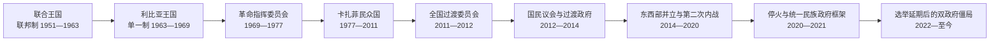

# 联合王国、卡扎菲政权与2011年后转型

## 时间

1951年至今（核验截止：2026-07-14）

## 概括

现代利比亚经历了三次国家重构。1951年，昔兰尼加、的黎波里塔尼亚与费赞在联合国安排下组成塞努西君主制国家；石油收入使贫穷的新国家迅速获得资源，却也放大地区、代际和政治参与失衡。1969年青年军官推翻国王，卡扎菲先以革命委员会、后以“民众国”制度统治，把石油福利、泛阿拉伯与泛非政策、群众组织同个人化安全国家结合。2011年起义和国际军事干预摧毁旧政权，但未形成垄断武力和被共同接受的继承规则；2014年后议会、政府、军队和武装集团分裂为互相重叠的东西部体系。2020年停火降低了全面战争强度，国家统一和全国选举截至2026年仍未完成。

## 利比亚联合王国

### 建国背景与制度妥协

1949年联合国决定利比亚在1952年以前独立。三地区的政治诉求并不相同：

- 昔兰尼加的塞努西精英倾向伊德里斯领导的君主制和地区自治；
- 的黎波里塔尼亚人口较多、城市政治活跃，许多民族主义者主张统一国家并担心东部王权支配；
- 费赞地广人稀，地方家族在法国军政管理下拥有较强中介地位；
- 英国希望保留战略合作与军事基地，美国重视惠勒斯空军基地，法国则曾试图维持费赞影响。

1951年宪法以联邦君主制调和分歧：国王伊德里斯一世为国家元首，三州保留各自政府和议会，联邦议会两院并存，的黎波里与班加西为主要首都，贝达后来成为王室和行政中心。它是谈判出来的国家框架，而非一个中央政权自然扩张的结果。

### 早期困境与石油转型

独立之初，利比亚财政、教育和基础设施极弱，主要依赖外国援助、基地租金和有限农业。政府用1955年石油法引入多家公司、分割特许区，以避免单一企业垄断。1959年发现大型油田，1961年开始商业出口，国家收入迅速增长。

石油带来三重转型：

1. 公路、学校、医疗和公共部门扩张；
2. 人口向的黎波里、班加西和油区集中，游牧与绿洲经济相对衰落；
3. 收入由中央分配，联邦州政府被视为重复、昂贵且妨碍统一规划。

1963年宪法修正取消联邦制，把三州改为中央管辖的行政区。单一制提高财政统筹能力，也削弱地区自治的制度出口，使不满更容易指向王室和中央政府。

### 王国统治结构

| 角色 | 法定权力 | 实际运行 |
| --- | --- | --- |
| 国王伊德里斯一世 | 任命首相、批准法律、统率军队并拥有重要保留权 | 依赖塞努西、宫廷和地区名流网络；年老后决策圈缩小。 |
| 内阁与首相 | 日常行政、预算、外交和发展计划 | 首相更换频繁，政党活动受限，议会难以形成稳定问责。 |
| 议会 | 两院立法与预算 | 选举受地方名流和行政影响，反对派空间逐步收窄。 |
| 外国盟友 | 条约、基地、援助与训练 | 英美基地和西方合作提供财政安全，也成为阿拉伯民族主义批评焦点。 |
| 石油机构 | 特许、税收和收入分配 | 国家能力快速增强，但社会对透明度、公平和政治参与的期待增长更快。 |

完整君主、首相及后续国家元首、政府首脑序列见[利比亚现代国家元首与政府首脑表](/%E4%BA%BA%E6%96%87%E7%A7%91%E5%AD%A6/%E5%8E%86%E5%8F%B2/%E5%8C%97%E9%9D%9E/%E5%88%A9%E6%AF%94%E4%BA%9A/%E5%88%A9%E6%AF%94%E4%BA%9A%E7%8E%B0%E4%BB%A3%E5%9B%BD%E5%AE%B6%E5%85%83%E9%A6%96%E4%B8%8E%E6%94%BF%E5%BA%9C%E9%A6%96%E8%84%91%E8%A1%A8.md)。

### 王国衰落与1969年政变

| 类型 | 因素 |
| --- | --- |
| 结构因素 | 王室权力集中、政党受压、议会代表性弱；军队中的年轻基层军官与旧精英脱节。 |
| 社会因素 | 石油财富增长却分配不均，腐败观感和地区差距突出；快速城市化产生新的受教育青年群体。 |
| 意识形态压力 | 纳赛尔主义、巴勒斯坦问题和阿拉伯民族主义使亲西方外交与外国基地失去正当性。 |
| 领导危机 | 伊德里斯年老、久居海外疗养并准备退位；王储哈桑缺少稳固军政基础。 |
| 直接触发 | 1969年9月1日，自由军官趁国王在土耳其治疗发动政变，迅速控制电台、军营和政府机关。 |
| 终结方式 | 革命指挥委员会废除君主制；王储未能正式即位，国王流亡。政变流血较少，但随后清洗旧军政网络。 |

## 卡扎菲革命政权

### 1969—1977年：从军官委员会到革命国家

以27岁的穆阿迈尔·卡扎菲为首的自由军官宣布建立利比亚阿拉伯共和国。早期政权以革命指挥委员会为最高机构，模仿埃及七月革命，强调阿拉伯统一、社会主义、伊斯兰和反帝国主义。

主要措施包括：

- 迫使英国和美国关闭军事基地；
- 驱逐或迫使残余意大利殖民者离境，没收其资产；
- 提高石油税率和国家分成，1970年代逐步扩大国有控制；
- 限制独立政党、工会和媒体，以阿拉伯社会主义联盟和“文化革命”组织群众；
- 多次推动与埃及、叙利亚、突尼斯等合邦，但因领导权、制度和外交分歧失败；
- 以革命法庭和安全机构清除旧制度人物、共产主义者、伊斯兰主义者和军内异议。

1973年卡扎菲发动“文化革命”，要求暂停旧法律、清洗反对者并建立人民委员会。1975—1979年分卷发表的《绿皮书》宣称议会制是对人民主权的篡夺，以基层人民大会和委员会作为“直接民主”替代方案。

### 1977—2011年：“民众国”制度与实际权力

1977年《人民权力宣言》建立“阿拉伯利比亚人民社会主义民众国”。形式上，全国公民通过基层人民大会讨论政策，各级人民委员会执行，总人民大会协调全国。1979年卡扎菲辞去正式职位，改称“革命领袖”。

| 层面 | 公开制度 | 实际权力机制 |
| --- | --- | --- |
| 基层政治 | 基层人民大会可讨论预算、人事和政策 | 参与不均，议题和执行受革命委员会、安全机关与资源控制约束。 |
| 国家立法 | 总人民大会汇总基层决定 | 秘书长是法定国家代表，但重大路线由卡扎菲设定。 |
| 行政 | 总人民委员会及各秘书处 | 官员频繁轮换、机构反复重组，难形成独立责任链。 |
| 革命监督 | 革命委员会“保卫革命” | 监控异议、动员群众、影响任命和司法，是非正式权力核心。 |
| 安全与军队 | 多个军政、安全和特种单位 | 相互制衡，关键单位由家族、部族盟友和亲信掌握，防止单一军队政变。 |
| 最高决策 | 卡扎菲没有常规官职 | 依靠个人仲裁、亲信网络、革命合法性和石油分配保持最终决定权。 |

因此，民众国既不能只解释为“无国家的直接民主”，也不能只用普通总统制描述；法定机构、革命组织、家族安全网络和卡扎菲个人权威同时存在。

### 石油国家、社会政策与发展工程

石油收入支持免费或补贴教育、医疗、住房和基本商品，识字率、预期寿命和城市基础设施显著改善。国家吸收大量公民进入公共部门，并引进埃及、突尼斯、撒哈拉以南非洲和亚洲劳工。1980年代启动“大人工河”工程，把撒哈拉化石地下水输往沿海城市和农业区，成为政权最重要的现代化象征之一。

但这种模式也有脆弱性：

- 经济高度依赖油价和进口，私营部门及生产性就业不足；
- 福利与项目分配受政治忠诚、地区和关系网络影响；
- 机构反复“革命化”和去专业化，法治与政策连续性较弱；
- 反对组织被禁止，监禁、酷刑、失踪和海外追杀构成高压统治；
- 1996年阿布·萨利姆监狱大规模杀害囚犯，后来成为2011年抗议的重要记忆。

### 对外政策的阶段变化

#### 激进扩张与地区战争

1970—1980年代，卡扎菲资助多国革命和武装组织，介入乍得内战并争夺奥祖地带，也支持乌干达的伊迪·阿明。利比亚在乍得的长期战争最终于1987年“丰田战争”中遭重挫；国际法院1994年判奥祖地带属于乍得，利军撤出。对外冒险消耗资源，也促使卡扎菲对正规军保持戒心。

#### 与美国冲突和国际制裁

锡德拉湾冲突、利比亚被指支持恐怖活动，以及1986年柏林迪斯科爆炸案后，美国空袭的黎波里和班加西，使对抗升级。1988年泛美航空103号班机洛克比爆炸案引发嫌疑人移交争议，联合国自1992年实施制裁。制裁限制航空、投资和设备进口，加剧经济停滞。

#### 和解与再融入

1999年利比亚移交洛克比嫌疑人，制裁暂停；2003年接受对遇难者家属赔偿责任安排，并宣布放弃核、化学等非常规武器计划。此后欧美解除多项制裁，能源公司回归，卡扎菲又以非洲联盟和撒哈拉合作重塑外交。对外和解改善国家收入，却没有同步建立稳定继承机制和政治开放。

### 政权长期维持与最终崩溃

| 类型 | 维持因素 | 崩溃因素 |
| --- | --- | --- |
| 资源 | 石油收入支付福利、安全机构和精英联盟 | 油收分配不透明，青年失业与地区差距削弱认同。 |
| 强制 | 多重安全机构、武装单位相互制衡，反对派组织困难 | 机构碎片化使危机时全国军队无法统一行动，部分部队和外交官倒戈。 |
| 制度 | 人民大会提供有限参与和动员渠道 | 法定职位空心化、政策依赖个人裁决，缺少可接受的继承与和平更替规则。 |
| 社会联盟 | 家族、卡扎法部族及若干部族和商业网络获益 | 昔兰尼加长期认为资源与职位分配不公；阿布·萨利姆等镇压积累怨恨。 |
| 外部环境 | 2003年后与西方和解减轻孤立 | 2011年阿拉伯起义扩散，国际制裁与军事干预改变力量平衡。 |
| 直接触发 | — | 2011年2月班加西因人权律师法特希·特尔比勒被捕引发示威，镇压扩大为武装起义。 |

## 2011年起义、内战与旧政权终结

### 从抗议到全国战争

2011年2月，班加西和东部城市抗议迅速扩大。安全部队开火、军警倒戈和武器库被夺使抗议军事化。反对派在班加西成立全国过渡委员会，宣称代表全国；卡扎菲政权仍控制的黎波里、苏尔特等西部与中部据点。

联合国安全理事会第1970号决议实施制裁并把局势提交国际刑事法院；第1973号决议授权保护平民、设禁飞区。北约主导的空中行动摧毁政府防空、装甲和指挥能力，同时反对派从东部与西部山区推进。外部干预阻止政府军重新夺取班加西，也使战争结果更加依赖国际军事力量。

### 决定性转折

1. 反对派维持班加西政权核心并获得国际承认；
2. 米苏拉塔在围城中未被政府军攻下，成为西部反攻基地；
3. 西部山区武装切断的黎波里补给，2011年8月攻入首都；
4. 民众国法定机构和多数中央部门崩溃，卡扎菲转往苏尔特；
5. 10月20日卡扎菲在苏尔特被俘后死亡；10月23日全国过渡委员会宣布“解放”。

旧政权直接灭亡于首都失守和卡扎菲死亡，但更深层原因是个人化制度没有独立继承机构：当最高领袖和安全网络崩溃时，国家行政、军队与地方武装无法自动重组为统一秩序。

## 2011—2014年：过渡国家为何没有巩固

### 初始成就

- 全国过渡委员会把权力移交给2012年选举产生的国民议会；
- 选举和政党活动一度创造公开政治空间；
- 石油生产较快恢复，国际冻结资产部分解冻；
- 制宪机构和地方选举开始运作。

### 制度与安全困境

反卡扎菲武装以城市、地区、部族或意识形态为基础，各自保留武器、监狱和检查站。过渡政府既无能力强制解散它们，又以工资和“革命者登记”把许多武装名义纳入内政、国防体系，造成国家给付但指挥不统一。

2012年美国驻班加西设施遇袭，显示东部安全恶化。2013年《政治隔离法》在武装压力下通过，大范围排除曾任旧政权公职者，削弱行政经验并加深赢家—输家政治。石油港口和油田被地方武装封锁，中央收入和权威受制于武装谈判。制宪、地方自治、伊斯兰法地位和旧政权人员处置争议相互叠加。

## 2014—2020年：第二次内战与双重国家

### 分裂形成

2014年哈利法·哈夫塔尔发动“尊严行动”，以打击伊斯兰主义武装和恢复军队为名在班加西作战。6月众议院选举投票率低、争议大；新议会迁往东部托布鲁克。的黎波里“利比亚黎明”联盟夺取首都，旧国民议会部分成员恢复活动并支持民族救国政府。最高法院关于选举修宪程序的判决又被双方作不同解释。

由此形成：

- 东部：众议院、阿卜杜拉·萨尼政府和哈夫塔尔“利比亚国民军”联盟；
- 西部：旧国民议会、民族救国政府及不同城市和伊斯兰主义武装；
- 中南部：地方部族、跨境武装和犯罪网络控制程度不一；
- 伊斯兰国利用真空占领苏尔特，后于2016年被米苏拉塔主力和国际空袭击败。

### 2015年政治协议与有限整合

联合国调解的《利比亚政治协议》在斯希拉特签署，建立由法耶兹·萨拉杰领导的总统委员会和民族团结政府，并把旧国民议会一部分转为高级国家委员会。2016年萨拉杰进入的黎波里，获得国际承认和部分西部机构支持。

协议没有解决三个核心问题：

1. 众议院未完成对政府和关键安全条款的一致批准；
2. 哈夫塔尔拒绝受西部文官体系节制，并在东部扩大军事控制；
3. 的黎波里政府仍依赖多个相互竞争的武装集团。

### 2019—2020年首都战争

2019年4月，哈夫塔尔部队向的黎波里发动进攻，企图以军事胜利统一国家。东部获得埃及、阿联酋和俄罗斯相关力量等支持；民族团结政府则在2019年底与土耳其签署安全与海洋协议，土耳其无人机、防空和叙利亚战斗人员改变战场平衡。2020年西部力量解除首都包围并推进至苏尔特—朱夫拉线。

双方都未能完成全国征服。2020年10月，“5+5”联合军事委员会签署全国停火，确定撤离外国战斗人员、开放道路和统一军事安排等目标。停火结束大规模正面战，却未消除外国部队、平行军队和地方武装。

## 2021年以来：统一框架、选举延期与再度双政府

### 统一民族政府的建立

利比亚政治对话论坛选出穆罕默德·门菲领导的三人总统委员会和阿卜杜勒·哈米德·德贝巴领导的统一民族政府。2021年3月众议院给予政府信任，东西部旧政府名义交接。主要任务是：

- 统一行政与财政机构；
- 执行停火和安全部门改革；
- 改善公共服务；
- 在2021年12月24日举行总统和议会选举。

候选资格、军人和双重国籍参选、先总统还是先宪法、议会制定选举法的程序等争议未解决。包括哈夫塔尔、赛义夫·伊斯兰·卡扎菲和德贝巴在内的候选人资格引发诉讼。选举委员会在投票日前宣布无法按期举行，未给出各方都接受的新日期。

### 2022年后的双政府

众议院认为德贝巴任期已经结束，2022年任命法蒂·巴沙加组建国家稳定政府；德贝巴主张只向民选政府交权。巴沙加多次试图进入的黎波里失败，2023年被众议院暂停，由乌萨马·哈马德代理。东部政府与哈夫塔尔军政网络合作，西部政府则继续控制多数中央部委和国际交往渠道。

2023年9月风暴“丹尼尔”导致德尔纳水坝溃决和灾难性洪水。灾害暴露：

- 长期维护失灵和国家监管缺位；
- 东西部机构相互推责；
- 地方救援、国际援助与东部安全体系并行；
- 重建资金成为新的权力和分配中心。

2024年中央银行领导危机一度触发油田停产与国际调解，说明即使石油公司和央行名义全国统一，领导任命与收入分配仍能迅速成为东西部博弈工具。

### 截至2026-07-14的局势

| 领域 | 现状 | 未决问题 |
| --- | --- | --- |
| 国家元首 | 穆罕默德·门菲领导的总统委员会继续获国际承认 | 权力有限，东部众议院对其若干行动提出法理挑战。 |
| 政府 | 德贝巴政府控制的黎波里和西部多数国家部委；哈马德政府在东部运作 | 缺少共同接受的统一过渡政府和交权时间表。 |
| 立法 | 众议院与高级国家委员会均主张参与选举法、关键任命 | 任期、内部领导和协商程序持续争议。 |
| 安全 | 2020年停火总体避免东西部全面战争 | 外国部队、雇佣兵、地方武装和双重军事指挥仍在。 |
| 经济 | 石油是全国财政命脉，央行与国家石油公司维持一定统一性 | 封锁、预算并行、透明度不足和重建分配可随时引发危机。 |
| 选举 | 技术机构继续准备，市政选举在部分地区推进 | 全国总统与议会选举自2021年延期后仍未举行。 |
| 联合国路线 | 2026年6月结构化对话报告提出525项以上治理、经济、安全和人权建议 | 建议须转化为主要机构接受的路线图，尚未自动结束权力分裂。 |

2025—2026年的调解重点逐渐从单纯要求现有五大机构会谈，转向更广泛的咨询、选举技术方案和结构化对话。进展主要体现在问题清单、社会参与和建议形成；在统一政府、候选资格、宪法基础、军队统一和资源分配上，仍没有可执行的全国协议。任何“选举日期已确定”或“国家已统一”的说法截至核验日都不准确。

## 重要事件

| 时间 | 事件 | 过程与转折 | 结果与长期影响 |
| --- | --- | --- | --- |
| 1951-12-24 | 独立与联邦王国成立 | 三地区代表在联合国进程下推戴伊德里斯 | 建立现代利比亚国家，但地区差异制度化。 |
| 1959—1961 | 发现并出口石油 | 特许勘探发现大油田，管道与港口投产 | 从援助依赖国转为石油国家，中央权力和社会期待同时上升。 |
| 1963 | 取消联邦制 | 中央接管三州权力 | 提高统筹能力，也压缩地区自治。 |
| 1969-09-01 | 自由军官政变 | 趁国王在国外迅速控制国家机关 | 终结塞努西君主制，开启42年卡扎菲时代。 |
| 1977—1979 | 建立民众国、卡扎菲退出正式职位 | 人民大会体系取代共和国常规机构 | 形成法定机构与革命领袖实际权力并存的双层结构。 |
| 1987 | 乍得战争惨败 | 哈夫塔尔部队等在“丰田战争”中失利 | 对外扩张受挫，军队碎片化和哈夫塔尔日后反叛。 |
| 1992—2003 | 洛克比制裁与和解 | 制裁造成孤立；移交嫌疑人、赔偿和放弃非常规武器 | 政权重新融入国际体系，但国内制度未改革。 |
| 2011 | 起义、北约干预与政权倒台 | 抗议军事化，反对派建政，国际空袭改变战局 | 卡扎菲政权灭亡；武装与国家机构碎片化。 |
| 2012 | 国民议会选举 | 全国过渡委员会和平交权 | 出现选举合法性，但安全与制宪未巩固。 |
| 2014 | 尊严行动、议会分裂与第二次内战 | 新众议院东迁，旧议会阵营控制首都 | 双政府、双立法与东西部军事分裂成形。 |
| 2015—2016 | 政治协议与民族团结政府 | 联合国调解建立总统委员会 | 获国际承认但未完成国内统一。 |
| 2019—2020 | 哈夫塔尔进攻的黎波里 | 外国支持双方升级；土耳其介入逆转战局 | 军事统一失败，转向停火和政治论坛。 |
| 2021 | 统一民族政府与选举延期 | 临时机构获信任，候选与法律争议阻止投票 | 过渡任期失去共同终点，2022年再生双政府。 |
| 2023 | 德尔纳洪灾 | 水坝溃决造成重大伤亡与失踪 | 暴露治理崩坏，重建又成为权力竞争焦点。 |
| 2026-06 | 结构化对话完成报告 | 多领域参与者形成525项以上建议 | 提供路线图材料，但全国选举和机构统一尚未实现。 |

## 兴衰与转型总析

### 王国为何能建立

- 联合国规定独立时限，阻止旧殖民分割方案；
- 伊德里斯兼具塞努西宗教、部族和反殖民合法性，并获英国支持；
- 联邦制允许三地区在共同国家内保留自治；
- 外援和随后出现的石油收入为新国家提供财政基础。

### 卡扎菲政权为何能长期维持

- 把石油收入转为福利、公共就业和精英分配；
- 以重叠安全机构和部族—家族网络阻止政变；
- 法定人民机构吸纳部分参与，同时不允许独立组织竞争；
- 在激进外交、制裁承压与对外和解之间灵活转向；
- 反对派长期分散、流亡或受严厉镇压。

### 2011年后为何反复分裂

- 推翻旧政权时同步摧毁了军警指挥链，却没有统一替代力量；
- 地方武装因战争功绩、城市和部族基础拒绝解除武装；
- 选举、法院判决和协议都缺少一支被全国接受的执行力量；
- 石油收入集中于全国机构，领土与军队却分散，诱发对央行、油港和预算的争夺；
- 外国支持者为不同阵营提供资金、武器、无人机和雇佣力量，降低妥协成本；
- 每个过渡安排都缺少清晰、共同接受且能执行的终止与交权规则。

## 演变关系

- 前一阶段：[奥斯曼、塞努西与意大利殖民](/%E4%BA%BA%E6%96%87%E7%A7%91%E5%AD%A6/%E5%8E%86%E5%8F%B2/%E5%8C%97%E9%9D%9E/%E5%88%A9%E6%AF%94%E4%BA%9A/%E5%A5%A5%E6%96%AF%E6%9B%BC%E3%80%81%E5%A1%9E%E5%8A%AA%E8%A5%BF%E4%B8%8E%E6%84%8F%E5%A4%A7%E5%88%A9%E6%AE%96%E6%B0%91.md)
- 领导人完整表：[利比亚现代国家元首与政府首脑表](/%E4%BA%BA%E6%96%87%E7%A7%91%E5%AD%A6/%E5%8E%86%E5%8F%B2/%E5%8C%97%E9%9D%9E/%E5%88%A9%E6%AF%94%E4%BA%9A/%E5%88%A9%E6%AF%94%E4%BA%9A%E7%8E%B0%E4%BB%A3%E5%9B%BD%E5%AE%B6%E5%85%83%E9%A6%96%E4%B8%8E%E6%94%BF%E5%BA%9C%E9%A6%96%E8%84%91%E8%A1%A8.md)
- 殖民行政表：[意大利利比亚殖民行政首脑表](/%E4%BA%BA%E6%96%87%E7%A7%91%E5%AD%A6/%E5%8E%86%E5%8F%B2/%E5%8C%97%E9%9D%9E/%E5%88%A9%E6%AF%94%E4%BA%9A/%E6%84%8F%E5%A4%A7%E5%88%A9%E5%88%A9%E6%AF%94%E4%BA%9A%E6%AE%96%E6%B0%91%E8%A1%8C%E6%94%BF%E9%A6%96%E8%84%91%E8%A1%A8.md)
- 本阶段主线：联邦王国 → 单一制王国 → 革命共和国 → 民众国 → 过渡机构 → 东西部并立 → 停火下的未完成统一。
- 返回：[利比亚历史总览](/%E4%BA%BA%E6%96%87%E7%A7%91%E5%AD%A6/%E5%8E%86%E5%8F%B2/%E5%8C%97%E9%9D%9E/%E5%88%A9%E6%AF%94%E4%BA%9A/README.md)
