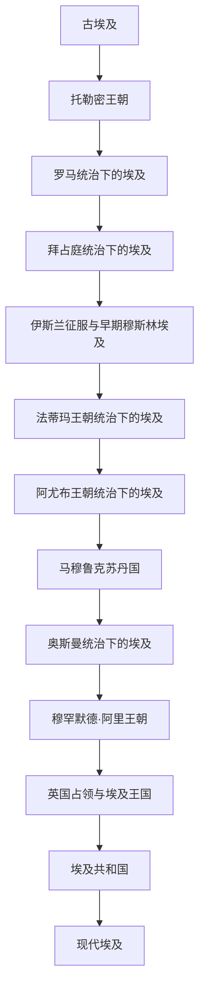

# 埃及

## 概括

埃及历史以尼罗河流域为地理核心，经历古埃及王朝国家、希腊化托勒密王朝、罗马与拜占庭统治、阿拉伯-伊斯兰化、法蒂玛、阿尤布、马穆鲁克、奥斯曼体系、近代王朝与英国占领，以及现代共和国阶段。

本目录用于维护埃及从古代到现代的连续历史；跨区域的阿拉伯帝国、奥斯曼帝国、古罗马和拜占庭等主题则在对应通史目录中维护，并在本目录中只保留与埃及有关的阶段说明。

## 历史主线

## 时期导航

| 顺序 | 名称 | 时间 | 简要概括 |
|---|---|---|---|
| 1 | [古埃及](/%E4%BA%BA%E6%96%87%E7%A7%91%E5%AD%A6/%E5%8E%86%E5%8F%B2/%E5%8C%97%E9%9D%9E/%E5%9F%83%E5%8F%8A/%E5%8F%A4%E5%9F%83%E5%8F%8A/README.md) | 约前3100-前30 | 尼罗河王朝文明、托勒密王朝及其被罗马吞并。 |
| 2 | [罗马统治下的埃及](/%E4%BA%BA%E6%96%87%E7%A7%91%E5%AD%A6/%E5%8E%86%E5%8F%B2/%E5%8C%97%E9%9D%9E/%E5%9F%83%E5%8F%8A/%E7%BD%97%E9%A9%AC%E7%BB%9F%E6%B2%BB%E4%B8%8B%E7%9A%84%E5%9F%83%E5%8F%8A.md) | 前30-395 | 埃及成为罗马帝国行省和地中海粮仓。 |
| 3 | [拜占庭统治下的埃及](/%E4%BA%BA%E6%96%87%E7%A7%91%E5%AD%A6/%E5%8E%86%E5%8F%B2/%E5%8C%97%E9%9D%9E/%E5%9F%83%E5%8F%8A/%E6%8B%9C%E5%8D%A0%E5%BA%AD%E7%BB%9F%E6%B2%BB%E4%B8%8B%E7%9A%84%E5%9F%83%E5%8F%8A.md) | 395-641 | 东罗马统治下的基督教埃及，直到阿拉伯征服。 |
| 4 | [伊斯兰征服与早期穆斯林埃及](/%E4%BA%BA%E6%96%87%E7%A7%91%E5%AD%A6/%E5%8E%86%E5%8F%B2/%E5%8C%97%E9%9D%9E/%E5%9F%83%E5%8F%8A/%E4%BC%8A%E6%96%AF%E5%85%B0%E5%BE%81%E6%9C%8D%E4%B8%8E%E6%97%A9%E6%9C%9F%E7%A9%86%E6%96%AF%E6%9E%97%E5%9F%83%E5%8F%8A.md) | 641-969 | 阿拉伯征服后，埃及进入伊斯兰世界并逐渐阿拉伯语化。 |
| 5 | [法蒂玛王朝统治下的埃及](/%E4%BA%BA%E6%96%87%E7%A7%91%E5%AD%A6/%E5%8E%86%E5%8F%B2/%E5%8C%97%E9%9D%9E/%E5%9F%83%E5%8F%8A/%E6%B3%95%E8%92%82%E7%8E%9B%E7%8E%8B%E6%9C%9D%E7%BB%9F%E6%B2%BB%E4%B8%8B%E7%9A%84%E5%9F%83%E5%8F%8A.md) | 969-1171 | 法蒂玛王朝迁都开罗，埃及成为什叶派哈里发中心。 |
| 6 | [阿尤布王朝统治下的埃及](/%E4%BA%BA%E6%96%87%E7%A7%91%E5%AD%A6/%E5%8E%86%E5%8F%B2/%E5%8C%97%E9%9D%9E/%E5%9F%83%E5%8F%8A/%E9%98%BF%E5%B0%A4%E5%B8%83%E7%8E%8B%E6%9C%9D%E7%BB%9F%E6%B2%BB%E4%B8%8B%E7%9A%84%E5%9F%83%E5%8F%8A.md) | 1171-1250 | 萨拉丁建立阿尤布王朝，埃及重回逊尼派政治核心。 |
| 7 | [马穆鲁克苏丹国](/%E4%BA%BA%E6%96%87%E7%A7%91%E5%AD%A6/%E5%8E%86%E5%8F%B2/%E5%8C%97%E9%9D%9E/%E5%9F%83%E5%8F%8A/%E9%A9%AC%E7%A9%86%E9%B2%81%E5%85%8B%E8%8B%8F%E4%B8%B9%E5%9B%BD.md) | 1250-1517 | 马穆鲁克军事集团统治埃及和叙利亚，是中世纪后期伊斯兰世界强权。 |
| 8 | [奥斯曼统治下的埃及](/%E4%BA%BA%E6%96%87%E7%A7%91%E5%AD%A6/%E5%8E%86%E5%8F%B2/%E5%8C%97%E9%9D%9E/%E5%9F%83%E5%8F%8A/%E5%A5%A5%E6%96%AF%E6%9B%BC%E7%BB%9F%E6%B2%BB%E4%B8%8B%E7%9A%84%E5%9F%83%E5%8F%8A.md) | 1517-1805 | 埃及并入奥斯曼帝国，地方马穆鲁克势力长期延续。 |
| 9 | [穆罕默德·阿里王朝](/%E4%BA%BA%E6%96%87%E7%A7%91%E5%AD%A6/%E5%8E%86%E5%8F%B2/%E5%8C%97%E9%9D%9E/%E5%9F%83%E5%8F%8A/%E7%A9%86%E7%BD%95%E9%BB%98%E5%BE%B7%C2%B7%E9%98%BF%E9%87%8C%E7%8E%8B%E6%9C%9D.md) | 1805-1953 | 近代埃及国家建设、王朝统治和欧洲干预并存。 |
| 10 | [英国占领与埃及王国](/%E4%BA%BA%E6%96%87%E7%A7%91%E5%AD%A6/%E5%8E%86%E5%8F%B2/%E5%8C%97%E9%9D%9E/%E5%9F%83%E5%8F%8A/%E8%8B%B1%E5%9B%BD%E5%8D%A0%E9%A2%86%E4%B8%8E%E5%9F%83%E5%8F%8A%E7%8E%8B%E5%9B%BD.md) | 1882-1953 | 英国占领、保护国、名义独立与王国体制交错。 |
| 11 | [埃及共和国](/%E4%BA%BA%E6%96%87%E7%A7%91%E5%AD%A6/%E5%8E%86%E5%8F%B2/%E5%8C%97%E9%9D%9E/%E5%9F%83%E5%8F%8A/%E5%9F%83%E5%8F%8A%E5%85%B1%E5%92%8C%E5%9B%BD.md) | 1953-至今 | 自由军官运动后形成共和国，经历纳赛尔、萨达特、穆巴拉克及后续政治重组。 |
| 12 | [现代埃及](/%E4%BA%BA%E6%96%87%E7%A7%91%E5%AD%A6/%E5%8E%86%E5%8F%B2/%E5%8C%97%E9%9D%9E/%E5%9F%83%E5%8F%8A/%E7%8E%B0%E4%BB%A3%E5%9F%83%E5%8F%8A.md) | 20世纪中后期-至今 | 聚焦现代国家治理、外交、社会经济与当代转型。 |

## 重要转折与时间节点

| 时间 | 事件 | 意义 |
|---|---|---|
| 约前3100 | 上下埃及统一 | 早期王朝国家形成，法老王权和尼罗河国家传统奠基。 |
| 前332 | 亚历山大进入埃及 | 埃及进入希腊化世界，亚历山大里亚成为地中海重镇。 |
| 前30 | 罗马吞并埃及 | 托勒密王朝结束，埃及并入罗马帝国。 |
| 395 | 罗马帝国东西分治 | 埃及转入东罗马 / 拜占庭体系。 |
| 641 | 阿拉伯征服埃及 | 埃及进入伊斯兰世界，语言和宗教结构逐渐转变。 |
| 969 | 法蒂玛王朝占领埃及 | 开罗兴起，埃及成为独立帝国核心。 |
| 1171 | 萨拉丁终结法蒂玛王朝 | 埃及转入阿尤布王朝，并回到逊尼派政治体系。 |
| 1250 | 马穆鲁克掌权 | 军事奴隶集团建立苏丹国，埃及成为中世纪伊斯兰强权。 |
| 1517 | 奥斯曼征服埃及 | 埃及并入奥斯曼帝国。 |
| 1805 | 穆罕默德·阿里掌权 | 近代埃及国家建设开始。 |
| 1882 | 英国占领埃及 | 埃及名义上仍属奥斯曼和后来的王国体制，实际受英国控制。 |
| 1952 | 自由军官运动 | 王朝体制终结，共和国道路开启。 |
| 1953 | 埃及共和国成立 | 现代埃及国家形态确立。 |

## 关键辨析

- “古埃及”主要指前王朝、王朝时期和托勒密王朝以前后的古代文明传统；不等于现代埃及国家的全部历史。
- “罗马统治下的埃及”和“拜占庭统治下的埃及”是埃及史与古罗马 / 东罗马史的交叉节点。
- 阿拉伯征服后的埃及属于伊斯兰世界主线，但埃及本地政治中心在法蒂玛、阿尤布和马穆鲁克时期非常重要，适合在埃及目录中单独维护。
- 奥斯曼时期埃及名义上属奥斯曼帝国，但地方马穆鲁克、总督和近代穆罕默德·阿里家族使埃及形成强烈的地方连续性。

## 相关笔记

- [北非](/%E4%BA%BA%E6%96%87%E7%A7%91%E5%AD%A6/%E5%8E%86%E5%8F%B2/%E5%8C%97%E9%9D%9E/README.md)
- [西亚通史](/%E4%BA%BA%E6%96%87%E7%A7%91%E5%AD%A6/%E5%8E%86%E5%8F%B2/%E8%A5%BF%E4%BA%9A/_%E9%80%9A%E5%8F%B2/README.md)
- [阿拉伯帝国](/%E4%BA%BA%E6%96%87%E7%A7%91%E5%AD%A6/%E5%8E%86%E5%8F%B2/%E8%A5%BF%E4%BA%9A/_%E9%80%9A%E5%8F%B2/%E9%98%BF%E6%8B%89%E4%BC%AF%E5%B8%9D%E5%9B%BD/README.md)
- [奥斯曼帝国](/%E4%BA%BA%E6%96%87%E7%A7%91%E5%AD%A6/%E5%8E%86%E5%8F%B2/%E8%A5%BF%E4%BA%9A/%E5%9C%9F%E8%80%B3%E5%85%B6/%E5%A5%A5%E6%96%AF%E6%9B%BC%E5%B8%9D%E5%9B%BD/README.md)
- [古罗马](/%E4%BA%BA%E6%96%87%E7%A7%91%E5%AD%A6/%E5%8E%86%E5%8F%B2/%E6%AC%A7%E6%B4%B2/_%E9%80%9A%E5%8F%B2/%E5%8F%A4%E7%BD%97%E9%A9%AC/README.md)

## 目录层级

- 直接上级：[北非](/%E4%BA%BA%E6%96%87%E7%A7%91%E5%AD%A6/%E5%8E%86%E5%8F%B2/%E5%8C%97%E9%9D%9E/README.md)
- 历史总览：[历史](/%E4%BA%BA%E6%96%87%E7%A7%91%E5%AD%A6/%E5%8E%86%E5%8F%B2/README.md)
