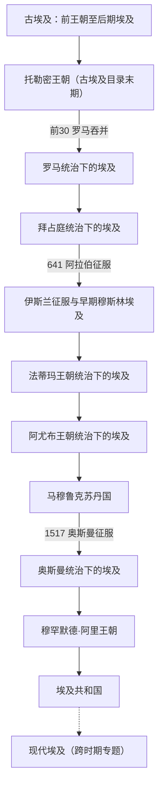
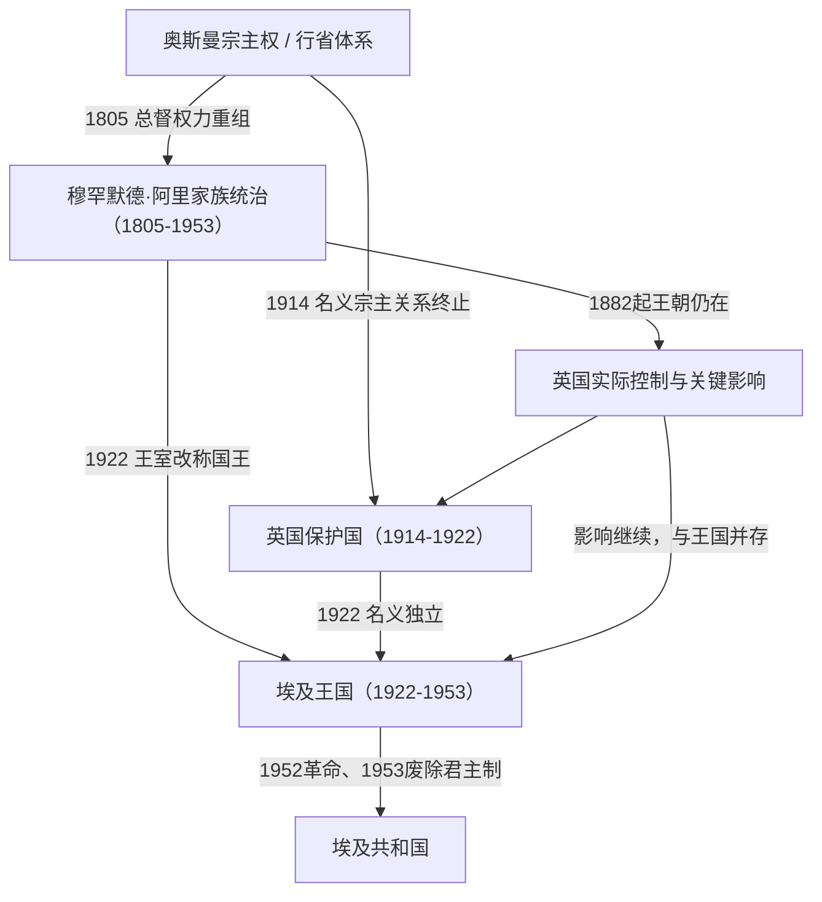

# 埃及

## 范围与对象

本目录以尼罗河下游和三角洲为地理核心，整理从古代文明到现代国家的长时段，但区分三种不同关系：

1. **文明连续性**：尼罗河环境、人口与城市、语言宗教、制度和贸易网络如何延续或转型；
2. **政治演进**：王朝、帝国行省、苏丹国、王国和共和国如何更替；
3. **实际控制**：名义宗主权、王朝统治和外国占领可能在同一时期重叠，不能机械写成单线继承。

本库把[古埃及](/%E4%BA%BA%E6%96%87%E7%A7%91%E5%AD%A6/%E5%8E%86%E5%8F%B2/%E5%8C%97%E9%9D%9E/%E5%9F%83%E5%8F%8A/%E5%8F%A4%E5%9F%83%E5%8F%8A/README.md)作为约前6000年至前30年的文明长时段入口，**包含托勒密王朝**。顶层图把托勒密单列，只是为了显示其被罗马吞并这一政治转折，并不是在“古埃及”之后重复增加一个阶段。

上级入口：[北非](/%E4%BA%BA%E6%96%87%E7%A7%91%E5%AD%A6/%E5%8E%86%E5%8F%B2/%E5%8C%97%E9%9D%9E/README.md)；历史总览：[历史](/%E4%BA%BA%E6%96%87%E7%A7%91%E5%AD%A6/%E5%8E%86%E5%8F%B2/README.md)。

## 一句话全史

埃及由尼罗河王朝文明发展为希腊化、罗马和拜占庭的地中海核心区域，7世纪后进入伊斯兰世界；法蒂玛以来开罗成为长期政治中心，阿尤布、马穆鲁克和奥斯曼体系相继重组统治，穆罕默德·阿里家族建立近代国家框架并与英国控制重叠，1952—1953年后转入共和国。

## 政治演进图

虚线只表示“现代埃及”专题覆盖共和国时期的治理、外交和社会经济问题，不表示共和国之后出现了另一个政体。

## 近代王朝、政体与实际控制

- 1805年以后，穆罕默德·阿里家族在相当长时间内仍处于奥斯曼名义宗主权之下。
- 1882年英国占领并未立即终结该王朝；英国实际控制、王朝统治和奥斯曼名义关系一度并存。
- 1914—1922年为英国保护国，1922年建立埃及王国后英国仍保持关键影响；王国王室仍是穆罕默德·阿里家族。
- 因而[穆罕默德·阿里王朝](/%E4%BA%BA%E6%96%87%E7%A7%91%E5%AD%A6/%E5%8E%86%E5%8F%B2/%E5%8C%97%E9%9D%9E/%E5%9F%83%E5%8F%8A/%E7%A9%86%E7%BD%95%E9%BB%98%E5%BE%B7%C2%B7%E9%98%BF%E9%87%8C%E7%8E%8B%E6%9C%9D.md)与[英国占领与埃及王国](/%E4%BA%BA%E6%96%87%E7%A7%91%E5%AD%A6/%E5%8E%86%E5%8F%B2/%E5%8C%97%E9%9D%9E/%E5%9F%83%E5%8F%8A/%E8%8B%B1%E5%9B%BD%E5%8D%A0%E9%A2%86%E4%B8%8E%E5%9F%83%E5%8F%8A%E7%8E%8B%E5%9B%BD.md)是两条重叠的观察线，而不是前后完全分离的政权。

## 文明连续性

| 维度 | 延续与变化 |
|---|---|
| 地理与经济 | 尼罗河灌溉、河谷农业和三角洲长期支撑人口与财政；地中海、红海和苏伊士方向不断改变对外网络。 |
| 语言与文字 | 古埃及语言和文字传统经历漫长变化，科普特传统在基督教时期延续；阿拉伯征服后阿拉伯语逐步扩展。 |
| 宗教 | 法老宗教、希腊化与罗马宗教、基督教和伊斯兰先后改变公共秩序，但早期传统、科普特社群和地方习俗并非瞬间消失。 |
| 制度与国家 | 法老官僚、帝国行省、哈里发行省、地方苏丹国、近代王朝和共和国均利用尼罗河谷的财政与行政集中条件。 |
| 人口与社会 | 王朝和帝国更替不等于居民整体替换；征服、移民、宗教转变和语言变化在长期互动中累积。 |
| 空间中心 | 孟菲斯、底比斯、亚历山大里亚、福斯塔特与开罗先后成为不同政治和贸易体系的核心。 |

## 政治阶段导航

| 顺序 | 名称 | 时间 | 对象关系 | 简要概括 |
|---:|---|---|---|---|
| 1 | [古埃及（含托勒密王朝）](/%E4%BA%BA%E6%96%87%E7%A7%91%E5%AD%A6/%E5%8E%86%E5%8F%B2/%E5%8C%97%E9%9D%9E/%E5%9F%83%E5%8F%8A/%E5%8F%A4%E5%9F%83%E5%8F%8A/README.md) | 约前6000—前30 | 文明长时段 | 从史前聚落、王朝国家到希腊化托勒密王朝；前30年被罗马吞并。 |
| 2 | [罗马统治下的埃及](/%E4%BA%BA%E6%96%87%E7%A7%91%E5%AD%A6/%E5%8E%86%E5%8F%B2/%E5%8C%97%E9%9D%9E/%E5%9F%83%E5%8F%8A/%E7%BD%97%E9%A9%AC%E7%BB%9F%E6%B2%BB%E4%B8%8B%E7%9A%84%E5%9F%83%E5%8F%8A.md) | 前30—395 | 帝国行省 | 埃及成为罗马皇帝直接控制的行省和地中海粮仓。 |
| 3 | [拜占庭统治下的埃及](/%E4%BA%BA%E6%96%87%E7%A7%91%E5%AD%A6/%E5%8E%86%E5%8F%B2/%E5%8C%97%E9%9D%9E/%E5%9F%83%E5%8F%8A/%E6%8B%9C%E5%8D%A0%E5%BA%AD%E7%BB%9F%E6%B2%BB%E4%B8%8B%E7%9A%84%E5%9F%83%E5%8F%8A.md) | 395—641 | 东罗马行省 | 基督教、亚历山大宗主教区、科普特传统和帝国税粮体系并存。 |
| 4 | [伊斯兰征服与早期穆斯林埃及](/%E4%BA%BA%E6%96%87%E7%A7%91%E5%AD%A6/%E5%8E%86%E5%8F%B2/%E5%8C%97%E9%9D%9E/%E5%9F%83%E5%8F%8A/%E4%BC%8A%E6%96%AF%E5%85%B0%E5%BE%81%E6%9C%8D%E4%B8%8E%E6%97%A9%E6%9C%9F%E7%A9%86%E6%96%AF%E6%9E%97%E5%9F%83%E5%8F%8A.md) | 641—969 | 哈里发与地方政权 | 埃及进入伊斯兰世界，福斯塔特兴起，语言和制度逐步转型。 |
| 5 | [法蒂玛王朝统治下的埃及](/%E4%BA%BA%E6%96%87%E7%A7%91%E5%AD%A6/%E5%8E%86%E5%8F%B2/%E5%8C%97%E9%9D%9E/%E5%9F%83%E5%8F%8A/%E6%B3%95%E8%92%82%E7%8E%9B%E7%8E%8B%E6%9C%9D%E7%BB%9F%E6%B2%BB%E4%B8%8B%E7%9A%84%E5%9F%83%E5%8F%8A.md) | 969—1171 | 哈里发王朝 | 法蒂玛迁入埃及并建立开罗，埃及成为伊斯玛仪派哈里发中心。 |
| 6 | [阿尤布王朝统治下的埃及](/%E4%BA%BA%E6%96%87%E7%A7%91%E5%AD%A6/%E5%8E%86%E5%8F%B2/%E5%8C%97%E9%9D%9E/%E5%9F%83%E5%8F%8A/%E9%98%BF%E5%B0%A4%E5%B8%83%E7%8E%8B%E6%9C%9D%E7%BB%9F%E6%B2%BB%E4%B8%8B%E7%9A%84%E5%9F%83%E5%8F%8A.md) | 1171—1250 | 家族王朝 | 萨拉丁终结法蒂玛统治，埃及成为重组叙利亚—黎凡特格局的核心。 |
| 7 | [马穆鲁克苏丹国](/%E4%BA%BA%E6%96%87%E7%A7%91%E5%AD%A6/%E5%8E%86%E5%8F%B2/%E5%8C%97%E9%9D%9E/%E5%9F%83%E5%8F%8A/%E9%A9%AC%E7%A9%86%E9%B2%81%E5%85%8B%E8%8B%8F%E4%B8%B9%E5%9B%BD.md) | 1250—1517 | 军事苏丹国 | 马穆鲁克军事集团统治埃及和叙利亚，控制红海与地中海贸易节点。 |
| 8 | [奥斯曼统治下的埃及](/%E4%BA%BA%E6%96%87%E7%A7%91%E5%AD%A6/%E5%8E%86%E5%8F%B2/%E5%8C%97%E9%9D%9E/%E5%9F%83%E5%8F%8A/%E5%A5%A5%E6%96%AF%E6%9B%BC%E7%BB%9F%E6%B2%BB%E4%B8%8B%E7%9A%84%E5%9F%83%E5%8F%8A.md) | 1517—1805 | 行省主导阶段 | 奥斯曼吞并埃及，地方马穆鲁克、总督和税收网络继续影响治理。 |
| 9 | [穆罕默德·阿里王朝](/%E4%BA%BA%E6%96%87%E7%A7%91%E5%AD%A6/%E5%8E%86%E5%8F%B2/%E5%8C%97%E9%9D%9E/%E5%9F%83%E5%8F%8A/%E7%A9%86%E7%BD%95%E9%BB%98%E5%BE%B7%C2%B7%E9%98%BF%E9%87%8C%E7%8E%8B%E6%9C%9D.md) | 1805—1953 | 王朝线 | 近代国家建设、奥斯曼名义宗主权、欧洲干预与英国占领重叠。 |
| 10 | [英国占领与埃及王国](/%E4%BA%BA%E6%96%87%E7%A7%91%E5%AD%A6/%E5%8E%86%E5%8F%B2/%E5%8C%97%E9%9D%9E/%E5%9F%83%E5%8F%8A/%E8%8B%B1%E5%9B%BD%E5%8D%A0%E9%A2%86%E4%B8%8E%E5%9F%83%E5%8F%8A%E7%8E%8B%E5%9B%BD.md) | 1882—1953 | 实际控制与政体线 | 英国占领、保护国、名义独立和王国体制交错，并与同一家族王朝重叠。 |
| 11 | [埃及共和国](/%E4%BA%BA%E6%96%87%E7%A7%91%E5%AD%A6/%E5%8E%86%E5%8F%B2/%E5%8C%97%E9%9D%9E/%E5%9F%83%E5%8F%8A/%E5%9F%83%E5%8F%8A%E5%85%B1%E5%92%8C%E5%9B%BD.md) | 1953年至今 | 共和国政体 | 自由军官运动后形成共和国，经历纳赛尔、萨达特、穆巴拉克及后续政治重组。 |

## 跨时期专题

- [现代埃及](/%E4%BA%BA%E6%96%87%E7%A7%91%E5%AD%A6/%E5%8E%86%E5%8F%B2/%E5%8C%97%E9%9D%9E/%E5%9F%83%E5%8F%8A/%E7%8E%B0%E4%BB%A3%E5%9F%83%E5%8F%8A.md)（20世纪中后期至今）：聚焦共和国时期的国家治理、人口与城市化、尼罗河水资源、苏伊士运河、阿以关系、经济改革和社会转型。它与“埃及共和国”是专题与政体的关系，不是前后继承关系。

## 重要转折与时间节点

| 时间 | 事件 | 意义 |
|---|---|---|
| 约前3100年 | 上下埃及统一 | 早期王朝国家形成，法老王权和尼罗河国家传统奠基 |
| 前332年 | 亚历山大进入埃及 | 埃及进入希腊化世界，亚历山大里亚成为地中海重镇 |
| 前30年 | 罗马吞并埃及 | 托勒密王朝结束，埃及并入罗马帝国 |
| 395年 | 罗马帝国东西分治 | 埃及转入东罗马 / 拜占庭体系 |
| 641年 | 阿拉伯征服埃及 | 埃及进入伊斯兰世界，语言和宗教结构逐渐转变 |
| 969年 | 法蒂玛王朝占领埃及 | 开罗兴起，埃及成为独立帝国核心 |
| 1171年 | 萨拉丁终结法蒂玛王朝 | 埃及转入阿尤布王朝，并回到逊尼派政治体系 |
| 1250年 | 马穆鲁克掌权 | 军事集团建立苏丹国，埃及成为中世纪伊斯兰强权 |
| 1517年 | 奥斯曼征服埃及 | 埃及并入奥斯曼帝国 |
| 1805年 | 穆罕默德·阿里掌权 | 近代埃及国家建设开始 |
| 1882年 | 英国占领埃及 | 王朝仍在，实际控制转入英国手中 |
| 1914年 | 英国建立保护国 | 奥斯曼名义宗主关系终止 |
| 1922年 | 埃及王国建立 | 名义独立与英国关键影响继续并存 |
| 1952—1953年 | 自由军官运动与共和国成立 | 王朝体制终结，共和国道路确立 |

## 关键断裂与现代承接

- 托勒密王朝属于古埃及目录最后阶段，又是希腊化王朝；“包含于古埃及长时段”不等于它与此前法老王朝没有制度和精英层变化。
- 罗马、拜占庭和阿拉伯征服先后改变最高统治、财政与宗教环境，但尼罗河农业、城市网络和本地社会保持不同程度连续。
- 法蒂玛建立开罗后，开罗在阿尤布、马穆鲁克、奥斯曼、近代王朝和共和国时期持续成为政治中心。
- 1805年的近代国家建设、1882年的英国占领和1952—1953年的革命—共和转换，是理解现代埃及的三重转折。
- 现代共和国承接尼罗河核心、开罗中心、近代官僚与军队建设，也重新解释古埃及和阿拉伯—伊斯兰传统；现代国家不能被视为任何单一古代王朝的直接复制。

## 相关笔记

- 区域上级：[北非](/%E4%BA%BA%E6%96%87%E7%A7%91%E5%AD%A6/%E5%8E%86%E5%8F%B2/%E5%8C%97%E9%9D%9E/README.md)
- 伊斯兰帝国主线：[西亚通史](/%E4%BA%BA%E6%96%87%E7%A7%91%E5%AD%A6/%E5%8E%86%E5%8F%B2/%E8%A5%BF%E4%BA%9A/_%E9%80%9A%E5%8F%B2/README.md)、[阿拉伯帝国](/%E4%BA%BA%E6%96%87%E7%A7%91%E5%AD%A6/%E5%8E%86%E5%8F%B2/%E8%A5%BF%E4%BA%9A/_%E9%80%9A%E5%8F%B2/%E9%98%BF%E6%8B%89%E4%BC%AF%E5%B8%9D%E5%9B%BD/README.md)
- 奥斯曼整体主线：[奥斯曼帝国](/%E4%BA%BA%E6%96%87%E7%A7%91%E5%AD%A6/%E5%8E%86%E5%8F%B2/%E8%A5%BF%E4%BA%9A/%E5%9C%9F%E8%80%B3%E5%85%B6/%E5%A5%A5%E6%96%AF%E6%9B%BC%E5%B8%9D%E5%9B%BD/README.md)
- 罗马与拜占庭整体主线：[古罗马](/%E4%BA%BA%E6%96%87%E7%A7%91%E5%AD%A6/%E5%8E%86%E5%8F%B2/%E6%AC%A7%E6%B4%B2/_%E9%80%9A%E5%8F%B2/%E5%8F%A4%E7%BD%97%E9%A9%AC/README.md)
- 历史总览：[历史](/%E4%BA%BA%E6%96%87%E7%A7%91%E5%AD%A6/%E5%8E%86%E5%8F%B2/README.md)
