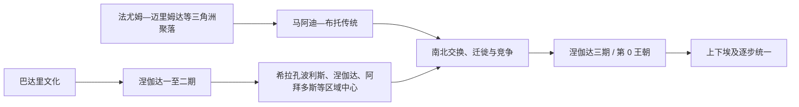

# 前王朝时期

## 时间

约前6000-前3100年。

## 概括

前王朝时期是尼罗河流域从新石器聚落、地方文化到上下埃及政治整合的阶段。此时尚未形成统一王朝国家，但农业定居、墓葬等级、区域首领、贸易网络和象征性王权已经逐步出现。

## 王朝世系 / 统治结构

| 层面 | 说明 |
|---|---|
| 地方聚落 | 尼罗河谷地和三角洲出现多个农业与手工业聚落。 |
| 区域文化 | 上埃及的涅伽达文化逐渐扩展影响，是统一前的重要文化基础。 |
| 首领权力 | 部分墓葬和器物显示社会分层、首领权威和早期战争活动。 |
| 上下埃及 | 上埃及与下埃及在地理、象征和政治传统上逐渐形成差异，后被统一王权整合。 |

## 演进图

## 重要事件

- 尼罗河流域农业、畜牧、陶器和定居聚落发展。
- 涅伽达文化扩张，上埃及政治与文化影响增强。
- 王权象征、礼仪器物、墓葬分层和早期行政标记逐渐出现。
- 上下埃及逐步走向政治整合，为早王朝时期的统一国家奠基。
- 阿拜多斯 U-j 墓、希拉孔波利斯礼仪中心及远距离贸易遗存，显示区域精英、早期记事系统和跨地区交换网络已经形成。

## 演变关系

- 前接尼罗河流域史前文化。
- 后接[早王朝时期](/%E4%BA%BA%E6%96%87%E7%A7%91%E5%AD%A6/%E5%8E%86%E5%8F%B2/%E5%8C%97%E9%9D%9E/%E5%9F%83%E5%8F%8A/%E5%8F%A4%E5%9F%83%E5%8F%8A/%E6%97%A9%E7%8E%8B%E6%9C%9D%E6%97%B6%E6%9C%9F.md)。

## 上级

- [古埃及](/%E4%BA%BA%E6%96%87%E7%A7%91%E5%AD%A6/%E5%8E%86%E5%8F%B2/%E5%8C%97%E9%9D%9E/%E5%9F%83%E5%8F%8A/%E5%8F%A4%E5%9F%83%E5%8F%8A/README.md)

## 具体发展过程

- 法尤姆、迈里姆达和巴达里等文化显示不同地区各自形成农牧、陶器和墓葬传统，不能简单视为一个民族同时出现。
- 涅伽达一至三期中，上埃及聚落规模、手工业分工和精英墓葬显著扩大；希拉孔波利斯、涅伽达、阿拜多斯成为竞争中心。
- 尼罗河、红海和黎凡特贸易带来木材、铜、酒、油与异域象征物，首领通过控制交换强化权威。
- 陶器记号、骨牌和印章逐步承担物资与身份记录功能，是文字行政的前身。
- 涅伽达文化向三角洲扩散伴随迁徙、交换和政治吸收，统一并非一次战役。

## 统治结构与转型原因

政治以聚落首领、祭祀中心、武装随从和再分配仓储为核心。干旱化促使人口向尼罗河集中，河运降低南北整合成本；上埃及精英对贸易、礼仪和暴力资源的控制推动区域国家形成。第0王朝王名证据零散，“蝎王”身份和那尔迈归属均存在争议。

## 地区差异与统一争议

下埃及的迈里姆达、法尤姆和后来的马阿迪—布托传统拥有自己的农牧技术、墓葬习惯及地中海—黎凡特交换网络，并非被动等待上埃及“带来文明”。涅伽达二至三期器物和葬俗向三角洲扩展，可能同时包含商贸网络、精英模仿、人口移动、据点兼并与军事冲突。现有材料不足以把统一归结为一次由南向北的征服。

希拉孔波利斯的大型礼仪区、阿拜多斯 U-j 墓及涅伽达精英墓显示首领已能集中粮食、手工业品和远距离进口物。罐签、印章与早期象形符号首先服务于所有权、产地和贡赋记录；书写、王权图像与行政是在国家形成过程中相互促进的。调色板和权杖头上的“击敌”“巡行”“列队”属于礼仪化政治表达，不能逐幅当作战役实录。

到涅伽达三期，上下埃及的双重地理观念、王冠、守护女神和王衔逐渐制度化。那尔迈调色板显示统一意识已经成熟，却不能单独证明他是唯一“统一者”。政治统一也不等于文化差异消失；三角洲、河谷和边疆在早王朝之后仍保有不同生产与交往方式。

## 世系

- 相关第0王朝与争议统治者见[法老世系表](/%E4%BA%BA%E6%96%87%E7%A7%91%E5%AD%A6/%E5%8E%86%E5%8F%B2/%E5%8C%97%E9%9D%9E/%E5%9F%83%E5%8F%8A/%E5%8F%A4%E5%9F%83%E5%8F%8A/%E6%B3%95%E8%80%81%E4%B8%96%E7%B3%BB%E8%A1%A8.md)。