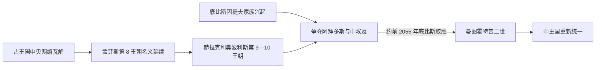

# 第一中间期

## 时间

约前2181-前2055年。

## 概括

第一中间期是古王国中央集权瓦解后的分裂阶段。地方长官和区域政权增强，赫拉克利奥波利斯和底比斯等势力竞争，埃及从金字塔时代的强中央秩序转入多中心政治。

## 王朝世系 / 统治结构

| 层面 | 说明 |
|---|---|
| 王朝范围 | 通常涉及第7-第10王朝及第11王朝早期。 |
| 北方势力 | 赫拉克利奥波利斯政权控制部分下埃及和中埃及。 |
| 南方势力 | 底比斯政权在上埃及兴起，最终推动重新统一。 |
| 地方贵族 | 诺姆长官、地方精英和区域军事实力显著增强。 |

## 演进图

## 重要事件

- 古王国后期中央财政和行政控制减弱。
- 地方政权竞争加剧，埃及长期处于分裂局面。
- 地方墓葬、文学和社会观念中出现对秩序崩解的反思。
- 底比斯第11王朝逐渐强大，为中王国统一奠定基础。
- 约前2055年，曼图霍特普二世击败赫拉克利奥波利斯政权并重新统一上下埃及，第一中间期结束。

## 演变关系

- 前接[古王国时期](/%E4%BA%BA%E6%96%87%E7%A7%91%E5%AD%A6/%E5%8E%86%E5%8F%B2/%E5%8C%97%E9%9D%9E/%E5%9F%83%E5%8F%8A/%E5%8F%A4%E5%9F%83%E5%8F%8A/%E5%8F%A4%E7%8E%8B%E5%9B%BD%E6%97%B6%E6%9C%9F.md)。
- 后接[中王国时期](/%E4%BA%BA%E6%96%87%E7%A7%91%E5%AD%A6/%E5%8E%86%E5%8F%B2/%E5%8C%97%E9%9D%9E/%E5%9F%83%E5%8F%8A/%E5%8F%A4%E5%9F%83%E5%8F%8A/%E4%B8%AD%E7%8E%8B%E5%9B%BD%E6%97%B6%E6%9C%9F.md)。

## 上级

- [古埃及](/%E4%BA%BA%E6%96%87%E7%A7%91%E5%AD%A6/%E5%8E%86%E5%8F%B2/%E5%8C%97%E9%9D%9E/%E5%9F%83%E5%8F%8A/%E5%8F%A4%E5%9F%83%E5%8F%8A/README.md)

## 分裂与竞争过程

- 第6王朝末王位快速更替，孟菲斯第8王朝名义权威局限。
- 赫拉克利奥波利斯第9—10王朝控制中埃及和三角洲部分地区，以梅里卡拉等王维持北方体系。
- 底比斯因提夫家族先控制上埃及南部，再向北争夺阿拜多斯。
- 地方总督兴建自身墓葬、组织军队和灌溉，地方社会并非全面“黑暗时代”。
- 曼图霍特普二世击败赫拉克利奥波利斯，约前2055年重新统一。

## 崩解与复兴机制

古王国财政分散、地方官世袭、低泛滥和继承危机共同造成多中心格局。地方行政与墓葬文化仍发展，棺材文使来世观念超出王室。底比斯凭上埃及资源、军队和阿蒙—蒙图崇拜整合南方，军事胜利是统一的直接条件。

## 地方社会与统一战争细节

这一时期资料高度偏向地方墓葬和后世王权文本。赫拉克利奥波利斯控制三角洲与中埃及部分地区，阿斯尤特地方家族是其南方重要盟友；底比斯因提夫家族则沿河向北争夺阿拜多斯。边界不是固定战线，地方长官可能根据军力、婚姻和经济联系改变效忠。墓志中“我在饥荒中供养全城”既可能保存低泛滥记忆，也用于塑造善治者形象，不能直接推导出全国同时陷入灾难。

地方政府仍组织渠道、畜群、武装和长途交换，工匠风格在各诺姆形成差异。《棺材文》和奥西里斯信仰的传播使非王室精英也能获得更丰富的来世仪式，这不是“宗教民主化”一次完成，而是葬祭知识逐步扩散。曼图霍特普二世先稳固上埃及，再夺取阿拜多斯和北方政治中心；统一后仍须安抚旧地方家族、重建任命和赋税网络。中王国的复兴因此同时依赖军事胜利与制度再整合。

## 世系

- 第7王朝史料空缺、第8王表及南北并立序列见[法老世系表](/%E4%BA%BA%E6%96%87%E7%A7%91%E5%AD%A6/%E5%8E%86%E5%8F%B2/%E5%8C%97%E9%9D%9E/%E5%9F%83%E5%8F%8A/%E5%8F%A4%E5%9F%83%E5%8F%8A/%E6%B3%95%E8%80%81%E4%B8%96%E7%B3%BB%E8%A1%A8.md)。