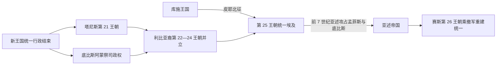

# 第三中间期

## 时间

约前1069-前664年。

## 概括

第三中间期是新王国衰落后埃及再次分裂的阶段。利比亚裔王朝、底比斯阿蒙祭司、三角洲地方政权和努比亚库施王朝先后影响埃及政治，中央统一王权长期不稳定。

## 王朝世系 / 统治结构

| 层面 | 说明 |
|---|---|
| 王朝范围 | 通常包括第21-第25王朝。 |
| 北方政权 | 三角洲地区出现塔尼斯、布巴斯提斯等中心。 |
| 南方权力 | 底比斯阿蒙祭司集团和地方统治者保持重要影响。 |
| 努比亚介入 | 库施王朝一度统一埃及，形成第25王朝。 |

## 演进图

## 重要事件

- 第21王朝时期埃及南北权力分离明显。
- 利比亚裔统治者建立第22等王朝，地方化趋势增强。
- 努比亚库施王朝北上，重塑埃及传统王权形象。
- 亚述军队先后攻占孟斐斯、底比斯，重创第25王朝在埃及的统治。
- 普萨美提克一世利用亚述撤军和地方联盟重建统一王权，第26王朝由此取代分裂格局。

## 演变关系

- 前接[新王国时期](/%E4%BA%BA%E6%96%87%E7%A7%91%E5%AD%A6/%E5%8E%86%E5%8F%B2/%E5%8C%97%E9%9D%9E/%E5%9F%83%E5%8F%8A/%E5%8F%A4%E5%9F%83%E5%8F%8A/%E6%96%B0%E7%8E%8B%E5%9B%BD%E6%97%B6%E6%9C%9F.md)。
- 后接[后期埃及时期](/%E4%BA%BA%E6%96%87%E7%A7%91%E5%AD%A6/%E5%8E%86%E5%8F%B2/%E5%8C%97%E9%9D%9E/%E5%9F%83%E5%8F%8A/%E5%8F%A4%E5%9F%83%E5%8F%8A/%E5%90%8E%E6%9C%9F%E5%9F%83%E5%8F%8A%E6%97%B6%E6%9C%9F.md)。

## 上级

- [古埃及](/%E4%BA%BA%E6%96%87%E7%A7%91%E5%AD%A6/%E5%8E%86%E5%8F%B2/%E5%8C%97%E9%9D%9E/%E5%9F%83%E5%8F%8A/%E5%8F%A4%E5%9F%83%E5%8F%8A/README.md)

## 分裂、重组与外压

- 第21王朝在塔尼斯称王，底比斯阿蒙大祭司控制上埃及，双方以婚姻维持名义统一。
- 舍顺克一世建立利比亚裔第22王朝并远征黎凡特；后代把军政职位分授亲族，反促地方割据。
- 第22、23、24王朝与地方首领同时称王，王朝编号不能视为先后全国统治。
- 库施王皮耶利用阿蒙信仰北征；第25王朝以传统法老礼仪推动建筑和文化复兴。
- 亚述的阿萨尔哈东、亚述巴尼拔多次入侵，攻陷孟菲斯并劫掠底比斯；坦沃塔玛尼退回努比亚。
- 赛斯的普萨美提克一世借亚述撤退和希腊雇佣兵重新统一。

## 结构变化

利比亚军事家族本地化、神庙土地与多座三角洲城市共同削弱单一中心；同时地方制度维持农业和宗教连续。库施统一依赖宗教合法性，却受近东帝国军力压制。亚述撤出造成权力真空，是第26王朝复兴的直接机会。

## 并立格局的细化

第 21 王朝并非简单“北王南祭司”：塔尼斯与底比斯家族通过婚姻、王女任职和共同葬祭维持合作，普苏森尼斯等北方君主仍使用完整法老王衔。利比亚麦什维什军事首领在三角洲和中埃及定居后逐渐埃及化，舍顺克一世曾恢复统一并远征黎凡特；他把儿子和亲族安置为将领、祭司的办法在短期巩固王权，长期却使职位和军力家族化。第 22—24 王朝的重叠正是同一政治网络分裂的结果，而非三个王朝整齐接续。

皮耶北征碑显示各三角洲王和地方首领既竞争又谈判归降。库施第 25 王朝借阿蒙传统、金字塔葬制与古典艺术复兴塑造合法性，并试图介入黎凡特反亚述联盟。亚述拥有更强的远程军队与帝国补给，先后攻取孟菲斯、底比斯；库施王退回努比亚后仍延续自身国家。普萨美提克一世利用亚述撤军、赛斯地方基础和希腊—卡里亚军人完成统一，第三中间期遂由外部冲击和内部再集中共同结束。

## 世系

- 第21—25王朝、底比斯祭司王权和多王并立见[法老世系表](/%E4%BA%BA%E6%96%87%E7%A7%91%E5%AD%A6/%E5%8E%86%E5%8F%B2/%E5%8C%97%E9%9D%9E/%E5%9F%83%E5%8F%8A/%E5%8F%A4%E5%9F%83%E5%8F%8A/%E6%B3%95%E8%80%81%E4%B8%96%E7%B3%BB%E8%A1%A8.md)。