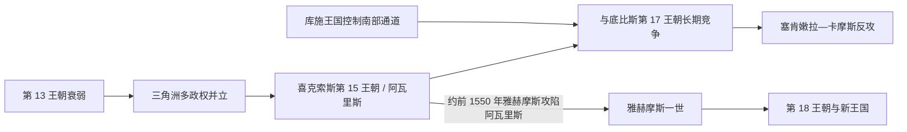

# 第二中间期

## 时间

约前1650-前1550年。

## 概括

第二中间期是中王国后期中央衰落后出现的分裂阶段。希克索斯等来自西亚方向的统治集团控制尼罗河三角洲，底比斯政权则在上埃及维持本土王权，并最终发动战争重新统一埃及。

## 王朝世系 / 统治结构

| 层面 | 说明 |
|---|---|
| 王朝范围 | 通常涉及第14-第17王朝。 |
| 北方政权 | 希克索斯第15王朝以阿瓦里斯为中心，控制三角洲和部分下埃及。 |
| 南方政权 | 底比斯第17王朝在上埃及维持本土王权。 |
| 军事变化 | 战车、复合弓等军事技术和西亚因素对埃及产生重要影响。 |

## 演进图

## 重要事件

- 希克索斯政权在三角洲建立统治中心。
- 埃及形成北方希克索斯、南方底比斯等多中心格局。
- 底比斯统治者逐步发动反希克索斯战争。
- 塞格嫩拉·陶与卡摩斯发动底比斯反攻，战争从上埃及向三角洲推进。
- 雅赫摩斯一世攻取阿瓦里斯，并追击希克索斯势力至南巴勒斯坦，开启新王国时期。

## 演变关系

- 前接[中王国时期](/%E4%BA%BA%E6%96%87%E7%A7%91%E5%AD%A6/%E5%8E%86%E5%8F%B2/%E5%8C%97%E9%9D%9E/%E5%9F%83%E5%8F%8A/%E5%8F%A4%E5%9F%83%E5%8F%8A/%E4%B8%AD%E7%8E%8B%E5%9B%BD%E6%97%B6%E6%9C%9F.md)。
- 后接[新王国时期](/%E4%BA%BA%E6%96%87%E7%A7%91%E5%AD%A6/%E5%8E%86%E5%8F%B2/%E5%8C%97%E9%9D%9E/%E5%9F%83%E5%8F%8A/%E5%8F%A4%E5%9F%83%E5%8F%8A/%E6%96%B0%E7%8E%8B%E5%9B%BD%E6%97%B6%E6%9C%9F.md)。

## 上级

- [古埃及](/%E4%BA%BA%E6%96%87%E7%A7%91%E5%AD%A6/%E5%8E%86%E5%8F%B2/%E5%8C%97%E9%9D%9E/%E5%9F%83%E5%8F%8A/%E5%8F%A4%E5%9F%83%E5%8F%8A/README.md)

## 并立与统一战争

- 第13王朝王位快速更替后，三角洲地方政权脱离中央，阿瓦里斯发展为连接黎凡特的港口中心。
- 希克索斯第15王朝可能通过渐进夺权而非一次民族入侵建立统治，并采用埃及王衔和神庙传统。
- 上埃及同时有第16、17王朝等政权，边界与臣属关系反复变化。
- 塞格嫩拉·陶可能在战争中阵亡；卡摩斯沿尼罗河北进并切断希克索斯—努比亚联盟。
- 雅赫摩斯一世攻取阿瓦里斯、追击至南巴勒斯坦并收复努比亚，完成统一。

## 军事与终结原因

战车、马、复合弓和新式兵器经西亚交流进入埃及，但底比斯胜利来自持续组织、河运和南部资源，不是单一“技术学习”。希克索斯控制范围有限、南北夹击和底比斯王室连续动员构成败亡条件；驱逐战争催生新王国的常备军和帝国防御思维。

## 区域格局与战争阶段

阿瓦里斯的西亚来源居民早在中王国已定居，经营港口、牧业、手工业和黎凡特贸易。希克索斯统治者从这一社会网络中崛起，采用埃及王衔、圣书体和塞特崇拜，同时保留部分西亚物质文化；“外来”与“埃及化”可以并存。其实际控制以三角洲和中埃及交通为核心，南方第 16、17 王朝、努比亚库施和若干地方王并未同时消失。库施一度占据下努比亚堡垒，并可能与阿瓦里斯保持外交联系，使底比斯面临南北压力。

战争大致经历塞格嫩拉·陶的冲突、卡摩斯北征和雅赫摩斯一世全面攻势。卡摩斯石碑强调截断希克索斯与库施联系，但属于胜利宣传；雅赫摩斯通过多次围攻夺取阿瓦里斯，随后追至沙鲁亨，并向南恢复努比亚。战车和复合弓增强机动作战，胜负仍取决于河运、围城、补给和底比斯王室连续动员。统一战争的记忆后来成为新王国向黎凡特建立缓冲区的重要合法性来源。

## 世系

- 第13—17王朝、希克索斯及底比斯并立王序见[法老世系表](/%E4%BA%BA%E6%96%87%E7%A7%91%E5%AD%A6/%E5%8E%86%E5%8F%B2/%E5%8C%97%E9%9D%9E/%E5%9F%83%E5%8F%8A/%E5%8F%A4%E5%9F%83%E5%8F%8A/%E6%B3%95%E8%80%81%E4%B8%96%E7%B3%BB%E8%A1%A8.md)。