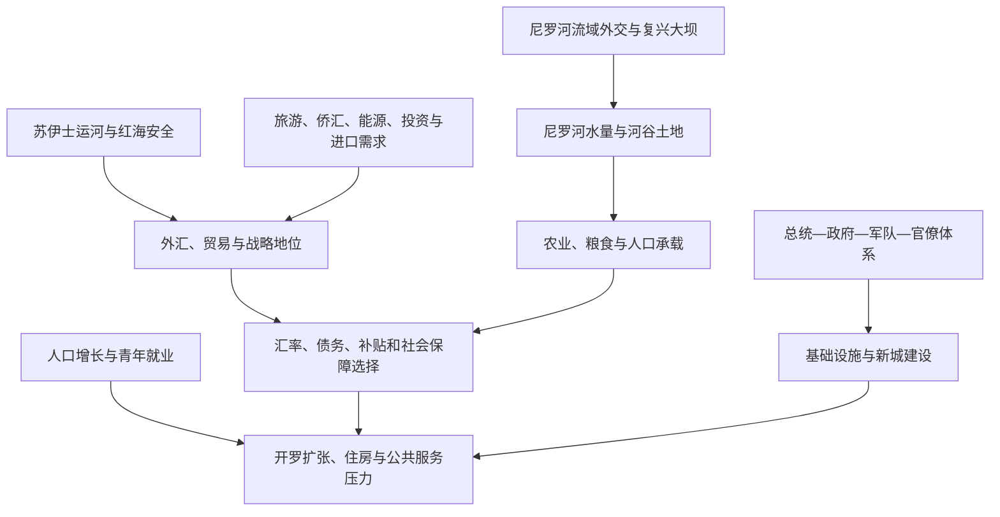

# 现代埃及

## 对象类型

跨时期专题，不是“埃及共和国”之后的新政权阶段。

## 时间

20世纪中后期至今；当代信息核验至2026年7月14日。

## 当前概况

截至核验日，埃及总统为阿卜杜勒·法塔赫·塞西，总理为穆斯塔法·马德布利。塞西于2024年4月开始新的六年任期；马德布利自2018年任总理，2024年获再任命，2026年内阁改组后仍在任。完整国家元首、集体过渡机构和总理序列见[埃及共和国国家元首与政府首脑表](/%E4%BA%BA%E6%96%87%E7%A7%91%E5%AD%A6/%E5%8E%86%E5%8F%B2/%E5%8C%97%E9%9D%9E/%E5%9F%83%E5%8F%8A/%E5%9F%83%E5%8F%8A%E5%85%B1%E5%92%8C%E5%9B%BD%E5%9B%BD%E5%AE%B6%E5%85%83%E9%A6%96%E4%B8%8E%E6%94%BF%E5%BA%9C%E9%A6%96%E8%84%91%E8%A1%A8.md)。

埃及国内人口于2026年5月达到约1.09亿，绝大多数人口集中在尼罗河谷、三角洲、开罗—吉萨都市区和运河城市。人口、可耕地和淡水在狭长空间高度集中，是理解住房、交通、粮食、就业和公共服务的基础。

## 结构关系图

## 国家治理

现行宪法下，总统是国家元首和行政权首脑，总理领导政府日常工作，众议院负责立法和预算，参议院具有咨询与立法参与功能。实际治理还依赖军队、安全机构、中央部委、各省行政和大型国有企业。军队既承担国防，也参与基础设施、制造和供应网络；其经济范围和监督程度是理解国家—市场关系的重要议题。

2014年宪法及2019年修正后的制度强化总统任命和国家机构协调。政府以道路、电力、港口、新行政首都、社会住房和“体面生活”等项目扩大基础设施与基层服务；与此同时，项目融资、征地、地方参与、债务和资源优先级持续引发讨论。政治空间、媒体、社会组织和反对派活动受到较强限制，安全与稳定常被置于制度设计核心。

## 人口、城市与社会

2026年国内人口达到约1.09亿，人口增长速度虽较过去放缓，新增就业、学校、医院和住房需求仍然庞大。开罗—吉萨是全国政治、教育、金融和交通中心，亚历山大里亚、三角洲城市和上埃及省份则面临不同产业与公共服务条件。非正规住房并非单一“贫民窟问题”，它也反映正式土地、租赁、交通和就业空间无法同步扩张。

新行政首都和沙漠新城试图分散旧开罗人口和政府职能；能否形成足够就业、公共交通和可负担住房，决定其长期效果。青年教育扩大与就业结构错位、女性劳动参与、城乡与南北差距、物价和补贴改革共同塑造家庭生活。伊斯兰、科普特基督教及多种地方传统长期共存；爱资哈尔、科普特正教会和国家宗教管理均具有公共影响。

## 尼罗河、水资源与粮食

埃及农业和饮水高度依赖尼罗河。阿斯旺高坝通过多年调节、防洪、灌溉和发电支撑现代国家，但也带来泥沙、土壤盐碱化和生态管理问题。人口增长、气候波动、污染和有限耕地迫使政府扩大渠道整治、污水再利用、海水淡化、节水灌溉与粮食进口；任何单项工程都不能取代整个流域和需求侧管理。

埃塞俄比亚复兴大坝于2025年宣布建成并投入运行。埃及政府不反对上游发展本身，但反对未经下游国家同意的单边蓄水和运行，继续要求就干旱期调度、数据交换和争端解决达成具有法律约束力的协议。苏丹内部局势又使三方协调更复杂。水问题因此同时是工程、国际法、粮食安全与国家安全问题。

## 苏伊士运河与对外通道

苏伊士运河提供外汇和战略影响，运河区港口、工业和物流项目试图把“收通行费”扩展为制造与服务网络。2015年新航道和此后的南段扩建提升部分航段通行能力与安全，但全球贸易、油价、船型和地区安全仍决定实际收益。

2023年底以后红海和曼德海峡安全危机使大量船舶绕行好望角，2024年运河船数、吨位和收入显著下降。2025—2026年出现部分恢复信号，2025/26财年上半年船数、吨位和收入同比改善；是否全面恢复仍取决于红海航运风险与国际航线选择。这说明运河既是国家资产，也是埃及无法单独控制的地缘政治风险暴露点。

## 经济结构

现代埃及经济由国家和军方关联部门、大型私人企业、广泛非正规经济和农业家庭共同构成。主要外汇来源包括侨汇、旅游、苏伊士运河、油气出口和外来投资；粮食、燃料、设备和中间品进口又产生持续外汇需求。人口规模为市场和劳动力提供优势，也放大就业、住房和补贴成本。

纳赛尔时期的公共部门、萨达特以来的开放、1990年代结构调整和2016年以来汇率—财政改革层层叠加。2020年代外部冲击、货币贬值、通胀、利息和债务服务压缩财政空间；政府一方面吸引海湾与国际融资、出售或合作开发部分资产，另一方面扩大现金转移和基本商品支持。判断改革不能只看增长率，还要观察实际工资、贫困、就业质量、进口能力和公共服务。

## 外交与安全位置

埃及同时位于阿拉伯世界、非洲、东地中海和红海四个体系：

| 方向 | 核心议题 |
|---|---|
| 巴勒斯坦—以色列 | 1979年和约提供国家间框架；拉法口岸、加沙停火斡旋、西奈安全与巴勒斯坦问题长期相连。 |
| 美国与欧洲 | 军事援助、反恐、贸易、移民、能源和人权议题并存。 |
| 海湾国家 | 投资、央行支持、劳工侨汇和地区安全合作重要，同时涉及资产、主权和经济政策选择。 |
| 尼罗河流域与非洲 | 复兴大坝、水资源、非盟外交、贸易和安全合作是重点。 |
| 利比亚、苏丹与红海 | 邻国战争、难民与移民、边境安全和航运直接影响埃及。 |
| 东地中海 | 天然气、海域划界、管线和区域论坛把能源与外交结合。 |

## 重要转折

| 时间 | 事件 | 对现代议题的影响 |
|---|---|---|
| 1956年 | 苏伊士运河国有化 | 国家主权、财政与全球航运联系确立。 |
| 1960—1970年 | 阿斯旺高坝建设并投入运行 | 重塑灌溉、电力、防洪和人口承载。 |
| 1967—1973年 | 战败、消耗战与十月战争 | 军队、财政、外交路线和西奈问题重组。 |
| 1974年以后 | 经济开放 | 外资、侨汇、进口和私人部门扩大，公共部门仍保留。 |
| 1978—1979年 | 戴维营协议与埃以和约 | 西奈归还并改变地区联盟。 |
| 1991年以后 | 结构调整与私有化 | 国家—市场关系和社会分配改变。 |
| 2011年 | 全国抗议与穆巴拉克辞职 | 政治秩序进入连续过渡和重组。 |
| 2013—2014年 | 穆尔西被解除职务、新宪法与塞西就任 | 当代治理结构形成。 |
| 2015年 | 新苏伊士运河航段启用 | 航运能力与国家发展叙事加强。 |
| 2016年以后 | 汇率和财政改革 | 外汇配置、物价、债务和社会保障成为政策核心。 |
| 2023年底以后 | 红海航运危机 | 运河收入和外汇对地区安全的敏感性凸显。 |
| 2024年 | 塞西开始新总统任期 | 当前政策周期延续。 |
| 2025年 | 埃塞俄比亚宣布复兴大坝建成运行 | 尼罗河调度与法律协议问题进入运行期。 |

## 核心张力

- **集中能力与问责**：强中央有利于快速建设和危机动员，也可能压缩地方反馈、竞争和独立监督。
- **基础设施与财政承受力**：工程可改善供给和连接，但需与债务、维护、就业和公共服务回报比较。
- **人口规模与机会**：庞大人口既是市场与劳动力，也是教育、住房、粮食和水资源压力。
- **战略通道与外部脆弱性**：运河、旅游、侨汇和能源带来外汇，也暴露于战争、航运和全球金融波动。
- **尼罗河依赖与区域合作**：水安全无法只靠国内工程，必须与上游发展、气候和跨境规则共同处理。

## 演变关系

- 本专题位于[埃及共和国](/%E4%BA%BA%E6%96%87%E7%A7%91%E5%AD%A6/%E5%8E%86%E5%8F%B2/%E5%8C%97%E9%9D%9E/%E5%9F%83%E5%8F%8A/%E5%9F%83%E5%8F%8A%E5%85%B1%E5%92%8C%E5%9B%BD.md)内部，二者是“政体主线—跨时期专题”，不是前后继承。
- 近代制度背景来自[穆罕默德·阿里王朝](/%E4%BA%BA%E6%96%87%E7%A7%91%E5%AD%A6/%E5%8E%86%E5%8F%B2/%E5%8C%97%E9%9D%9E/%E5%9F%83%E5%8F%8A/%E7%A9%86%E7%BD%95%E9%BB%98%E5%BE%B7%C2%B7%E9%98%BF%E9%87%8C%E7%8E%8B%E6%9C%9D.md)和[英国占领与埃及王国](/%E4%BA%BA%E6%96%87%E7%A7%91%E5%AD%A6/%E5%8E%86%E5%8F%B2/%E5%8C%97%E9%9D%9E/%E5%9F%83%E5%8F%8A/%E8%8B%B1%E5%9B%BD%E5%8D%A0%E9%A2%86%E4%B8%8E%E5%9F%83%E5%8F%8A%E7%8E%8B%E5%9B%BD.md)。
- 区域比较见[北非](/%E4%BA%BA%E6%96%87%E7%A7%91%E5%AD%A6/%E5%8E%86%E5%8F%B2/%E5%8C%97%E9%9D%9E/README.md)、[西亚通史](/%E4%BA%BA%E6%96%87%E7%A7%91%E5%AD%A6/%E5%8E%86%E5%8F%B2/%E8%A5%BF%E4%BA%9A/_%E9%80%9A%E5%8F%B2/README.md)与[撒哈拉以南非洲](/%E4%BA%BA%E6%96%87%E7%A7%91%E5%AD%A6/%E5%8E%86%E5%8F%B2/%E9%9D%9E%E6%B4%B2/README.md)。

## 上级

- [埃及](/%E4%BA%BA%E6%96%87%E7%A7%91%E5%AD%A6/%E5%8E%86%E5%8F%B2/%E5%8C%97%E9%9D%9E/%E5%9F%83%E5%8F%8A/README.md)
