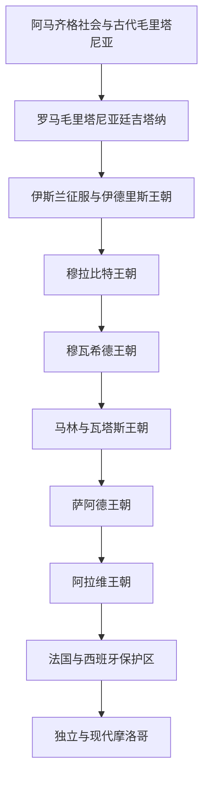

# 摩洛哥历史

## 概括

摩洛哥位于马格里布最西端，同时面向大西洋、地中海、撒哈拉和伊比利亚。古代阿马齐格社会、罗马毛里塔尼亚行省、伊斯兰王朝、跨撒哈拉贸易和安达卢斯联系共同塑造其历史。与阿尔及利亚和突尼斯不同，近世摩洛哥没有长期成为奥斯曼行省，而由萨阿德和阿拉维王朝维持独立苏丹国传统。

## 演进图

## 历史主线

摩洛哥国家形成并非直线继承，而是城市、部族联盟、宗教声望与王朝军队不断重组的结果。伊德里斯王朝奠定非斯和谢里夫王权传统；穆拉比特与穆瓦希德把摩洛哥、撒哈拉和安达卢斯连为跨海帝国；阿拉维王朝自17世纪延续至现代，在殖民保护国时期仍保留苏丹制度，并成为独立后的君主制核心。

## 阶段导航

| 顺序 | 阶段 | 时间 | 入口 | 简要概括 |
|---:|---|---|---|---|
| 1 | 古代毛里塔尼亚、伊德里斯与早期国家 | 古代—约11世纪 | [古代毛里塔尼亚、伊德里斯与早期国家](/%E4%BA%BA%E6%96%87%E7%A7%91%E5%AD%A6/%E5%8E%86%E5%8F%B2/%E5%8C%97%E9%9D%9E/%E6%91%A9%E6%B4%9B%E5%93%A5/%E5%8F%A4%E4%BB%A3%E6%AF%9B%E9%87%8C%E5%A1%94%E5%B0%BC%E4%BA%9A%E3%80%81%E4%BC%8A%E5%BE%B7%E9%87%8C%E6%96%AF%E4%B8%8E%E6%97%A9%E6%9C%9F%E5%9B%BD%E5%AE%B6.md) | 阿马齐格社会、罗马边疆、伊斯兰征服与非斯国家形成 |
| 2 | 穆拉比特至阿拉维王朝 | 约11世纪—1912年 | [穆拉比特至阿拉维王朝](/%E4%BA%BA%E6%96%87%E7%A7%91%E5%AD%A6/%E5%8E%86%E5%8F%B2/%E5%8C%97%E9%9D%9E/%E6%91%A9%E6%B4%9B%E5%93%A5/%E7%A9%86%E6%8B%89%E6%AF%94%E7%89%B9%E8%87%B3%E9%98%BF%E6%8B%89%E7%BB%B4%E7%8E%8B%E6%9C%9D.md) | 跨撒哈拉与安达卢斯帝国、地方王朝和近世苏丹国 |
| 3 | 保护国、独立与现代摩洛哥 | 1912年至今 | [保护国、独立与现代摩洛哥](/%E4%BA%BA%E6%96%87%E7%A7%91%E5%AD%A6/%E5%8E%86%E5%8F%B2/%E5%8C%97%E9%9D%9E/%E6%91%A9%E6%B4%9B%E5%93%A5/%E4%BF%9D%E6%8A%A4%E5%9B%BD%E3%80%81%E7%8B%AC%E7%AB%8B%E4%B8%8E%E7%8E%B0%E4%BB%A3%E6%91%A9%E6%B4%9B%E5%93%A5.md) | 法西保护区、民族运动、独立君主国与西撒哈拉问题 |

## 重要转折与时间节点

| 时间 | 事件 | 意义 |
|---|---|---|
| 788年 | 伊德里斯一世建立统治 | 谢里夫王权和早期伊斯兰摩洛哥的重要起点 |
| 11世纪中叶 | 穆拉比特兴起 | 摩洛哥、撒哈拉商路和安达卢斯被连接 |
| 1147年 | 穆瓦希德攻占马拉喀什 | 新王朝取代穆拉比特并建立更大帝国 |
| 16世纪 | 萨阿德王朝巩固 | 抵抗葡萄牙扩张并控制跨撒哈拉远征 |
| 1666年前后 | 阿拉维王朝统一主要地区 | 延续至现代的王朝秩序形成 |
| 1912年 | 《非斯条约》 | 法国保护国建立，西班牙控制北部和南部部分区域 |
| 1956年 | 摩洛哥恢复独立 | 保护国体制终结，君主国重建主权 |
| 1975年 | 绿色进军与西班牙撤离西撒哈拉 | 摩洛哥与西撒哈拉争议进入长期阶段 |
| 2011年 | 宪法改革 | 地区抗议背景下调整君主制与政府关系 |

## 相关笔记

- 上级：[北非历史](/%E4%BA%BA%E6%96%87%E7%A7%91%E5%AD%A6/%E5%8E%86%E5%8F%B2/%E5%8C%97%E9%9D%9E/README.md)
- 地区争议：[西撒哈拉](/%E4%BA%BA%E6%96%87%E7%A7%91%E5%AD%A6/%E5%8E%86%E5%8F%B2/%E5%8C%97%E9%9D%9E/%E8%A5%BF%E6%92%92%E5%93%88%E6%8B%89/README.md)
- 区域社会：[阿马齐格人、阿拉伯化与北非社会](/%E4%BA%BA%E6%96%87%E7%A7%91%E5%AD%A6/%E5%8E%86%E5%8F%B2/%E5%8C%97%E9%9D%9E/%E9%98%BF%E9%A9%AC%E9%BD%90%E6%A0%BC%E4%BA%BA%E3%80%81%E9%98%BF%E6%8B%89%E4%BC%AF%E5%8C%96%E4%B8%8E%E5%8C%97%E9%9D%9E%E7%A4%BE%E4%BC%9A.md)
- 撒哈拉联系：[撒哈拉商路、游牧网络与萨赫勒联系](/%E4%BA%BA%E6%96%87%E7%A7%91%E5%AD%A6/%E5%8E%86%E5%8F%B2/%E5%8C%97%E9%9D%9E/%E6%92%92%E5%93%88%E6%8B%89%E5%95%86%E8%B7%AF%E3%80%81%E6%B8%B8%E7%89%A7%E7%BD%91%E7%BB%9C%E4%B8%8E%E8%90%A8%E8%B5%AB%E5%8B%92%E8%81%94%E7%B3%BB.md)

## 目录层级

- 直接上级：[北非](/%E4%BA%BA%E6%96%87%E7%A7%91%E5%AD%A6/%E5%8E%86%E5%8F%B2/%E5%8C%97%E9%9D%9E/README.md)
- 历史总览：[历史](/%E4%BA%BA%E6%96%87%E7%A7%91%E5%AD%A6/%E5%8E%86%E5%8F%B2/README.md)
