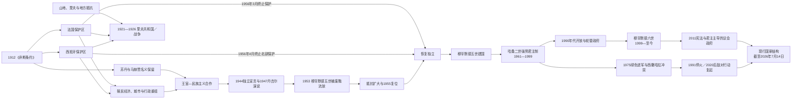

# 摩洛哥的保护国、独立与现代国家

## 时间

1912年—2026年7月14日

## 概括

1912年《非斯条约》没有废除摩洛哥王朝，而是在苏丹和马赫赞名义下建立多重殖民统治：法国驻节总监掌握大部分领土的军事、外交、财政和重要行政权；西班牙高级专员控制北部保护区，另有南部地带；丹吉尔后来成为国际区。殖民国家通过战争、地方中介、土地制度、港口、铁路和城市规划重组社会，但里夫共和国、山地与乡村抵抗、城市民族主义、工会、王室和国际环境持续挑战其合法性。

1953年法国流放苏丹穆罕默德五世，原想把王室与民族主义分离，反而使复位成为全国性主权诉求。1955年苏丹回国，1956年法国和西班牙结束主要保护安排。独立后的摩洛哥没有转为共和国，而由王室控制军队、宗教权威和国家行政，在政党、议会与地方精英之间重建强势君主制。

哈桑二世时期的宪法政治与紧急统治、政变企图、“铅色年代”、绿色进军和西撒哈拉战争共同塑造国家。穆罕默德六世时期出现家庭法、人权、社会保护与基础设施改革，2011年宪法扩大政府和议会的明文权限；国王仍掌握宗教、军事、安全、战略政策和重要任命权。西撒哈拉最终地位截至2026年7月14日仍未解决。

## 演进图

## 一、保护国的建立与实际权力结构

### 从列强干预到多重保护区

1907年后法国已占领乌季达并进入卡萨布兰卡。1911年非斯被围，苏丹阿卜杜勒·哈菲兹请求法军救援；德国派舰至阿加迪尔，法德通过殖民补偿避免战争。1912年3月30日《非斯条约》规定法国“改革”摩洛哥行政并负责对外与安全，实质上把主权交给驻节总监。苏丹数月后退位，优素福继位。

1912年11月法西协定划出西班牙保护区。北部以得土安为中心，由苏丹任命的哈里发保留礼仪、司法和法令名义，西班牙高级专员掌实权；南部塔尔法亚一带另受西班牙控制。丹吉尔因海峡战略和多国利益，于1923年协定后形成国际行政区。伊夫尼和西属撒哈拉属于另外的西班牙殖民安排，不应与北部保护区混为一谈。

法国和西班牙殖民行政首脑的完整名录及任期见[摩洛哥保护国殖民行政首脑表](/%E4%BA%BA%E6%96%87%E7%A7%91%E5%AD%A6/%E5%8E%86%E5%8F%B2/%E5%8C%97%E9%9D%9E/%E6%91%A9%E6%B4%9B%E5%93%A5/%E6%91%A9%E6%B4%9B%E5%93%A5%E4%BF%9D%E6%8A%A4%E5%9B%BD%E6%AE%96%E6%B0%91%E8%A1%8C%E6%94%BF%E9%A6%96%E8%84%91%E8%A1%A8.md)。

### 殖民统治机制

| 领域 | 正式安排 | 实际运作与影响 |
|---|---|---|
| 国家元首 | 阿拉维苏丹继续颁布达希尔并接受效忠 | 法国驻节总监决定战略政策；西班牙区以哈里发转达名义权威。 |
| 军事与治安 | 宣称恢复秩序、保护苏丹 | 殖民军、外籍军团、本地辅助军和航空兵逐步征服内陆，警察与情报压制政治组织。 |
| 地方行政 | 保留帕夏、卡伊德、部族首领和伊斯兰法院 | 殖民官监督或重组地方权威，选择盟友、划定“习惯法”区并控制任命。 |
| 土地与农业 | 登记、测量、公共土地和现代产权制度 | 定居者、公司及地方精英取得高价值土地，商品农业扩大，乡村失地与劳工迁移增加。 |
| 城市与基础设施 | 建设“新城”、港口、铁路、公路和公共卫生 | 设施促进贸易和城市化，却以欧洲新城与旧城分离、资源外运和战略控制为优先。 |
| 财政与货币 | 海关、税制、银行和预算“改革” | 关税与债务受外部控制，摩洛哥国家收入服务殖民行政与贷款偿付。 |
| 教育与法律 | 法国、西班牙学校与有限本地教育并存 | 教育机会分层；1930年所谓“柏柏尔法令”被民族主义者视为分化穆斯林共同体的象征。 |

“间接统治”并不意味着殖民干预较轻。苏丹和地方首领的保留降低行政成本，也让殖民命令披上传统法令形式；当王室拒绝配合时，殖民当局仍可废黜苏丹。

## 二、征服战争、里夫共和国与社会重组

签约后殖民者仍需用二十多年征服广大地区。扎扬联盟在中阿特拉斯抵抗法国，1914年赫尼夫拉附近法军遭重创；南部和阿特拉斯多支力量坚持到1930年代。所谓“平定”包括军事占领、封锁、强制迁移和与地方首领结盟，1934年前后法国才宣称主要征服完成。

西班牙在里夫推进引发更大危机。1921年，阿卜杜勒·克里姆领导的里夫军在安瓦勒击溃西班牙军，建立以议事机构、税收和军队为基础的里夫共和国。它既是地方国家建设，也具有反殖民主权诉求。1925年里夫军进入法国控制区后，法国与西班牙投入大军、海空力量并实施两栖登陆；西班牙军使用化学武器的历史证据明确。阿卜杜勒·克里姆于1926年投降，流亡后仍参与马格里布反殖民活动。

殖民经济扩大卡萨布兰卡、拉巴特、港口和磷酸盐产业，形成欧洲定居者、摩洛哥商人与工人并存的城市社会。乡村税负、土地集中和人口增长推动迁移；工会、学生、乌里玛和新式社团因此获得新的组织场所。

## 三、民族主义、王室与独立

### 从改革诉求到主权诉求

1930年“柏柏尔法令”把部分阿马齐格地区的习惯司法从伊斯兰法院体系中区分出来。其实际法律范围和殖民前地方习惯均复杂，但城市活动者把它解释为殖民者“分而治之”，通过清真寺祈祷、请愿和报刊建立跨地区民族主义语言。1934年改革行动委员会提出改革方案，最初仍要求在保护条约框架内恢复摩洛哥权利。

二战改变力量关系。1942年盟军“火炬行动”登陆摩洛哥，维希体系崩溃；1943年卡萨布兰卡会议让穆罕默德五世接触盟国领导人。1944年独立党发表独立宣言，明确要求主权和君主领导。法国镇压示威，却无法恢复战前秩序。1947年穆罕默德五世在丹吉尔演说强调摩洛哥统一和阿拉伯—伊斯兰归属，王室与民族主义联盟更加公开。

### 1953年废黜为何失败

法国驻节当局与部分帕夏、地方名流组织反苏丹压力，1953年8月废黜并流放穆罕默德五世，扶立王族旁支穆罕默德·本·阿拉法。殖民当局希望保留王制外壳、切断独立党与王室联系，结果却产生三个反效果：

1. 苏丹从政争参与者转化为民族主权象征。
2. 本·阿拉法缺乏广泛效忠，传统合法性与殖民强制直接捆绑。
3. 城市武装行动、罢工、乡村“解放军”和国际反殖民压力同时增加。

法国在越南失败、阿尔及利亚战争爆发和国内政策变化后转向谈判。本·阿拉法1955年退位，穆罕默德五世11月回国。1956年3月法国承认独立，4月西班牙结束北部保护安排；丹吉尔同年并入。塔尔法亚1958年移交，伊夫尼1969年移交，西属撒哈拉则在1975年形成另一场未决冲突。

## 四、独立建国与哈桑二世时期

### 穆罕默德五世：整合而非简单复旧

独立政府必须合并法、西、丹吉尔不同的法律、军队、货币与行政体系。王室建立摩洛哥皇家武装力量，吸收部分殖民军摩洛哥士兵和抵抗者，却防止任何政党独占军队。独立党内部及其与王室围绕制宪、外交和社会改革发生分歧；1959年全国人民力量联盟分裂出来。穆罕默德五世先让政治家组阁，1960年又亲任政府首脑，加强宫廷对行政的控制。1957年他由“苏丹”改称“国王”。

### 哈桑二世：宪法、紧急统治与王权集中

哈桑二世1961年即位，1962年首部宪法确立世袭君主制、议会和政府，但国王保留广泛任命、解散议会和紧急权。1965年卡萨布兰卡学生与社会抗议遭强力镇压，国王宣布例外状态并亲自领导政府；同年反对派领袖迈赫迪·本·巴尔卡在巴黎失踪，成为国家暴力争议的标志。

1971年斯希拉特宫军事政变和1972年袭击王室专机均失败。此后哈桑二世重组军队、安全机构和精英联盟，以王室赞助、地方行政、政党管理和选举维持统治。“铅色年代”中，左翼、军人、撒哈拉与其他反对者遭秘密拘禁、酷刑、强迫失踪或不公审判；其规模和责任在后来真相调查中获得部分确认。

### 西撒哈拉与政权整合

1975年国际法院咨询意见承认西撒哈拉部分部族与摩洛哥、毛里塔尼亚有法律联系，但没有确认足以取消当地人民自决的主权关系。哈桑二世随后组织约35万人参加绿色进军；《马德里协定》后西班牙撤离，摩洛哥和毛里塔尼亚分别进入。波利萨里奥阵线宣布撒哈拉阿拉伯民主共和国并展开战争，阿尔及利亚提供后方支持。毛里塔尼亚1979年退出，摩洛哥控制其原占区并在1980年代建设防御墙。

这一议题既是领土冲突，也帮助王室把军队、政党和民族主义整合到“领土完整”共识中。战争成本、国际外交和僵局促成1991年联合国主持的停火及西撒哈拉全民投票特派团部署，但选民资格与政治方案争议使公投未举行。

### 经济调整与1990年代开放

1970年代磷酸盐繁荣后，债务、油价和战争开支导致财政危机；1980年代结构调整、物价上涨和失业引发卡萨布兰卡等地抗议。1990年代，国际人权压力、国内社会变化和继承安排推动释放部分政治犯、修宪和扩大反对派参政。1998年，反对派领袖阿卜杜勒·拉赫曼·优素菲出任“轮替政府”首相；这是重要开放，但内政、安全和战略领域仍受王室核心掌握。

## 五、穆罕默德六世时期的改革与国家结构

### 改革、连续性与社会压力

穆罕默德六世1999年即位后，释放或允许部分流亡者回国，2004年设公平与和解委员会调查1956—1999年严重侵权并给予赔偿；委员会不公开追究个人刑责，因此既是地区少见的官方真相机制，也有问责局限。2004年家庭法改革提高女性婚姻、离婚和监护中的法律地位，落实仍受司法能力和社会差异影响。

2003年卡萨布兰卡爆炸后，反恐法律、安全行动和宗教管理加强。基础设施、丹吉尔港、可再生能源、工业和旅游扩大国家能力与国际连接，同时地区、城乡、青年就业与公共服务差距持续。2016—2017年里夫“希拉克”抗议及其他地方运动显示发展成果分布不均。

### 2011年宪法与政府轮替

“二月二十日运动”在2011年要求反腐、社会公正与真正权力分立。国王迅速提出修宪并举行公投。新宪法把阿马齐格语列为官方语言，确认更多权利，规定国王从众议院选举第一大党任命政府首脑，并扩大政府对行政和立法的职责。

但宪法同时规定国王为国家元首、信士长、军队最高统帅和机构间最高仲裁者；国王主持部长会议、安全委员会和司法权力最高委员会，并参与战略政策及重要任命。因此，现代摩洛哥既不是国王只履行礼仪的议会君主制，也不是没有选举和政府责任的纯个人统治；权力在王宫、政府、议会、官僚—安全机构、政党和经济精英之间分配，但战略中枢明显偏向王室。

正义与发展党在2011年选举居首，本基兰出任政府首脑；2016年选后组阁僵局导致其于2017年被同党奥斯曼尼取代。2021年，自由人士全国联盟赢得最多议席，党魁阿齐兹·阿赫努什获任政府首脑。2024年内阁调整后，他截至2026年7月14日仍在任。

### 当前正式与实际权力结构

| 角色／机构 | 产生方式 | 宪法与政治作用 | 截至2026年7月14日 |
|---|---|---|---|
| 国王 | 阿拉维王朝男性直系继承 | 国家元首、信士长、军队最高统帅；主持部长会议与安全委员会，掌握战略和重要任命权 | **穆罕默德六世**，1999年7月23日起在位。 |
| 政府首脑 | 国王从众议院选举第一大党中任命 | 领导政府会议、协调公共政策、提议部长并对众议院政府纲领负责 | **阿齐兹·阿赫努什**，自由人士全国联盟，2021年9月10日获任。 |
| 政府 | 国王依政府首脑建议任命部长 | 执行法律和公共政策，管理行政；战略事项须经国王主持的部长会议 | 由多党联盟组成。 |
| 议会 | 众议院直接选举；参议院由地方、职业和劳工选举团间接产生 | 立法、预算、质询与不信任程序 | 两院制，选举竞争真实但政策空间受王室权限和政党碎片化影响。 |
| 司法权力最高委员会 | 法官代表及宪法规定成员组成，国王主持 | 保障司法制度并参与法官任命 | 宪法宣示司法独立，国王是司法独立保障者。 |
| 王宫与高级行政网络 | 宪法职权、王室顾问、战略机构、瓦利与总督体系 | 在安全、宗教、外交、重大投资和领土议题中影响突出 | 与民选政府并存，不能把两者误写为完全分离的“双政府”。 |

## 国家元首

| 顺序 | 国家元首 | 在位 | 政体／说明 |
|---:|---|---|---|
| 1 | 苏丹优素福 | 1912—1927年 | 法西保护国下的名义国家元首。 |
| 2 | **苏丹穆罕默德五世** | 1927—1953年 | 后期与民族主义合作，被殖民当局废黜。 |
| 争议 | 穆罕默德·本·阿拉法 | 1953—1955年 | 法国当局扶立；独立后国家不承认其正统性。 |
| 2复位 | **穆罕默德五世** | 1955—1961年 | 1956年恢复主权；1957年由苏丹改称国王。 |
| 3 | 哈桑二世 | 1961—1999年 | 强势宪政君主制形成。 |
| 4 | **穆罕默德六世** | 1999年至今 | 现任国王，核验截至2026年7月14日。 |

更早统治者、复位和王族关系见[摩洛哥君主世系表](/%E4%BA%BA%E6%96%87%E7%A7%91%E5%AD%A6/%E5%8E%86%E5%8F%B2/%E5%8C%97%E9%9D%9E/%E6%91%A9%E6%B4%9B%E5%93%A5/%E6%91%A9%E6%B4%9B%E5%93%A5%E5%90%9B%E4%B8%BB%E4%B8%96%E7%B3%BB%E8%A1%A8.md)。

## 历届政府首脑

| 顺序 | 政府首脑 | 任期 | 角色与说明 |
|---:|---|---|---|
| 1 | 姆巴雷克·贝卡伊 | 1955—1958年 | 首届政府委员会主席，跨越保护国末期与独立初期。 |
| 2 | 艾哈迈德·巴拉弗雷杰 | 1958年 | 独立党领袖，兼外交事务。 |
| 3 | 阿卜杜拉·易卜拉欣 | 1958—1960年 | 推动经济自主和外交调整，与王宫分歧后离任。 |
| 4 | 国王穆罕默德五世 | 1960—1961年 | 亲自任政府委员会主席。 |
| 5 | 国王哈桑二世 | 1961—1963年 | 即位初期亲自领导政府。 |
| 6 | 艾哈迈德·巴赫尼尼 | 1963—1965年 | 宪法政府首脑，1965年例外状态前离任。 |
| 7 | 国王哈桑二世 | 1965—1967年 | 例外状态下再次亲自领导政府。 |
| 8 | 穆罕默德·本希马 | 1967—1969年 | 首相。 |
| 9 | 艾哈迈德·拉腊基 | 1969—1971年 | 首相。 |
| 10 | 穆罕默德·卡里姆·拉姆拉尼 | 1971—1972年 | 第一次任首相。 |
| 11 | 艾哈迈德·奥斯曼 | 1972—1979年 | 长期首相，绿色进军与西撒哈拉战争初期在任。 |
| 12 | 马阿提·布阿比德 | 1979—1983年 | 首相，经济紧缩和社会抗议时期。 |
| 13 | 穆罕默德·卡里姆·拉姆拉尼 | 1983—1986年 | 第二次任首相。 |
| 14 | 阿兹丁·拉腊基 | 1986—1992年 | 首相。 |
| 15 | 穆罕默德·卡里姆·拉姆拉尼 | 1992—1994年 | 第三次任首相。 |
| 16 | 阿卜杜勒拉蒂夫·菲拉利 | 1994—1998年 | 首相兼外交事务，开放和轮替谈判时期。 |
| 17 | **阿卜杜勒·拉赫曼·优素菲** | 1998—2002年 | 反对派领袖主持轮替政府。 |
| 18 | 德里斯·杰图 | 2002—2007年 | 无党派技术官僚首相。 |
| 19 | 阿巴斯·法西 | 2007—2012年 | 独立党首相，任内发生2011年抗议与修宪。 |
| 20 | 阿卜杜勒-伊拉·本基兰 | 2012—2017年 | 2011年宪法后首位“政府首脑”，正义与发展党。 |
| 21 | 萨阿德丁·奥斯曼尼 | 2017—2021年 | 正义与发展党，组建多党联盟。 |
| 22 | **阿齐兹·阿赫努什** | 2021年至今 | 自由人士全国联盟；截至2026年7月14日仍任政府首脑。 |

表内按完整执政阶段合并同一人连续改组的多届内阁；这比把每次小改组误列为新首脑更适合通史阅读。

## 六、西撒哈拉问题截至2026年7月

1975年后，摩洛哥控制西撒哈拉大部分人口中心、海岸和防御墙以西地区，波利萨里奥阵线及其宣布的撒哈拉阿拉伯民主共和国控制防御墙以东、以南部分地带并以阿尔及利亚廷杜夫难民营为政治后方。联合国仍把西撒哈拉列入非自治领土，摩洛哥主张主权并提出自治方案，波利萨里奥坚持包含独立选项的自决；不同国家的承认和政策并不一致。

1991年停火后，联合国特派团原拟配合公投，但选民资格和政治方案长期僵持。2020年盖尔盖拉特危机后，波利萨里奥宣布停火结束，低强度敌对行动恢复。联合国安理会第2797号决议把特派团任期延长至2026年10月31日；截至2026年7月14日，谈判仍未形成双方接受的最终地位安排。正文应始终区分摩洛哥的实际控制与主权主张、波利萨里奥的主张与有限控制、外国双边立场以及联合国非殖民化框架。

详见[西撒哈拉历史](/%E4%BA%BA%E6%96%87%E7%A7%91%E5%AD%A6/%E5%8E%86%E5%8F%B2/%E5%8C%97%E9%9D%9E/%E8%A5%BF%E6%92%92%E5%93%88%E6%8B%89/README.md)。

## 重要事件与时间节点

| 时间 | 事件 | 结果与长期影响 |
|---|---|---|
| 1912年 | 《非斯条约》与法西协定 | 法国、西班牙保护区及保留苏丹的多重殖民结构形成。 |
| 1914年 | 扎扬抵抗重创法军 | 表明条约签署不等于领土已被征服。 |
| 1921年 | 安瓦勒战役与里夫共和国兴起 | 西班牙军政危机，反殖民国家建设达到高点。 |
| 1925—1926年 | 法西联合进攻里夫 | 里夫共和国失败，殖民军事控制扩大。 |
| 1930年 | “柏柏尔法令”争议 | 城市民族主义借反分化动员形成全国政治语言。 |
| 1942年 | “火炬行动”登陆 | 维希殖民秩序被盟军重组。 |
| 1944年 | 独立党发表独立宣言 | 改革要求转为明确主权诉求。 |
| 1947年 | 穆罕默德五世丹吉尔演说 | 王室与民族主义联盟公开化。 |
| 1953年 | 苏丹被废黜流放 | 殖民策略反而把复位与独立合并为全国诉求。 |
| 1955—1956年 | 苏丹复位、法国和西班牙结束保护 | 摩洛哥恢复主权并开始行政整合。 |
| 1962年 | 首部宪法 | 君主制、政府和议会的制度框架形成。 |
| 1965年 | 卡萨布兰卡抗议、例外状态、本·巴尔卡失踪 | 王权集中和“铅色年代”加深。 |
| 1971、1972年 | 两次军事政变企图 | 王室强化军队与安全控制。 |
| 1975年 | 国际法院意见、绿色进军和《马德里协定》 | 西撒哈拉冲突进入现阶段。 |
| 1980年代 | 防御墙、战争与结构调整 | 领土控制趋于固化，经济紧缩引发社会抗议。 |
| 1991年 | 联合国停火与特派团部署 | 大规模战争暂停，公投与最终地位仍未解决。 |
| 1998年 | 优素菲轮替政府 | 反对派首次在王室框架下主导政府。 |
| 1999年 | 穆罕默德六世即位 | 改革与王室战略连续性并行。 |
| 2004年 | 家庭法改革、公平与和解委员会 | 性别法与国家暴力记忆处理出现重要变化。 |
| 2011年 | 二月二十日运动与修宪 | 政府明文权限扩大，王室战略权力保留。 |
| 2020年 | 盖尔盖拉特危机及敌对行动复起 | 1991年停火框架受到实质破坏。 |
| 2021年 | 自由人士全国联盟胜选、阿赫努什组阁 | 政府轮替，正义与发展党大幅失势。 |
| 2023年 | 高阿特拉斯地震 | 山区救援、住房和地区发展差距成为国家治理考验。 |
| 2025—2026年 | 联合国继续延长西撒哈拉特派团 | 最终地位未决，外交推进与低强度冲突并存。 |

## 建立、稳定、危机与改革的因果层次

| 阶段 | 结构因素 | 组织与政策 | 直接转折 |
|---|---|---|---|
| 保护国建立 | 军事技术差距、外债、关税受控、列强竞争 | 驻节总监和高级专员借苏丹法令、地方首领与殖民军统治 | 1911年非斯危机和法德交易后签署《非斯条约》。 |
| 民族独立 | 城市化、教育、工人组织、战后反殖民环境 | 独立党、王室、抵抗组织和外交压力形成多层联盟 | 1953年废黜苏丹使殖民合法性崩塌。 |
| 君主制巩固 | 王室拥有宗教声望、军队和全国行政，政党碎片化 | 宪法、地方行政、精英联盟、安全机构和领土民族主义 | 1965年例外状态及1971—1972年政变失败强化集中。 |
| 1990年代开放 | 社会结构变化、人权压力、继承需要和经济改革 | 释放政治犯、修宪、轮替政府 | 1998年优素菲组阁。 |
| 2011年改革 | 地区抗议、青年失业、反腐和尊严诉求 | 快速修宪、扩大政府权限并保留王室战略领域 | 公投与随后选举吸收部分抗议动能。 |
| 当前挑战 | 地区差距、气候与水资源、就业、公共服务、西撒哈拉僵局 | 社会保护、基础设施、产业政策、地方治理和安全外交 | 尚无单一终局；改革、集中与社会压力同时存在。 |

## 争议与辨析

- 摩洛哥是保护国而非名义上被废国，但主权受制是真实的；不能因苏丹保留就淡化殖民统治。
- “柏柏尔法令”确有殖民分类和司法重组背景，其被民族主义宣传描述的“强迫基督教化”并非条文本身内容；应区分法律、政治解读和动员效果。
- 独立不是法国单方面“授予”，也不是单一政党或王室独自取得，而是抵抗、罢工、王室合法性、谈判和国际环境共同作用。
- 现代政府和议会具有真实政策与选举功能，但国王不是礼仪元首；制度描述必须同时写出两层权力。
- 西撒哈拉不得只用摩洛哥行政区划呈现，也不能把波利萨里奥主张写成已获普遍承认的主权；实际控制、主权主张和联合国地位需分列。
- 2011年宪法既改变政府任命与权利条文，也保留王室关键权力；“完全不变”和“已经议会化”都是过度概括。

## 演变关系

- 前一阶段：[穆拉比特至阿拉维王朝](/%E4%BA%BA%E6%96%87%E7%A7%91%E5%AD%A6/%E5%8E%86%E5%8F%B2/%E5%8C%97%E9%9D%9E/%E6%91%A9%E6%B4%9B%E5%93%A5/%E7%A9%86%E6%8B%89%E6%AF%94%E7%89%B9%E8%87%B3%E9%98%BF%E6%8B%89%E7%BB%B4%E7%8E%8B%E6%9C%9D.md)
- 王朝世系：[摩洛哥君主世系表](/%E4%BA%BA%E6%96%87%E7%A7%91%E5%AD%A6/%E5%8E%86%E5%8F%B2/%E5%8C%97%E9%9D%9E/%E6%91%A9%E6%B4%9B%E5%93%A5/%E6%91%A9%E6%B4%9B%E5%93%A5%E5%90%9B%E4%B8%BB%E4%B8%96%E7%B3%BB%E8%A1%A8.md)
- 殖民首脑专表：[摩洛哥保护国殖民行政首脑表](/%E4%BA%BA%E6%96%87%E7%A7%91%E5%AD%A6/%E5%8E%86%E5%8F%B2/%E5%8C%97%E9%9D%9E/%E6%91%A9%E6%B4%9B%E5%93%A5/%E6%91%A9%E6%B4%9B%E5%93%A5%E4%BF%9D%E6%8A%A4%E5%9B%BD%E6%AE%96%E6%B0%91%E8%A1%8C%E6%94%BF%E9%A6%96%E8%84%91%E8%A1%A8.md)
- 地区问题：[西撒哈拉历史](/%E4%BA%BA%E6%96%87%E7%A7%91%E5%AD%A6/%E5%8E%86%E5%8F%B2/%E5%8C%97%E9%9D%9E/%E8%A5%BF%E6%92%92%E5%93%88%E6%8B%89/README.md)
- 比较专题：[殖民统治、民族主义与北非独立](/%E4%BA%BA%E6%96%87%E7%A7%91%E5%AD%A6/%E5%8E%86%E5%8F%B2/%E5%8C%97%E9%9D%9E/_%E9%80%9A%E5%8F%B2/%E6%AE%96%E6%B0%91%E7%BB%9F%E6%B2%BB%E3%80%81%E6%B0%91%E6%97%8F%E4%B8%BB%E4%B9%89%E4%B8%8E%E5%8C%97%E9%9D%9E%E7%8B%AC%E7%AB%8B.md)
- 返回：[摩洛哥历史](/%E4%BA%BA%E6%96%87%E7%A7%91%E5%AD%A6/%E5%8E%86%E5%8F%B2/%E5%8C%97%E9%9D%9E/%E6%91%A9%E6%B4%9B%E5%93%A5/README.md)
