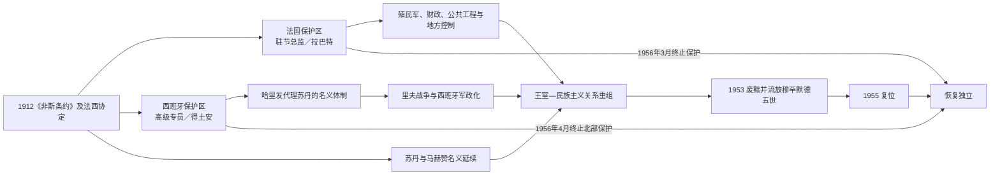

# 摩洛哥保护国殖民行政首脑表

## 范围与说明

1912—1956年的摩洛哥不是一个由单一殖民总督直接取代苏丹的殖民地。法国保护区覆盖大部分领土，法国驻节总监在拉巴特掌握军事、外交、财政和重要行政实权；西班牙保护区以得土安为中心，由高级专员代表西班牙政府，同时保留哈里发作为苏丹代理人的名义结构；丹吉尔则在1923／1924年后形成国际区。

下表分别列出法国驻节总监和西班牙高级专员。任期极短的代理人、政变期间事实任职者也予列入并注明争议。苏丹仍是形式上的国家元首，其完整序列见[摩洛哥君主世系表](/%E4%BA%BA%E6%96%87%E7%A7%91%E5%AD%A6/%E5%8E%86%E5%8F%B2/%E5%8C%97%E9%9D%9E/%E6%91%A9%E6%B4%9B%E5%93%A5/%E6%91%A9%E6%B4%9B%E5%93%A5%E5%90%9B%E4%B8%BB%E4%B8%96%E7%B3%BB%E8%A1%A8.md)。

## 法国保护区驻节总监

| 顺序 | 姓名 | 任期 | 身份与主要说明 |
|---:|---|---|---|
| 1 | **于贝尔·利奥泰（Hubert Lyautey）** | 1912年4月28日—1925年8月25日 | 首任驻节总监；此前已参与军事占领。以“间接统治”和保留苏丹、马赫赞外壳著称，同时通过军队、城市规划、土地与财政制度建立殖民国家。 |
| 代理 | 亨利·古罗（Henri Gouraud） | 1916年12月13日—1917年4月7日 | 利奥泰离任期间代理。 |
| 2 | 泰奥多尔·斯泰格（Théodore Steeg） | 1925年10月4日—1929年1月1日 | 在里夫战争末期接任；法国与西班牙联合镇压后强化北部控制。 |
| 3 | 吕西安·圣（Lucien Saint） | 1929年1月2日—1933年9月14日 | 推进交通、农业与行政整合，民族主义社团逐步形成。 |
| 4 | 奥古斯特·亨利·庞索（Auguste Henri Ponsot） | 1933年9月14日—1936年3月22日 | 面对1930年“柏柏尔法令”争议之后的民族动员。 |
| 5 | 马塞尔·佩鲁通（Marcel Peyrouton） | 1936年3月22日—9月16日 | 任期短，处于法国国内人民阵线更替期。 |
| 6 | 夏尔·诺盖（Charles Noguès） | 1936年9月16日—1943年6月21日 | 二战初期为驻节总监；1940年后服从维希政权，1942年盟军“火炬行动”登陆后权力瓦解。 |
| 7 | 加布里埃尔·皮奥（Gabriel Puaux） | 1943年6月21日—1946年3月4日 | 自由法国体系下重组殖民行政；1944年独立宣言后民族主义更明确。 |
| 8 | 埃里克·拉博讷（Eirik Labonne） | 1946年3月4日—1947年5月14日 | 试图以有限改革管理战后民族主义，未解决主权矛盾。 |
| 9 | 阿尔方斯·朱安（Alphonse Juin） | 1947年5月14日—1951年8月28日 | 对独立党和苏丹施压，依赖部分地方名流制衡穆罕默德五世。 |
| 10 | 奥古斯坦·纪尧姆（Augustin Guillaume） | 1951年8月28日—1954年5月20日 | 主导1953年废黜穆罕默德五世并扶立本·阿拉法；行动扩大抵抗和王室合法性。 |
| 11 | 弗朗西斯·拉科斯特（Francis Lacoste） | 1954年5月20日—1955年6月20日 | 武装抵抗、罢工和外交压力加剧，法国政策转入谈判。 |
| 12 | 吉尔贝·格朗瓦尔（Gilbert Grandval） | 1955年6月20日—8月31日 | 尝试快速政治妥协，任期短。 |
| 13 | 皮埃尔·布瓦耶·德·拉图尔（Pierre Boyer de Latour） | 1955年8月31日—11月9日 | 推动结束本·阿拉法统治和穆罕默德五世复位安排。 |
| 14 | 安德烈·路易·迪布瓦（André Louis Dubois） | 1955年11月9日—1956年3月2日 | 最后一任驻节总监；在任期间完成独立谈判，法国保护国终止。 |

## 西班牙保护区高级专员

| 顺序 | 姓名 | 任期 | 身份与主要说明 |
|---:|---|---|---|
| 1 | 费利佩·阿尔福·门多萨（Felipe Alfau Mendoza） | 1913年4月3日—8月15日 | 首任高级专员，建立得土安机构。 |
| 2 | 何塞·马里纳·维加（José Marina Vega） | 1913年8月17日—1915年7月9日 | 以军事方式巩固有限占领区。 |
| 3 | 弗朗西斯科·戈麦斯·霍尔达纳（Francisco Gómez Jordana） | 1915年7月9日—1918年11月18日 | 任内去世；殖民控制仍局限于部分城镇与交通线。 |
| 4 | 达马索·贝伦格尔（Dámaso Berenguer） | 1919年1月27日—1922年7月13日 | 1921年安瓦勒战役惨败暴露西班牙军政危机。 |
| 5 | 里卡多·布尔格特（Ricardo Burguete） | 1922年7月15日—1923年1月22日 | 在里夫共和国战争中接任。 |
| 6 | 路易斯·西尔韦拉·卡萨多（Luis Silvela Casado） | 1923年2月16日—9月14日 | 首位文官高级专员，任期受西班牙政变终止。 |
| 7 | 路易斯·艾斯普鲁·蒙德哈尔（Luis Aizpuru y Mondéjar） | 1923年9月25日—1924年10月16日 | 普里莫·德·里维拉独裁初期军政负责人。 |
| 8 | 米格尔·普里莫·德·里维拉（Miguel Primo de Rivera） | 1924年10月16日—1925年11月2日 | 西班牙独裁者兼任；与法国协调登陆和反攻里夫。 |
| 9 | 何塞·桑胡尔霍（José Sanjurjo） | 1925年11月2日—1928年11月 | 第一次任期；里夫共和国于1926年被法西联合击败。 |
| 10 | 弗朗西斯科·戈麦斯—霍尔达纳·索萨（Francisco Gómez-Jordana Sousa） | 1928年11月—1931年4月19日 | 前任同名驻专之子；管理战后保护区。 |
| 11 | 何塞·桑胡尔霍 | 1931年4月19日—6月20日 | 第二次短期任职，西班牙第二共和国初期离任。 |
| 12 | 卢西亚诺·洛佩斯·费雷尔（Luciano López Ferrer） | 1931年6月20日—1933年5月 | 第二共和国时期高级专员。 |
| 13 | 胡安·莫莱斯（Juan Moles） | 1933年5月—1934年1月23日 | 第一次任期。 |
| 14 | 曼努埃尔·里科·阿韦略（Manuel Rico Avello） | 1934年1月23日—1936年3月 | 第二共和国时期文官。 |
| 15 | 胡安·莫莱斯 | 1936年3月—5月 | 第二次任期。 |
| 代理 | 阿图罗·阿尔瓦雷斯—布伊亚（Arturo Álvarez-Buylla） | 1936年5月—7月18日 | 代理高级专员；西班牙内战政变后被叛军拘捕并杀害。 |
| 事实任职 | 爱德华多·萨恩斯·德·布鲁阿加（Eduardo Sáenz de Buruaga） | 1936年7月18日—当月 | 政变初期短暂掌权，正式任命与精确任期存在争议。 |
| 16 | 弗朗西斯科·佛朗哥（Francisco Franco） | 1936年7月—10月2日 | 在成为叛军最高领袖前短暂兼任；西班牙保护区成为政变的重要兵源基地。 |
| 17 | 路易斯·奥尔加斯·约尔迪（Luis Orgaz Yoldi） | 1936年10月2日—1937年3月 | 第一次任期。 |
| 18 | 胡安·路易斯·贝格贝德尔（Juan Luis Beigbeder） | 1937年4月16日—1939年8月12日 | 1937年4月获任，内战时期及其结束前后任职；部分简表把其实际到任或稳定掌权时间约写为同年8月，3—4月衔接仍有资料差异。 |
| 19 | 卡洛斯·阿森西奥·卡瓦尼利亚斯（Carlos Asensio Cabanillas） | 1939年8月16日—1941年5月12日 | 佛朗哥政权早期军政负责人。 |
| 20 | 路易斯·奥尔加斯·约尔迪 | 1941年5月12日—1945年3月4日 | 第二次任期，处于二战时期。 |
| 21 | 何塞·恩里克·巴雷拉（José Enrique Varela） | 1945年3月4日—1951年3月24日 | 任内去世，是任期最长者之一。 |
| 22 | 拉斐尔·加西亚·瓦利尼奥（Rafael García Valiño） | 1951年3月24日—1956年4月7日；部分交接名录延至同年8月 | 最后一任高级专员；1956年4月协议终止北部保护国体制，个别名录把善后职务或离任日期继续计算至8月。 |

## 实际权力结构

| 层级 | 法国保护区 | 西班牙保护区 | 共同特点 |
|---|---|---|---|
| 名义主权 | 苏丹及其法令、马赫赞机构 | 苏丹名义主权，由得土安哈里发代理 | 保护国以“改革与协助”名义保留旧制度外壳。 |
| 最高殖民行政 | 法国驻节总监 | 西班牙高级专员 | 对本国政府负责，掌握军事、警察、外交和关键任命。 |
| 地方控制 | 殖民官、军队、城市市政、受监管的帕夏与卡伊德 | 军事辖区、地方官员、哈里发机构 | 通过地方精英、土地制度和武装力量把控制向乡村推进。 |
| 经济权力 | 土地转移、公司、港口、铁路、税收与货币体系 | 港口、矿业、军事采购与区域贸易 | 殖民基础设施优先服务战略、出口和定居者经济。 |
| 抵抗与谈判 | 部族武装、城市民族主义、工会、王室与外交网络 | 里夫共和国、地方抗争及后期民族主义 | 镇压无法消除主权诉求，最终须与苏丹和民族运动谈判。 |

## 返回与相关笔记

- 保护国形成、民族运动与独立过程见[保护国、独立与现代摩洛哥](/%E4%BA%BA%E6%96%87%E7%A7%91%E5%AD%A6/%E5%8E%86%E5%8F%B2/%E5%8C%97%E9%9D%9E/%E6%91%A9%E6%B4%9B%E5%93%A5/%E4%BF%9D%E6%8A%A4%E5%9B%BD%E3%80%81%E7%8B%AC%E7%AB%8B%E4%B8%8E%E7%8E%B0%E4%BB%A3%E6%91%A9%E6%B4%9B%E5%93%A5.md)。
- 王朝主线见[摩洛哥君主世系表](/%E4%BA%BA%E6%96%87%E7%A7%91%E5%AD%A6/%E5%8E%86%E5%8F%B2/%E5%8C%97%E9%9D%9E/%E6%91%A9%E6%B4%9B%E5%93%A5/%E6%91%A9%E6%B4%9B%E5%93%A5%E5%90%9B%E4%B8%BB%E4%B8%96%E7%B3%BB%E8%A1%A8.md)。
- 返回[摩洛哥历史](/%E4%BA%BA%E6%96%87%E7%A7%91%E5%AD%A6/%E5%8E%86%E5%8F%B2/%E5%8C%97%E9%9D%9E/%E6%91%A9%E6%B4%9B%E5%93%A5/README.md)。
