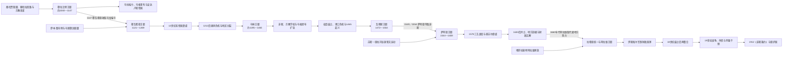

# 摩洛哥的穆拉比特至阿拉维王朝

## 时间

约11世纪中叶—1912年

## 概括

11世纪中叶至1912年的摩洛哥经历穆拉比特、穆瓦希德、马林、瓦塔斯、萨阿德和阿拉维等王朝，并穿插伊德里斯短暂复辟、苏菲联盟与地方政权。王朝更迭不是同一套官僚机器简单换姓：桑哈贾、马斯穆达、泽纳塔和阿拉伯—谢里夫家族依靠不同的部族联盟、宗教纲领、军队、城市与商路崛起，又必须重新谈判对平原、山地、绿洲和港口的控制。

穆拉比特和穆瓦希德把摩洛哥、马格里布、撒哈拉与安达卢斯连接为跨区域帝国；马林和瓦塔斯以非斯为中心，却受到伊比利亚沿海扩张与宫廷废立困扰；萨阿德以谢里夫身份和反葡萄牙战争重建统一；阿拉维则从塔菲拉勒特扩张，以王族宗教声望、军队、地方首领和外交贸易维系统治。19世纪欧洲军事、债务、领事保护和商业特权层层侵蚀主权，1912年保护国是长期结构危机和当年军事危机的共同结果。

## 演进图

## 一、权力如何运作

摩洛哥苏丹的权威常以“马赫赞”概括，既指宫廷与中央政府，也包括税收、军队、司法任命、地方卡伊德、帕夏和与王室结盟的部族。旧文献把服税地区称“马赫赞之地”、把不定期缴税或抗拒驻军地区称“西巴之地”，但两者不是文明与无政府的固定边界：同一地区可承认苏丹的宗教和司法权威，同时拒绝某项税收；巡行、礼物、婚姻、赦免和军事远征会不断改变关系。

| 权力资源 | 具体机制 | 优势 | 内在限制 |
|---|---|---|---|
| 宗教合法性 | 改革教义、护教战争、哈里发称号或谢里夫血统 | 能跨越部族动员并解释征服 | 教义分裂、宗教学者反对或统治实践失信会反噬王朝。 |
| 部族与王族联盟 | 分封、婚姻、贡赋、卡伊德任命、王族总督 | 低行政成本连接山地与平原 | 地方掌握军队和税源，继承危机时容易独立。 |
| 军队 | 部族骑兵、安达卢斯军、基督徒或土耳其火枪手、阿比德军团 | 强势君主可压制地方并保护商路 | 军饷中断会导致废立；军团可能成为造王者。 |
| 城市与财政 | 非斯、马拉喀什、梅克内斯、港口关税、市场税与铸币 | 支持宫廷、建筑、学术和常备军 | 城市精英可抵制税收，海贸转向会使旧中心失去收入。 |
| 跨撒哈拉贸易 | 黄金、盐、奴隶、皮革、纺织品和驼运 | 连接苏斯、德拉、锡吉勒马萨与萨赫勒 | 海上贸易兴起、商路转移和远征成本会削弱收益。 |
| 对外外交 | 与安达卢斯、奥斯曼、欧洲国家缔约、赎俘和通商 | 平衡邻国并获得军火、贷款和承认 | 19世纪条约特权和外债逐渐侵蚀财政、司法与关税自主。 |

完整君主、复位、并立和争议统治者见[摩洛哥君主世系表](/%E4%BA%BA%E6%96%87%E7%A7%91%E5%AD%A6/%E5%8E%86%E5%8F%B2/%E5%8C%97%E9%9D%9E/%E6%91%A9%E6%B4%9B%E5%93%A5/%E6%91%A9%E6%B4%9B%E5%93%A5%E5%90%9B%E4%B8%BB%E4%B8%96%E7%B3%BB%E8%A1%A8.md)。

## 二、穆拉比特：从撒哈拉改革运动到跨海帝国

### 建立与崛起

11世纪，桑哈贾语族的拉姆图纳、古达拉等群体控制撒哈拉西部驼运路线，却面临联盟竞争、宗教规范差异和北方泽纳塔城市的压力。法学家阿卜杜拉·伊本·亚辛与叶海亚、阿布·伯克尔兄弟把马立克派改革、军事纪律和部族联盟结合，形成“穆拉比特”运动。它先控制沙漠商路与绿洲，约1054年夺取锡吉勒马萨，随后进入苏斯和阿格马特。

阿布·伯克尔把北方指挥交给优素福·伊本·塔什芬。马拉喀什约在1060年代至1070年前后建设为军政中心，具体建城年在材料中有差异。优素福整合北部城市和山地通道，铸币、征税并维持法学家支持。1086年，他应安达卢斯泰法君主求援，在萨拉卡击败卡斯蒂利亚；之后逐步废黜泰法君主，把安达卢斯纳入帝国。

### 鼎盛、衰落与灭亡

穆拉比特的鼎盛依赖撒哈拉黄金、马格里布农业、安达卢斯城市税收和跨海军队。阿里·伊本·优素福时期，基督教诸国持续推进，安达卢斯地方社会对北非军事政权的负担不满；摩洛哥境内，伊本·图马特以更激进的统一论和道德改革指责穆拉比特。帝国必须在两端作战，军费、堡垒和雇佣兵开支增加。

1143年以后连续短期君主无法逆转危机。穆瓦希德逐步夺取山地、非斯和沿海通道，1147年攻陷马拉喀什，末代统治者被杀。直接触发是首都失守，结构原因则是跨海帝国过度延伸、继承弱化、宗教合法性竞争和地方军政网络倒向新运动。

## 三、穆瓦希德：宗教革命、哈里发帝国与分裂

### 从廷梅尔到马拉喀什

伊本·图马特出身高阿特拉斯马斯穆达群体，游学归来后批评穆拉比特宗教实践，自称马赫迪，在廷梅尔建立纪律严密的核心组织。1130年前后的布海拉战败及其死亡没有终结运动；阿卜杜勒·穆明重建军队，逐城夺取摩洛哥，1147年灭穆拉比特。

阿卜杜勒·穆明把原本以马斯穆达议事层级构成的运动改造成由其家族继承的哈里发政权，并征服阿尔及利亚、伊弗里基亚和安达卢斯大片地区。帝国设置总督、税收和军团，在马拉喀什、拉巴特、塞维利亚等地建设清真寺、城墙和行政设施。

### 鼎盛与瓦解

阿布·雅各布·优素福和雅各布·曼苏尔时期，宫廷支持哲学、医学和建筑，1195年阿拉科斯胜利象征军事实力。与此同时，广阔帝国依赖哈里发个人统御、马斯穆达精英和多族军队，地方忠诚并不牢固。

1212年托洛萨会战不是唯一衰落原因，却摧毁军事威望并加重财政压力。1224年穆斯坦西尔无嗣死亡后，安达卢斯总督和摩洛哥王族争位，哈夫斯、扎亚尼和马林等势力相继独立。后期哈里发仅控制马拉喀什周边；1269年马林夺取首都，残余政权终结。

## 四、马林与瓦塔斯：非斯国家、帝国复兴尝试和海岸危机

### 马林兴起与14世纪扩张

马林是泽纳塔联盟，最初在摩洛哥东部和东北活动。它利用穆瓦希德内战逐步夺取非斯、梅克内斯和拉巴特，1269年完成对马拉喀什的征服。阿布·优素福·雅各布建立新的王朝秩序，1276年营建非斯新城，使宫廷、军营与旧城商业—学术区既相连又分开。

马林依赖泽纳塔骑兵、阿拉伯部族、城市税收和宗教学者。王朝修建布伊纳尼亚等宗教学校，以马立克法学和公共建筑补充并不具谢里夫血统的合法性。阿布·哈桑和阿布·伊南一度征服特莱姆森与突尼斯，试图恢复穆瓦希德式马格里布帝国；1340年里奥萨拉多战败削弱安达卢斯介入，1348年后远征失败、黑死病、叛乱和父子战争使扩张崩溃。

### 权臣废立、休达失守与瓦塔斯接管

1358年阿布·伊南被杀后，多名幼主与短期君主由维齐尔、军团和瓦塔斯家族废立。地方税源流失，海上形势又改变：1415年葡萄牙占领休达，既是战略港口损失，也暴露王朝保护海岸能力不足。1420年末主阿卜杜勒·哈克二世幼年即位，瓦塔斯长期摄政；其成年后清洗瓦塔斯，引发更大反弹。1465年非斯起义杀死苏丹。

伊德里斯—朱提首领短暂掌权后，瓦塔斯于1472年建立苏丹国。它保有非斯和部分北部，却无法阻止葡萄牙控制休达、丹吉尔、阿尔西拉、萨菲、阿泽穆尔等节点。南部苏斯的萨阿德家族以反葡萄牙“圣战”和谢里夫血统吸引支持，1541年夺回阿加迪尔后声望激增，1549年占领非斯。瓦塔斯在奥斯曼阿尔及尔援助下1554年短暂复城，随即败亡。

## 五、萨阿德：反葡萄牙统一、曼苏尔鼎盛与内战

### 谢里夫动员与国家重建

萨阿德家族以先知后裔身份在德拉—苏斯地区崛起，地方苏菲教团、商人和部族希望组织对葡萄牙沿海堡垒的抵抗。1510年穆罕默德·卡伊姆被推为运动领袖；1517年去世后，艾哈迈德·阿拉杰与弟弟穆罕默德·谢赫分掌马拉喀什—苏斯力量。穆罕默德·谢赫在1541年夺回阿加迪尔，声望和资源随之上升，1544年前后击败并放逐兄长，1549年再夺非斯，既清除瓦塔斯，也抵抗奥斯曼从阿尔及尔向西扩张。王朝使用火枪手、部族军队和外来军事技术，并从糖业、港口和撒哈拉贸易取得收入。

1574年穆塔瓦基勒继位后被叔父阿卜杜勒·马利克推翻，遂请求葡萄牙国王塞巴斯蒂昂干预。1578年凯比尔堡“三王战役”中，塞巴斯蒂昂、穆塔瓦基勒和阿卜杜勒·马利克均死亡；摩洛哥获胜并取得巨额赎金，艾哈迈德·曼苏尔继位。

### 鼎盛、桑海远征与解体

曼苏尔通过奥斯曼式宫廷、火器军、对欧外交、糖业与赎金建设强势国家，巴迪宫象征其威望。1591年朱达尔帕夏率火枪军越过撒哈拉，在通迪比击败桑海。远征控制廷巴克图、加奥等城，却无法低成本支配尼日尔河广阔地区；黄金收益低于期待，驻军逐步地方化。

1603年曼苏尔死于瘟疫后，三个儿子及其后裔在非斯、马拉喀什并立。为了争位，他们让渡港口、征收重税并依赖地方军队，城市、部族和苏菲联盟转向自主。萨累海盗共和国、伊利格、迪拉伊等力量分享权力；1659年末主被杀。王朝直接终结于宫廷暴力，深层原因则是继承无序、财政枯竭、跨撒哈拉统治失败和地方军政力量坐大。

## 六、阿拉维：统一、军事财政国家与欧洲压力

### 塔菲拉勒特起点与拉希德统一

阿拉维家族定居塔菲拉勒特，以哈桑支谢里夫血统和绿洲商路声望为基础。谢里夫·伊本·阿里、穆罕默德一世最初只是地区统治者；拉希德击败兄长后向北扩张，1666年夺取非斯、1668年前后控制马拉喀什，并摧毁迪拉伊中心。其成功来自谢里夫合法性、商路财政、火器与吸收原萨阿德和地方军队。

### 伊斯梅尔的集权与18世纪废立

伊斯梅尔以梅克内斯为首都，建设要塞、粮仓、宫殿和道路，组织阿比德·布哈里常备军，并用王族总督、卡伊德和军事部族约束地方。他收复部分欧洲沿海据点，通过赎俘和外交在欧洲国家间平衡。集权的代价是庞大军费和对君主个人的依赖。

1727年伊斯梅尔死后，其众多儿子与阿比德军团、非斯和马拉喀什精英反复废立。阿卜杜拉六度在位说明军队已成为造王者。1757年穆罕默德三世继位后削弱军团政治，扩大港口关税和欧洲贸易，营建索维拉，才恢复较长稳定。

### 19世纪主权侵蚀

19世纪地中海强权差距扩大。阿卜杜勒·拉赫曼支持阿尔及利亚的阿卜杜勒·卡迪尔，1844年伊斯利战役败于法国，丹吉尔和索维拉遭炮击；摩洛哥被迫限制援助并接受边界安排。1859—1860年与西班牙战争后失去对得土安的暂时控制并承担巨额赔款，只能以外债和关税担保筹款。

1880年马德里会议把列强“保护”摩洛哥臣民和商业特权制度化。哈桑一世巡行各地、采购武器、派遣学生并调整税制，仍无法消除财政和地方阻力。阿卜杜勒·阿齐兹时期，欧洲顾问、外债、改革税和列强竞争激起反对；1904年英法协调、1905—1906年第一次摩洛哥危机和阿尔赫西拉斯会议把警察与金融监督国际化。1907年卡萨布兰卡事件后法军占领城市及东部乌季达。

阿卜杜勒·哈菲兹以反外来控制和恢复秩序为号召废黜弟弟，但很快也依赖法国贷款与军队。1911年非斯被围促使法军进城，引发阿加迪尔危机；1912年3月《非斯条约》建立法国保护国，11月法西协定划出西班牙保护区。苏丹王统保留，军事、外交、财政和主要行政实权转入殖民机构。

## 重要事件与时间节点

| 时间 | 事件 | 结果与意义 |
|---|---|---|
| 约1054年 | 穆拉比特夺取锡吉勒马萨 | 宗教—军事联盟控制关键撒哈拉商路。 |
| 约1060—1070年代 | 马拉喀什建城并成为首都 | 内陆新军政中心取代旧有城市平衡。 |
| 1086年 | 萨拉卡战役 | 穆拉比特进入安达卢斯并逐步兼并泰法。 |
| 1147年 | 穆瓦希德攻占马拉喀什 | 穆拉比特王朝直接灭亡。 |
| 1195年 | 阿拉科斯战役 | 穆瓦希德达到军事威望高点。 |
| 1212年 | 托洛萨会战 | 安达卢斯败局与帝国内部继承危机共同加速分裂。 |
| 1269年 | 马林攻取马拉喀什 | 穆瓦希德残余终结，非斯重新成为国家重心。 |
| 1340年 | 里奥萨拉多战役 | 马林大规模介入伊比利亚受挫。 |
| 1415年 | 葡萄牙占领休达 | 欧洲沿海据点扩张开始，海峡控制改变。 |
| 1465年 | 非斯起义杀死阿卜杜勒·哈克二世 | 马林终结，城市与瓦塔斯权臣重组王权。 |
| 1541年 | 萨阿德收复阿加迪尔 | 反葡萄牙声望使南部王朝具备全国竞争力。 |
| 1549、1554年 | 萨阿德夺非斯并消灭瓦塔斯复辟 | 谢里夫王朝完成主要统一。 |
| 1578年 | 三王战役 | 葡萄牙远征失败，曼苏尔继位并获巨额政治资本。 |
| 1591年 | 通迪比战役与桑海崩溃 | 摩洛哥建立尼日尔河驻军政权，但远距收益有限。 |
| 1603年 | 曼苏尔去世 | 萨阿德多支内战和地方割据开始。 |
| 1666—1668年 | 拉希德夺取非斯、马拉喀什 | 阿拉维完成主要统一。 |
| 1672—1727年 | 伊斯梅尔长期统治 | 常备军、要塞与梅克内斯宫廷构成集权高峰。 |
| 1727—1757年 | 多次废立 | 军团和城市成为造王者，中央权威反复崩解。 |
| 1757—1790年 | 穆罕默德三世重建 | 港口贸易和外交财政恢复王朝稳定。 |
| 1844年 | 伊斯利战役 | 法国军事优势迫使摩洛哥改变阿尔及利亚政策。 |
| 1859—1860年 | 西摩战争与得土安赔款 | 外债、关税担保和财政依赖加深。 |
| 1880年 | 马德里会议 | 列强领事保护和商业特权扩大。 |
| 1906年 | 阿尔赫西拉斯会议 | 警察、银行和财政监督国际化。 |
| 1907年 | 法军进入乌季达、卡萨布兰卡 | 局部军事占领成为事实。 |
| 1911—1912年 | 非斯危机、阿加迪尔危机与《非斯条约》 | 列强协调完成，摩洛哥进入保护国时期。 |

## 王朝兴衰的因果比较

| 王朝 | 崛起机制 | 鼎盛条件 | 结构性衰落 | 直接终结 |
|---|---|---|---|---|
| 穆拉比特 | 桑哈贾联盟、宗教纪律、撒哈拉商路 | 马格里布农业与安达卢斯税收结合 | 两线战争、财政负担、宗教合法性竞争 | 1147年马拉喀什被穆瓦希德攻陷。 |
| 穆瓦希德 | 马斯穆达联盟、马赫迪教义、阿卜杜勒·穆明军事组织 | 统一马格里布和安达卢斯、强势哈里发 | 帝国过广、继承内战、外围王朝独立 | 1269年马林夺马拉喀什。 |
| 马林 | 泽纳塔军事联盟、利用穆瓦希德分裂 | 非斯财政、宗教学校和短期马格里布扩张 | 黑死病、权臣废立、海岸压力 | 1465年非斯起义杀死末主。 |
| 瓦塔斯 | 摄政家族与非斯官僚网络 | 保有北部城市和王朝制度 | 缺乏军力、葡萄牙据点、南部萨阿德动员 | 1554年复辟军败亡。 |
| 萨阿德 | 谢里夫血统、反葡萄牙战争、苏斯资源 | 三王战役、糖业、赎金、火器与外交 | 远征成本、继承分裂、地方苏菲和港口势力 | 1659年末主被杀。 |
| 阿拉维 | 塔菲拉勒特商路、谢里夫声望、拉希德军事扩张 | 伊斯梅尔常备军；后有港口关税与外交 | 继承危机、军团政治；19世纪财政军事差距 | 王朝未灭，1912年主权转入保护国框架。 |

## 争议与辨析

- “马赫赞之地／西巴之地”不等于中央文明与部族无政府。许多地区承认苏丹宗教权威，却就税收、驻军和地方任命讨价还价。
- “摩洛哥帝国”在穆拉比特、穆瓦希德和马林时代覆盖范围不同，不能把最大版图当作全时期有效边界。
- 1212年托洛萨会战和1578年三王战役都是重大转折，但王朝兴衰仍需结合财政、继承、军团和地方联盟。
- 萨阿德远征导致桑海国家崩溃，却没有让摩洛哥稳定控制整个西非黄金产区；廷巴克图驻军后来地方化。
- 阿拉维王朝延续不等于每个时期中央均有效控制全国；1727年后的废立与19世纪地方抗争必须保留。
- 1912年不是某位苏丹“个人出卖国家”的单因结果，而是战争赔款、债务、列强条约、军队差距、地方冲突和当年危机叠加。

## 演变关系

- 前一阶段：[古代毛里塔尼亚、伊德里斯与早期国家](/%E4%BA%BA%E6%96%87%E7%A7%91%E5%AD%A6/%E5%8E%86%E5%8F%B2/%E5%8C%97%E9%9D%9E/%E6%91%A9%E6%B4%9B%E5%93%A5/%E5%8F%A4%E4%BB%A3%E6%AF%9B%E9%87%8C%E5%A1%94%E5%B0%BC%E4%BA%9A%E3%80%81%E4%BC%8A%E5%BE%B7%E9%87%8C%E6%96%AF%E4%B8%8E%E6%97%A9%E6%9C%9F%E5%9B%BD%E5%AE%B6.md)
- 后一阶段：[保护国、独立与现代摩洛哥](/%E4%BA%BA%E6%96%87%E7%A7%91%E5%AD%A6/%E5%8E%86%E5%8F%B2/%E5%8C%97%E9%9D%9E/%E6%91%A9%E6%B4%9B%E5%93%A5/%E4%BF%9D%E6%8A%A4%E5%9B%BD%E3%80%81%E7%8B%AC%E7%AB%8B%E4%B8%8E%E7%8E%B0%E4%BB%A3%E6%91%A9%E6%B4%9B%E5%93%A5.md)
- 完整世系：[摩洛哥君主世系表](/%E4%BA%BA%E6%96%87%E7%A7%91%E5%AD%A6/%E5%8E%86%E5%8F%B2/%E5%8C%97%E9%9D%9E/%E6%91%A9%E6%B4%9B%E5%93%A5/%E6%91%A9%E6%B4%9B%E5%93%A5%E5%90%9B%E4%B8%BB%E4%B8%96%E7%B3%BB%E8%A1%A8.md)
- 撒哈拉联系：[撒哈拉商路、游牧网络与萨赫勒联系](/%E4%BA%BA%E6%96%87%E7%A7%91%E5%AD%A6/%E5%8E%86%E5%8F%B2/%E5%8C%97%E9%9D%9E/_%E9%80%9A%E5%8F%B2/%E6%92%92%E5%93%88%E6%8B%89%E5%95%86%E8%B7%AF%E3%80%81%E6%B8%B8%E7%89%A7%E7%BD%91%E7%BB%9C%E4%B8%8E%E8%90%A8%E8%B5%AB%E5%8B%92%E8%81%94%E7%B3%BB.md)
- 安达卢斯联系：[伊比利亚半岛历史](/%E4%BA%BA%E6%96%87%E7%A7%91%E5%AD%A6/%E5%8E%86%E5%8F%B2/%E6%AC%A7%E6%B4%B2/%E4%BC%8A%E6%AF%94%E5%88%A9%E4%BA%9A%E5%8D%8A%E5%B2%9B/README.md)
- 返回：[摩洛哥历史](/%E4%BA%BA%E6%96%87%E7%A7%91%E5%AD%A6/%E5%8E%86%E5%8F%B2/%E5%8C%97%E9%9D%9E/%E6%91%A9%E6%B4%9B%E5%93%A5/README.md)
