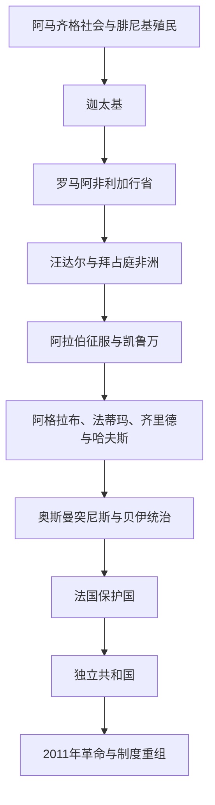

# 突尼斯历史

## 概括

突尼斯位于地中海中部航路和马格里布东缘，国土虽小，却多次成为跨区域政治中心。迦太基以今突尼斯附近为核心建立西地中海强权；罗马时期阿非利加行省是重要农业与城市区；凯鲁万、马赫迪耶和突尼斯城先后成为伊斯兰王朝、奥斯曼贝伊与现代国家的中心。

本目录不重复维护完整[迦太基通史](/%E4%BA%BA%E6%96%87%E7%A7%91%E5%AD%A6/%E5%8E%86%E5%8F%B2/%E5%8C%97%E9%9D%9E/_%E9%80%9A%E5%8F%B2/%E8%BF%A6%E5%A4%AA%E5%9F%BA/README.md)，只说明迦太基及罗马北非如何进入突尼斯地域史。

## 演进图

## 历史主线

突尼斯的核心平原和港口长期具有高密度城市、农业与海上贸易传统。阿拉伯征服后，伊弗里基亚成为连接埃及、马格里布和西西里的区域。奥斯曼征服并未消灭地方统治，贝伊家族逐渐建立世袭政权。19世纪财政危机为法国保护国铺路，20世纪民族运动则建立由新宪政党主导的共和国。

## 阶段导航

| 顺序 | 阶段 | 时间 | 入口 | 简要概括 |
|---:|---|---|---|---|
| 1 | 迦太基、罗马与拜占庭非洲 | 古代—7世纪 | [迦太基、罗马与拜占庭非洲](/%E4%BA%BA%E6%96%87%E7%A7%91%E5%AD%A6/%E5%8E%86%E5%8F%B2/%E5%8C%97%E9%9D%9E/%E7%AA%81%E5%B0%BC%E6%96%AF/%E8%BF%A6%E5%A4%AA%E5%9F%BA%E3%80%81%E7%BD%97%E9%A9%AC%E4%B8%8E%E6%8B%9C%E5%8D%A0%E5%BA%AD%E9%9D%9E%E6%B4%B2.md) | 腓尼基城市、罗马行省、基督教与晚期古代政权 |
| 2 | 伊弗里基亚王朝与奥斯曼突尼斯 | 7世纪—1881年 | [伊弗里基亚王朝与奥斯曼突尼斯](/%E4%BA%BA%E6%96%87%E7%A7%91%E5%AD%A6/%E5%8E%86%E5%8F%B2/%E5%8C%97%E9%9D%9E/%E7%AA%81%E5%B0%BC%E6%96%AF/%E4%BC%8A%E5%BC%97%E9%87%8C%E5%9F%BA%E4%BA%9A%E7%8E%8B%E6%9C%9D%E4%B8%8E%E5%A5%A5%E6%96%AF%E6%9B%BC%E7%AA%81%E5%B0%BC%E6%96%AF.md) | 凯鲁万、地方王朝、哈夫斯苏丹与贝伊统治 |
| 3 | 法国保护国、独立与现代突尼斯 | 1881年至今 | [法国保护国、独立与现代突尼斯](/%E4%BA%BA%E6%96%87%E7%A7%91%E5%AD%A6/%E5%8E%86%E5%8F%B2/%E5%8C%97%E9%9D%9E/%E7%AA%81%E5%B0%BC%E6%96%AF/%E6%B3%95%E5%9B%BD%E4%BF%9D%E6%8A%A4%E5%9B%BD%E3%80%81%E7%8B%AC%E7%AB%8B%E4%B8%8E%E7%8E%B0%E4%BB%A3%E7%AA%81%E5%B0%BC%E6%96%AF.md) | 民族主义、共和国、威权发展与2011年后转型 |

## 重要转折与时间节点

| 时间 | 事件 | 意义 |
|---|---|---|
| 传统前814年 | 迦太基建城 | 突尼斯地区成为西地中海重要中心 |
| 前146年 | 罗马灭迦太基 | 阿非利加行省建立，后发展为帝国农业核心 |
| 439年 | 汪达尔占领迦太基 | 西罗马在北非的统治被打破 |
| 670年 | 凯鲁万建立 | 伊斯兰征服和新区域中心形成 |
| 800年 | 阿格拉布王朝建立 | 伊弗里基亚在阿拔斯名义宗主下取得高度自主 |
| 1229年 | 哈夫斯王朝建立 | 突尼斯成为中世纪马格里布贸易和外交中心 |
| 1574年 | 奥斯曼控制突尼斯 | 西班牙—奥斯曼争夺结束，突尼斯进入奥斯曼体系 |
| 1881年 | 法国保护国建立 | 财政和主权被法国接管 |
| 1956—1957年 | 独立并建立共和国 | 贝伊君主制终结，布尔吉巴体制形成 |
| 2011年 | 革命推翻本·阿里 | 阿拉伯地区政治动荡的重要起点 |
| 2021—2022年 | 总统集中权力并通过新宪法 | 2014年后议会制衡结构被显著改变 |

## 相关笔记

- 上级：[北非历史](/%E4%BA%BA%E6%96%87%E7%A7%91%E5%AD%A6/%E5%8E%86%E5%8F%B2/%E5%8C%97%E9%9D%9E/README.md)
- 古代主线：[迦太基](/%E4%BA%BA%E6%96%87%E7%A7%91%E5%AD%A6/%E5%8E%86%E5%8F%B2/%E5%8C%97%E9%9D%9E/_%E9%80%9A%E5%8F%B2/%E8%BF%A6%E5%A4%AA%E5%9F%BA/README.md)
- 社会背景：[阿马齐格人、阿拉伯化与北非社会](/%E4%BA%BA%E6%96%87%E7%A7%91%E5%AD%A6/%E5%8E%86%E5%8F%B2/%E5%8C%97%E9%9D%9E/_%E9%80%9A%E5%8F%B2/%E9%98%BF%E9%A9%AC%E9%BD%90%E6%A0%BC%E4%BA%BA%E3%80%81%E9%98%BF%E6%8B%89%E4%BC%AF%E5%8C%96%E4%B8%8E%E5%8C%97%E9%9D%9E%E7%A4%BE%E4%BC%9A.md)

## 目录层级

- 直接上级：[北非](/%E4%BA%BA%E6%96%87%E7%A7%91%E5%AD%A6/%E5%8E%86%E5%8F%B2/%E5%8C%97%E9%9D%9E/README.md)
- 历史总览：[历史](/%E4%BA%BA%E6%96%87%E7%A7%91%E5%AD%A6/%E5%8E%86%E5%8F%B2/README.md)
