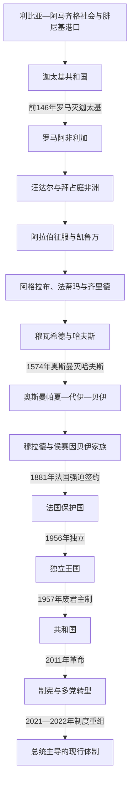

# 突尼斯历史

## 概括

突尼斯位于西西里海峡南岸和马格里布东缘，沿海港口、北部农业区与通向内陆的交通线，使其多次成为跨区域政治中心。迦太基以今突尼斯城附近为核心建立西地中海强权；罗马阿非利加是重要农业和城市区；凯鲁万、马赫迪耶与突尼斯城又先后成为伊斯兰王朝、奥斯曼贝伊和现代国家的中心。

本目录采用“三个阶段页＋一篇长世系专表”组织通史。顶层只提供主线和导航，具体过程、统治机制、事件、王朝兴衰和现代政治结构均放入下级笔记。完整跨区域迦太基史另见[迦太基通史](/%E4%BA%BA%E6%96%87%E7%A7%91%E5%AD%A6/%E5%8E%86%E5%8F%B2/%E5%8C%97%E9%9D%9E/_%E9%80%9A%E5%8F%B2/%E8%BF%A6%E5%A4%AA%E5%9F%BA/README.md)。

## 演进图

## 历史主线

突尼斯地域史可概括为四条连续线索：港口与农业腹地支撑国家；外来帝国必须通过地方城市、部族和官僚治理；政治中心从迦太基转向凯鲁万、马赫迪耶与突尼斯城；近代财政主权丧失引向殖民统治，而民族组织、工会和谈判又建立共和国。2011年后曾形成总统—议会分权，2021—2022年以后重新转为总统主导的行政结构。

## 阶段导航

| 顺序 | 阶段 | 时间 | 入口 | 阅读重点 |
|---:|---|---|---|---|
| 1 | 迦太基、罗马与拜占庭非洲 | 约前1千纪初—8世纪初 | [迦太基、罗马与拜占庭非洲](/%E4%BA%BA%E6%96%87%E7%A7%91%E5%AD%A6/%E5%8E%86%E5%8F%B2/%E5%8C%97%E9%9D%9E/%E7%AA%81%E5%B0%BC%E6%96%AF/%E8%BF%A6%E5%A4%AA%E5%9F%BA%E3%80%81%E7%BD%97%E9%A9%AC%E4%B8%8E%E6%8B%9C%E5%8D%A0%E5%BA%AD%E9%9D%9E%E6%B4%B2.md) | 迦太基政体与布匿战争、罗马行省、基督教、汪达尔和拜占庭统治 |
| 2 | 伊弗里基亚王朝与奥斯曼突尼斯 | 647—1881年 | [伊弗里基亚王朝与奥斯曼突尼斯](/%E4%BA%BA%E6%96%87%E7%A7%91%E5%AD%A6/%E5%8E%86%E5%8F%B2/%E5%8C%97%E9%9D%9E/%E7%AA%81%E5%B0%BC%E6%96%AF/%E4%BC%8A%E5%BC%97%E9%87%8C%E5%9F%BA%E4%BA%9A%E7%8E%8B%E6%9C%9D%E4%B8%8E%E5%A5%A5%E6%96%AF%E6%9B%BC%E7%AA%81%E5%B0%BC%E6%96%AF.md) | 凯鲁万、地方王朝、哈夫斯苏丹、奥斯曼复合统治、贝伊改革与债务 |
| 3 | 法国保护国、独立与现代国家 | 1881年—2026年7月14日 | [法国保护国、独立与现代突尼斯](/%E4%BA%BA%E6%96%87%E7%A7%91%E5%AD%A6/%E5%8E%86%E5%8F%B2/%E5%8C%97%E9%9D%9E/%E7%AA%81%E5%B0%BC%E6%96%AF/%E6%B3%95%E5%9B%BD%E4%BF%9D%E6%8A%A4%E5%9B%BD%E3%80%81%E7%8B%AC%E7%AB%8B%E4%B8%8E%E7%8E%B0%E4%BB%A3%E7%AA%81%E5%B0%BC%E6%96%AF.md) | 殖民权力、民族运动、共和国国家建设、2011年革命与2022年宪法体制 |

## 世系与统治者专表

| 专表 | 覆盖范围 | 说明 |
|---|---|---|
| [突尼斯君主与主要统治者世系表](/%E4%BA%BA%E6%96%87%E7%A7%91%E5%AD%A6/%E5%8E%86%E5%8F%B2/%E5%8C%97%E9%9D%9E/%E7%AA%81%E5%B0%BC%E6%96%AF/%E7%AA%81%E5%B0%BC%E6%96%AF%E5%90%9B%E4%B8%BB%E4%B8%8E%E4%B8%BB%E8%A6%81%E7%BB%9F%E6%B2%BB%E8%80%85%E4%B8%96%E7%B3%BB%E8%A1%A8.md) | 迦太基可辨认领袖、汪达尔国王、阿格拉布、法蒂玛、齐里德、哈夫斯、穆拉德和侯赛因王朝 | 对迦太基残缺官职、哈夫斯并立支系和奥斯曼多头权力分别标注，不把争议谱系写成确定世系 |

## 重要转折与时间节点

| 时间 | 转折 | 导向 |
|---|---|---|
| 约前9—前8世纪 | 迦太基聚落形成 | 西地中海港口网络出现新的核心 |
| 前146年 | 罗马灭迦太基 | 罗马阿非利加行省和重建后的迦太基兴起 |
| 439年 | 汪达尔夺取迦太基 | 西罗马北非税粮区转为海上王国 |
| 533—534年 | 东罗马灭汪达尔 | 拜占庭非洲建立 |
| 670年 | 凯鲁万建立 | 伊斯兰军政中心转向内陆 |
| 800年 | 阿格拉布王朝建立 | 阿拔斯名义下的地方世袭国家形成 |
| 909—973年 | 法蒂玛兴起并迁都开罗 | 伊弗里基亚先成哈里发中心，后交齐里德治理 |
| 1229年 | 哈夫斯独立 | 突尼斯城成为中世纪区域首都 |
| 1574年 | 奥斯曼最终征服 | 帕夏、代伊和贝伊复合统治形成 |
| 1705年 | 侯赛因王朝建立 | 贝伊地方国家延续至殖民和独立初年 |
| 1869—1883年 | 国际财政控制、法国入侵和保护国制度化 | 主权逐步转入法国驻地总督 |
| 1956—1957年 | 独立并建立共和国 | 殖民统治和贝伊君主制先后终结 |
| 1987年 | 本·阿里接任 | 威权体制换领导人但保留国家与执政党骨架 |
| 2011年 | 革命推翻本·阿里 | 制宪议会、多党政治和全国对话开启 |
| 2021—2022年 | 非常措施与新宪法 | 行政权重新集中于总统 |
| 2024—2026年 | 总统连任、两院体制继续运作 | 现行制度仍在发展，截止2026年7月14日不预写终局 |

## 相关笔记

- 上级：[北非历史](/%E4%BA%BA%E6%96%87%E7%A7%91%E5%AD%A6/%E5%8E%86%E5%8F%B2/%E5%8C%97%E9%9D%9E/README.md)
- 古代主线：[迦太基通史](/%E4%BA%BA%E6%96%87%E7%A7%91%E5%AD%A6/%E5%8E%86%E5%8F%B2/%E5%8C%97%E9%9D%9E/_%E9%80%9A%E5%8F%B2/%E8%BF%A6%E5%A4%AA%E5%9F%BA/README.md)
- 社会背景：[阿马齐格人、阿拉伯化与北非社会](/%E4%BA%BA%E6%96%87%E7%A7%91%E5%AD%A6/%E5%8E%86%E5%8F%B2/%E5%8C%97%E9%9D%9E/_%E9%80%9A%E5%8F%B2/%E9%98%BF%E9%A9%AC%E9%BD%90%E6%A0%BC%E4%BA%BA%E3%80%81%E9%98%BF%E6%8B%89%E4%BC%AF%E5%8C%96%E4%B8%8E%E5%8C%97%E9%9D%9E%E7%A4%BE%E4%BC%9A.md)
- 比较专题：[殖民统治、民族主义与北非独立](/%E4%BA%BA%E6%96%87%E7%A7%91%E5%AD%A6/%E5%8E%86%E5%8F%B2/%E5%8C%97%E9%9D%9E/_%E9%80%9A%E5%8F%B2/%E6%AE%96%E6%B0%91%E7%BB%9F%E6%B2%BB%E3%80%81%E6%B0%91%E6%97%8F%E4%B8%BB%E4%B9%89%E4%B8%8E%E5%8C%97%E9%9D%9E%E7%8B%AC%E7%AB%8B.md)
- 历史总览：[历史](/%E4%BA%BA%E6%96%87%E7%A7%91%E5%AD%A6/%E5%8E%86%E5%8F%B2/README.md)
