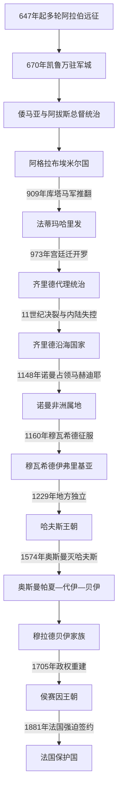

# 突尼斯的伊弗里基亚王朝与奥斯曼时期

## 时间

647—1881年；法国把保护国统治制度化的过程延续至1883年

## 概括

“伊弗里基亚”通常指以今突尼斯为核心、并随时代伸缩到阿尔及利亚东部和利比亚西部的区域，不等同于现代突尼斯国界。阿拉伯征服从647年的远征到698年迦太基失守，再到8世纪初地方抵抗逐渐被压服，历时半个多世纪。凯鲁万的建立把军营、清真寺、市场和行政中心放在内陆，既避开拜占庭海军，也便于连接沿海、草原和马格里布西部。

此后，阿格拉布、法蒂玛、齐里德、诺曼西西里、穆瓦希德和哈夫斯政权先后控制核心地区。1574年奥斯曼帝国排除西班牙势力，但突尼斯并未成为由伊斯坦布尔直接管理的普通行省：帕夏、耶尼切里军团的代伊和负责内陆征税治安的贝伊并存，地方贝伊家族最终把军政权力世袭化。19世纪改革扩大国家能力，也造成高昂军费、包税压迫和外债；1869年国际财政委员会架空财政主权，1881年法国入侵并迫使贝伊接受保护国。

主要王朝的完整公认统治序列、僭位、复位和争议见[突尼斯君主与主要统治者世系表](/%E4%BA%BA%E6%96%87%E7%A7%91%E5%AD%A6/%E5%8E%86%E5%8F%B2/%E5%8C%97%E9%9D%9E/%E7%AA%81%E5%B0%BC%E6%96%AF/%E7%AA%81%E5%B0%BC%E6%96%AF%E5%90%9B%E4%B8%BB%E4%B8%8E%E4%B8%BB%E8%A6%81%E7%BB%9F%E6%B2%BB%E8%80%85%E4%B8%96%E7%B3%BB%E8%A1%A8.md)。

## 演进图

## 征服、建城与早期行省

### 不是一次完成的“阿拉伯征服”

647年，阿拉伯军在苏费图拉附近击败反叛东罗马的格列高利，但取得贡物后撤出。670年乌克白·本·纳菲建立凯鲁万，才出现稳定的军政基地。此后拜占庭沿海据点、不同阿马齐格联盟和阿拉伯军团反复进退：乌克白约在683年战死；哈桑·本·努曼于698年攻陷迦太基；阿马齐格领袖卡希娜约在7世纪末至8世纪初战败。卡希娜的身份、活动范围和确切年代均有争议，不能把后世传说直接当作逐年实录。

征服后的社会变化同样漫长。阿拉伯军人和移民带来新的政治、宗教和语言网络，地方阿马齐格群体则通过结盟、反抗、参军、改宗和迁徙进入行省。基督教和拉丁语并未在698年立即消失，伊斯兰化、阿拉伯化与城市重组持续数世纪。

### 总督统治与地方反抗

伊弗里基亚先受倭马亚、后受阿拔斯哈里发任命的总督治理。凯鲁万军团拥有土地、薪饷与政治诉求，沿海港口负责海军和贸易，内陆部族及地方首领则掌握交通和征税节点。沉重税役、阿拉伯军团内部的部族竞争以及哈瓦利吉平等观念，促成8世纪阿马齐格大起义和多个地方政权。哈里发中央难以直接控制整个马格里布，给世袭地方王朝留下空间。

## 阿格拉布王朝：阿拔斯名义下的地方国家

800年，阿拔斯哈里发承认易卜拉欣·本·阿格拉布及其后裔治理伊弗里基亚。埃米尔按年贡奉、在钱币和礼仪上承认哈里发，换取任命官员、征税和统军的高度自主。王朝另建阿巴西耶、拉卡达等宫城，既远离凯鲁万法学家和市民压力，也控制军队。

阿格拉布政权的力量来自富庶农业、港口税、跨撒哈拉和地中海贸易，以及由阿拉伯军团、奴隶士兵和地方部队构成的军队。827年开始的西西里战争把军队不满外导，并带来战利品和海上据点；凯鲁万大清真寺、蓄水池和沿海要塞反映国家动员能力。

其衰落不是单因“奢侈”。宫廷内斗、军队与税负不满、城乡宗教精英疏离构成内部裂缝；与此同时，伊斯玛仪派传教士在库塔马阿马齐格群体中建立严密网络。阿布·阿卜杜拉领导的库塔马军逐步夺取城市，909年齐亚达特·阿拉三世出逃，王朝直接灭亡。

## 法蒂玛与齐里德：从革命中心到沿海国家

### 法蒂玛哈里发的伊弗里基亚阶段

法蒂玛运动宣称伊玛目来自先知家族，以伊斯玛仪派教义和库塔马军推翻阿格拉布王朝。阿卜杜拉·马赫迪于909年称哈里发，921年建马赫迪耶，把宫城、港口和舰队集中于可防御半岛。新政权与逊尼派城市精英、旧军团和被征税人口关系紧张；943—947年阿布·雅齐德领导的大起义一度逼近政权核心，直到曼苏尔反攻才平定。

法蒂玛的战略目标不止伊弗里基亚。969年其军队夺取埃及，973年穆伊兹把宫廷迁往开罗，并委托桑哈贾阿马齐格的齐里德家族治理西部。伊弗里基亚由帝国中心变成远方属地，政治重心第一次出现明确东移。

### 齐里德独立、乡村重组与诺曼占领

齐里德起初代表法蒂玛统治，并与哈马德支系争夺中部马格里布。11世纪中叶穆伊兹·本·巴迪斯公开转向逊尼派、停止承认开罗。法蒂玛随后鼓励巴努·希拉勒和巴努·苏莱姆等阿拉伯部族向西迁徙。迁徙、战争、既有旱作牧业变化、地方政权分裂和齐里德财政危机共同削弱内陆控制，不能简单归结为某一族群“一次摧毁北非”。

1057年齐里德退出凯鲁万、退守马赫迪耶，依靠港口、舰队和贸易维持沿海国家。诺曼西西里利用其衰弱，1148年占领马赫迪耶及主要港口，建立短暂的“非洲王国”属地。1160年穆瓦希德哈里发阿卜杜勒·穆明跨海陆进军，驱逐诺曼人并重建马格里布统一。

## 哈夫斯王朝：突尼斯城的区域中心

### 独立与鼎盛

哈夫斯家族原是穆瓦希德在伊弗里基亚的总督。1229年阿布·扎卡里亚·叶海亚一世停止服从衰弱的穆瓦希德中心，以突尼斯城为首都。国家通过港口关税、农业税、商人社群、城镇法学家和地方首领维系统治，并与意大利城邦、阿拉贡等签订贸易条约。安达卢斯穆斯林和犹太移民把手工业、园艺、学术和城市网络带入伊弗里基亚。

穆罕默德一世·穆斯坦西尔采用哈里发称号。1270年法国国王路易九世率第八次十字军抵达突尼斯，军中疫病和路易去世使远征转为和约。14—15世纪的阿布·阿拔斯·艾哈迈德二世、阿布·法里斯和奥斯曼等君主曾重新统一领土，使突尼斯成为马格里布外交和地中海商业节点。

### 分裂、复兴与直接灭亡

哈夫斯世系并不线性。王族支系在突尼斯、贝贾亚和君士坦丁等地并立，马林王朝两度入侵，城市派系、部族和宫廷军队左右废立。王朝数次复兴，却未消除继承制度不稳、地方财政分散和海防成本上升。

16世纪，哈夫斯领土成为哈布斯堡西班牙和奥斯曼帝国争夺西地中海的前线。海雷丁于1534年占领突尼斯；西班牙1535年夺回城市，扶立穆莱·哈桑并控制拉古莱特要塞。奥斯曼1569年再度夺城，西班牙1573年短暂恢复哈夫斯统治。1574年奥斯曼大军攻陷突尼斯和拉古莱特，末代哈夫斯统治者被俘处死，王朝直接灭亡。

## 奥斯曼突尼斯：名义行省与地方军政复合体

### 帕夏、代伊与贝伊

1574年以后，伊斯坦布尔任命帕夏代表苏丹，耶尼切里军团的军官会议及其选出的代伊控制首都驻军，贝伊则率“马哈拉”巡行内陆、征税、维持治安并与部族协商。三种职位权责重叠，实权随军队、财政和个人网络变化。突尼斯继续在祈祷、钱币或任命形式上承认奥斯曼苏丹，但地方统治者可自行处理大量税收、战争、外交和继承事务。

沿海私掠和舰队既是收入，也是与欧洲国家谈判的工具；内陆农业、橄榄油、谷物、畜牧和跨撒哈拉贸易仍是财政基础。17世纪初大量被逐出伊比利亚的摩里斯科人迁入突尼斯，在城镇、园艺、手工业和灌溉方面形成新社群。

### 穆拉德贝伊家族

穆拉德一世及其子哈穆达帕夏掌握内陆征税与军队，把贝伊职位家族化。代伊并未立刻消失，贝伊必须平衡首都军团、城市商人、宗教精英和地方部族。17世纪后半叶继承规则不明，穆拉德家族亲族、代伊和阿尔及尔势力相互干预，引发长期“穆拉德战争”。1702年穆拉德三世被易卜拉欣·谢里夫刺杀；1705年易卜拉欣对阿尔及尔作战被俘，地方军官侯赛因·本·阿里在突尼斯掌权。

## 侯赛因王朝：地方国家、改革与主权丧失

### 建立、复辟与18世纪稳定

侯赛因一世于1705年建立新王朝，以贝伊身份统治并维持奥斯曼名义宗主权。1735年其侄阿里帕夏借阿尔及尔支持夺位，1756年侯赛因支系又在阿尔及尔军介入下复辟。此后继承逐渐稳定，贝伊通过马哈拉征税、包税官、城市官僚、马穆鲁克军政精英和地方首领治理国家。

哈穆达贝伊在1782—1814年长期执政，压制耶尼切里叛乱，发展农业、贸易和外交，通常被视为王朝鼎盛期。然而欧洲海军优势、废止私掠的压力和奥斯曼—欧洲战争逐步削弱旧财政来源。

### 19世纪改革的双重效应

艾哈迈德一世贝伊试图建设新式军队、军校、兵工厂和中央行政，并于1846年正式废除奴隶制。这些改革增强国家直接干预能力，也远超本地财政承受范围。欧洲贷款利率高、宫廷与包税腐败、税负不均和大型建设项目共同积累债务。

1857年《安全盟约》在欧洲列强压力下承诺生命、财产和不同宗教臣民的法律保障；1861年宪法建立大议会和受规则约束的政府，但行政资源不足、精英争权和财政危机使制度很快停摆。1864年政府加倍征收人头税“麦杰巴”，引发由阿里·本·加德哈姆等领导的广泛起义。镇压和报复性征税进一步破坏乡村经济与王朝合法性。

1860年代借款、挪用和税收崩溃使国家无法偿债。1869年英国、法国和意大利代表组成国际财政委员会，直接分配突尼斯收入给债权人，财政主权事实上被架空。意大利移民和商业影响不断扩大，法国则担心意大利控制西西里海峡南岸，并已从阿尔及利亚向东扩张。

### 1881年的直接转型

1881年，法国以克鲁米尔部族越境冲突为军事借口，从阿尔及利亚和海上入侵。5月12日，萨迪克贝伊在巴尔杜宫被迫签订条约：法国控制对外关系和防务，并可在境内驻军。地方军队和部族此后仍有抵抗，但没有形成能迫使法国撤出的统一指挥。1883年《马尔萨公约》又授权法国推动其认为必要的行政、司法和财政“改革”，驻地总督遂成为实际最高权力者。

侯赛因贝伊王室因此没有在1881年立即灭亡，而是从高度自治的奥斯曼属邦统治家族，转成法国保护国下的名义君主。王朝直到1957年才被共和国废除；作为主权政权，其直接终点则是1881—1883年的保护国制度化。

## 统治结构比较

| 阶段 | 名义最高权力 | 实际权力结构 | 财政与军事基础 | 主要制约 |
|---|---|---|---|---|
| 总督时期 | 倭马亚或阿拔斯哈里发 | 总督、凯鲁万军团、法官、地方首领 | 土地税、人头税、贡赋和驻军 | 距中央遥远、军团派系和阿马齐格反抗 |
| 阿格拉布 | 阿拔斯哈里发；世袭埃米尔实际自治 | 埃米尔宫廷、官僚、法官、军队 | 农业税、港税、西西里战利品和贸易 | 军队、市民法学家与宫廷之间张力 |
| 法蒂玛 | 伊斯玛仪派哈里发 | 哈里发、库塔马军、传教组织和新都官僚 | 税收、舰队、跨区域扩张 | 逊尼派城市反对、大起义和东扩战略 |
| 齐里德 | 初为法蒂玛代理，后独立埃米尔 | 桑哈贾王族、城市和地方军 | 内陆税收，后转向沿海贸易与海军 | 支系分裂、迁徙战争、诺曼海权 |
| 哈夫斯 | 苏丹或哈里发 | 王族、维齐尔、城市精英、地方支系和部族 | 关税、农业税、贸易条约 | 继承内战、马林干预、西班牙—奥斯曼竞争 |
| 奥斯曼早期 | 奥斯曼苏丹 | 帕夏、军团代伊、内陆贝伊三方并存 | 军团、私掠、关税、马哈拉征税 | 军职竞争、地方自治和外部舰队 |
| 侯赛因王朝 | 奥斯曼宗主下的贝伊 | 贝伊宫廷、马穆鲁克官员、包税人、地方首领 | 农业税、关税、贸易，后加外债 | 继承冲突、军费、债务与欧洲干预 |
| 保护国转型 | 贝伊名义在位 | 法国驻地总督逐步取得实际最高权力 | 法国军队、关税与受控财政 | 本地抵抗、民族运动及国际竞争 |

## 重要事件

| 时间 | 事件 | 过程与长期影响 |
|---|---|---|
| 647年 | 苏费图拉远征 | 阿拉伯军击败格列高利后撤退，显示征服尚未制度化 |
| 670年 | 凯鲁万建立 | 形成常设军营、清真寺、市场和内陆行政中心 |
| 698年 | 迦太基失守 | 拜占庭沿海统治核心终结，区域政治中心转移 |
| 8世纪 | 阿马齐格起义与哈瓦利吉政权 | 削弱哈里发直接控制，推动地方政治多中心化 |
| 800年 | 阿格拉布王朝建立 | 在阿拔斯名义下形成世袭、高度自治的伊弗里基亚国家 |
| 827年 | 西西里远征开始 | 扩大海上势力，也把军队和财政长期绑在海外战争上 |
| 909年 | 法蒂玛推翻阿格拉布 | 伊斯玛仪派—库塔马联盟建立新哈里发政权 |
| 921年 | 马赫迪耶建都 | 强化海防、舰队和王朝宫廷控制 |
| 943—947年 | 阿布·雅齐德大起义 | 一度威胁法蒂玛生存，平定后国家重新集中 |
| 969—973年 | 法蒂玛夺取埃及并迁都 | 伊弗里基亚由帝国中心变为齐里德代理统治区 |
| 11世纪中叶 | 齐里德与法蒂玛决裂 | 政治、宗派和乡村权力结构重组，凯鲁万衰落 |
| 1148—1160年 | 诺曼占领与穆瓦希德收复 | 西西里海权短暂控制沿海，后被马格里布帝国驱逐 |
| 1229年 | 哈夫斯独立 | 突尼斯城成为中世纪马格里布重要首都 |
| 1270年 | 第八次十字军抵达突尼斯 | 疫病、路易九世去世和谈判使远征结束 |
| 1534—1574年 | 西班牙—奥斯曼争夺 | 城市数度易手，哈夫斯成为外部势力附庸并最终灭亡 |
| 1574年 | 奥斯曼最终征服 | 突尼斯进入奥斯曼体系，帕夏、代伊、贝伊复合统治形成 |
| 1613—1705年 | 穆拉德贝伊家族兴衰 | 贝伊职位世袭化，继承战争后由侯赛因王朝取代 |
| 1705年 | 侯赛因王朝建立 | 地方贝伊国家重建，延续至法国保护国和独立初年 |
| 1846年 | 废除奴隶制 | 王朝改革的重要成果，也体现中央国家介入社会关系 |
| 1857—1861年 | 《安全盟约》与宪法 | 试图建立法权和议会约束，但受外压、财政与行政能力限制 |
| 1864年 | 麦杰巴税起义 | 税负、地方不满和改革成本集中爆发，镇压进一步削弱国家 |
| 1869年 | 国际财政委员会成立 | 债权国直接控制收入，财政主权严重丧失 |
| 1881年 | 法军入侵与《巴尔杜条约》 | 法国取得外交、防务和驻军权，保护国建立 |
| 1883年 | 《马尔萨公约》 | 法国行政控制制度化，贝伊沦为名义君主 |

## 崛起、衰落与政权终结

| 政权 | 崛起机制 | 鼎盛条件 | 结构性衰落 | 外部压力与直接终结 |
|---|---|---|---|---|
| 阿格拉布 | 哈里发以地方世袭换贡赋和稳定 | 农业、港贸、军队与西西里扩张 | 宫廷内斗、军税矛盾、宗教精英疏离 | 库塔马—伊斯玛仪派网络推进，909年首都失守 |
| 法蒂玛伊弗里基亚 | 宗教革命组织与库塔马军 | 新都、舰队、集中宫廷和东征 | 地方反抗、重心向埃及转移 | 973年主动迁都开罗，地方交给齐里德，并非被一战灭亡 |
| 齐里德 | 法蒂玛授权和桑哈贾军政网络 | 控制凯鲁万、马赫迪耶与内陆税源 | 支系分裂、与法蒂玛决裂、乡村军政结构破碎 | 诺曼舰队1148年夺马赫迪耶，王朝直接终结 |
| 哈夫斯 | 穆瓦希德总督地方化、突尼斯港贸 | 贸易条约、移民技术、城市学术与王朝威望 | 支系并立、继承战、地方财政分散 | 西班牙—奥斯曼夹击，1574年奥斯曼攻城灭国 |
| 穆拉德贝伊 | 贝伊控制内陆征税治安并家族化 | 长期贝伊协调军团、城市和部族 | 职位重叠、亲族战争、阿尔及尔干预 | 1702年末代核心统治者遇刺；1705年侯赛因夺权 |
| 侯赛因王朝主权国家 | 调和军团、官僚、部族与奥斯曼名义宗主 | 18世纪贸易、农业与稳定继承 | 改革军费、包税不公、债务、政治代表不足 | 1869年财政受控；1881年法国入侵迫签条约，1883年实际主权丧失 |

## 演变关系

- 前一阶段：[迦太基、罗马与拜占庭非洲](/%E4%BA%BA%E6%96%87%E7%A7%91%E5%AD%A6/%E5%8E%86%E5%8F%B2/%E5%8C%97%E9%9D%9E/%E7%AA%81%E5%B0%BC%E6%96%AF/%E8%BF%A6%E5%A4%AA%E5%9F%BA%E3%80%81%E7%BD%97%E9%A9%AC%E4%B8%8E%E6%8B%9C%E5%8D%A0%E5%BA%AD%E9%9D%9E%E6%B4%B2.md)
- 统治者专表：[突尼斯君主与主要统治者世系表](/%E4%BA%BA%E6%96%87%E7%A7%91%E5%AD%A6/%E5%8E%86%E5%8F%B2/%E5%8C%97%E9%9D%9E/%E7%AA%81%E5%B0%BC%E6%96%AF/%E7%AA%81%E5%B0%BC%E6%96%AF%E5%90%9B%E4%B8%BB%E4%B8%8E%E4%B8%BB%E8%A6%81%E7%BB%9F%E6%B2%BB%E8%80%85%E4%B8%96%E7%B3%BB%E8%A1%A8.md)
- 后一阶段：[法国保护国、独立与现代突尼斯](/%E4%BA%BA%E6%96%87%E7%A7%91%E5%AD%A6/%E5%8E%86%E5%8F%B2/%E5%8C%97%E9%9D%9E/%E7%AA%81%E5%B0%BC%E6%96%AF/%E6%B3%95%E5%9B%BD%E4%BF%9D%E6%8A%A4%E5%9B%BD%E3%80%81%E7%8B%AC%E7%AB%8B%E4%B8%8E%E7%8E%B0%E4%BB%A3%E7%AA%81%E5%B0%BC%E6%96%AF.md)
- 上级：[突尼斯历史](/%E4%BA%BA%E6%96%87%E7%A7%91%E5%AD%A6/%E5%8E%86%E5%8F%B2/%E5%8C%97%E9%9D%9E/%E7%AA%81%E5%B0%BC%E6%96%AF/README.md)
- 帝国背景：[阿拉伯帝国](/%E4%BA%BA%E6%96%87%E7%A7%91%E5%AD%A6/%E5%8E%86%E5%8F%B2/%E8%A5%BF%E4%BA%9A/_%E9%80%9A%E5%8F%B2/%E9%98%BF%E6%8B%89%E4%BC%AF%E5%B8%9D%E5%9B%BD/README.md)、[奥斯曼帝国](/%E4%BA%BA%E6%96%87%E7%A7%91%E5%AD%A6/%E5%8E%86%E5%8F%B2/%E8%A5%BF%E4%BA%9A/%E5%9C%9F%E8%80%B3%E5%85%B6/%E5%A5%A5%E6%96%AF%E6%9B%BC%E5%B8%9D%E5%9B%BD/README.md)
