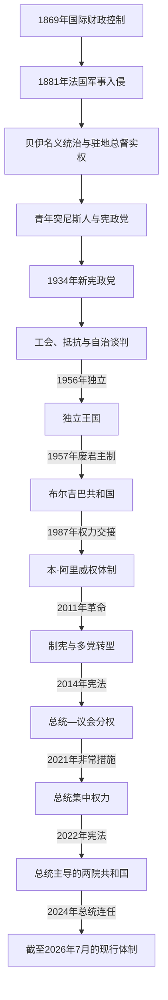

# 突尼斯的法国保护国、独立与现代国家

## 时间

1881年—2026年7月14日

## 概括

1881年法国以边境冲突为借口入侵，迫使萨迪克贝伊签订《巴尔杜条约》；1883年《马尔萨公约》又把行政、司法和财政“改革”交给法国监督。侯赛因王朝、突尼斯大臣和地方官署在名义上保留，实际最高权力却属于法国驻地总督。殖民政府用军队、民政监督、土地登记、欧洲移民定居和出口基础设施重塑社会，法国人与其他欧洲社群享有不同于多数突尼斯人臣民的法律和政治地位。

民族运动从青年突尼斯人、宪政党发展到新宪政党和突尼斯总工会，把报刊、城市抗议、工会、农村游击与谈判结合起来。1956年3月20日独立，1957年7月25日制宪议会废除君主制。布尔吉巴政府推进个人身份法、教育、公共卫生和国家行政建设，同时形成一党总统集权；本·阿里1987年以“医学政变”接替后，初期开放很快转为警察、执政党和总统家族控制。

2010—2011年革命推翻本·阿里，制宪议会、全国对话和2014年宪法建立多党竞争与总统—议会分权。经济停滞、地区不平等、恐怖袭击、政党碎片化和行政冲突削弱新制度。凯斯·赛义德总统于2021年7月暂停议会、解除总理职务并以非常措施集中权力；2022年宪法确立总统主导的行政体系。赛义德在2024年选举中连任。截止2026年7月14日，国家元首仍为凯斯·赛义德，政府首脑为萨拉·扎弗拉尼·曾兹里。

侯赛因王朝贝伊和末代国王的完整世系见[突尼斯君主与主要统治者世系表](/%E4%BA%BA%E6%96%87%E7%A7%91%E5%AD%A6/%E5%8E%86%E5%8F%B2/%E5%8C%97%E9%9D%9E/%E7%AA%81%E5%B0%BC%E6%96%AF/%E7%AA%81%E5%B0%BC%E6%96%AF%E5%90%9B%E4%B8%BB%E4%B8%8E%E4%B8%BB%E8%A6%81%E7%BB%9F%E6%B2%BB%E8%80%85%E4%B8%96%E7%B3%BB%E8%A1%A8.md)。

## 演进图

## 法国保护国的建立与统治机制

### 从债务控制到军事占领

19世纪贝伊政府的军事改革、宫廷开支、高息外债和包税不公共同造成财政崩溃。1869年英、法、意代表组成国际财政委员会，先行分配海关等收入给债权人，突尼斯在形式上仍属奥斯曼体系，财政主权却已被外部共管。法国占领阿尔及利亚后希望控制其东部边界，意大利则凭移民、贸易和地理距离在突尼斯拥有强大影响，列强竞争使债务危机转为战略争夺。

1881年法国宣称克鲁米尔部族越境袭击阿尔及利亚，从陆海两路出兵。5月12日《巴尔杜条约》授权法国负责外交、防务和驻军。中部、南部军民仍持续抵抗，殖民军到1881年底才大体控制主要地区。1883年《马尔萨公约》要求贝伊实施法国认为必要的改革，使保护国从有限外交军事控制转为全面行政监督。

### 名义双层政府与实际权力

贝伊仍是名义国家元首，突尼斯首席大臣和各部继续发布命令，地方“凯德”管理行政与征税；但法国驻地总督可向贝伊提出并实际决定政策。法国籍政府秘书长监督本地各部，财政、公共工程、教育、司法和安全等技术部门由法国官员主导，地方“民政监督官”监控省区。法令常以贝伊名义颁布，从而用本地王权外壳执行殖民政策。

法律秩序具有分层性质：法国公民受法国法院和领事—殖民制度保护，欧洲移民的财产和政治参与优先；多数穆斯林和犹太突尼斯人仍为贝伊臣民，并在宗教法庭、本地法院和殖民行政之间受到不同管辖。1883年后法国也逐步重组司法，传统机构并非完全消失，却失去主权上的最终裁量。

### 土地、基础设施与社会变化

土地登记、国有地和“闲置地”认定促使大量农地转入法国定居者、公司和银行。铁路从内陆磷矿、谷物和橄榄产区通向突尼斯、斯法克斯等港口，灌溉、道路、城市卫生和学校有所扩张，但投资优先服务出口、移民定居和军政控制。沿海城市和采矿区形成雇佣工人、商人及专业阶层，内陆农村则承受土地流失、税负和价格波动。

法国人、人数众多的意大利移民、马耳他人、突尼斯穆斯林和犹太社群共同构成殖民城市。社群之间既合作、竞争和文化交融，也因国籍、教育、司法与就业机会不同而分层。殖民现代化与不平等并存，正是民族主义得以跨越精英请愿和群众政治的社会基础。

## 民族运动、战争与独立

### 从改革请愿到群众组织

1907年“青年突尼斯人”以报刊、教育和行政平等诉求开展改革运动。1911年杰拉兹公墓争议引发冲突，1912年抵制突尼斯电车公司演变为罢工，法国随后逮捕或流放领袖。第一次世界大战后民族自决话语扩散，1920年宪政党成立，要求宪法、代表机关和限制殖民专权。

1934年，哈比卜·布尔吉巴等人在宪政党内分裂并成立新宪政党。新党通过地方支部、报刊、律师、学生和农村组织扩大社会基础。1938年4月要求议会的示威遭武力镇压，领导人被捕，合法政治空间收缩。

### 第二次世界大战与王权危机

1940年法国战败后，保护国受维希政府控制。1942年11月至1943年5月，轴心国军队占领突尼斯北部，盟军从阿尔及利亚和利比亚方向夹攻，突尼斯成为北非战场最后阶段。轰炸、征用和战斗破坏经济；轴心当局对突尼斯犹太人强征劳役、罚款并建立劳工营。

蒙塞夫贝伊试图任命更具民族代表性的政府，并在交战双方之间维护王权自主。1943年盟军胜利后，自由法国以合作嫌疑将其废黜并流放；是否构成“通敌”长期存在争议。事件反而使贝伊成为部分民族主义者眼中的主权象征，并暴露保护国王权完全受法国决定。

### 工会、抵抗与谈判

1946年突尼斯总工会成立，工人组织把社会诉求与独立运动结合。法国有限改革无法满足新宪政党要求。1952年谈判破裂后，领导人被捕，乡村“费拉加”武装活动、罢工和殖民镇压升级；总工会领袖法尔哈特·哈舍德遇刺进一步激化危机。

法国在印度支那战争失败、摩洛哥和阿尔及利亚危机上升的背景下调整政策。1954年法国承诺内部自治，塔哈尔·本·阿马尔政府与法国谈判，1955年签署自治公约。布尔吉巴主张把自治作为通向完全独立的阶段，萨拉赫·本·优素福则反对协议并强调与阿尔及利亚斗争和阿拉伯世界联动，两派冲突以布尔吉巴路线获胜告终。

1956年3月20日法国承认突尼斯独立，废除《巴尔杜条约》框架。新国家仍需处理法国军事基地、殖民土地和行政人员。1961年比塞大危机中突尼斯军民与法军交战，造成严重伤亡；1963年法国撤出基地，军事主权才完整落实。

### 保护国衰落与直接终结

保护国并非仅因法国“主动放弃”而结束。结构上，受教育专业阶层、工人和农村组织扩大，殖民双重法律和土地分配越来越缺乏合法性；外部上，第二次世界大战削弱法国威望，全球去殖民化和法国在印度支那、摩洛哥、阿尔及利亚的多线压力提高统治成本；直接过程中，1952年后的镇压未能消灭抵抗，工会和新宪政党又保持谈判能力。1954—1956年的自治谈判、政党路线斗争和法国战略调整最终汇合为独立。

## 法国殖民行政首脑

下表列法国在突尼斯的常任最高代表。1881—1885年初期称“驻扎大臣”或相近名称，随后制度化为“驻地总督”；1955年内部自治后改称高级专员。日期间的短暂空档多由临时代理承担，不另把每一名代理列为正式一任。

| 顺序 | 法国最高代表 | 任期 | 职衔与关键事项 |
|---:|---|---|---|
| 1 | 泰奥多尔·鲁斯唐 | 1881年5月13日—1882年2月28日 | 驻扎大臣；推动《巴尔杜条约》后的最初军事—外交控制 |
| 2 | 保罗·康邦 | 1882年2月28日—1886年10月28日 | 先任驻扎大臣，1885年起为驻地总督；推动《马尔萨公约》和文官保护国体系 |
| 3 | 朱斯坦·马西科 | 1886年11月23日—1892年11月5日 | 驻地总督；扩展法国行政和财政监督 |
| 4 | 夏尔·鲁维耶 | 1892年11月—1894年11月14日 | 延续土地、工程和民政控制 |
| 5 | 勒内·米耶 | 1894年11月14日—1900年11月 | 在定居扩张和本地改革诉求间维持殖民秩序 |
| 6 | 伯努瓦·德·梅克尔 | 1900年11月—1901年12月27日 | 任期短暂 |
| 7 | 斯蒂芬·皮雄 | 1901年12月27日—1907年2月7日 | 殖民行政强化，青年突尼斯人运动开始形成 |
| 8 | 加布里埃尔·阿拉佩蒂特 | 1907年2月7日—1918年10月26日 | 经历杰拉兹事件、电车抵制与第一次世界大战 |
| 9 | 艾蒂安·弗朗丹 | 1918年10月26日—1921年1月1日 | 战后民族主义扩展，宪政党成立 |
| 10 | 吕西安·圣 | 1921年1月1日—1929年1月2日 | 以有限改革和压制应对宪政党 |
| 11 | 弗朗索瓦·芒瑟龙 | 1929年2月18日—1933年7月29日 | 经济危机与政治重组时期 |
| 12 | 马塞尔·佩鲁东 | 1933年7月29日—1936年3月21日 | 新宪政党成立后加强镇压 |
| 13 | 阿尔芒·吉永 | 1936年4月17日—1938年10月18日 | 人民阵线初期释放政治犯，1938年示威后再度镇压 |
| 14 | 埃里克·拉博纳 | 1938年11月22日—1940年6月3日 | 第二次世界大战初期任职 |
| 15 | 马塞尔·佩鲁东 | 1940年6月3日—7月22日 | 第二任；法国战败和维希接管过渡期 |
| 16 | 让-皮埃尔·埃斯泰瓦 | 1940年7月26日—1943年5月10日 | 维希政府驻地总督；经历轴心国占领和突尼斯战役 |
| 17 | 夏尔·马斯特 | 1943年5月10日—1947年2月22日 | 自由法国恢复控制并废黜蒙塞夫贝伊 |
| 18 | 让·蒙斯 | 1947年2月22日—1950年6月13日 | 工会和民族主义持续扩张 |
| 19 | 路易·佩里耶 | 1950年6月13日—1952年1月13日 | 与舍尼克政府尝试改革，后因法国政策转硬而终止 |
| 20 | 让·德·奥特克洛克 | 1952年1月13日—1953年9月2日 | 大规模逮捕和镇压，民族抵抗升级 |
| 21 | 皮埃尔·瓦扎尔 | 1953年9月2日—1954年11月5日 | 推动有限改革，法国转向承认内部自治 |
| 22 | 皮埃尔·布瓦耶·德·拉图尔 | 1954年11月5日—1955年8月31日 | 监督自治谈判与公约实施 |
| 23 | 罗歇·赛杜 | 1955年9月13日—1956年3月20日 | 高级专员；内部自治向完全独立过渡，保护国终结 |

## 保护国时期突尼斯政府首脑

贝伊任命的“首席大臣”是名义政府首脑，重大政策受法国驻地总督和政府秘书长控制。早期官方任期存在交接空档，下表按通常承认的正式任职顺序列出；空档由代理或旧内阁维持，不另虚构一任。

| 顺序 | 首席大臣 | 任期 | 实际位置与关键事项 |
|---:|---|---|---|
| 1 | 穆罕默德·哈兹纳达尔 | 1881年9月—1882年10月 | 保护国最初阶段任职，实权快速转向法国代表 |
| 2 | 穆罕默德·阿齐兹·布阿图尔 | 1882年10月—1907年2月 | 长期主持名义政府，法国技术部门和秘书长体系在其任内定型 |
| 3 | 穆罕默德·杰卢利 | 1907年11月—1908年6月 | 青年突尼斯人运动兴起时任职 |
| 4 | 优素福·贾伊特 | 1908—1915年 | 经历杰拉兹事件和电车抵制，任期具体交接日资料不一 |
| 5 | 穆罕默德·塔伊布·杰卢利 | 1915年10月—1922年5月 | 第一次世界大战及宪政党成立时期 |
| 6 | 穆斯塔法·丁吉兹利 | 1922年5月—1926年11月 | 法国驻地总督掌握最终决策 |
| 7 | 哈利勒·布哈吉卜 | 1926年11月—1932年3月 | 经济危机前后任职 |
| 8 | 哈迪·拉赫瓦 | 1932年3月—1942年12月 | 经历新宪政党成立、1938年镇压和维希统治 |
| 9 | 穆罕默德·舍尼克 | 1943年1月—5月 | 蒙塞夫贝伊任命，试图扩大本地政府自主；盟军胜利后被撤 |
| 10 | 萨拉赫丁·巴库什 | 1943年5月—1947年7月 | 自由法国恢复殖民控制时期 |
| 11 | 穆斯塔法·卡阿克 | 1947年8月—1950年8月 | 有限制度改革未能化解民族诉求 |
| 12 | 穆罕默德·舍尼克 | 1950年8月—1952年3月 | 第二任；与民族主义者合作争取自治，后遭法国压制 |
| 13 | 萨拉赫丁·巴库什 | 1952年3月—1954年3月 | 第二任；武装抵抗和殖民镇压高峰 |
| 14 | 穆罕默德·萨拉赫·姆扎利 | 1954年3月—6月 | 法国提出有限改革，因缺乏政治基础迅速下台 |
| 15 | **塔哈尔·本·阿马尔** | 1954年8月7日—1956年4月11日 | 领导自治及独立谈判，1956年3月20日签署独立文件；4月11日向布尔吉巴政府交接 |

## 独立建国与布尔吉巴时期

### 王国到共和国

独立后，制宪议会掌握立法和制宪权，新宪政党控制政府与组织网络。1956年8月颁布《个人身份法》，禁止一夫多妻、规范离婚并提高妇女法律地位；教育、司法和宗教基金管理也迅速国家化。布尔吉巴政府打击萨拉赫·本·优素福派，结束党内双重权力。

1957年7月25日，制宪议会废除拉明贝伊王位并宣布共和国，布尔吉巴任总统。废君主制并非全民公投，而是由制宪议会在执政党占绝对优势下完成。1959年宪法确立总统制，党、国家行政、工会和地方组织逐步被纳入单一政治中心。

### 国家建设、社会改革与一党集权

布尔吉巴把普及教育、公共卫生、家庭计划、基础设施和外交务实作为现代国家工程。政府没收或接收殖民土地，并在1960年代由艾哈迈德·本·萨拉推动合作社和国家主导发展。强制并社、行政过急、农业歉收和基层反对使政策在1969年被撤回，突尼斯随后更重视私营部门、旅游业和对欧贸易。

政治上，新宪政党改名社会主义宪政党，反对派活动受限，选举不能形成真正轮替。1975年议会授予布尔吉巴终身总统身份。1978年政府与总工会冲突引发“黑色星期四”，1984年取消食品补贴造成“面包骚乱”，显示经济改革成本、青年就业和执政合法性的矛盾。总统年老、继承不明、宫廷派系和伊斯兰主义反对运动加剧危机。

1987年11月7日，总理宰因·阿比丁·本·阿里依据宪法中的健康条款，凭医生证明宣布布尔吉巴无力履职并接任总统。权力交接没有大规模战斗，被称为“医学政变”；它直接终结了布尔吉巴三十年统治，却保留了总统制国家、官僚和执政党骨架。

## 本·阿里时期：开放承诺与警察国家

本·阿里起初释放部分政治犯、废除终身总统并推动1988年“民族契约”，承诺政治开放。1989年后，政府与伊斯兰复兴运动冲突加剧，逮捕、军事审判、媒体控制和安全机构监视扩大。执政党改名宪政民主联盟，总统选举和议会选举定期举行，但候选资格、媒体、行政资源和结果受到严密控制。

1990—2000年代，制造业、旅游、基础设施、女性教育和部分中产阶层发展，使体制获得稳定；与此同时，内陆与沿海差距、青年失业、非正规经济和警察腐败长期存在。总统妻族特拉贝尔西家族被指利用许可、银行和私有化攫取资产，腐败成为反对体制的共同语言。2008年加夫萨矿区抗议已把就业、地方资源分配和镇压问题集中暴露出来。

2010年12月17日，西迪布济德小贩穆罕默德·布瓦吉吉自焚，引发从内陆向沿海城市扩散的示威。工会地方组织、律师、青年和网络传播使抗议无法被局部隔离。安全镇压造成死伤，却未能恢复秩序；2011年1月14日本·阿里离境，二十三年统治直接终结。

## 2011年革命后的制度转型

### 临时政府、制宪议会与“三驾马车”

本·阿里离境当天，总理穆罕默德·加努希短暂宣布代行总统；次日宪法委员会认定总统职位永久空缺，由众议长福阿德·迈巴扎任临时总统。街头抗议迫使原执政党成员逐步退出，宪政民主联盟被解散。2011年10月制宪议会选举后，复兴运动与保卫共和大会、争取工作与自由民主论坛组成“三驾马车”联合执政，蒙塞夫·马尔祖基任临时总统。

制宪过程要协调宗教与世俗、总统与议会、中央与地方、旧国家机构与革命问责。经济增长放缓、利比亚战争冲击、罢工和行政不确定性增加压力。2013年肖克里·贝莱德和穆罕默德·卜拉希米遇刺，引发政府合法性危机和大规模抗议。

### 全国对话与2014年宪法

突尼斯总工会、工业贸易和手工业联合会、人权联盟与律师协会组成全国对话机制，推动执政联盟与反对派接受路线图。迈赫迪·朱马技术官僚政府接替党派政府，制宪议会于2014年1月通过新宪法。该宪法设置民选总统、对议会负责的政府、权利保障和较分散的行政权，试图防止个人独裁。

2014年选举后，突尼斯呼声党与复兴运动合作，避免立即排除一方，却也使选民难以用轮替追责。2015年巴尔杜博物馆和苏塞海滩恐怖袭击重创旅游并推动安全法治扩张。政党分裂、政府频繁更迭、公共债务、通胀、青年失业和地区不平等持续，2014年宪法要求的宪法法院一直未能完整建立。总统、总理和议会围绕权限及任命的冲突不断累积。

## 2021年以后：总统集权与新宪法

凯斯·赛义德以反党派、反腐败和直接民主话语在2019年当选总统。新冠疫情、经济危机以及总统、希沙姆·迈希希政府和议会多数的对抗使国家运作更加僵持。2021年7月25日，赛义德引用宪法非常状态条款，暂停议会、解除总理职务并接管行政权；支持者称之为纠正失灵体制，反对者则称其破坏2014年宪政秩序。

总统随后以法令治理，2022年3月解散议会。2022年7月25日新宪法公投通过，并在8月公布最终结果。新宪法规定行政职能由总统在政府协助下行使：总统任命和免除政府首脑，政府按总统确定的方向执行政策并对总统负责，议会不再像2014年体制那样决定政府日常存续。

2022年末至2023年初选出新的人民代表大会，投票率很低；2024年全国地区与区域委员会建立后，议会形成两院结构。第二院以地方、区域和大区层级的间接代表为基础，重点参与发展计划、预算及相关监督。制度目标是把代表链条从地方推向中央，但候选参与度、权力平衡和实际问责效果仍在形成中。

2024年10月6日总统选举中，官方结果显示赛义德获得约90.69%的有效票，投票率约28.79%；他于10月开始第二任期。反对派候选资格、司法独立、政党人物羁押、媒体与社团空间受到国内外批评；总统及其支持者则把现行路线解释为清除腐败、恢复国家主权和推进“7月25日进程”。截至2026年7月14日，现行体制继续运作，尚不能把这一仍在发展的阶段写成已完成的最终结论。

## 国家元首

### 保护国与独立王国

1881—1957年的名义国家元首为侯赛因王朝贝伊，1956年独立后拉明贝伊一度改称国王。完整顺序见[突尼斯君主与主要统治者世系表](/%E4%BA%BA%E6%96%87%E7%A7%91%E5%AD%A6/%E5%8E%86%E5%8F%B2/%E5%8C%97%E9%9D%9E/%E7%AA%81%E5%B0%BC%E6%96%AF/%E7%AA%81%E5%B0%BC%E6%96%AF%E5%90%9B%E4%B8%BB%E4%B8%8E%E4%B8%BB%E8%A6%81%E7%BB%9F%E6%B2%BB%E8%80%85%E4%B8%96%E7%B3%BB%E8%A1%A8.md)。保护国时期贝伊发布法令和任命本地政府，但重大决策受法国驻地总督控制，不能把其名义在位等同于完整主权。

### 共和国总统

| 顺序 | 国家元首 | 任期 | 产生与关键事件 |
|---:|---|---|---|
| 1 | **哈比卜·布尔吉巴** | 1957年7月25日—1987年11月7日 | 制宪议会废君主制后任总统；国家建设与社会改革并行，后形成终身总统和一党集权 |
| 2 | **宰因·阿比丁·本·阿里** | 1987年11月7日—2011年1月14日 | 以总统健康条款接任；建立宪政民主联盟—安全机构主导体制，革命中离境 |
| 代行 | 穆罕默德·加努希 | 2011年1月14—15日 | 总理依据当时宪法临时代行；宪法委员会次日改认总统职位永久空缺 |
| 临时 | 福阿德·迈巴扎 | 2011年1月15日—12月13日 | 以前众议长身份任临时总统，主持向制宪议会过渡 |
| 3 | 蒙塞夫·马尔祖基 | 2011年12月13日—2014年12月31日 | 制宪议会选举的临时总统，经历“三驾马车”和全国对话 |
| 4 | **贝吉·凯德·埃塞卜西** | 2014年12月31日—2019年7月25日 | 2014年宪法下首位经普选产生并完成权力交接的总统，在任内去世 |
| 临时 | 穆罕默德·纳赛尔 | 2019年7月25日—10月23日 | 依2014年宪法由议长代理，总统选举后交权 |
| 5 | **凯斯·赛义德** | 2019年10月23日—至今 | 2019年当选；2021年起集中权力，推动2022年宪法；2024年10月开始第二任期，截至2026年7月14日仍在任 |

## 独立后的政府首脑

历任政府名录把“首席大臣”“第一部长”和2011年后的“政府首脑”连续统计。1957—1969年正式总理职位一度撤销，布尔吉巴总统直接领导行政，巴希·拉德加姆以总统府国务秘书协调政府；表中把这一制度空档明确标出。少数公开名录把辞职日、任命日或交接日混用，本表在备注中区分宣布辞职与实际交接，不另虚构政府首脑。

| 顺序 | 政府首脑或协调者 | 任期 | 职位与关键事项 |
|---:|---|---|---|
| 1 | **哈比卜·布尔吉巴** | 1956年4月11日—1957年7月25日 | 独立王国首席大臣；由塔哈尔·本·阿马尔交接，废君主制后转任总统 |
| — | 巴希·拉德加姆 | 1957年7月29日—1969年11月7日 | 总统府国务秘书，实际协调政府；法律上不是总理 |
| 2 | 巴希·拉德加姆 | 1969年11月7日—1970年10月9日 | 恢复总理职位后的首任 |
| 代行 | 哈迪·努伊拉 | 1970年10月9日—11月2日 | 代总理，随后正式就任 |
| 3 | **哈迪·努伊拉** | 1970年11月2日—1980年4月23日 | 推动经济开放和私营部门发展，因健康原因离任 |
| 4 | 穆罕默德·姆扎利 | 1980年4月23日—1986年7月8日 | 政治有限开放后转向紧缩，经历1984年面包骚乱 |
| 5 | 拉希德·斯法尔 | 1986年7月8日—1987年10月2日 | 处理财政经济危机 |
| 6 | 宰因·阿比丁·本·阿里 | 1987年10月3日—11月7日 | 总理兼内政安全背景；一个月后接任总统 |
| 7 | 哈迪·巴库什 | 1987年11月7日—1989年9月27日 | 本·阿里初期开放与体制重组 |
| 8 | 哈米德·卡鲁伊 | 1989年9月27日—1999年11月17日 | 接替巴库什；执政党和总统主导，镇压伊斯兰主义反对派 |
| 9 | 穆罕默德·加努希 | 1999年11月17日—2011年2月27日 | 本·阿里后期总理；革命后短暂留任并在持续抗议下辞职 |
| 10 | 贝吉·凯德·埃塞卜西 | 2011年2月27日—12月24日 | 过渡政府，组织制宪议会选举 |
| 11 | 哈马迪·杰巴利 | 2011年12月24日—2013年3月13日 | 复兴运动领导的“三驾马车”首任政府首脑；贝莱德遇刺后于2月19日宣布辞职，至新政府就职完成交接 |
| 12 | 阿里·拉雷耶德 | 2013年3月13日—2014年1月29日 | 政治暗杀和全国对话危机中执政，按路线图交权 |
| 13 | 迈赫迪·朱马 | 2014年1月29日—2015年2月6日 | 技术官僚政府，组织2014年选举 |
| 14 | 哈比卜·埃西德 | 2015年2月6日—2016年8月27日 | 2014年宪法下议会多数政府，遭议会撤回信任 |
| 15 | 优素福·沙赫德 | 2016年8月27日—2020年2月27日 | 联合政府分裂、反腐行动和经济改革争议 |
| 16 | 伊利亚斯·法赫法赫 | 2020年2月27日—9月2日 | 新冠疫情初期执政，利益冲突争议后辞职 |
| 17 | 希沙姆·迈希希 | 2020年9月2日—2021年7月25日 | 与总统、议会长期冲突；2021年非常措施中被解除职务 |
| — | 总统直接主导的非常措施期 | 2021年7月25日—10月11日 | 无正式政府首脑，总统及看守部长维持行政 |
| 18 | 纳杰拉·布登 | 2021年10月11日—2023年8月1日 | 突尼斯首位女性政府首脑；按总统方向执行政策 |
| 19 | 艾哈迈德·哈沙尼 | 2023年8月1日—2024年8月7日 | 2022年宪法下由总统任免 |
| 20 | 卡迈勒·马杜里 | 2024年8月7日—2025年3月20日 | 总统第二任期初继续主持政府 |
| 21 | **萨拉·扎弗拉尼·曾兹里** | 2025年3月21日—至今 | 由总统任命；截至2026年7月14日仍为政府首脑 |

## 各阶段实际权力结构

| 阶段 | 国家元首 | 政府首脑 | 议会或代表机构 | 实际最高权力与制约 |
|---|---|---|---|---|
| 法国保护国，1881—1956年 | 侯赛因王朝贝伊 | 突尼斯首席大臣 | 殖民咨询机构，代表性有限且分社群 | 法国驻地总督、政府秘书长和殖民军掌实权；贝伊法令提供形式合法性 |
| 独立王国，1956—1957年 | 拉明贝伊／国王 | 布尔吉巴 | 制宪议会 | 制宪议会与新宪政党政府掌主动，王室无独立军政基础 |
| 布尔吉巴共和国，1957—1987年 | 总统布尔吉巴 | 总理职位1957—1969年撤销，后恢复 | 一党优势议会 | 总统、执政党、行政和安全机构集中；工会偶有独立动员能力 |
| 本·阿里共和国，1987—2011年 | 总统本·阿里 | 总理 | 受控多党议会 | 总统、宪政民主联盟、内政安全系统和家族商业网络居主导 |
| 制宪过渡，2011—2014年 | 临时总统 | 联合或技术官僚政府 | 制宪议会 | 议会多数、总统和政府分权；街头、工会和全国对话组织构成外部制约 |
| 2014年宪法体制，2014—2021年 | 民选总统 | 对议会负责的政府首脑 | 人民代表大会 | 总统掌外交国防等领域，政府掌一般行政；政党联盟和权限冲突导致频繁僵局 |
| 非常措施，2021—2022年 | 凯斯·赛义德 | 先空缺，后总统任命 | 议会暂停后解散 | 总统以法令集中行政和立法权，2014年制衡结构中断 |
| 2022年宪法体制，2022年至今 | 凯斯·赛义德 | 总统任免、对总统负责 | 人民代表大会与全国地区和大区委员会两院 | 总统确定国家一般政策并可免政府；两院参与立法、预算和发展监督，但行政权明显以总统为中心 |

## 重要事件

| 时间 | 事件 | 过程与长期影响 |
|---|---|---|
| 1881年 | 法军入侵、《巴尔杜条约》 | 法国取得外交、防务和驻军权，保护国建立 |
| 1883年 | 《马尔萨公约》 | 驻地总督获得全面推动行政改革的权力 |
| 1907年 | 青年突尼斯人运动形成 | 精英改革请愿转向报刊和公共政治 |
| 1911—1912年 | 杰拉兹事件与电车抵制 | 城市群众动员遭镇压，民族运动领袖被捕或流放 |
| 1920年 | 宪政党成立 | 把宪法、代表制和主权诉求组织化 |
| 1934年 | 新宪政党成立 | 地方支部和群众组织扩大民族主义社会基础 |
| 1938年 | 四月示威遭镇压 | 合法请愿空间缩小，殖民统治与民族运动对立加深 |
| 1942—1943年 | 突尼斯战役 | 轴心占领、盟军反攻、犹太人被强征劳役；北非战场结束 |
| 1943年 | 蒙塞夫贝伊被废 | 法国直接决定君主废立，王权自主幻想破灭 |
| 1946年 | 突尼斯总工会成立 | 工运、社会改革和民族独立相结合 |
| 1952年 | 抵抗升级、哈舍德遇刺 | 武装、罢工与国际舆论共同提高殖民成本 |
| 1954—1955年 | 内部自治谈判 | 法国承诺自治，布尔吉巴与本·优素福路线分裂 |
| 1956年3月20日 | 突尼斯独立 | 保护国条约终止，布尔吉巴政府掌握主权 |
| 1956年8月 | 《个人身份法》 | 家庭法和妇女权利成为国家改革核心 |
| 1957年7月25日 | 废除君主制 | 制宪议会建立共和国，侯赛因王朝终结 |
| 1961—1963年 | 比塞大危机与法军撤离 | 经过战争和谈判完成军事基地收回 |
| 1962—1969年 | 合作社与国家主导发展 | 政策扩张后因经济、行政和政治反弹被撤回 |
| 1975年 | 布尔吉巴成为终身总统 | 一党总统集权制度化，继承问题加重 |
| 1978年 | “黑色星期四” | 政府与总工会冲突造成严重伤亡 |
| 1984年 | 面包骚乱 | 补贴改革、贫困和威权治理矛盾集中爆发 |
| 1987年11月7日 | 本·阿里接任 | 以健康条款终结布尔吉巴统治，国家机器基本延续 |
| 1989—1992年 | 政治开放终止与镇压 | 复兴运动及其他反对派遭压制，警察国家巩固 |
| 2008年 | 加夫萨矿区抗议 | 内陆就业、资源分配和腐败问题成为革命前兆 |
| 2010年12月—2011年1月 | 革命 | 布瓦吉吉自焚后抗议全国化，本·阿里离境 |
| 2011年10月 | 制宪议会选举 | 竞争性选举和联合执政开始 |
| 2013年 | 两次政治暗杀与全国对话 | 政治危机通过社会组织推动的路线图缓解 |
| 2014年 | 新宪法与全国选举 | 建立总统—议会分权和权利保障框架 |
| 2015年 | 巴尔杜和苏塞恐怖袭击 | 人员伤亡、旅游受创，安全治理优先度上升 |
| 2019年 | 凯斯·赛义德当选总统 | 反党派和制度重构诉求进入国家最高权力 |
| 2021年7月25日 | 暂停议会、解除总理 | 2014年体制的权力平衡被打断 |
| 2022年 | 解散议会并通过新宪法 | 总统主导的行政体系获得新宪法框架 |
| 2023—2024年 | 新两院议会形成 | 人民代表大会与地区、区域代表第二院先后建立 |
| 2024年10月 | 赛义德连任 | 官方得票约90.69%，投票率约28.79%，总统路线延续 |
| 2025年3月21日 | 曾兹里任政府首脑 | 2022年宪法下政府继续对总统负责 |
| 截至2026年7月14日 | 现行体制持续 | 赛义德为总统，曾兹里为政府首脑，政治与经济转型仍未定型 |

## 制度崛起、衰落与转型原因

| 阶段 | 建立或巩固机制 | 主要成果或鼎盛条件 | 结构性衰落因素 | 直接终结或转型 |
|---|---|---|---|---|
| 法国保护国 | 债务控制、军事占领、贝伊名义合法性和殖民官僚 | 军事优势、出口基础设施、定居网络和分层法律 | 民族组织、土地与法律不平等、殖民合法性下降 | 1952年后抵抗与国际压力升级，1954—1956年谈判结束保护国 |
| 布尔吉巴体制 | 新宪政党组织、制宪议会、国家行政与社会改革 | 教育、卫生、家庭法和统一国家机构 | 一党僵化、经济政策失误、社会抗议、总统老化和继承危机 | 1987年本·阿里以健康条款接任 |
| 本·阿里体制 | 安全机构、执政党、受控选举、经济增长与外部合作 | 旅游、制造业和部分中产扩张 | 腐败、家族攫取、地区不平等、青年失业、政治封闭 | 布瓦吉吉事件触发全国抗议，2011年1月总统离境 |
| 2014年宪法体制 | 革命合法性、制宪协商、全国对话和竞争选举 | 和平轮替、权利框架、多党与公民社会参与 | 权限冲突、政党碎片化、宪法法院缺位、经济与安全压力 | 2021年总统启用非常措施并中断议会，2022年以新宪法取代 |
| 2022年宪法体制 | 总统个人授权、反党派诉求、法令治理和公投 | 行政指挥集中、两院地方代表构想 | 低参与率、反对派与权利争议、经济和社会压力 | 截至2026年仍在发展，不能预先写定其终局 |

## 演变关系

- 前一阶段：[伊弗里基亚王朝与奥斯曼突尼斯](/%E4%BA%BA%E6%96%87%E7%A7%91%E5%AD%A6/%E5%8E%86%E5%8F%B2/%E5%8C%97%E9%9D%9E/%E7%AA%81%E5%B0%BC%E6%96%AF/%E4%BC%8A%E5%BC%97%E9%87%8C%E5%9F%BA%E4%BA%9A%E7%8E%8B%E6%9C%9D%E4%B8%8E%E5%A5%A5%E6%96%AF%E6%9B%BC%E7%AA%81%E5%B0%BC%E6%96%AF.md)
- 王朝世系：[突尼斯君主与主要统治者世系表](/%E4%BA%BA%E6%96%87%E7%A7%91%E5%AD%A6/%E5%8E%86%E5%8F%B2/%E5%8C%97%E9%9D%9E/%E7%AA%81%E5%B0%BC%E6%96%AF/%E7%AA%81%E5%B0%BC%E6%96%AF%E5%90%9B%E4%B8%BB%E4%B8%8E%E4%B8%BB%E8%A6%81%E7%BB%9F%E6%B2%BB%E8%80%85%E4%B8%96%E7%B3%BB%E8%A1%A8.md)
- 上级：[突尼斯历史](/%E4%BA%BA%E6%96%87%E7%A7%91%E5%AD%A6/%E5%8E%86%E5%8F%B2/%E5%8C%97%E9%9D%9E/%E7%AA%81%E5%B0%BC%E6%96%AF/README.md)
- 比较专题：[殖民统治、民族主义与北非独立](/%E4%BA%BA%E6%96%87%E7%A7%91%E5%AD%A6/%E5%8E%86%E5%8F%B2/%E5%8C%97%E9%9D%9E/_%E9%80%9A%E5%8F%B2/%E6%AE%96%E6%B0%91%E7%BB%9F%E6%B2%BB%E3%80%81%E6%B0%91%E6%97%8F%E4%B8%BB%E4%B9%89%E4%B8%8E%E5%8C%97%E9%9D%9E%E7%8B%AC%E7%AB%8B.md)
