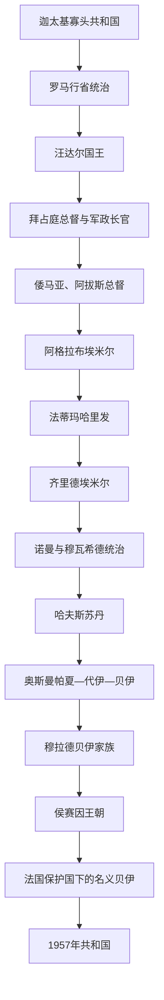

# 突尼斯君主与主要统治者世系表

## 范围与读表说明

本表汇总以今突尼斯为核心或在此建立统治中心的主要王朝、国王与实际统治者。它服务于[突尼斯历史](/%E4%BA%BA%E6%96%87%E7%A7%91%E5%AD%A6/%E5%8E%86%E5%8F%B2/%E5%8C%97%E9%9D%9E/%E7%AA%81%E5%B0%BC%E6%96%AF/README.md)、[迦太基、罗马与拜占庭非洲](/%E4%BA%BA%E6%96%87%E7%A7%91%E5%AD%A6/%E5%8E%86%E5%8F%B2/%E5%8C%97%E9%9D%9E/%E7%AA%81%E5%B0%BC%E6%96%AF/%E8%BF%A6%E5%A4%AA%E5%9F%BA%E3%80%81%E7%BD%97%E9%A9%AC%E4%B8%8E%E6%8B%9C%E5%8D%A0%E5%BA%AD%E9%9D%9E%E6%B4%B2.md)和[伊弗里基亚王朝与奥斯曼突尼斯](/%E4%BA%BA%E6%96%87%E7%A7%91%E5%AD%A6/%E5%8E%86%E5%8F%B2/%E5%8C%97%E9%9D%9E/%E7%AA%81%E5%B0%BC%E6%96%AF/%E4%BC%8A%E5%BC%97%E9%87%8C%E5%9F%BA%E4%BA%9A%E7%8E%8B%E6%9C%9D%E4%B8%8E%E5%A5%A5%E6%96%AF%E6%9B%BC%E7%AA%81%E5%B0%BC%E6%96%AF.md)，不把现代国界机械投射到古代。

- 迦太基共和国每年选出两名苏费特，军队统帅又与苏费特分立。铭文和文献只保存少量姓名，因而不存在可恢复的“完整历代国王表”。早期所谓“王”多是现代学者根据家族、将领和古典作者重建的政治领袖，年代及身份均有争议。
- 哈夫斯王朝曾有贝贾亚、君士坦丁等并行支系，也两度受马林王朝占领。本表采用以突尼斯城实际主权者为中心的常见序列，并把僭位和奥斯曼占领写入备注。
- 奥斯曼时期的帕夏、代伊、贝伊可能同时存在；表中“穆拉德贝伊家族”和“侯赛因王朝”列的是逐渐掌握地方最高权力的贝伊主线，不等于奥斯曼苏丹世系。
- 年代尤其是早期迦太基、法蒂玛—齐里德权力移交和哈夫斯内战存在异说，表中用“约”“传统说”或“有争议”标示，不把推测写成确定事实。

## 世系总图

## 迦太基：可辨认的早期领袖与共和官职

### 政体而非连续王朝

| 机构或职位 | 产生方式 | 职权 | 连续性问题 |
|---|---|---|---|
| 两名苏费特 | 一般按年选举，出自城邦精英 | 主持政务、司法和议事；不必兼任战场统帅 | 保存下来的姓名极少，无法按年度复原 |
| 元老院或长老会议 | 寡头家族构成 | 外交、财政、战争与重大政策 | 古典作者使用希腊、罗马政治术语转述，具体组成仍有争议 |
| “一百零四人”法庭 | 由精英政治结构产生 | 审查将领，限制军事家族独走 | 成立年代及实际运作细节不完全明确 |
| 公民大会 | 公民参与 | 精英机构意见不一时可作裁决 | 参与范围与程序材料不足 |
| 将军 | 任命或选举，常可连任 | 统军、远征，有时经营海外属地 | 将领长期任职不等于世袭国王 |

### 文献中常见的领袖

| 人物或家族 | 约略活动时间 | 可确认身份 | 关键事件与争议 |
|---|---|---|---|
| 埃莉萨或狄多 | 传统说前9世纪 | 建城传说中的王后 | 传统建城年为前814年；叙事混合腓尼基迁徙记忆与后世文学，不能作为可连续纪年的王朝起点 |
| 马尔库斯 | 约前6世纪中叶 | 将领与政治强人 | 在西西里、撒丁等地作战；是否曾是“国王”并无可靠共识 |
| **马戈一世** | 约前550—前530年 | 马戈家族领袖、将领 | 推进军制和海外扩张；常被放入重建的“马戈王朝”，但正式称号不明 |
| 哈斯德鲁巴一世 | 约前530—前510年 | 马戈一世之子、将领 | 在撒丁作战并阵亡；家族权势延续不等于君主继承 |
| 哈米尔卡一世 | 约前510—前480年 | 马戈家族领袖、将领 | 前480年希墨拉战败身亡；同时代身份和亲属关系的部分细节有异说 |
| 汉诺、希米尔科等马戈家族领袖 | 约前5世纪 | 将领与寡头领袖 | 多人同名，古典资料互相矛盾，不能给出无争议的精确“在位年” |
| 汉尼拔一世 | 前5世纪末—前406年 | 将领 | 进攻西西里希腊城邦，围攻阿格里真托期间死于疫病 |
| 希米尔科二世 | 前406—前396年 | 将领 | 与叙拉古作战，军队受疫病和败退打击后自杀；编号属现代区分 |
| 马戈二世及其家族继承者 | 前4世纪前半 | 将领、政治家 | 与叙拉古长期战争；人物编号和年代重建仍有争议 |
| 汉诺“大王” | 前4世纪中叶 | 贵族、将领 | 与其他精英派系争权；同名人物是否为一人，古今研究并不一致 |
| 吉斯科、哈米尔卡二世 | 前4世纪后半 | 将领 | 介入西西里战争；部分亲属关系和统帅任期不明 |
| 博米尔卡 | 前309—前308年 | 将领、政治强人 | 趁阿加托克利斯入侵企图建立个人统治，失败被处死；通常视为恢复僭主制的最后一次重大尝试 |
| **哈米尔卡·巴卡** | 前247—前228年 | 将领，巴卡家族首领 | 第一次布匿战争末期统军，后在伊比利亚扩张；不是迦太基国王 |
| 哈斯德鲁巴“美男子” | 前228—前221年 | 将领、伊比利亚总督 | 继承巴卡家族在伊比利亚的指挥权，建立新迦太基；与哈米尔卡为姻亲 |
| **汉尼拔·巴卡** | 前221—前201年任主要统帅；前196年任苏费特 | 将领、改革官员 | 发动第二次布匿战争并越过阿尔卑斯；战后任苏费特整顿财政，前195年流亡；从未以君主身份统治迦太基 |

## 汪达尔王国国王

| 顺序 | 国王 | 在位 | 与前任关系 | 关键事件 |
|---:|---|---|---|---|
| 1 | **盖萨里克** | 428—477年 | 与兄长贡德里克共同领导后继位 | 429年渡海进入北非，439年夺取迦太基，建立舰队强国，455年攻入罗马 |
| 2 | 胡内里克 | 477—484年 | 盖萨里克之子 | 延续阿里乌派王权，对尼西亚派教会加强压制，王国精英与多数地方臣民裂痕加深 |
| 3 | 贡萨蒙德 | 484—496年 | 盖萨里克之孙、胡内里克侄 | 部分缓和宗教政策，在与阿马齐格政权和东罗马竞争中维持核心领地 |
| 4 | 特拉萨蒙德 | 496—523年 | 贡萨蒙德之弟 | 与东哥特王国联姻，重启对尼西亚派教会压力，边疆控制持续收缩 |
| 5 | 希尔德里克 | 523—530年 | 胡内里克之子 | 亲东罗马并放宽宗教限制，因军事失败和宫廷反对被堂亲盖利默废黜 |
| 6 | **盖利默** | 530—534年 | 盖萨里克家族旁支、希尔德里克堂亲 | 政变夺位触发查士丁尼干预；533年阿德底姆与特里卡马鲁姆战败，534年投降，王国灭亡 |

## 阿格拉布王朝埃米尔

| 顺序 | 埃米尔 | 在位 | 与前任关系 | 关键事件 |
|---:|---|---|---|---|
| 1 | **易卜拉欣一世·本·阿格拉布** | 800—812年 | 建国者 | 获阿拔斯哈里发承认世袭治理伊弗里基亚，以贡赋换取高度自治 |
| 2 | 阿卜杜拉一世 | 812—817年 | 易卜拉欣一世之子 | 加强税收，遭军队与地方精英反对 |
| 3 | **齐亚达特·阿拉一世** | 817—838年 | 阿卜杜拉一世之弟 | 镇压军队叛乱，827年开始征服西西里，重建凯鲁万大清真寺 |
| 4 | 阿格拉布·阿布·伊卡勒 | 838—841年 | 齐亚达特·阿拉一世之弟 | 延续西西里战事，统治短暂 |
| 5 | 穆罕默德一世·阿布·阿拔斯 | 841—856年 | 阿格拉布之子 | 加强海上扩张与公共建设，王朝趋于稳定 |
| 6 | 艾哈迈德·本·穆罕默德 | 856—863年 | 穆罕默德一世之子 | 继续经营西西里与伊弗里基亚城镇 |
| 7 | 齐亚达特·阿拉二世 | 863年 | 艾哈迈德之弟 | 在位不足一年 |
| 8 | 穆罕默德二世·阿布·加拉尼克 | 863—875年 | 齐亚达特·阿拉二世堂亲 | 宫廷奢侈与海上战事并行，地方行政仍能运作 |
| 9 | **易卜拉欣二世** | 875—902年 | 穆罕默德二世之弟 | 强化中央、兴建拉卡达，严厉统治激化反抗；晚年让位并远征西西里和意大利南部 |
| 10 | 阿卜杜拉二世 | 902—903年 | 易卜拉欣二世之子 | 试图整顿宫廷，很快遭其子杀害 |
| 11 | **齐亚达特·阿拉三世** | 903—909年 | 阿卜杜拉二世之子 | 清洗宗族仍无法阻止库塔马军和伊斯玛仪派传教网络推进；909年逃亡，王朝灭亡 |

## 法蒂玛哈里发：以伊弗里基亚为中心的阶段

| 顺序 | 哈里发 | 在位 | 与前任关系 | 关键事件 |
|---:|---|---|---|---|
| 1 | **阿卜杜拉·马赫迪** | 909—934年 | 王朝奠基者 | 借库塔马阿马齐格军推翻阿格拉布王朝，921年以马赫迪耶为新都 |
| 2 | 卡伊姆 | 934—946年 | 马赫迪之子 | 对埃及远征未果；晚年遭阿布·雅齐德大起义围困 |
| 3 | **曼苏尔** | 946—953年 | 卡伊姆之子 | 击败阿布·雅齐德，以曼苏里耶重建统治中心 |
| 4 | **穆伊兹** | 953—975年 | 曼苏尔之子 | 969年夺取埃及，973年将宫廷迁往开罗，把伊弗里基亚交由齐里德家族治理 |

## 齐里德王朝：伊弗里基亚主线

| 顺序 | 埃米尔 | 在位 | 与前任关系 | 关键事件 |
|---:|---|---|---|---|
| 1 | **布卢金·本·齐里** | 972—984年 | 齐里之子，法蒂玛代理人 | 受命治理马格里布；实际权力中心仍与法蒂玛迁都过程重叠 |
| 2 | 曼苏尔·本·布卢金 | 984—996年 | 布卢金之子 | 强调地方王权，镇压库塔马反抗 |
| 3 | 巴迪斯·本·曼苏尔 | 996—1016年 | 曼苏尔之子 | 与哈马德支系战争，齐里德政治空间分裂 |
| 4 | **穆伊兹·本·巴迪斯** | 1016—1062年 | 巴迪斯之子 | 转向逊尼派并于11世纪中叶与法蒂玛决裂；希拉勒、苏莱姆部族迁徙和战争加速内陆控制瓦解，1057年退守马赫迪耶 |
| 5 | 塔米姆·本·穆伊兹 | 1062—1108年 | 穆伊兹之子 | 以沿海海军和贸易维持缩小后的国家 |
| 6 | 叶海亚·本·塔米姆 | 1108—1116年 | 塔米姆之子 | 继续经营沿海城市并与地中海势力交涉 |
| 7 | 阿里·本·叶海亚 | 1116—1121年 | 叶海亚之子 | 国土受地方政权和诺曼海军挤压 |
| 8 | **哈桑·本·阿里** | 1121—1148年 | 阿里之子 | 1148年诺曼西西里夺取马赫迪耶，被迫流亡；齐里德伊弗里基亚政权终结 |

## 哈夫斯王朝：突尼斯城主权者标准序列

### 前身总督

| 顺序 | 统治者 | 任期 | 身份与说明 |
|---:|---|---|---|
| 1 | 阿布·穆罕默德·阿卜杜勒·瓦希德·本·阿比·哈夫斯 | 1207—1222年 | 穆瓦希德王朝任命的伊弗里基亚总督，哈夫斯家族地方权力奠基者 |
| 2 | 阿布·穆罕默德·阿卜杜拉 | 1222—1229年 | 前任之子；家族权力过渡期，后被弟弟叶海亚取代 |

### 独立苏丹与实际控制突尼斯者

| 顺序 | 统治者 | 在位 | 与前任关系及关键事件 |
|---:|---|---|---|
| 1 | **阿布·扎卡里亚·叶海亚一世** | 1229—1249年 | 推翻兄长并摆脱穆瓦希德控制，建立独立哈夫斯国家 |
| 2 | **穆罕默德一世·穆斯坦西尔** | 1249—1277年 | 叶海亚一世之子；采用哈里发称号，1270年应对第八次十字军，王朝达鼎盛 |
| 3 | 叶海亚二世·瓦西克 | 1277—1279年 | 穆罕默德一世之子；被迫退位，继承危机开始 |
| 4 | 易卜拉欣一世 | 1279—1283年 | 叶海亚二世叔父；内战中夺位 |
| 5 | 阿卜杜勒·阿齐兹一世 | 1283年 | 易卜拉欣一世之子；统治极短 |
| 6 | 伊本·阿比·乌马拉 | 1283—1284年 | 僭位者，自称王族后裔；实际占领突尼斯，后被推翻 |
| 7 | 阿布·哈夫斯·奥马尔一世 | 1284—1295年 | 王族旁支；结束僭位并重建突尼斯主线 |
| 8 | 阿布·阿西达·穆罕默德二世 | 1295—1309年 | 奥马尔一世之子；与阿拉贡、马林及地方派系周旋 |
| 9 | 阿布·叶海亚·阿布·伯克尔一世 | 1309年 | 王族成员；在位短暂，常称“沙希德” |
| 10 | 阿布·巴卡·哈立德一世 | 1309—1311年 | 王族旁支；被新一轮政变取代 |
| 11 | 阿卜杜勒·瓦希德·扎卡里亚 | 1311—1317年 | 伊本·利希亚尼家族摄政者；控制突尼斯但合法性受争议 |
| 12 | 阿布·达尔巴·穆罕默德三世 | 1317—1318年 | 哈夫斯王族；统治短暂 |
| 13 | **阿布·叶海亚·阿布·伯克尔二世** | 1318—1346年 | 王族成员；逐步统一伊弗里基亚，但地方支系仍强 |
| 14 | 阿布·阿拔斯·艾哈迈德一世 | 1346年 | 阿布·伯克尔二世之子；很快在继承冲突中败亡 |
| 15 | 阿布·哈夫斯·奥马尔二世 | 1346—1347年 | 王族成员；统治不足一年 |
| 16 | 阿布·阿拔斯·艾哈迈德·法德勒 | 1347—1350年 | 王族成员；其间马林王朝占领突尼斯，主权反复 |
| 17 | 阿布·伊斯哈克·易卜拉欣二世 | 1350—1369年 | 王族成员；在马林干预后维持残缺统治 |
| 18 | 阿布·巴卡·哈立德二世 | 1369—1370年 | 易卜拉欣二世之子；被贝贾亚支系推翻 |
| 19 | **阿布·阿拔斯·艾哈迈德二世** | 1370—1394年 | 贝贾亚支系；重新统一主要领地 |
| 20 | **阿布·法里斯·阿卜杜勒·阿齐兹二世** | 1394—1434年 | 艾哈迈德二世之子；扩大控制、压服地方，王朝再度强盛 |
| 21 | 阿布·阿卜杜拉·穆罕默德·穆恩塔西尔 | 1434—1435年 | 阿卜杜勒·阿齐兹二世之子；短期继承 |
| 22 | **阿布·阿姆尔·奥斯曼** | 1435—1488年 | 哈夫斯王族；在短期继承危机后即位并长期统治，维持贸易与区域均衡 |
| 23 | 阿布·扎卡里亚·叶海亚二世 | 1488—1489年 | 奥斯曼之孙；继承斗争中被废 |
| 24 | 阿卜杜勒·穆敏 | 1489—1490年 | 王族政变者；很快被推翻 |
| 25 | 阿布·叶海亚·扎卡里亚三世 | 1490—1494年 | 王族成员；内斗持续 |
| 26 | 阿布·阿卜杜拉·穆罕默德四世·穆塔瓦基勒 | 1494—1526年 | 扎卡里亚三世之子；面对西班牙和奥斯曼海权上升 |
| 27 | 穆罕默德五世（穆莱·哈桑） | 1526—1543年 | 穆罕默德四世之子；1534年被海雷丁夺城，1535年靠西班牙复位，成为西班牙保护对象，后被儿子推翻 |
| 28 | 艾哈迈德三世 | 1543—1569年 | 穆莱·哈桑之子；在西班牙驻军与奥斯曼压力间求存，1569年奥斯曼夺城后流亡 |
| — | 奥斯曼首次直接占领 | 1569—1573年 | 乌鲁奇·阿里夺取突尼斯；1573年西班牙远征短暂恢复哈夫斯统治 |
| 29 | **穆罕默德六世** | 1573—1574年 | 哈夫斯王族，西班牙扶立；1574年奥斯曼大军攻陷突尼斯和拉古莱特，他被俘后处死，王朝直接灭亡 |

> 哈夫斯姓名的序号和转写在不同研究传统中不完全一致。本表的顺序以“实际掌握突尼斯城”为主，因此把僭位者和奥斯曼占领列入，但不把同一时期所有地方支系都误作全国唯一君主。

## 奥斯曼突尼斯：穆拉德贝伊家族与过渡统治

| 顺序 | 最高权力者 | 掌权时间 | 身份、继承与关键事件 |
|---:|---|---|---|
| 1 | **穆拉德一世贝伊** | 1613—1631年 | 奥斯曼军官出身，任贝伊后掌握内陆征税和治安；奠定家族权力 |
| 2 | 哈穆达帕夏贝伊 | 1631—1666年 | 穆拉德一世之子；长期统治，把贝伊职权世袭化并在代伊、军团间维持平衡 |
| 3 | 穆拉德二世贝伊 | 1666—1675年 | 哈穆达之子；继承后家族内部竞争加剧 |
| 4 | 穆罕默德二世贝伊 | 1675—1696年 | 穆拉德二世之子；“穆拉德继承战争”中多次失势、复位，实际权力与阿里贝伊等亲族、代伊并存 |
| 5 | 拉马丹贝伊 | 1696—1699年 | 穆拉德二世之子、穆罕默德二世之弟；依军政派系继位，后被侄子推翻并杀害 |
| 6 | **穆拉德三世贝伊** | 1699—1702年 | 阿里贝伊之子；以严酷手段清洗对手，1702年被易卜拉欣·谢里夫刺杀，穆拉德家族主线终结 |
| 7 | 易卜拉欣·谢里夫 | 1702—1705年 | 奥斯曼军官、非穆拉德家族；兼掌贝伊和代伊权力，试图终止内战；1705年对阿尔及尔作战被俘，侯赛因·本·阿里在突尼斯夺权 |

## 侯赛因王朝贝伊与末代国王

| 顺序 | 统治者 | 在位 | 与前任关系 | 关键事件 |
|---:|---|---|---|---|
| 1 | **侯赛因一世·本·阿里** | 1705—1735年 | 建国者 | 借易卜拉欣·谢里夫被俘建立新王朝；平衡军团、城市精英、部族与奥斯曼名义宗主权，后被侄子阿里推翻，1740年被杀 |
| 2 | 阿里一世帕夏 | 1735—1756年 | 侯赛因一世之侄 | 借阿尔及尔支持夺位；1756年阿尔及尔军介入，侯赛因支系复辟，阿里被处死 |
| 3 | 穆罕默德一世·拉希德 | 1756—1759年 | 侯赛因一世之子 | 恢复侯赛因支系，重整战后政局 |
| 4 | 阿里二世 | 1759—1782年 | 穆罕默德一世之弟 | 发展农业和地中海贸易，晚年由其子哈穆达参与政务 |
| 5 | **哈穆达·本·阿里** | 1782—1814年 | 阿里二世之子 | 强化地方国家、海贸与外交，压制耶尼切里叛乱，通常被视为王朝18世纪鼎盛君主 |
| 6 | 奥斯曼·本·阿里 | 1814年9月—12月 | 哈穆达之弟 | 在位仅数月，被堂兄马哈茂德之子刺杀 |
| 7 | 马哈茂德·本·穆罕默德 | 1814—1824年 | 侯赛因支系堂亲 | 结束宫廷政变，面对欧洲压制私掠和海权变化 |
| 8 | 侯赛因二世 | 1824—1835年 | 马哈茂德之子 | 1827年纳瓦里诺海战损失舰队，财政和军事依赖加深 |
| 9 | 穆斯塔法·本·马哈茂德 | 1835—1837年 | 侯赛因二世之弟 | 短期承继，改革压力上升 |
| 10 | **艾哈迈德一世贝伊** | 1837—1855年 | 穆斯塔法之子 | 1846年正式废除奴隶制，建设新军、军校和工场；改革成本与借债同步扩大 |
| 11 | 穆罕默德二世贝伊 | 1855—1859年 | 艾哈迈德一世堂兄 | 1857年颁布《安全盟约》，承诺臣民平等与财产权 |
| 12 | **穆罕默德三世·萨迪克贝伊** | 1859—1882年 | 穆罕默德二世之弟 | 1861年颁布宪法，1864年麦杰巴税起义后暂停；债务违约导致1869年国际财政委员会，1881年签署《巴尔杜条约》 |
| 13 | 阿里三世贝伊 | 1882—1902年 | 萨迪克之弟 | 1883年《马尔萨公约》使法国驻地总督可全面“改革”行政，贝伊实权进一步空洞化 |
| 14 | 穆罕默德四世·哈迪贝伊 | 1902—1906年 | 阿里三世之子 | 保护国框架内名义统治 |
| 15 | 穆罕默德五世·纳西尔贝伊 | 1906—1922年 | 哈迪之堂弟 | 经历青年突尼斯人运动、杰拉兹事件、第一次世界大战和宪政党成立 |
| 16 | 穆罕默德六世·哈比卜贝伊 | 1922—1929年 | 纳西尔堂弟 | 法国驻地总督继续掌握实权，民族主义组织扩展 |
| 17 | 艾哈迈德二世贝伊 | 1929—1942年 | 哈比卜之堂弟 | 新宪政党于1934年成立；1938年法国镇压民族运动 |
| 18 | **穆罕默德七世·蒙塞夫贝伊** | 1942—1943年 | 艾哈迈德二世堂弟 | 在轴心国占领和盟军反攻间主张突尼斯主权、任命较广泛政府；1943年被自由法国废黜，是否“通敌”长期有争议 |
| 19 | **穆罕默德八世·拉明贝伊／国王** | 1943—1957年 | 蒙塞夫堂弟 | 1955年内部自治、1956年独立；1956年3月20日至1957年7月25日为独立突尼斯贝伊，后改称国王；制宪议会废除君主制，侯赛因王朝终结 |

## 王朝兴衰的连续机制

| 转型 | 崛起或维持机制 | 结构性衰落 | 直接终结 |
|---|---|---|---|
| 迦太基共和国 | 港口、舰队、商贸网络、与腓尼基及阿马齐格社群的多层关系 | 海外战争成本、佣兵与属地矛盾、与罗马力量失衡 | 前146年第三次布匿战争后城邦被毁 |
| 汪达尔王国 | 夺取罗马非洲税粮区和舰队，集中于迦太基 | 宗教与族群裂痕、边疆收缩、宫廷政变、军力下降 | 533—534年东罗马远征击败盖利默 |
| 阿格拉布王朝 | 阿拔斯授权、地方世袭、税收和军队、地中海扩张 | 宫廷内斗、税负与军政不满、伊斯玛仪派组织动员 | 909年库塔马军攻入，齐亚达特·阿拉三世出逃 |
| 法蒂玛—齐里德 | 宗教革命网络与库塔马军；后以代理家族治理西部 | 中心迁往埃及、支系分裂、与开罗决裂、乡村军政结构改变 | 法蒂玛中心973年东迁；齐里德1148年失去马赫迪耶 |
| 哈夫斯王朝 | 穆瓦希德总督地方化、突尼斯港贸、王朝和宗教合法性 | 继承冲突、地方支系、马林干预、海权和财政压力 | 1574年奥斯曼攻陷突尼斯并处置末代统治者 |
| 穆拉德贝伊家族 | 贝伊掌内陆征税与治安，家族化控制军政资源 | 代伊、军团、亲族多头竞争和长期内战 | 1702年穆拉德三世遇刺，1705年侯赛因夺权 |
| 侯赛因王朝 | 调和城市、部族、军队与奥斯曼名义宗主，利用贸易和外交 | 军事改革成本、腐败包税、债务、欧洲经济与外交干预 | 1881—1883年沦为保护国名义王室；1957年制宪议会废君主制 |

## 演变关系

- 总览：[突尼斯历史](/%E4%BA%BA%E6%96%87%E7%A7%91%E5%AD%A6/%E5%8E%86%E5%8F%B2/%E5%8C%97%E9%9D%9E/%E7%AA%81%E5%B0%BC%E6%96%AF/README.md)
- 古代阶段：[迦太基、罗马与拜占庭非洲](/%E4%BA%BA%E6%96%87%E7%A7%91%E5%AD%A6/%E5%8E%86%E5%8F%B2/%E5%8C%97%E9%9D%9E/%E7%AA%81%E5%B0%BC%E6%96%AF/%E8%BF%A6%E5%A4%AA%E5%9F%BA%E3%80%81%E7%BD%97%E9%A9%AC%E4%B8%8E%E6%8B%9C%E5%8D%A0%E5%BA%AD%E9%9D%9E%E6%B4%B2.md)
- 中世纪与近世阶段：[伊弗里基亚王朝与奥斯曼突尼斯](/%E4%BA%BA%E6%96%87%E7%A7%91%E5%AD%A6/%E5%8E%86%E5%8F%B2/%E5%8C%97%E9%9D%9E/%E7%AA%81%E5%B0%BC%E6%96%AF/%E4%BC%8A%E5%BC%97%E9%87%8C%E5%9F%BA%E4%BA%9A%E7%8E%8B%E6%9C%9D%E4%B8%8E%E5%A5%A5%E6%96%AF%E6%9B%BC%E7%AA%81%E5%B0%BC%E6%96%AF.md)
- 君主制终结后的阶段：[法国保护国、独立与现代突尼斯](/%E4%BA%BA%E6%96%87%E7%A7%91%E5%AD%A6/%E5%8E%86%E5%8F%B2/%E5%8C%97%E9%9D%9E/%E7%AA%81%E5%B0%BC%E6%96%AF/%E6%B3%95%E5%9B%BD%E4%BF%9D%E6%8A%A4%E5%9B%BD%E3%80%81%E7%8B%AC%E7%AB%8B%E4%B8%8E%E7%8E%B0%E4%BB%A3%E7%AA%81%E5%B0%BC%E6%96%AF.md)
